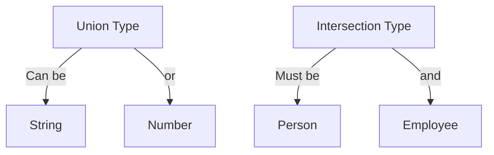

## 27.7 Advanced Types and Mapped Types

In this section, we delve into the advanced type features of TypeScript, focusing on union types, intersection types, and mapped types. These features allow developers to model complex scenarios with greater precision, enhancing both type safety and code expressiveness. Let's explore how these advanced types can simplify your code and improve your development workflow.

### Understanding Union Types

Union types in TypeScript allow a variable to hold more than one type. This is particularly useful when a value can be of different types at different times. Union types are defined using the pipe (`|`) symbol.

#### Example: Union Types

```typescript
type StringOrNumber = string | number;

function printValue(value: StringOrNumber): void {
    if (typeof value === 'string') {
        console.log(`String value: ${value}`);
    } else {
        console.log(`Number value: ${value}`);
    }
}

printValue("Hello, World!"); // String value: Hello, World!
printValue(42); // Number value: 42
```

In this example, the `StringOrNumber` type can be either a `string` or a `number`. The function `printValue` handles both types appropriately by checking the type at runtime.

### Exploring Intersection Types

Intersection types combine multiple types into one. This means that a value must satisfy all the types involved. Intersection types are defined using the ampersand (`&`) symbol.

#### Example: Intersection Types

```typescript
interface Person {
    name: string;
    age: number;
}

interface Employee {
    employeeId: number;
}

type EmployeePerson = Person & Employee;

const employee: EmployeePerson = {
    name: "Alice",
    age: 30,
    employeeId: 1234
};

console.log(employee);
```

Here, `EmployeePerson` is an intersection of `Person` and `Employee`, meaning it must have all the properties of both interfaces.

### Introducing Mapped Types

Mapped types allow you to create new types by transforming existing ones. They are particularly useful for creating variations of a type, such as making all properties optional or readonly.

#### Example: Mapped Types

```typescript
interface User {
    id: number;
    name: string;
    email: string;
}

type ReadonlyUser = {
    readonly [K in keyof User]: User[K];
};

const user: ReadonlyUser = {
    id: 1,
    name: "John Doe",
    email: "john.doe@example.com"
};

// user.name = "Jane Doe"; // Error: Cannot assign to 'name' because it is a read-only property.
```

In this example, `ReadonlyUser` is a mapped type that makes all properties of `User` readonly.

### Practical Use Cases for Advanced Types

Advanced types in TypeScript can greatly enhance the flexibility and robustness of your code. Here are some scenarios where they prove invaluable:

- **API Responses**: Use union types to handle different response formats from an API.
- **Configuration Objects**: Use intersection types to combine multiple configuration interfaces.
- **Immutable Data Structures**: Use mapped types to create immutable versions of data structures.

### Improving Type Safety and Code Expressiveness

Advanced types not only improve type safety by ensuring that variables conform to expected types, but they also enhance code expressiveness by allowing developers to convey more information through types. This leads to more readable and maintainable code.

### Simplifying Code with Advanced Types

By using advanced types, you can simplify complex type definitions and reduce redundancy in your code. This results in cleaner and more efficient codebases.

### Try It Yourself

Experiment with the examples provided by modifying the types and observing the effects. For instance, try adding more properties to the `Person` and `Employee` interfaces and see how the `EmployeePerson` type adapts.

### Visualizing Type Relationships

To better understand how union and intersection types work, let's visualize their relationships using a Venn diagram.



This diagram illustrates that a union type can be one of several types, while an intersection type must satisfy all types.

### References and Further Reading

- [TypeScript Handbook: Advanced Types](https://www.typescriptlang.org/docs/handbook/advanced-types.html)
- [MDN Web Docs: TypeScript](https://developer.mozilla.org/en-US/docs/Web/JavaScript/Reference/Global_Objects/TypeScript)

### Knowledge Check

To reinforce your understanding of advanced types and mapped types, try answering the following questions:

## Mastering Advanced Types and Mapped Types Quiz



### What is a union type in TypeScript?

- [x] A type that can be one of several types
- [ ] A type that combines multiple types into one
- [ ] A type that transforms existing types
- [ ] A type that makes all properties optional

> **Explanation:** A union type allows a variable to hold values of different types.

### How are intersection types defined in TypeScript?

- [ ] Using the pipe (`|`) symbol
- [x] Using the ampersand (`&`) symbol
- [ ] Using the colon (`:`) symbol
- [ ] Using the equal (`=`) symbol

> **Explanation:** Intersection types are defined using the ampersand (`&`) symbol.

### What is the purpose of mapped types in TypeScript?

- [ ] To create new types by combining existing ones
- [ ] To allow a variable to hold multiple types
- [x] To create new types by transforming existing ones
- [ ] To make all properties of a type optional

> **Explanation:** Mapped types transform existing types to create new variations.

### Which of the following is an example of a mapped type?

- [ ] `type A = B | C;`
- [ ] `type A = B & C;`
- [x] `type A = { [K in keyof B]: B[K] };`
- [ ] `type A = keyof B;`

> **Explanation:** Mapped types use the syntax `{ [K in keyof B]: B[K] }`.

### How do advanced types improve code expressiveness?

- [x] By allowing developers to convey more information through types
- [ ] By making all properties of a type optional
- [ ] By reducing the number of types in a codebase
- [ ] By making code less readable

> **Explanation:** Advanced types enhance code expressiveness by providing more detailed type information.

### What is the benefit of using intersection types?

- [ ] They allow a variable to hold multiple types
- [x] They combine multiple types into one, ensuring all properties are present
- [ ] They transform existing types into new ones
- [ ] They make all properties of a type optional

> **Explanation:** Intersection types ensure that a value satisfies all combined types.

### How can union types be used in API responses?

- [x] To handle different response formats
- [ ] To combine multiple response types into one
- [ ] To transform response types into new ones
- [ ] To make all response properties optional

> **Explanation:** Union types can represent different possible response formats.

### What is a practical use case for mapped types?

- [ ] Handling different API response formats
- [ ] Combining multiple configuration interfaces
- [x] Creating immutable versions of data structures
- [ ] Making all properties of a type optional

> **Explanation:** Mapped types can create immutable versions of data structures.

### True or False: Mapped types can only make properties readonly.

- [ ] True
- [x] False

> **Explanation:** Mapped types can transform properties in various ways, not just make them readonly.

### True or False: Union types are defined using the ampersand (`&`) symbol.

- [ ] True
- [x] False

> **Explanation:** Union types are defined using the pipe (`|`) symbol.



Remember, this is just the beginning. As you progress, you'll build more complex and interactive applications using these advanced TypeScript features. Keep experimenting, stay curious, and enjoy the journey!
