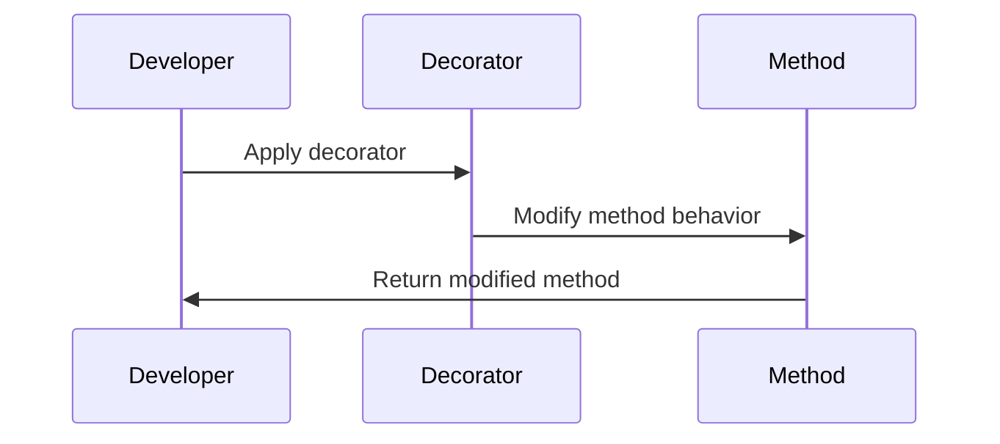

## 27.8 Decorators in TypeScript

Decorators in TypeScript provide a powerful way to add annotations and a meta-programming syntax for class declarations and members. They enable developers to modify classes and their members, offering a flexible mechanism to implement cross-cutting concerns like logging, validation, and dependency injection. In this section, we will explore what decorators are, how to use them, and their practical applications.

### What Are Decorators?

Decorators are a special kind of declaration that can be attached to a class, method, accessor, property, or parameter. They allow you to modify the behavior of the decorated item. In essence, decorators are functions that are invoked with a specific set of arguments, depending on the type of decorator.

#### Key Concepts

- **Annotation**: Decorators provide a way to add metadata to classes and their members.
- **Meta-programming**: They enable the modification of class behavior at runtime.
- **Cross-cutting concerns**: Decorators are ideal for implementing features that affect multiple parts of an application, such as logging and security.

### Decorator Syntax

TypeScript supports several types of decorators, each with its own syntax and use cases. Let's explore the syntax for class, method, property, and parameter decorators.

#### Class Decorators

A class decorator is applied to the class constructor. It can be used to observe, modify, or replace a class definition.

```typescript
function sealed(constructor: Function) {
    Object.seal(constructor);
    Object.seal(constructor.prototype);
}

@sealed
class Greeter {
    greeting: string;
    constructor(message: string) {
        this.greeting = message;
    }
    greet() {
        return `Hello, ${this.greeting}`;
    }
}
```

In this example, the `@sealed` decorator seals the `Greeter` class, preventing new properties from being added to it.

#### Method Decorators

Method decorators are applied to methods within a class. They can be used to modify the method's behavior or to add metadata.

```typescript
function log(target: Object, propertyKey: string, descriptor: PropertyDescriptor) {
    const originalMethod = descriptor.value;
    descriptor.value = function (...args: any[]) {
        console.log(`Calling ${propertyKey} with arguments: ${args}`);
        return originalMethod.apply(this, args);
    };
}

class Calculator {
    @log
    add(a: number, b: number): number {
        return a + b;
    }
}

const calculator = new Calculator();
calculator.add(2, 3); // Logs: Calling add with arguments: 2,3
```

Here, the `@log` decorator logs the method name and arguments each time the `add` method is called.

#### Property Decorators

Property decorators are applied to class properties. They can be used to observe or modify property metadata.

```typescript
function readonly(target: Object, propertyKey: string) {
    Object.defineProperty(target, propertyKey, {
        writable: false
    });
}

class Person {
    @readonly
    name: string = "John Doe";
}

const person = new Person();
person.name = "Jane Doe"; // Error: Cannot assign to read-only property 'name'
```

The `@readonly` decorator makes the `name` property immutable.

#### Parameter Decorators

Parameter decorators are applied to function parameters. They can be used to add metadata about parameters.

```typescript
function logParameter(target: Object, propertyKey: string, parameterIndex: number) {
    const metadataKey = `log_${propertyKey}_parameters`;
    if (Array.isArray(target[metadataKey])) {
        target[metadataKey].push(parameterIndex);
    } else {
        target[metadataKey] = [parameterIndex];
    }
}

class Logger {
    greet(@logParameter message: string): string {
        return `Hello, ${message}`;
    }
}
```

In this example, the `@logParameter` decorator adds metadata about the parameters of the `greet` method.

### Creating and Applying Decorators

Creating a decorator involves defining a function that takes specific arguments based on the type of decorator. Let's look at how to create and apply decorators in TypeScript.

#### Creating a Class Decorator

A class decorator is a function that takes a constructor as its only argument.

```typescript
function timestamp<T extends { new(...args: any[]): {} }>(constructor: T) {
    return class extends constructor {
        timestamp = new Date();
    };
}

@timestamp
class Document {
    content: string;
    constructor(content: string) {
        this.content = content;
    }
}

const doc = new Document("Hello, world!");
console.log(doc.timestamp); // Outputs the current date and time
```

The `@timestamp` decorator adds a `timestamp` property to the `Document` class.

#### Creating a Method Decorator

A method decorator is a function that takes three arguments: the target object, the method name, and the property descriptor.

```typescript
function measure(target: Object, propertyKey: string, descriptor: PropertyDescriptor) {
    const originalMethod = descriptor.value;
    descriptor.value = function (...args: any[]) {
        console.time(propertyKey);
        const result = originalMethod.apply(this, args);
        console.timeEnd(propertyKey);
        return result;
    };
}

class MathOperations {
    @measure
    multiply(a: number, b: number): number {
        return a * b;
    }
}

const operations = new MathOperations();
operations.multiply(5, 10); // Logs the time taken to execute the multiply method
```

The `@measure` decorator logs the execution time of the `multiply` method.

#### Creating a Property Decorator

A property decorator is a function that takes two arguments: the target object and the property name.

```typescript
function uppercase(target: Object, propertyKey: string) {
    let value: string;
    const getter = () => value;
    const setter = (newVal: string) => {
        value = newVal.toUpperCase();
    };
    Object.defineProperty(target, propertyKey, {
        get: getter,
        set: setter
    });
}

class Message {
    @uppercase
    text: string;
}

const message = new Message();
message.text = "hello";
console.log(message.text); // Outputs: HELLO
```

The `@uppercase` decorator converts the `text` property to uppercase.

#### Creating a Parameter Decorator

A parameter decorator is a function that takes three arguments: the target object, the method name, and the parameter index.

```typescript
function required(target: Object, propertyKey: string, parameterIndex: number) {
    const existingRequiredParameters: number[] = Reflect.getOwnMetadata("required", target, propertyKey) || [];
    existingRequiredParameters.push(parameterIndex);
    Reflect.defineMetadata("required", existingRequiredParameters, target, propertyKey);
}

class Validator {
    validate(@required input: string) {
        console.log(`Validating: ${input}`);
    }
}
```

The `@required` decorator marks a parameter as required, storing metadata about it.

### Use Cases for Decorators

Decorators are versatile and can be used in various scenarios. Here are some common use cases:

#### Dependency Injection

Decorators can be used to inject dependencies into classes, promoting loose coupling and enhancing testability.

```typescript
function inject(serviceIdentifier: string) {
    return function (target: Object, propertyKey: string) {
        const service = ServiceLocator.getService(serviceIdentifier);
        Object.defineProperty(target, propertyKey, {
            value: service
        });
    };
}

class Consumer {
    @inject("LoggerService")
    logger: LoggerService;

    logMessage(message: string) {
        this.logger.log(message);
    }
}
```

In this example, the `@inject` decorator injects a `LoggerService` into the `Consumer` class.

#### Metadata Annotation

Decorators can add metadata to classes and their members, which can be used for reflection or configuration purposes.

```typescript
function metadata(key: string, value: any) {
    return function (target: Object, propertyKey?: string) {
        Reflect.defineMetadata(key, value, target, propertyKey);
    };
}

@metadata("role", "admin")
class Admin {
    @metadata("permission", "read-write")
    accessResource() {
        console.log("Accessing resource");
    }
}
```

The `@metadata` decorator adds metadata to the `Admin` class and its `accessResource` method.

### Current Status of Decorators in ECMAScript Proposals

Decorators are currently a stage 3 proposal in the ECMAScript specification process. This means they are well-defined and expected to be included in future ECMAScript versions, but they are not yet part of the official standard. TypeScript has supported decorators for some time, providing a way for developers to experiment with this feature before it becomes a standard part of JavaScript.

For more information on the status of decorators in ECMAScript, you can refer to the [TC39 Decorators Proposal](https://github.com/tc39/proposal-decorators).

### Visualizing Decorator Usage

To better understand how decorators work, let's visualize the flow of applying a method decorator.



This diagram illustrates the process of applying a method decorator, where the developer applies the decorator, the decorator modifies the method's behavior, and the modified method is returned.

### Try It Yourself

Experiment with the provided code examples by modifying the decorators or creating your own. Try adding additional functionality, such as logging the return value of a method or enforcing access control on a class.

### Knowledge Check

- What are decorators in TypeScript, and how do they differ from regular functions?
- How can decorators be used to implement cross-cutting concerns?
- What is the current status of decorators in the ECMAScript proposal process?

### Summary

Decorators in TypeScript offer a powerful way to enhance classes and their members with additional behavior and metadata. They are versatile tools for implementing cross-cutting concerns like logging, validation, and dependency injection. While decorators are not yet part of the official ECMAScript standard, TypeScript provides a robust implementation that allows developers to leverage this feature today.

Remember, this is just the beginning. As you progress, you'll build more complex and interactive applications using decorators. Keep experimenting, stay curious, and enjoy the journey!

## Quiz: Mastering Decorators in TypeScript



### What is a decorator in TypeScript?

- [x] A special kind of declaration that can be attached to a class, method, accessor, property, or parameter.
- [ ] A function that only modifies method behavior.
- [ ] A TypeScript feature that is not related to classes.
- [ ] A way to define interfaces in TypeScript.

> **Explanation:** Decorators are special declarations that can be attached to various elements in TypeScript to modify their behavior or add metadata.

### Which of the following is a correct use of a class decorator?

- [x] `@sealed class MyClass {}`
- [ ] `sealed class MyClass {}`
- [ ] `@sealed function MyClass() {}`
- [ ] `sealed function MyClass() {}`

> **Explanation:** The correct syntax for applying a class decorator is `@decoratorName` before the class declaration.

### What arguments does a method decorator receive?

- [x] Target object, method name, and property descriptor.
- [ ] Only the method name.
- [ ] Only the property descriptor.
- [ ] Target object and method name only.

> **Explanation:** A method decorator receives the target object, the method name, and the property descriptor as arguments.

### How can decorators be used in dependency injection?

- [x] By injecting dependencies into classes, promoting loose coupling.
- [ ] By creating new instances of classes.
- [ ] By modifying the return type of methods.
- [ ] By changing the class name.

> **Explanation:** Decorators can inject dependencies into classes, which promotes loose coupling and enhances testability.

### What is the current status of decorators in ECMAScript proposals?

- [x] Stage 3 proposal.
- [ ] Stage 1 proposal.
- [ ] Stage 2 proposal.
- [ ] Stage 4 proposal.

> **Explanation:** Decorators are currently a stage 3 proposal in the ECMAScript specification process.

### What is a common use case for parameter decorators?

- [x] Adding metadata about parameters.
- [ ] Modifying the return value of a function.
- [ ] Changing the function name.
- [ ] Creating new class instances.

> **Explanation:** Parameter decorators are commonly used to add metadata about parameters.

### Which decorator type is used to modify class properties?

- [x] Property decorator.
- [ ] Class decorator.
- [ ] Method decorator.
- [ ] Parameter decorator.

> **Explanation:** Property decorators are used to modify or observe class properties.

### What is a key benefit of using decorators?

- [x] Implementing cross-cutting concerns like logging and validation.
- [ ] Creating new programming languages.
- [ ] Replacing all functions with classes.
- [ ] Eliminating the need for interfaces.

> **Explanation:** Decorators are beneficial for implementing cross-cutting concerns such as logging and validation.

### Can decorators be used to modify method behavior?

- [x] True
- [ ] False

> **Explanation:** Decorators can indeed be used to modify method behavior by altering the method's functionality or adding additional logic.

### Are decorators part of the official ECMAScript standard?

- [ ] True
- [x] False

> **Explanation:** Decorators are not yet part of the official ECMAScript standard but are a stage 3 proposal.


