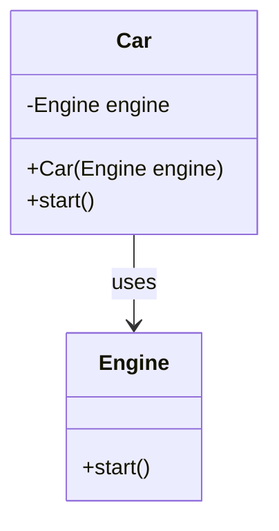

## 27.9 Dependency Injection with TypeScript

In modern software development, creating applications that are both modular and testable is crucial. Dependency Injection (DI) is a design pattern that helps achieve these goals by promoting loose coupling between components. In this section, we will explore how TypeScript supports dependency injection patterns, the benefits it brings to code modularity and unit testing, and how frameworks like InversifyJS can facilitate DI in TypeScript applications.

### Understanding Dependency Injection

Dependency Injection is a design pattern used to implement Inversion of Control (IoC) between classes and their dependencies. Instead of a class creating its dependencies, they are provided to the class from an external source. This approach decouples the class from its dependencies, making it easier to manage and test.

#### Key Concepts of Dependency Injection

- **Inversion of Control (IoC):** A principle where the control of object creation and management is transferred from the class itself to an external entity.
- **Dependency:** An object that a class requires to function correctly.
- **Injector:** A component responsible for providing dependencies to a class.

### Benefits of Dependency Injection

1. **Loose Coupling:** Classes are not tightly bound to their dependencies, allowing for easier changes and maintenance.
2. **Improved Testability:** Dependencies can be easily mocked or stubbed, facilitating unit testing.
3. **Enhanced Modularity:** Components can be developed and maintained independently.
4. **Reusability:** Dependencies can be reused across different parts of the application.

### Implementing Dependency Injection in TypeScript

TypeScript, with its strong typing and support for decorators, provides a robust platform for implementing dependency injection. Let's explore how to implement DI in TypeScript with examples.

#### Basic Dependency Injection Example

Consider a simple example where a `Car` class depends on an `Engine` class.

```typescript
// Engine.ts
export class Engine {
    start() {
        console.log("Engine started");
    }
}

// Car.ts
import { Engine } from './Engine';

export class Car {
    private engine: Engine;

    constructor(engine: Engine) {
        this.engine = engine;
    }

    start() {
        this.engine.start();
        console.log("Car started");
    }
}

// main.ts
import { Car } from './Car';
import { Engine } from './Engine';

const engine = new Engine();
const car = new Car(engine);
car.start();
```

In this example, the `Car` class receives an `Engine` instance through its constructor, demonstrating constructor injection.

### Using Decorators and Metadata for Injection

TypeScript decorators provide a powerful way to implement dependency injection by adding metadata to classes and methods. Decorators can be used to annotate dependencies, making it easier for an injector to provide them.

#### Example with Decorators

```typescript
// decorators.ts
function Injectable(target: Function) {
    // Decorator logic to mark a class as injectable
}

function Inject(target: Object, propertyKey: string | symbol, parameterIndex: number) {
    // Decorator logic to specify a dependency
}

// Engine.ts
@Injectable
export class Engine {
    start() {
        console.log("Engine started");
    }
}

// Car.ts
import { Engine } from './Engine';
import { Inject } from './decorators';

@Injectable
export class Car {
    private engine: Engine;

    constructor(@Inject engine: Engine) {
        this.engine = engine;
    }

    start() {
        this.engine.start();
        console.log("Car started");
    }
}
```

In this example, the `Injectable` decorator marks classes as injectable, and the `Inject` decorator specifies dependencies.

### Introducing InversifyJS

InversifyJS is a powerful and flexible inversion of control container for TypeScript and JavaScript applications. It leverages TypeScript's decorators and metadata to provide a seamless DI experience.

#### Setting Up InversifyJS

To use InversifyJS, you need to install it via npm:

```bash
npm install inversify reflect-metadata --save
```

Ensure that `reflect-metadata` is imported at the entry point of your application:

```typescript
import "reflect-metadata";
```

#### Example with InversifyJS

```typescript
// types.ts
const TYPES = {
    Engine: Symbol.for("Engine"),
    Car: Symbol.for("Car")
};

// Engine.ts
import { injectable } from "inversify";

@injectable()
export class Engine {
    start() {
        console.log("Engine started");
    }
}

// Car.ts
import { inject, injectable } from "inversify";
import { Engine } from './Engine';
import { TYPES } from './types';

@injectable()
export class Car {
    private engine: Engine;

    constructor(@inject(TYPES.Engine) engine: Engine) {
        this.engine = engine;
    }

    start() {
        this.engine.start();
        console.log("Car started");
    }
}

// inversify.config.ts
import { Container } from "inversify";
import { TYPES } from './types';
import { Engine } from './Engine';
import { Car } from './Car';

const container = new Container();
container.bind<Engine>(TYPES.Engine).to(Engine);
container.bind<Car>(TYPES.Car).to(Car);

export { container };

// main.ts
import { container } from './inversify.config';
import { Car } from './Car';
import { TYPES } from './types';

const car = container.get<Car>(TYPES.Car);
car.start();
```

In this example, InversifyJS is used to manage dependencies. The `Container` is configured to bind interfaces to their implementations, and the `@injectable` and `@inject` decorators are used to annotate classes and their dependencies.

### Benefits of Using InversifyJS

1. **Type Safety:** Leverages TypeScript's type system to ensure dependencies are correctly injected.
2. **Scalability:** Easily manage complex dependency graphs in large applications.
3. **Flexibility:** Supports various DI patterns, including constructor injection, property injection, and method injection.

### Visualizing Dependency Injection

To better understand how dependency injection works, let's visualize the process using a class diagram.



This diagram illustrates the relationship between the `Car` and `Engine` classes, where `Car` depends on `Engine`.

### Try It Yourself

Experiment with the code examples provided by modifying the dependencies. For instance, create a `TurboEngine` class and inject it into the `Car` class instead of the regular `Engine`. Observe how the DI pattern allows for easy swapping of dependencies without modifying the `Car` class.

### Knowledge Check

- What is Dependency Injection, and why is it important?
- How does TypeScript support dependency injection patterns?
- What role do decorators play in implementing DI in TypeScript?
- How does InversifyJS facilitate dependency injection in TypeScript applications?
- What are the benefits of using DI in terms of code modularity and testability?

### Conclusion

Dependency Injection is a powerful design pattern that enhances the modularity and testability of applications. TypeScript, with its support for decorators and strong typing, provides an excellent platform for implementing DI. By using frameworks like InversifyJS, developers can manage complex dependency graphs with ease, leading to more maintainable and scalable applications.

Remember, this is just the beginning. As you progress, you'll build more complex and interactive applications. Keep experimenting, stay curious, and enjoy the journey!

## Mastering Dependency Injection in TypeScript



### What is Dependency Injection?

- [x] A design pattern that promotes loose coupling by providing dependencies from an external source.
- [ ] A method for creating dependencies within a class.
- [ ] A way to tightly couple classes with their dependencies.
- [ ] A pattern that discourages the use of external dependencies.

> **Explanation:** Dependency Injection is a design pattern that promotes loose coupling by providing dependencies from an external source, rather than creating them within a class.

### What is the primary benefit of using Dependency Injection?

- [x] Improved testability and modularity.
- [ ] Increased complexity.
- [ ] Tighter coupling between components.
- [ ] Reduced code readability.

> **Explanation:** The primary benefit of using Dependency Injection is improved testability and modularity, as it allows for easy swapping and mocking of dependencies.

### Which TypeScript feature is commonly used to implement Dependency Injection?

- [x] Decorators
- [ ] Interfaces
- [ ] Enums
- [ ] Generics

> **Explanation:** Decorators are commonly used in TypeScript to implement Dependency Injection, as they allow for adding metadata to classes and methods.

### What is InversifyJS?

- [x] A dependency injection library for TypeScript and JavaScript.
- [ ] A testing framework for TypeScript.
- [ ] A module bundler for JavaScript.
- [ ] A CSS preprocessor.

> **Explanation:** InversifyJS is a dependency injection library for TypeScript and JavaScript, facilitating the implementation of DI patterns.

### How does InversifyJS enhance dependency management?

- [x] By providing a container to manage complex dependency graphs.
- [ ] By creating dependencies within classes.
- [ ] By discouraging the use of decorators.
- [ ] By tightly coupling classes with their dependencies.

> **Explanation:** InversifyJS enhances dependency management by providing a container to manage complex dependency graphs, allowing for flexible and scalable DI implementations.

### What is the role of the `@injectable` decorator in InversifyJS?

- [x] To mark a class as injectable, allowing it to be managed by the DI container.
- [ ] To inject dependencies into a class.
- [ ] To create a new instance of a class.
- [ ] To bind a class to an interface.

> **Explanation:** The `@injectable` decorator in InversifyJS marks a class as injectable, allowing it to be managed by the DI container.

### What is constructor injection?

- [x] A DI pattern where dependencies are provided through a class constructor.
- [ ] A pattern where dependencies are created within a class.
- [ ] A method for injecting dependencies into class properties.
- [ ] A way to inject dependencies at runtime.

> **Explanation:** Constructor injection is a DI pattern where dependencies are provided through a class constructor, promoting loose coupling.

### How can decorators improve testability in TypeScript?

- [x] By allowing easy annotation and swapping of dependencies.
- [ ] By increasing code complexity.
- [ ] By tightly coupling classes with their dependencies.
- [ ] By reducing code readability.

> **Explanation:** Decorators improve testability in TypeScript by allowing easy annotation and swapping of dependencies, facilitating mocking and testing.

### What is the purpose of the `@inject` decorator in InversifyJS?

- [x] To specify a dependency to be injected into a class.
- [ ] To mark a class as injectable.
- [ ] To create a new instance of a class.
- [ ] To bind a class to an interface.

> **Explanation:** The `@inject` decorator in InversifyJS specifies a dependency to be injected into a class, allowing for flexible DI implementations.

### True or False: Dependency Injection promotes tight coupling between classes.

- [ ] True
- [x] False

> **Explanation:** False. Dependency Injection promotes loose coupling between classes by providing dependencies from an external source.


