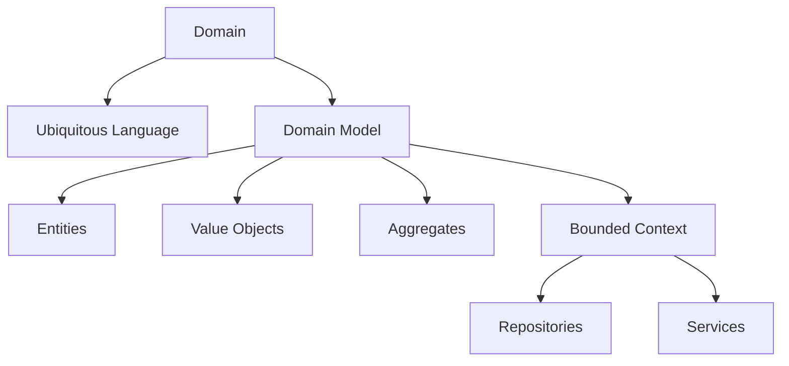

## 28.1 Introduction to Domain-Driven Design

Domain-Driven Design (DDD) is a strategic approach to software development that emphasizes collaboration between technical and domain experts to create a model that accurately reflects the core business domain. This approach is particularly beneficial for complex systems where understanding and modeling the domain is crucial for success.

### What is Domain-Driven Design?

Domain-Driven Design is a methodology introduced by Eric Evans in his seminal book, "Domain-Driven Design: Tackling Complexity in the Heart of Software," published in 2003. DDD focuses on creating a shared understanding of the domain through a ubiquitous language and a domain model that guides the design and development of software systems.

#### Key Concepts of DDD

- **Domain**: The sphere of knowledge and activity around which the application logic revolves. It is the primary focus of the software system.
- **Ubiquitous Language**: A common language used by both developers and domain experts to ensure clear communication and understanding.
- **Domain Model**: An abstract representation of the domain, capturing the essential concepts and relationships.
- **Bounded Context**: A boundary within which a particular domain model is defined and applicable. It helps in managing complexity by dividing the domain into smaller, manageable parts.
- **Entities and Value Objects**: Entities are objects with a distinct identity, while value objects are immutable and defined by their attributes.
- **Aggregates**: A cluster of domain objects that are treated as a single unit for data changes.
- **Repositories**: Mechanisms for retrieving and storing aggregates.
- **Services**: Operations that do not naturally fit within entities or value objects.

### The Significance of DDD in Software Development

Domain-Driven Design is significant because it aligns the software design with the business domain, ensuring that the software meets the actual needs of the business. By focusing on the domain, DDD helps in:

- **Reducing Complexity**: By breaking down the domain into bounded contexts, DDD manages complexity and makes the system more understandable.
- **Improving Communication**: The use of a ubiquitous language ensures that all stakeholders have a shared understanding of the domain.
- **Enhancing Flexibility**: A well-defined domain model allows for easier adaptation to changes in business requirements.
- **Increasing Collaboration**: DDD encourages collaboration between developers and domain experts, leading to better software solutions.

### Historical Context and Origins of DDD

The concept of Domain-Driven Design was formalized by Eric Evans in the early 2000s. His book laid the foundation for DDD by providing a comprehensive framework for tackling complexity in software systems. Since then, DDD has gained widespread adoption in the software industry, particularly for large-scale and complex projects.

### Benefits of Using DDD in Complex Projects

- **Focus on Core Domain**: DDD emphasizes understanding and modeling the core domain, which is critical for the success of complex projects.
- **Modular Design**: By dividing the domain into bounded contexts, DDD promotes a modular design that is easier to manage and evolve.
- **Scalability**: DDD's focus on the domain model allows for scalable solutions that can grow with the business.
- **Resilience to Change**: A well-defined domain model provides a solid foundation for adapting to changes in business requirements.

### Implementing DDD with JavaScript

JavaScript, with its versatility and widespread use, is well-suited for implementing Domain-Driven Design principles. As a language that supports both object-oriented and functional programming paradigms, JavaScript provides the flexibility needed to model complex domains effectively.

#### JavaScript Features Relevant to DDD

- **Prototypal Inheritance**: JavaScript's prototypal inheritance allows for flexible object modeling, which is essential for representing domain entities and value objects.
- **Closures and Functions**: JavaScript's first-class functions and closures enable the creation of services and repositories that encapsulate domain logic.
- **Modules**: JavaScript's module system supports the separation of concerns, allowing for the implementation of bounded contexts and modular design.
- **Asynchronous Programming**: JavaScript's asynchronous capabilities, such as Promises and async/await, are useful for handling complex workflows and interactions within the domain.

### Setting the Stage for Deeper Exploration

This introduction to Domain-Driven Design provides a foundation for understanding the core concepts and their significance in software development. In the subsequent sections, we will delve deeper into the implementation of DDD principles in JavaScript, exploring how to model domains, define bounded contexts, and create a ubiquitous language that bridges the gap between technical and domain experts.

### Visualizing DDD Concepts

To better understand the relationships between the core concepts of DDD, let's visualize them using a diagram.

**Diagram Description**: This diagram illustrates the core concepts of Domain-Driven Design and their relationships. The domain is central, with the ubiquitous language and domain model branching out. The domain model further connects to entities, value objects, aggregates, and bounded contexts, which in turn link to repositories and services.

### Try It Yourself

To get a hands-on understanding of DDD in JavaScript, try implementing a simple domain model for a library management system. Define entities like `Book` and `Member`, and create a service for borrowing books. Experiment with different ways to model the domain and see how the concepts of DDD can be applied.

### Knowledge Check

- What is the primary focus of Domain-Driven Design?
- How does DDD help in managing complexity in software systems?
- What is the role of a ubiquitous language in DDD?
- How can JavaScript's features be leveraged to implement DDD principles?

### Summary

Domain-Driven Design is a powerful approach to software development that emphasizes understanding and modeling the business domain. By focusing on the domain, DDD helps in managing complexity, improving communication, and creating flexible and scalable software solutions. JavaScript, with its versatile features, is well-suited for implementing DDD principles, making it an excellent choice for developing complex systems.

### Embrace the Journey

Remember, this is just the beginning. As you progress through the guide, you'll explore more advanced DDD concepts and learn how to apply them in JavaScript. Keep experimenting, stay curious, and enjoy the journey!

### References and Links

- [Domain-Driven Design: Tackling Complexity in the Heart of Software by Eric Evans](https://www.domainlanguage.com/ddd/)
- [MDN Web Docs: JavaScript](https://developer.mozilla.org/en-US/docs/Web/JavaScript)
- [W3Schools: JavaScript Tutorial](https://www.w3schools.com/js/)

---

## Quiz: Understanding Domain-Driven Design in JavaScript



### What is the primary focus of Domain-Driven Design?

- [x] Modeling the business domain
- [ ] Optimizing database queries
- [ ] Enhancing user interface design
- [ ] Improving network performance

> **Explanation:** Domain-Driven Design focuses on modeling the business domain to ensure the software aligns with business needs.

### How does DDD help in managing complexity?

- [x] By dividing the domain into bounded contexts
- [ ] By using complex algorithms
- [ ] By focusing on user interface design
- [ ] By optimizing database performance

> **Explanation:** DDD manages complexity by dividing the domain into bounded contexts, making it more understandable and manageable.

### What is a ubiquitous language in DDD?

- [x] A common language used by developers and domain experts
- [ ] A programming language used for coding
- [ ] A language used for database queries
- [ ] A language used for user interface design

> **Explanation:** A ubiquitous language is a common language used by both developers and domain experts to ensure clear communication and understanding.

### Which JavaScript feature is useful for creating services in DDD?

- [x] Closures and functions
- [ ] Arrays and loops
- [ ] CSS styling
- [ ] HTML elements

> **Explanation:** JavaScript's closures and functions are useful for creating services that encapsulate domain logic.

### What is the role of a domain model in DDD?

- [x] An abstract representation of the domain
- [ ] A database schema
- [ ] A user interface design
- [ ] A network protocol

> **Explanation:** A domain model is an abstract representation of the domain, capturing the essential concepts and relationships.

### How can JavaScript's module system support DDD?

- [x] By allowing the implementation of bounded contexts
- [ ] By optimizing network requests
- [ ] By enhancing user interface design
- [ ] By improving database performance

> **Explanation:** JavaScript's module system supports the separation of concerns, allowing for the implementation of bounded contexts and modular design.

### What is an entity in DDD?

- [x] An object with a distinct identity
- [ ] A database table
- [ ] A user interface component
- [ ] A network packet

> **Explanation:** An entity is an object with a distinct identity, which is a key concept in Domain-Driven Design.

### What is a value object in DDD?

- [x] An immutable object defined by its attributes
- [ ] A mutable object with a unique identity
- [ ] A database record
- [ ] A user interface element

> **Explanation:** A value object is an immutable object defined by its attributes, used in Domain-Driven Design.

### What is a bounded context in DDD?

- [x] A boundary within which a particular domain model is defined
- [ ] A user interface layout
- [ ] A network topology
- [ ] A database schema

> **Explanation:** A bounded context is a boundary within which a particular domain model is defined and applicable, helping manage complexity.

### True or False: JavaScript is not suitable for implementing DDD principles.

- [ ] True
- [x] False

> **Explanation:** False. JavaScript, with its versatile features, is well-suited for implementing Domain-Driven Design principles.



---
