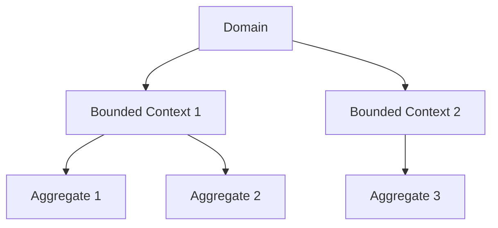

## 28.10 Challenges and Best Practices

Domain-Driven Design (DDD) offers a robust framework for tackling complex software projects by aligning software design with business needs. However, implementing DDD in JavaScript presents unique challenges and opportunities. In this section, we will explore these challenges and provide best practices to help you effectively apply DDD principles in your JavaScript projects.

### Understanding the Challenges of DDD in JavaScript

#### 1. Over-Engineering and Complexity

One of the primary challenges in implementing DDD is the risk of over-engineering. DDD encourages a deep focus on the domain, which can lead to complex models and architectures that are difficult to manage.

- **Avoiding Over-Engineering**: Start small and gradually expand your domain model. Focus on the core domain first and avoid premature optimization. Use simple solutions where possible and introduce complexity only when necessary.

#### 2. Team Alignment and Collaboration

Effective DDD requires close collaboration between developers and domain experts. Misalignment can lead to misunderstandings and a domain model that does not accurately reflect business needs.

- **Fostering Collaboration**: Encourage regular communication between developers and domain experts. Use domain language consistently and involve domain experts in the modeling process. Consider using collaborative tools and workshops to facilitate understanding.

#### 3. Iterative Development and Refactoring

DDD is inherently iterative, requiring continuous refinement of the domain model. This can be challenging in fast-paced development environments.

- **Embracing Iteration**: Adopt agile methodologies to support iterative development. Regularly review and refactor the domain model to ensure it remains aligned with business goals. Use automated tests to validate changes and prevent regressions.

#### 4. Testing and Validating the Domain Model

Ensuring the accuracy and reliability of the domain model is crucial. However, testing complex domain logic can be challenging.

- **Effective Testing Strategies**: Implement unit tests to validate individual components of the domain model. Use integration tests to ensure that different parts of the model work together as expected. Consider using behavior-driven development (BDD) to align tests with business requirements.

#### 5. Continuous Learning and Adaptation

The domain and business requirements are constantly evolving, requiring developers to continuously learn and adapt.

- **Encouraging Continuous Learning**: Stay informed about the latest DDD practices and tools. Encourage team members to share knowledge and experiences. Regularly review and update the domain model to reflect changes in the business environment.

### Best Practices for Implementing DDD in JavaScript

#### 1. Start with a Clear Understanding of the Domain

Before diving into code, ensure that you have a thorough understanding of the domain. This involves working closely with domain experts to identify key concepts, processes, and relationships.

- **Domain Exploration**: Use techniques such as event storming and domain storytelling to explore the domain. Create a shared understanding of the domain language and concepts.

#### 2. Define Bounded Contexts

Bounded contexts are a core concept in DDD, helping to manage complexity by dividing the domain into distinct areas with clear boundaries.

- **Implementing Bounded Contexts**: Identify natural divisions within the domain and define bounded contexts accordingly. Ensure that each context has a clear purpose and set of responsibilities. Use context maps to visualize relationships between contexts.

#### 3. Use Aggregates to Model Complex Entities

Aggregates are clusters of related objects that are treated as a single unit. They help to enforce consistency and encapsulate complex domain logic.

- **Designing Aggregates**: Identify entities and value objects that naturally belong together. Define aggregate roots to manage the lifecycle and interactions of related objects. Ensure that aggregates maintain consistency and integrity.

#### 4. Leverage JavaScript's Flexibility

JavaScript's dynamic nature and rich ecosystem provide unique opportunities for implementing DDD.

- **JavaScript Features**: Use JavaScript's prototypal inheritance and functional programming capabilities to model domain logic. Leverage libraries and frameworks that support DDD principles, such as NestJS for building scalable server-side applications.

#### 5. Prioritize Communication and Collaboration

Effective communication is essential for successful DDD implementation. Ensure that all team members, including developers and domain experts, are aligned and working towards a common goal.

- **Communication Strategies**: Use domain language consistently across the team. Hold regular meetings and workshops to discuss domain concepts and model changes. Encourage open communication and feedback.

#### 6. Embrace Continuous Integration and Deployment

Continuous integration and deployment (CI/CD) practices help to ensure that changes to the domain model are tested and deployed efficiently.

- **CI/CD Practices**: Implement automated testing and deployment pipelines to validate changes. Use feature flags and canary releases to manage risk and ensure smooth deployments.

### Code Examples

Let's explore some code examples to illustrate these concepts.

#### Example: Defining a Bounded Context

```javascript
// Define a bounded context for a shopping cart
class ShoppingCart {
  constructor() {
    this.items = [];
  }

  addItem(item) {
    this.items.push(item);
  }

  removeItem(itemId) {
    this.items = this.items.filter(item => item.id !== itemId);
  }

  calculateTotal() {
    return this.items.reduce((total, item) => total + item.price, 0);
  }
}

// Usage
const cart = new ShoppingCart();
cart.addItem({ id: 1, name: 'Laptop', price: 1000 });
cart.addItem({ id: 2, name: 'Mouse', price: 50 });
console.log(cart.calculateTotal()); // Output: 1050
```

#### Example: Implementing an Aggregate

```javascript
// Define an aggregate for an order
class Order {
  constructor(orderId) {
    this.orderId = orderId;
    this.items = [];
    this.status = 'pending';
  }

  addItem(item) {
    this.items.push(item);
  }

  completeOrder() {
    if (this.items.length === 0) {
      throw new Error('Order cannot be completed without items.');
    }
    this.status = 'completed';
  }
}

// Usage
const order = new Order(123);
order.addItem({ id: 1, name: 'Laptop', price: 1000 });
order.completeOrder();
console.log(order.status); // Output: completed
```

### Visualizing Domain Concepts

Let's use Mermaid.js to visualize the relationship between bounded contexts and aggregates.



**Diagram Description**: This diagram illustrates a domain divided into two bounded contexts, each containing multiple aggregates. This structure helps manage complexity and maintain clear boundaries within the domain.

### References and Links

- [Domain-Driven Design Reference](https://www.domainlanguage.com/ddd/reference/)
- [Martin Fowler's DDD Articles](https://martinfowler.com/tags/domain%20driven%20design.html)
- [Eric Evans' Domain-Driven Design Book](https://www.amazon.com/Domain-Driven-Design-Tackling-Complexity-Software/dp/0321125215)

### Knowledge Check

- What are the key challenges of implementing DDD in JavaScript?
- How can you avoid over-engineering when applying DDD principles?
- Why is collaboration between developers and domain experts important in DDD?
- What are bounded contexts, and why are they important in DDD?
- How can you use JavaScript's features to implement DDD effectively?

### Exercises

1. **Exercise 1**: Define a bounded context for a library management system. Identify key entities and aggregates within this context.
2. **Exercise 2**: Implement a simple aggregate for managing book loans in a library. Ensure that the aggregate enforces consistency and integrity.
3. **Exercise 3**: Create a context map for a hypothetical e-commerce application. Identify relationships between different bounded contexts.

### Embrace the Journey

Remember, implementing DDD in JavaScript is a journey, not a destination. As you continue to explore and apply DDD principles, you'll gain a deeper understanding of your domain and build more robust and maintainable software. Keep experimenting, stay curious, and enjoy the journey!

## Quiz: Mastering DDD Challenges and Best Practices



### What is a common challenge when implementing DDD in JavaScript?

- [x] Over-engineering and complexity
- [ ] Lack of libraries
- [ ] Inability to use classes
- [ ] Limited community support

> **Explanation:** Over-engineering and complexity are common challenges in DDD due to the focus on detailed domain modeling.

### How can you avoid over-engineering in DDD?

- [x] Start small and expand gradually
- [ ] Use complex solutions from the start
- [ ] Avoid refactoring
- [ ] Ignore domain experts

> **Explanation:** Starting small and expanding gradually helps avoid unnecessary complexity and over-engineering.

### Why is collaboration important in DDD?

- [x] It ensures the domain model accurately reflects business needs
- [ ] It reduces the need for testing
- [ ] It eliminates the need for documentation
- [ ] It speeds up development

> **Explanation:** Collaboration ensures that the domain model aligns with business needs and reduces misunderstandings.

### What is a bounded context in DDD?

- [x] A distinct area within the domain with clear boundaries
- [ ] A type of database
- [ ] A JavaScript library
- [ ] A testing framework

> **Explanation:** A bounded context is a distinct area within the domain with clear boundaries, helping manage complexity.

### How can JavaScript's features be leveraged in DDD?

- [x] By using prototypal inheritance and functional programming
- [ ] By avoiding classes and objects
- [ ] By using only ES5 features
- [ ] By ignoring libraries

> **Explanation:** JavaScript's prototypal inheritance and functional programming capabilities can be leveraged to model domain logic effectively.

### What is an aggregate in DDD?

- [x] A cluster of related objects treated as a single unit
- [ ] A type of database
- [ ] A JavaScript library
- [ ] A testing framework

> **Explanation:** An aggregate is a cluster of related objects that are treated as a single unit, ensuring consistency and encapsulating domain logic.

### What is the purpose of a context map?

- [x] To visualize relationships between bounded contexts
- [ ] To store data
- [ ] To execute code
- [ ] To test applications

> **Explanation:** A context map visualizes relationships between bounded contexts, helping manage complexity and maintain clear boundaries.

### How can continuous integration help in DDD?

- [x] By validating changes efficiently
- [ ] By eliminating the need for testing
- [ ] By avoiding refactoring
- [ ] By ignoring domain experts

> **Explanation:** Continuous integration helps validate changes efficiently, ensuring that the domain model remains aligned with business goals.

### What is a key benefit of using automated tests in DDD?

- [x] They validate changes and prevent regressions
- [ ] They eliminate the need for documentation
- [ ] They speed up development
- [ ] They reduce the need for collaboration

> **Explanation:** Automated tests validate changes and prevent regressions, ensuring the reliability of the domain model.

### True or False: DDD is a one-time process that doesn't require iteration.

- [ ] True
- [x] False

> **Explanation:** DDD is inherently iterative, requiring continuous refinement and adaptation to align with evolving business needs.




