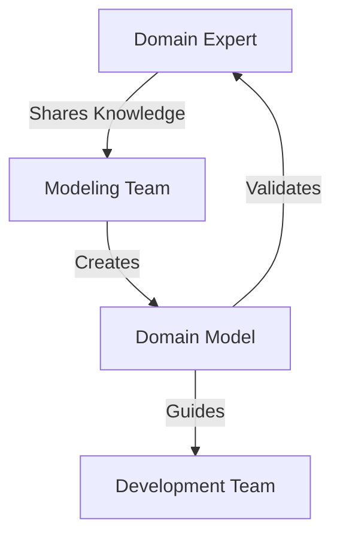

## 28.2 Modeling Complex Domains

In the realm of software development, modeling complex domains is a crucial step in bridging the gap between business needs and technical implementation. This section delves into the art and science of domain modeling, particularly using JavaScript, to create software that accurately reflects real-world entities and processes.

### Understanding the Importance of Domain Modeling

Domain modeling is the process of creating a conceptual model of the domain that captures the essential entities, relationships, and rules. It serves as a blueprint for building software systems that are aligned with business objectives. The primary goal is to ensure that both stakeholders and developers have a shared understanding of the domain, which facilitates communication and reduces the risk of misinterpretation.

#### Key Benefits of Domain Modeling

- **Shared Understanding**: Establishes a common language and understanding among stakeholders, developers, and domain experts.
- **Alignment with Business Goals**: Ensures that the software reflects the business processes and objectives.
- **Improved Communication**: Facilitates clearer communication through a shared vocabulary and visual representations.
- **Reduced Complexity**: Helps manage complexity by breaking down the domain into manageable components.

### Techniques for Modeling Complex Domains

#### Domain Models

A domain model is a visual representation of the entities, relationships, and rules within a domain. It serves as a blueprint for the software architecture and guides the development process.

- **Entities**: Represent real-world objects or concepts with a distinct identity.
- **Value Objects**: Represent descriptive aspects of the domain without a distinct identity.
- **Aggregates**: Group related entities and value objects into a single unit for consistency.

#### Ubiquitous Language

Ubiquitous Language is a practice where the language used in the domain model is consistent with the language used by domain experts and stakeholders. This ensures that everyone involved in the project has a common understanding of the terms and concepts.

### Mapping Business Concepts to JavaScript

JavaScript, with its flexible and dynamic nature, is well-suited for modeling complex domains. Let's explore how to map business concepts to JavaScript classes and modules.

#### Example: Modeling a Banking Domain

Consider a banking domain with entities such as `Account`, `Transaction`, and `Customer`.

```javascript
// Define a Customer class
class Customer {
  constructor(id, name, email) {
    this.id = id;
    this.name = name;
    this.email = email;
  }
}

// Define an Account class
class Account {
  constructor(accountNumber, balance, customer) {
    this.accountNumber = accountNumber;
    this.balance = balance;
    this.customer = customer;
  }

  deposit(amount) {
    this.balance += amount;
  }

  withdraw(amount) {
    if (amount > this.balance) {
      throw new Error('Insufficient funds');
    }
    this.balance -= amount;
  }
}

// Define a Transaction class
class Transaction {
  constructor(transactionId, account, amount, type) {
    this.transactionId = transactionId;
    this.account = account;
    this.amount = amount;
    this.type = type;
  }
}
```

In this example, we define three classes: `Customer`, `Account`, and `Transaction`. Each class encapsulates the properties and behaviors relevant to its respective entity in the banking domain.

#### Highlighting Key Lines

- **Customer Class**: Represents a customer with properties such as `id`, `name`, and `email`.
- **Account Class**: Represents a bank account with methods for `deposit` and `withdraw`.
- **Transaction Class**: Represents a transaction with properties such as `transactionId`, `account`, `amount`, and `type`.

### Leveraging Domain Experts' Knowledge

Domain experts possess invaluable knowledge about the business processes and rules. Their insights are crucial in shaping the domain model. Engage with domain experts to gather requirements, validate assumptions, and refine the model iteratively.

#### Techniques for Engaging Domain Experts

- **Workshops and Interviews**: Conduct workshops and interviews to gather insights and validate the model.
- **Collaborative Modeling**: Involve domain experts in the modeling process to ensure accuracy and completeness.
- **Feedback Loops**: Establish feedback loops to continuously refine the model based on expert input.

### Tools and Methodologies for Domain Modeling

Several tools and methodologies can aid in the domain modeling process. One such methodology is Event Storming.

#### Event Storming

Event Storming is a collaborative workshop technique used to explore complex domains. It involves stakeholders, developers, and domain experts working together to identify and map out domain events, commands, and aggregates.

- **Domain Events**: Significant occurrences within the domain.
- **Commands**: Actions that trigger domain events.
- **Aggregates**: Groups of related entities and value objects.



*Diagram: Collaborative Domain Modeling Process*

### Iterative Nature of Domain Modeling

Domain modeling is an iterative process. As the project evolves, new insights and requirements may emerge, necessitating changes to the model. Embrace this iterative nature and continuously refine the model to ensure it remains aligned with business goals.

#### Steps in the Iterative Process

1. **Initial Modeling**: Create an initial domain model based on current understanding.
2. **Validation**: Validate the model with stakeholders and domain experts.
3. **Refinement**: Refine the model based on feedback and new insights.
4. **Implementation**: Use the refined model to guide the development process.
5. **Review and Adapt**: Regularly review the model and adapt it as needed.

### Try It Yourself

To deepen your understanding of domain modeling, try modifying the example code to include additional entities or behaviors. For instance, add a `Loan` entity with methods for calculating interest and processing payments. Experiment with different modeling techniques and observe how they impact the design and implementation.

### References and Links

- [Domain-Driven Design Reference](https://www.domainlanguage.com/ddd/reference/)
- [Event Storming Guide](https://www.eventstorming.com/)
- [MDN Web Docs on JavaScript Classes](https://developer.mozilla.org/en-US/docs/Web/JavaScript/Reference/Classes)

### Knowledge Check

- What is the primary goal of domain modeling?
- How does Ubiquitous Language facilitate communication?
- What are the benefits of involving domain experts in the modeling process?
- Describe the role of aggregates in a domain model.
- What is Event Storming, and how does it aid in domain modeling?

### Embrace the Journey

Remember, domain modeling is a journey of discovery and collaboration. As you progress, you'll gain deeper insights into the domain and build software that truly reflects the business needs. Keep experimenting, stay curious, and enjoy the journey!

## Quiz: Mastering Domain Modeling in JavaScript



### What is the primary benefit of domain modeling?

- [x] Establishing a shared understanding among stakeholders
- [ ] Increasing code complexity
- [ ] Reducing the number of classes
- [ ] Eliminating the need for documentation

> **Explanation:** Domain modeling helps establish a shared understanding among stakeholders, ensuring that everyone is on the same page.

### What is Ubiquitous Language?

- [x] A consistent language used by all stakeholders
- [ ] A programming language
- [ ] A type of database
- [ ] A design pattern

> **Explanation:** Ubiquitous Language is a consistent language used by all stakeholders to ensure clear communication.

### Which class represents a real-world object with a distinct identity?

- [x] Entity
- [ ] Value Object
- [ ] Aggregate
- [ ] Command

> **Explanation:** An entity represents a real-world object with a distinct identity in the domain model.

### What is the purpose of Event Storming?

- [x] To explore complex domains collaboratively
- [ ] To write unit tests
- [ ] To design user interfaces
- [ ] To optimize database queries

> **Explanation:** Event Storming is a collaborative workshop technique used to explore complex domains.

### What is an aggregate in domain modeling?

- [x] A group of related entities and value objects
- [ ] A single entity
- [ ] A database table
- [ ] A user interface component

> **Explanation:** An aggregate is a group of related entities and value objects that form a single unit for consistency.

### How can domain experts contribute to the modeling process?

- [x] By sharing their knowledge and validating the model
- [ ] By writing code
- [ ] By designing user interfaces
- [ ] By testing the software

> **Explanation:** Domain experts contribute by sharing their knowledge and validating the domain model.

### What is the iterative nature of domain modeling?

- [x] Continuously refining the model based on feedback
- [ ] Writing code in a loop
- [ ] Designing user interfaces iteratively
- [ ] Testing software repeatedly

> **Explanation:** The iterative nature of domain modeling involves continuously refining the model based on feedback and new insights.

### What is a value object in domain modeling?

- [x] A descriptive aspect of the domain without a distinct identity
- [ ] A real-world object with a distinct identity
- [ ] A group of related entities
- [ ] A command that triggers domain events

> **Explanation:** A value object represents a descriptive aspect of the domain without a distinct identity.

### Which tool is used for domain modeling workshops?

- [x] Event Storming
- [ ] Unit Testing
- [ ] User Interface Design
- [ ] Database Optimization

> **Explanation:** Event Storming is used for domain modeling workshops to explore complex domains collaboratively.

### True or False: Domain modeling is a one-time process.

- [ ] True
- [x] False

> **Explanation:** Domain modeling is an iterative process that involves continuous refinement based on feedback and new insights.


