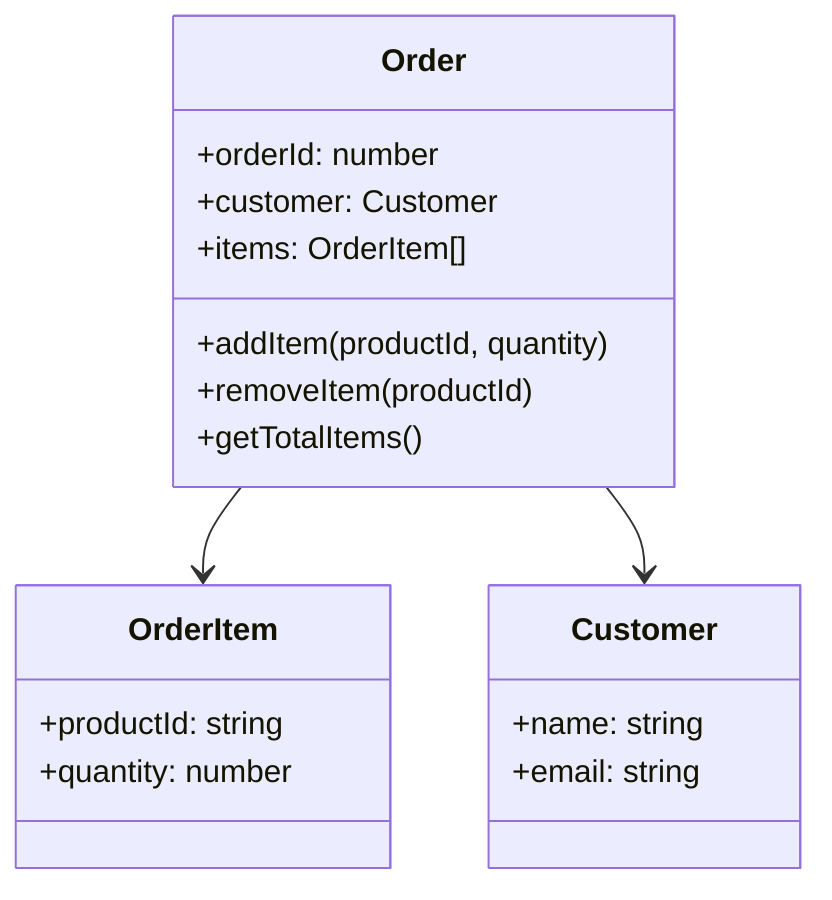

## 28.3 Entities, Value Objects, and Aggregates

In the realm of Domain-Driven Design (DDD), understanding the concepts of entities, value objects, and aggregates is crucial for creating robust and maintainable software systems. These building blocks help us model complex domains in a way that aligns with real-world scenarios. In this section, we will delve into these concepts and demonstrate how to implement them using JavaScript.

### Understanding Entities

**Entities** are objects that have a distinct identity that runs through time and different states. This identity is what distinguishes one entity from another, even if all their attributes are identical. Entities are mutable, meaning their state can change over time, but their identity remains constant.

#### Characteristics of Entities

- **Identity**: The primary characteristic of an entity is its unique identity. This identity is often represented by a unique identifier, such as a primary key in a database.
- **Mutability**: Entities can change their state over time. For example, a `User` entity might change its email address or password.
- **Lifecycle**: Entities have a lifecycle that includes creation, modification, and deletion.

#### Code Example: Implementing an Entity in JavaScript

Let's consider a `User` entity in a JavaScript application:

```javascript
class User {
  constructor(id, name, email) {
    this.id = id; // Unique identifier
    this.name = name;
    this.email = email;
  }

  updateEmail(newEmail) {
    this.email = newEmail; // Mutability: changing state
  }

  equals(otherUser) {
    return otherUser instanceof User && this.id === otherUser.id;
  }
}

// Usage
const user1 = new User(1, 'Alice', 'alice@example.com');
const user2 = new User(2, 'Bob', 'bob@example.com');

user1.updateEmail('alice.new@example.com');
console.log(user1.equals(user2)); // false
```

In this example, the `User` class represents an entity with a unique `id`. The `updateEmail` method demonstrates the mutability of entities, allowing the email to be updated.

### Defining Value Objects

**Value Objects** are objects that are defined by their attributes rather than a unique identity. They are immutable, meaning their state cannot change once they are created. Equality for value objects is determined by comparing their attributes.

#### Characteristics of Value Objects

- **Equality by Value**: Two value objects are considered equal if all their attributes are equal.
- **Immutability**: Once created, a value object cannot be modified. Any change results in a new value object.
- **No Identity**: Unlike entities, value objects do not have a unique identity.

#### Code Example: Implementing a Value Object in JavaScript

Consider a `Money` value object:

```javascript
class Money {
  constructor(amount, currency) {
    this.amount = amount;
    this.currency = currency;
    Object.freeze(this); // Ensures immutability
  }

  equals(otherMoney) {
    return otherMoney instanceof Money &&
           this.amount === otherMoney.amount &&
           this.currency === otherMoney.currency;
  }

  add(otherMoney) {
    if (this.currency !== otherMoney.currency) {
      throw new Error('Currencies must match');
    }
    return new Money(this.amount + otherMoney.amount, this.currency);
  }
}

// Usage
const money1 = new Money(100, 'USD');
const money2 = new Money(100, 'USD');
const money3 = money1.add(money2);

console.log(money1.equals(money2)); // true
console.log(money3.amount); // 200
```

In this example, the `Money` class is a value object. It is immutable, and its equality is based on its `amount` and `currency` attributes.

### Exploring Aggregates

**Aggregates** are clusters of entities and value objects that are treated as a single unit. An aggregate has a root entity, known as the aggregate root, which is the only entity that external objects can reference directly. Aggregates help maintain consistency and enforce invariants within their boundaries.

#### Characteristics of Aggregates

- **Aggregate Root**: The main entity that controls access to the aggregate. It ensures that all operations on the aggregate go through it.
- **Boundary**: Defines the scope of the aggregate. All entities and value objects within this boundary are part of the aggregate.
- **Consistency**: Aggregates ensure that all invariants are maintained within their boundaries.

#### Code Example: Implementing an Aggregate in JavaScript

Let's create an `Order` aggregate that consists of `OrderItem` entities and a `Customer` value object:

```javascript
class OrderItem {
  constructor(productId, quantity) {
    this.productId = productId;
    this.quantity = quantity;
  }
}

class Customer {
  constructor(name, email) {
    this.name = name;
    this.email = email;
    Object.freeze(this);
  }
}

class Order {
  constructor(orderId, customer) {
    this.orderId = orderId;
    this.customer = customer;
    this.items = [];
  }

  addItem(productId, quantity) {
    const item = new OrderItem(productId, quantity);
    this.items.push(item);
  }

  removeItem(productId) {
    this.items = this.items.filter(item => item.productId !== productId);
  }

  getTotalItems() {
    return this.items.reduce((total, item) => total + item.quantity, 0);
  }
}

// Usage
const customer = new Customer('Alice', 'alice@example.com');
const order = new Order(1, customer);

order.addItem('product1', 2);
order.addItem('product2', 3);
console.log(order.getTotalItems()); // 5
```

In this example, the `Order` class is the aggregate root. It manages the `OrderItem` entities and the `Customer` value object, ensuring that all operations on the aggregate are consistent.

### Best Practices for Managing Aggregates

1. **Maintain Invariants**: Ensure that all business rules and invariants are enforced within the aggregate. For example, an order should not have a negative quantity of items.

2. **Limit Aggregate Size**: Keep aggregates small to avoid performance issues and complex dependencies. Large aggregates can lead to inefficiencies and difficulties in maintaining consistency.

3. **Use Domain Events**: Consider using domain events to communicate changes within an aggregate to other parts of the system. This helps decouple the aggregate from other components.

4. **Transaction Boundaries**: Treat aggregates as transaction boundaries. All changes to an aggregate should be committed as a single transaction to maintain consistency.

5. **Reference by Identity**: When referencing other aggregates, use their unique identifiers rather than direct references. This helps maintain aggregate boundaries and reduces coupling.

### Visualizing Aggregates

To better understand the relationship between entities, value objects, and aggregates, let's visualize an aggregate structure using a class diagram:



In this diagram, the `Order` class is the aggregate root, managing the `OrderItem` entities and the `Customer` value object.

### Conclusion

Entities, value objects, and aggregates are fundamental concepts in Domain-Driven Design that help us model complex domains effectively. By understanding and implementing these concepts in JavaScript, we can create software systems that are both robust and maintainable. Remember to keep aggregates small, maintain invariants, and use domain events to communicate changes.

### Try It Yourself

Experiment with the code examples provided in this section. Try modifying the `Order` aggregate to include additional business rules, such as applying discounts or calculating taxes. This hands-on practice will deepen your understanding of entities, value objects, and aggregates.

### Knowledge Check

## Understanding Entities, Value Objects, and Aggregates in JavaScript



### What is the primary characteristic of an entity in DDD?

- [x] Unique identity
- [ ] Immutability
- [ ] Equality by value
- [ ] No identity

> **Explanation:** Entities are defined by their unique identity, which distinguishes them from other entities.

### How is equality determined for value objects?

- [ ] By unique identity
- [x] By comparing attributes
- [ ] By reference
- [ ] By mutability

> **Explanation:** Value objects are equal if all their attributes are equal, as they do not have a unique identity.

### What is the role of an aggregate root?

- [x] Controls access to the aggregate
- [ ] Represents a value object
- [ ] Ensures immutability
- [ ] Provides a unique identity

> **Explanation:** The aggregate root is the main entity that controls access to the aggregate and ensures consistency.

### Which of the following is a best practice for managing aggregates?

- [x] Maintain invariants within the aggregate
- [ ] Use direct references to other aggregates
- [ ] Keep aggregates large
- [ ] Avoid using domain events

> **Explanation:** Maintaining invariants within the aggregate ensures that all business rules are enforced.

### What is a common characteristic of value objects?

- [ ] Mutability
- [x] Immutability
- [ ] Unique identity
- [ ] Transaction boundaries

> **Explanation:** Value objects are immutable, meaning their state cannot change once created.

### How should aggregates be treated in terms of transactions?

- [x] As transaction boundaries
- [ ] As separate transactions
- [ ] As immutable objects
- [ ] As value objects

> **Explanation:** Aggregates should be treated as transaction boundaries to maintain consistency.

### What is a benefit of using domain events?

- [x] Decouples aggregates from other components
- [ ] Increases aggregate size
- [ ] Reduces immutability
- [ ] Provides unique identity

> **Explanation:** Domain events help decouple aggregates from other components by communicating changes.

### Why should aggregates be kept small?

- [x] To avoid performance issues
- [ ] To increase complexity
- [ ] To maintain immutability
- [ ] To ensure unique identity

> **Explanation:** Keeping aggregates small helps avoid performance issues and complex dependencies.

### How should other aggregates be referenced?

- [x] By unique identifiers
- [ ] By direct references
- [ ] By value
- [ ] By mutability

> **Explanation:** Referencing other aggregates by unique identifiers helps maintain boundaries and reduce coupling.

### True or False: Value objects have a unique identity.

- [ ] True
- [x] False

> **Explanation:** Value objects do not have a unique identity; they are defined by their attributes.



Remember, this is just the beginning. As you progress, you'll build more complex and interactive systems. Keep experimenting, stay curious, and enjoy the journey!


