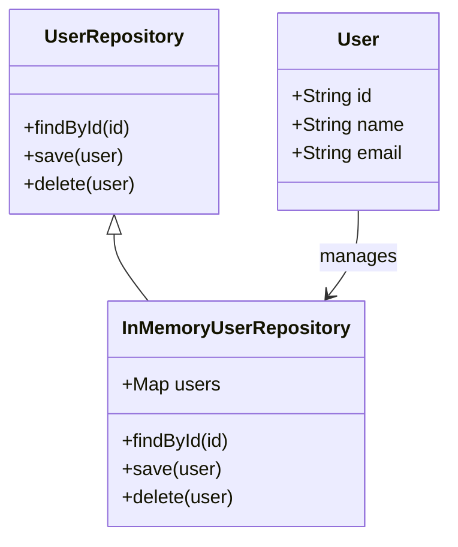
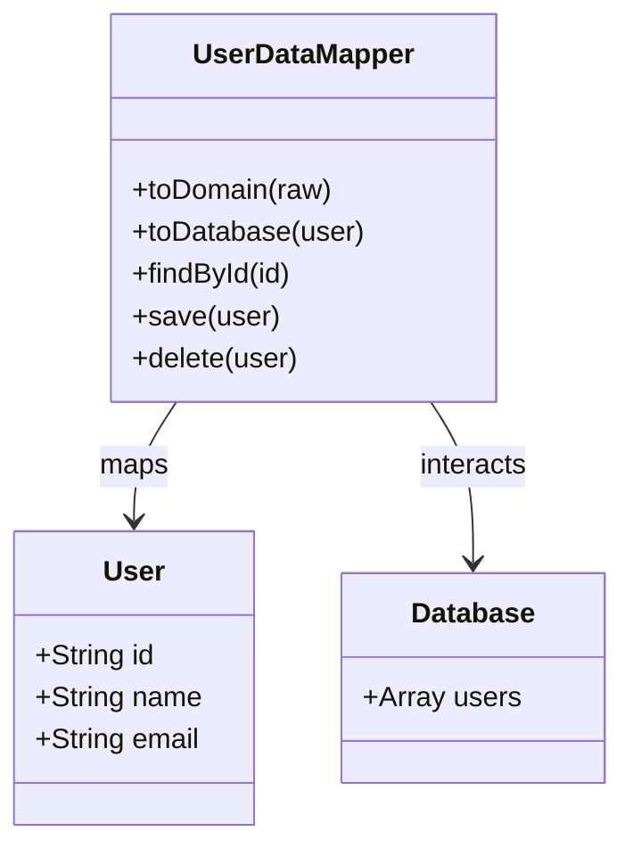

## 28.4 Repositories and Data Mappers

In the realm of Domain-Driven Design (DDD), the concepts of repositories and data mappers play a crucial role in abstracting data access and ensuring a clean separation between the domain model and data persistence. This section delves into these patterns, providing a comprehensive understanding of their purpose, implementation, and benefits in modern JavaScript applications.

### Understanding the Repository Pattern

The Repository pattern is a design pattern that mediates between the domain and data mapping layers using a collection-like interface for accessing domain objects. It provides a way to encapsulate the logic required to access data sources, such as databases, web services, or external APIs, and presents a simplified interface to the domain layer.

#### Purpose of the Repository Pattern

- **Abstraction of Data Access**: Repositories abstract the details of data access, allowing the domain layer to interact with data without knowing the specifics of the underlying data source.
- **Centralized Data Access Logic**: By centralizing data access logic, repositories promote code reuse and maintainability.
- **Decoupling Domain Logic**: Repositories decouple domain logic from infrastructure concerns, enabling easier testing and evolution of the domain model.

#### Key Participants

- **Repository Interface**: Defines the operations that can be performed on the domain objects, such as `find`, `save`, `delete`, etc.
- **Concrete Repository**: Implements the repository interface, providing the actual data access logic.
- **Domain Model**: Represents the business entities that the repository manages.

### Implementing Repositories in JavaScript

Let's explore how to implement a simple repository in JavaScript. We'll use a hypothetical `User` domain model as an example.

```javascript
// User domain model
class User {
  constructor(id, name, email) {
    this.id = id;
    this.name = name;
    this.email = email;
  }
}

// UserRepository interface
class UserRepository {
  findById(id) {
    throw new Error('Method not implemented.');
  }

  save(user) {
    throw new Error('Method not implemented.');
  }

  delete(user) {
    throw new Error('Method not implemented.');
  }
}

// Concrete implementation of UserRepository
class InMemoryUserRepository extends UserRepository {
  constructor() {
    super();
    this.users = new Map();
  }

  findById(id) {
    return this.users.get(id);
  }

  save(user) {
    this.users.set(user.id, user);
  }

  delete(user) {
    this.users.delete(user.id);
  }
}

// Usage
const userRepository = new InMemoryUserRepository();
const user = new User(1, 'John Doe', 'john.doe@example.com');
userRepository.save(user);
console.log(userRepository.findById(1)); // Output: User { id: 1, name: 'John Doe', email: 'john.doe@example.com' }
```

### Visualizing the Repository Pattern



*Figure 1: Class diagram illustrating the relationship between the User domain model, UserRepository interface, and its concrete implementation.*

### Exploring the Data Mapper Pattern

The Data Mapper pattern is another design pattern that separates the in-memory objects from the database. It is responsible for transferring data between objects and a database while keeping them independent of each other.

#### Purpose of the Data Mapper Pattern

- **Separation of Concerns**: The Data Mapper pattern separates the domain logic from the database logic, allowing each to evolve independently.
- **Flexibility**: It provides flexibility in how data is stored and retrieved, making it easier to adapt to changes in the database schema or domain model.
- **Testability**: By decoupling the domain model from the database, the domain logic can be tested without requiring a database connection.

#### Key Participants

- **Domain Model**: Represents the business entities that the data mapper manages.
- **Data Mapper**: Responsible for mapping between the domain model and the database schema.
- **Database**: The underlying data storage system.

### Implementing Data Mappers in JavaScript

Let's implement a simple data mapper for the `User` domain model using a mock database.

```javascript
// Mock database
const database = {
  users: []
};

// User data mapper
class UserDataMapper {
  toDomain(raw) {
    return new User(raw.id, raw.name, raw.email);
  }

  toDatabase(user) {
    return {
      id: user.id,
      name: user.name,
      email: user.email
    };
  }

  findById(id) {
    const raw = database.users.find(user => user.id === id);
    return raw ? this.toDomain(raw) : null;
  }

  save(user) {
    const raw = this.toDatabase(user);
    const index = database.users.findIndex(u => u.id === user.id);
    if (index !== -1) {
      database.users[index] = raw;
    } else {
      database.users.push(raw);
    }
  }

  delete(user) {
    const index = database.users.findIndex(u => u.id === user.id);
    if (index !== -1) {
      database.users.splice(index, 1);
    }
  }
}

// Usage
const userMapper = new UserDataMapper();
const user = new User(1, 'Jane Doe', 'jane.doe@example.com');
userMapper.save(user);
console.log(userMapper.findById(1)); // Output: User { id: 1, name: 'Jane Doe', email: 'jane.doe@example.com' }
```

### Visualizing the Data Mapper Pattern



*Figure 2: Class diagram illustrating the relationship between the User domain model, UserDataMapper, and the mock database.*

### Using ORMs and Data Access Libraries

In real-world applications, implementing repositories and data mappers from scratch can be cumbersome. Fortunately, there are several Object-Relational Mapping (ORM) libraries and data access tools available for JavaScript that simplify this process. Two popular options are TypeORM and Mongoose.

#### TypeORM

[TypeORM](https://typeorm.io/) is a powerful ORM for TypeScript and JavaScript that supports various database systems. It provides decorators and a repository pattern out of the box, making it easy to work with databases in a type-safe manner.

```javascript
import { Entity, PrimaryGeneratedColumn, Column, Repository } from 'typeorm';

// User entity
@Entity()
class User {
  @PrimaryGeneratedColumn()
  id;

  @Column()
  name;

  @Column()
  email;
}

// Usage with TypeORM
async function main() {
  const userRepository = new Repository(User);
  const user = new User();
  user.name = 'Alice';
  user.email = 'alice@example.com';
  await userRepository.save(user);
  const savedUser = await userRepository.findOneBy({ id: user.id });
  console.log(savedUser);
}
```

#### Mongoose

[Mongoose](https://mongoosejs.com/) is a popular ODM (Object Data Modeling) library for MongoDB and Node.js. It provides a straightforward, schema-based solution to model application data.

```javascript
const mongoose = require('mongoose');

// User schema
const userSchema = new mongoose.Schema({
  name: String,
  email: String
});

// User model
const User = mongoose.model('User', userSchema);

// Usage with Mongoose
async function main() {
  await mongoose.connect('mongodb://localhost:27017/mydatabase');
  const user = new User({ name: 'Bob', email: 'bob@example.com' });
  await user.save();
  const savedUser = await User.findOne({ name: 'Bob' });
  console.log(savedUser);
}
```

### Benefits of Decoupling Domain Logic from Infrastructure

Decoupling domain logic from infrastructure concerns, such as data access, provides several benefits:

- **Maintainability**: Changes to the database schema or data access logic do not affect the domain model, making the codebase easier to maintain.
- **Testability**: Domain logic can be tested independently of the database, leading to faster and more reliable tests.
- **Flexibility**: The application can adapt to changes in the data storage technology without impacting the domain logic.
- **Scalability**: By separating concerns, the application can scale more effectively, as each layer can be optimized independently.

### Try It Yourself

To solidify your understanding of repositories and data mappers, try modifying the code examples provided:

- Implement additional methods in the `UserRepository` and `UserDataMapper` classes, such as `findAll` or `update`.
- Experiment with different data storage solutions, such as local storage or indexedDB, for the `InMemoryUserRepository`.
- Use TypeORM or Mongoose to create a more complex domain model with relationships between entities.

### Knowledge Check

To reinforce your understanding of repositories and data mappers, consider the following questions:

- What are the main responsibilities of a repository in DDD?
- How does the Data Mapper pattern differ from the Active Record pattern?
- What are the benefits of using an ORM like TypeORM or Mongoose?
- How can decoupling domain logic from infrastructure concerns improve testability?

### Summary

In this section, we've explored the Repository and Data Mapper patterns, two essential components of Domain-Driven Design that facilitate the separation of domain logic from data access concerns. By implementing these patterns in JavaScript, we can create maintainable, testable, and flexible applications that are well-suited for modern web development.

Remember, this is just the beginning. As you progress, you'll build more complex and interactive applications. Keep experimenting, stay curious, and enjoy the journey!

## Quiz: Mastering Repositories and Data Mappers in JavaScript



### What is the primary purpose of the Repository pattern in DDD?

- [x] To abstract data access and provide a collection-like interface for domain objects
- [ ] To directly manipulate database records
- [ ] To serve as a caching mechanism
- [ ] To handle user authentication

> **Explanation:** The Repository pattern abstracts data access and provides a collection-like interface for domain objects, decoupling domain logic from data persistence.

### How does the Data Mapper pattern differ from the Active Record pattern?

- [x] The Data Mapper pattern separates domain logic from database logic, while Active Record combines them
- [ ] The Data Mapper pattern is only used in JavaScript
- [ ] The Active Record pattern is more flexible than the Data Mapper pattern
- [ ] The Data Mapper pattern is a type of Repository pattern

> **Explanation:** The Data Mapper pattern separates domain logic from database logic, unlike the Active Record pattern, which combines them.

### Which of the following is a benefit of using ORMs like TypeORM or Mongoose?

- [x] They simplify data access and provide a higher-level abstraction over databases
- [ ] They eliminate the need for a database
- [ ] They automatically optimize all database queries
- [ ] They are only suitable for small applications

> **Explanation:** ORMs like TypeORM and Mongoose simplify data access by providing a higher-level abstraction over databases, making it easier to work with data.

### What is a key advantage of decoupling domain logic from infrastructure concerns?

- [x] Improved testability and maintainability
- [ ] Increased application size
- [ ] Reduced code readability
- [ ] Slower development process

> **Explanation:** Decoupling domain logic from infrastructure concerns improves testability and maintainability, allowing for easier changes and testing.

### Which JavaScript library is commonly used for Object Data Modeling with MongoDB?

- [x] Mongoose
- [ ] TypeORM
- [ ] Sequelize
- [ ] Knex.js

> **Explanation:** Mongoose is a popular library for Object Data Modeling with MongoDB in JavaScript applications.

### What is the role of a Data Mapper in DDD?

- [x] To map between domain objects and database representations
- [ ] To handle user input validation
- [ ] To manage application state
- [ ] To serve as a caching layer

> **Explanation:** A Data Mapper maps between domain objects and database representations, keeping them independent of each other.

### Which of the following is NOT a responsibility of a repository?

- [ ] Providing an interface for accessing domain objects
- [ ] Abstracting data access logic
- [x] Handling user authentication
- [ ] Centralizing data access logic

> **Explanation:** Handling user authentication is not a responsibility of a repository; repositories focus on data access and domain object management.

### What is a common use case for the Repository pattern?

- [x] Managing collections of domain objects
- [ ] Rendering UI components
- [ ] Handling HTTP requests
- [ ] Managing application configuration

> **Explanation:** The Repository pattern is commonly used for managing collections of domain objects, abstracting data access logic.

### Which pattern is responsible for transferring data between objects and a database?

- [x] Data Mapper
- [ ] Singleton
- [ ] Observer
- [ ] Factory

> **Explanation:** The Data Mapper pattern is responsible for transferring data between objects and a database, keeping them independent.

### True or False: The Repository pattern is only applicable to relational databases.

- [ ] True
- [x] False

> **Explanation:** False. The Repository pattern is not limited to relational databases; it can be used with any data source, including NoSQL databases and web services.


