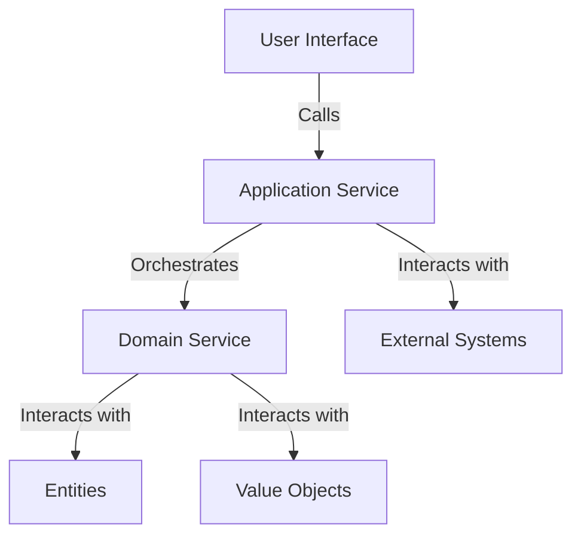

## 28.5 Domain Services and Application Services

In the realm of Domain-Driven Design (DDD), understanding the distinction between domain services and application services is crucial for building robust, maintainable software. These services play pivotal roles in encapsulating business logic that doesn't naturally fit within entities or value objects. In this section, we'll delve into the specifics of domain services and application services, providing clear definitions, examples, and best practices for their implementation in JavaScript.

### Understanding Domain Services

**Domain Services** are a core concept in DDD, designed to handle business logic that doesn't belong to any particular entity or value object. They encapsulate operations that involve multiple entities or require complex business rules.

#### When to Use Domain Services

- **Cross-Entity Operations**: When a business operation involves multiple entities, a domain service can coordinate the interaction between them.
- **Complex Business Logic**: If a piece of logic is too complex to reside within a single entity, a domain service can encapsulate this logic.
- **Stateless Operations**: Domain services are typically stateless, focusing on behavior rather than data.

#### Example of Domain Services in JavaScript

Let's consider a simple e-commerce system where we need to calculate the total price of an order, including discounts and taxes. This logic doesn't naturally belong to a single entity like `Order` or `Product`.

```javascript
class OrderService {
  constructor(discountService, taxService) {
    this.discountService = discountService;
    this.taxService = taxService;
  }

  calculateTotal(order) {
    const discount = this.discountService.calculateDiscount(order);
    const tax = this.taxService.calculateTax(order);
    const total = order.items.reduce((sum, item) => sum + item.price, 0);
    return total - discount + tax;
  }
}

// Usage
const orderService = new OrderService(new DiscountService(), new TaxService());
const total = orderService.calculateTotal(order);
console.log(`Total order price: $${total}`);
```

In this example, `OrderService` is a domain service that uses other services (`DiscountService` and `TaxService`) to calculate the total price of an order.

### Exploring Application Services

**Application Services** act as a bridge between the domain layer and the user interface or external systems. They orchestrate domain operations, ensuring that the right domain services are called in the correct sequence.

#### Role of Application Services

- **Orchestration**: Application services coordinate the execution of domain services and entities.
- **Transaction Management**: They often handle transactions, ensuring that operations are completed successfully.
- **Security and Validation**: Application services can enforce security rules and validate input data.

#### Example of Application Services in JavaScript

Continuing with our e-commerce example, let's create an application service that handles the checkout process.

```javascript
class CheckoutService {
  constructor(orderService, paymentService, notificationService) {
    this.orderService = orderService;
    this.paymentService = paymentService;
    this.notificationService = notificationService;
  }

  async checkout(order, paymentDetails) {
    const total = this.orderService.calculateTotal(order);
    const paymentResult = await this.paymentService.processPayment(paymentDetails, total);

    if (paymentResult.success) {
      this.notificationService.sendConfirmation(order);
      return { success: true, message: 'Checkout successful!' };
    } else {
      return { success: false, message: 'Payment failed. Please try again.' };
    }
  }
}

// Usage
const checkoutService = new CheckoutService(orderService, paymentService, notificationService);
checkoutService.checkout(order, paymentDetails).then(result => {
  console.log(result.message);
});
```

Here, `CheckoutService` is an application service that orchestrates the checkout process by coordinating the `OrderService`, `PaymentService`, and `NotificationService`.

### Separation of Concerns

A key principle in software design is the **separation of concerns**, which helps maintain a clean architecture by dividing responsibilities among different components. In the context of DDD:

- **Domain Services** focus on business logic and rules.
- **Application Services** handle orchestration, transactions, and interactions with external systems.

By keeping these services distinct, we ensure that each part of the system remains cohesive and focused on its primary responsibility.

### Best Practices for Domain and Application Services

1. **Cohesion and Focus**: Ensure that each service has a single responsibility and is focused on a specific aspect of the business logic.
2. **Statelessness**: Domain services should be stateless, relying on entities and value objects for data.
3. **Reusability**: Design services to be reusable across different parts of the application.
4. **Decoupling**: Keep domain and application services decoupled from the user interface and infrastructure layers.
5. **Testing**: Write unit tests for services to ensure that business logic is correct and maintainable.

### Visualizing Domain and Application Services

To better understand the interaction between domain and application services, let's visualize their roles in a typical application architecture.



**Diagram Description**: This diagram illustrates how the user interface interacts with application services, which in turn orchestrate domain services. Domain services interact with entities and value objects to perform business logic, while application services may also interact with external systems.

### Knowledge Check

- **Question**: What is the primary role of domain services in DDD?
- **Question**: How do application services differ from domain services?
- **Question**: Why is it important to keep domain services stateless?

### Exercises

1. **Exercise**: Implement a domain service for a library system that calculates late fees for borrowed books.
2. **Exercise**: Create an application service that handles user registration, including sending a welcome email.

### Summary

In this section, we've explored the roles of domain services and application services in Domain-Driven Design. By understanding their distinct responsibilities and how they interact, we can build more maintainable and scalable applications. Remember, this is just the beginning. As you progress, you'll refine these concepts and apply them to more complex scenarios. Keep experimenting, stay curious, and enjoy the journey!

## Understanding Domain and Application Services in JavaScript



### What is the primary role of domain services in DDD?

- [x] To encapsulate business logic that doesn't belong to a single entity
- [ ] To handle user interface interactions
- [ ] To manage database transactions
- [ ] To perform data validation

> **Explanation:** Domain services encapsulate business logic that doesn't naturally fit within a single entity or value object.

### How do application services differ from domain services?

- [x] Application services orchestrate domain operations
- [ ] Application services handle database transactions
- [ ] Application services are stateless
- [ ] Application services focus on business rules

> **Explanation:** Application services orchestrate domain operations and interactions with external systems, while domain services focus on business logic.

### Why is it important to keep domain services stateless?

- [x] To ensure reusability and scalability
- [ ] To simplify user interface interactions
- [ ] To manage database connections
- [ ] To handle security concerns

> **Explanation:** Stateless domain services are more reusable and scalable, as they focus on behavior rather than maintaining state.

### What is a key principle in software design that helps maintain a clean architecture?

- [x] Separation of concerns
- [ ] Code duplication
- [ ] Tight coupling
- [ ] Global variables

> **Explanation:** Separation of concerns divides responsibilities among different components, maintaining a clean architecture.

### Which of the following is a best practice for designing domain and application services?

- [x] Cohesion and focus
- [ ] Mixing responsibilities
- [ ] Using global state
- [ ] Ignoring testing

> **Explanation:** Ensuring cohesion and focus helps maintain a single responsibility for each service, improving maintainability.

### What is the role of application services in transaction management?

- [x] To handle transactions and ensure operations are completed successfully
- [ ] To perform data validation
- [ ] To encapsulate business logic
- [ ] To manage user interface interactions

> **Explanation:** Application services handle transactions, ensuring that operations are completed successfully.

### How can domain services interact with entities?

- [x] By coordinating operations involving multiple entities
- [ ] By managing user interface interactions
- [ ] By handling external system communications
- [ ] By performing data validation

> **Explanation:** Domain services coordinate operations involving multiple entities, encapsulating complex business logic.

### What is a common characteristic of domain services?

- [x] Statelessness
- [ ] Statefulness
- [ ] User interface management
- [ ] Database transactions

> **Explanation:** Domain services are typically stateless, focusing on behavior rather than data.

### What is the purpose of the `OrderService` in the provided code example?

- [x] To calculate the total price of an order
- [ ] To handle user interface interactions
- [ ] To manage database connections
- [ ] To perform data validation

> **Explanation:** The `OrderService` calculates the total price of an order, including discounts and taxes.

### True or False: Application services should be tightly coupled with the user interface.

- [ ] True
- [x] False

> **Explanation:** Application services should be decoupled from the user interface to maintain a clean architecture.




