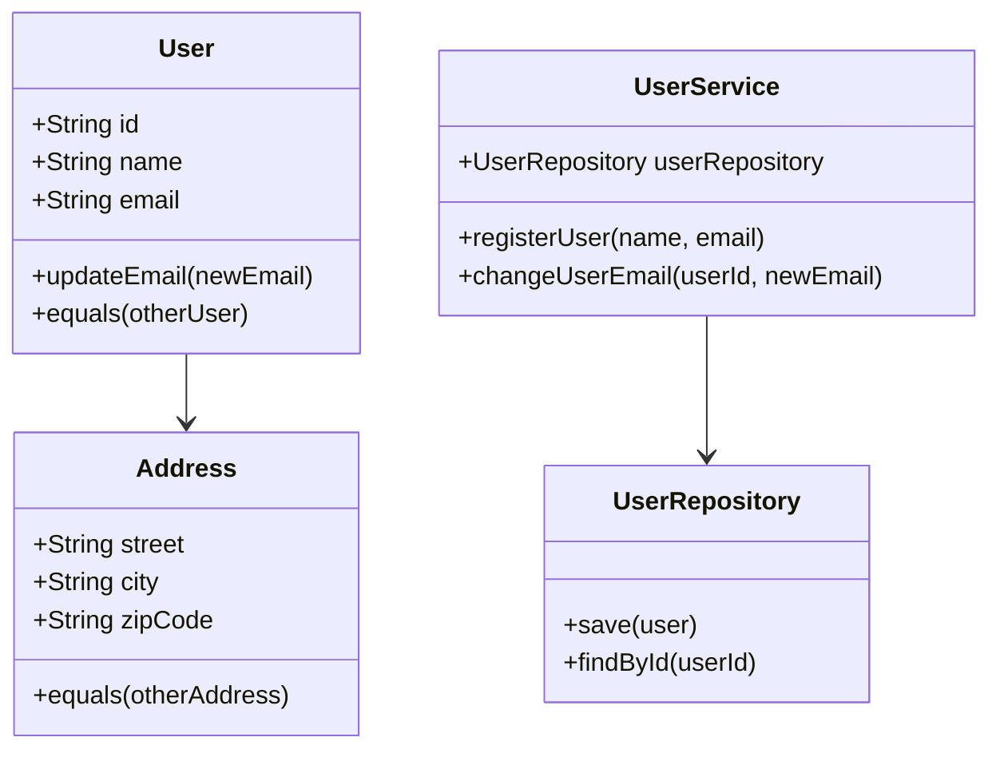

## 28.6 Implementing Domain-Driven Design with JavaScript Classes and Modules

Domain-Driven Design (DDD) is a powerful approach to software development that emphasizes collaboration between technical and domain experts to create a model that accurately reflects the business domain. In this section, we will explore how to implement DDD using JavaScript's ES6 classes and modules, creating a modular and maintainable codebase.

### Understanding Domain-Driven Design

Before diving into implementation, let's briefly revisit the core concepts of DDD:

- **Domain**: The sphere of knowledge and activity around which the application logic revolves.
- **Entities**: Objects that have a distinct identity that runs through time and different states.
- **Value Objects**: Objects that describe some characteristic or attribute but have no conceptual identity.
- **Aggregates**: A cluster of domain objects that can be treated as a single unit.
- **Repositories**: Mechanisms for encapsulating storage, retrieval, and search behavior which emulates a collection of objects.
- **Services**: Operations that do not naturally fit within entities or value objects.

### JavaScript ES6 Classes for Domain Entities and Value Objects

JavaScript ES6 introduced classes, providing a more structured way to define objects and their behaviors. Let's see how we can use classes to represent domain entities and value objects.

#### Defining Domain Entities

Entities are the core of your domain model. They have a unique identity and lifecycle. Here's how you can define an entity using JavaScript classes:

```javascript
// Entity: User
class User {
  constructor(id, name, email) {
    this.id = id; // Unique identifier
    this.name = name;
    this.email = email;
  }

  updateEmail(newEmail) {
    this.email = newEmail;
  }

  equals(otherUser) {
    return otherUser instanceof User && this.id === otherUser.id;
  }
}

// Usage
const user1 = new User(1, 'Alice', 'alice@example.com');
const user2 = new User(2, 'Bob', 'bob@example.com');
console.log(user1.equals(user2)); // false
```

#### Creating Value Objects

Value objects are immutable and do not have an identity. They are defined by their attributes. Here's an example:

```javascript
// Value Object: Address
class Address {
  constructor(street, city, zipCode) {
    this.street = street;
    this.city = city;
    this.zipCode = zipCode;
    Object.freeze(this); // Make the object immutable
  }

  equals(otherAddress) {
    return (
      otherAddress instanceof Address &&
      this.street === otherAddress.street &&
      this.city === otherAddress.city &&
      this.zipCode === otherAddress.zipCode
    );
  }
}

// Usage
const address1 = new Address('123 Main St', 'Anytown', '12345');
const address2 = new Address('123 Main St', 'Anytown', '12345');
console.log(address1.equals(address2)); // true
```

### Organizing Code with Modules

Modules in JavaScript allow you to encapsulate code and create reusable components. This is crucial in DDD as it helps maintain boundaries between different parts of the domain.

#### Using Import/Export Statements

JavaScript modules use `import` and `export` statements to share functionality between files. Here's how you can structure your domain model using modules:

```javascript
// user.js
export class User {
  constructor(id, name, email) {
    this.id = id;
    this.name = name;
    this.email = email;
  }

  updateEmail(newEmail) {
    this.email = newEmail;
  }
}

// address.js
export class Address {
  constructor(street, city, zipCode) {
    this.street = street;
    this.city = city;
    this.zipCode = zipCode;
    Object.freeze(this);
  }
}

// main.js
import { User } from './user.js';
import { Address } from './address.js';

const user = new User(1, 'Alice', 'alice@example.com');
const address = new Address('123 Main St', 'Anytown', '12345');
```

### Enforcing Boundaries with Modules

Modules help enforce boundaries within your domain by encapsulating logic and exposing only what is necessary. This aligns with the DDD principle of maintaining clear boundaries between different parts of the domain.

#### Example: Encapsulating Domain Logic

Consider a scenario where you have a `UserService` that handles user-related operations. You can encapsulate this logic within a module:

```javascript
// userService.js
import { User } from './user.js';

export class UserService {
  constructor(userRepository) {
    this.userRepository = userRepository;
  }

  registerUser(name, email) {
    const user = new User(Date.now(), name, email);
    this.userRepository.save(user);
    return user;
  }

  changeUserEmail(userId, newEmail) {
    const user = this.userRepository.findById(userId);
    if (user) {
      user.updateEmail(newEmail);
      this.userRepository.save(user);
    }
  }
}
```

### Using Namespaces and Folder Structures

Organizing your codebase using namespaces or folder structures can help reflect the domain context and maintain clarity.

#### Example Folder Structure

```
src/
  domain/
    user/
      User.js
      UserService.js
      UserRepository.js
    order/
      Order.js
      OrderService.js
      OrderRepository.js
  infrastructure/
    database/
      DatabaseConnection.js
    messaging/
      MessageQueue.js
```

This structure separates domain logic from infrastructure concerns, making it easier to manage and scale the application.

### Visualizing Domain-Driven Design with JavaScript

To better understand how these components interact, let's visualize the relationships between entities, value objects, services, and repositories using a class diagram.



### Key Takeaways

- **JavaScript ES6 classes** provide a structured way to define domain entities and value objects.
- **Modules** help encapsulate domain logic and enforce boundaries between different parts of the domain.
- **Import/export statements** allow for a clean and organized codebase.
- **Namespaces and folder structures** reflect the domain context and separate domain logic from infrastructure concerns.

### Try It Yourself

Experiment with the code examples provided by:

- Adding new methods to the `User` or `Address` classes.
- Creating a new domain entity or value object.
- Organizing your codebase using a different folder structure.

### Further Reading

- [MDN Web Docs: Classes](https://developer.mozilla.org/en-US/docs/Web/JavaScript/Reference/Classes)
- [MDN Web Docs: Modules](https://developer.mozilla.org/en-US/docs/Web/JavaScript/Guide/Modules)
- [Domain-Driven Design Reference](https://www.domainlanguage.com/ddd/reference/)

### Knowledge Check

To reinforce your understanding, try answering the following questions.

## Quiz: Mastering DDD with JavaScript Classes and Modules



### What is the primary purpose of using classes in JavaScript for DDD?

- [x] To define domain entities and value objects with structured behavior.
- [ ] To handle asynchronous operations.
- [ ] To manage global state.
- [ ] To perform mathematical calculations.

> **Explanation:** Classes provide a structured way to define domain entities and value objects, encapsulating their behavior and attributes.

### How do modules help in implementing DDD in JavaScript?

- [x] By encapsulating domain logic and enforcing boundaries.
- [ ] By providing a way to handle asynchronous code.
- [ ] By improving performance of the application.
- [ ] By simplifying error handling.

> **Explanation:** Modules encapsulate domain logic, enforce boundaries, and allow for a clean and organized codebase.

### Which statement is true about value objects in DDD?

- [x] They are immutable and defined by their attributes.
- [ ] They have a unique identity.
- [ ] They manage application state.
- [ ] They handle user input.

> **Explanation:** Value objects are immutable and defined by their attributes, not by a unique identity.

### What is the role of a repository in DDD?

- [x] To encapsulate storage, retrieval, and search behavior.
- [ ] To define domain entities.
- [ ] To manage user sessions.
- [ ] To handle HTTP requests.

> **Explanation:** Repositories encapsulate storage, retrieval, and search behavior, emulating a collection of objects.

### How can folder structures help in DDD?

- [x] By reflecting the domain context and separating concerns.
- [ ] By improving application performance.
- [ ] By handling asynchronous operations.
- [ ] By managing user authentication.

> **Explanation:** Folder structures reflect the domain context and separate domain logic from infrastructure concerns.

### What is the benefit of using `Object.freeze()` in value objects?

- [x] To make the object immutable.
- [ ] To improve performance.
- [ ] To handle errors.
- [ ] To manage state.

> **Explanation:** `Object.freeze()` is used to make objects immutable, which is a key characteristic of value objects.

### Which of the following is NOT a characteristic of domain entities?

- [ ] They have a unique identity.
- [x] They are immutable.
- [ ] They have a lifecycle.
- [ ] They encapsulate behavior.

> **Explanation:** Domain entities have a unique identity and lifecycle, but they are not necessarily immutable.

### What is the purpose of the `equals` method in domain entities?

- [x] To compare entities based on their identity.
- [ ] To handle errors.
- [ ] To manage state.
- [ ] To perform calculations.

> **Explanation:** The `equals` method is used to compare entities based on their identity, ensuring they are the same entity.

### How do import/export statements contribute to DDD?

- [x] By allowing for a clean and organized codebase.
- [ ] By improving application performance.
- [ ] By handling asynchronous operations.
- [ ] By managing user sessions.

> **Explanation:** Import/export statements allow for a clean and organized codebase, essential for maintaining boundaries in DDD.

### True or False: In DDD, services should encapsulate behavior that doesn't naturally fit within entities or value objects.

- [x] True
- [ ] False

> **Explanation:** Services in DDD encapsulate behavior that doesn't naturally fit within entities or value objects, providing operations that span multiple entities.



Remember, this is just the beginning. As you progress, you'll build more complex and interactive applications. Keep experimenting, stay curious, and enjoy the journey!


