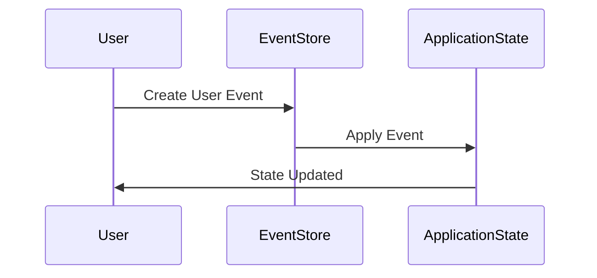
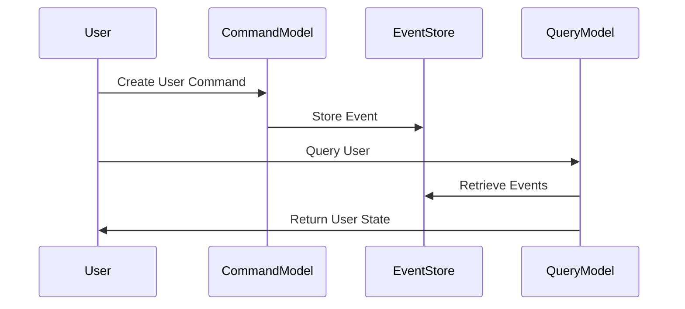

## 28.7 Event Sourcing and CQRS Patterns

In the realm of Domain-Driven Design (DDD), Event Sourcing and Command Query Responsibility Segregation (CQRS) are two powerful patterns that can transform how we handle data changes and queries. These patterns are particularly useful in complex systems where capturing every state change and separating read and write operations can lead to more scalable and maintainable architectures.

### Understanding Event Sourcing

**Event Sourcing** is a pattern where state changes in a system are captured as a sequence of events. Instead of storing the current state of an entity, we store a series of events that have led to the current state. This approach allows us to reconstruct any past state by replaying the events.

#### Key Concepts of Event Sourcing

- **Event Store**: A database that stores events. Each event represents a change in state.
- **Event**: A record of a state change, typically immutable and timestamped.
- **Rehydration**: The process of reconstructing the current state from a sequence of events.

#### Benefits of Event Sourcing

- **Auditability**: Every change is recorded, providing a complete audit trail.
- **Reproducibility**: The ability to reconstruct past states for debugging or analysis.
- **Flexibility**: Allows for future changes in business logic without altering past data.

#### Challenges of Event Sourcing

- **Complexity**: Managing event stores and ensuring consistency can be complex.
- **Storage**: Requires efficient storage solutions to handle potentially large volumes of events.
- **Event Versioning**: Handling changes in event structure over time.

### Implementing Event Sourcing in JavaScript

Let's explore how to implement Event Sourcing in a JavaScript application using the `node-eventstore` library.

#### Example: Implementing Event Sourcing

```javascript
const eventstore = require('eventstore');

// Initialize the event store
const es = eventstore({
  type: 'mongodb',
  host: 'localhost', // optional
  port: 27017, // optional
  dbName: 'eventstore' // optional
});

// Define an event
const userCreatedEvent = {
  id: '1',
  streamId: 'user-1',
  payload: {
    name: 'John Doe',
    email: 'john.doe@example.com'
  },
  eventType: 'UserCreated'
};

// Store the event
es.getEventStream('user-1', (err, stream) => {
  if (err) throw err;
  stream.addEvent(userCreatedEvent);
  stream.commit((err) => {
    if (err) throw err;
    console.log('Event stored successfully');
  });
});

// Rehydrate state from events
es.getEventStream('user-1', (err, stream) => {
  if (err) throw err;
  const events = stream.events;
  const userState = events.reduce((state, event) => {
    switch (event.eventType) {
      case 'UserCreated':
        return { ...state, ...event.payload };
      default:
        return state;
    }
  }, {});
  console.log('Rehydrated user state:', userState);
});
```

### Understanding CQRS

**Command Query Responsibility Segregation (CQRS)** is a pattern that separates the models for reading and writing data. This separation allows for optimized and scalable architectures, particularly in systems with complex business logic and high read/write loads.

#### Key Concepts of CQRS

- **Command Model**: Handles write operations, encapsulating business logic and validation.
- **Query Model**: Handles read operations, optimized for data retrieval.
- **Separation of Concerns**: By separating read and write models, each can be optimized independently.

#### Benefits of CQRS

- **Scalability**: Read and write models can be scaled independently.
- **Performance**: Optimized queries for read-heavy applications.
- **Flexibility**: Different data models for reads and writes allow for more flexibility in design.

#### Challenges of CQRS

- **Complexity**: Requires careful design to manage separate models and ensure consistency.
- **Consistency**: Ensuring eventual consistency between read and write models can be challenging.

### Implementing CQRS in JavaScript

Let's explore how to implement CQRS in a JavaScript application.

#### Example: Implementing CQRS

```javascript
// Command Model
class UserCommandModel {
  constructor(eventStore) {
    this.eventStore = eventStore;
  }

  createUser(userId, name, email) {
    const userCreatedEvent = {
      id: userId,
      streamId: `user-${userId}`,
      payload: { name, email },
      eventType: 'UserCreated'
    };
    this.eventStore.getEventStream(`user-${userId}`, (err, stream) => {
      if (err) throw err;
      stream.addEvent(userCreatedEvent);
      stream.commit((err) => {
        if (err) throw err;
        console.log('User created event stored');
      });
    });
  }
}

// Query Model
class UserQueryModel {
  constructor(eventStore) {
    this.eventStore = eventStore;
  }

  getUser(userId, callback) {
    this.eventStore.getEventStream(`user-${userId}`, (err, stream) => {
      if (err) return callback(err);
      const events = stream.events;
      const userState = events.reduce((state, event) => {
        switch (event.eventType) {
          case 'UserCreated':
            return { ...state, ...event.payload };
          default:
            return state;
        }
      }, {});
      callback(null, userState);
    });
  }
}

// Usage
const es = eventstore({ type: 'mongodb', host: 'localhost', port: 27017, dbName: 'eventstore' });
const userCommandModel = new UserCommandModel(es);
const userQueryModel = new UserQueryModel(es);

userCommandModel.createUser('1', 'John Doe', 'john.doe@example.com');
userQueryModel.getUser('1', (err, user) => {
  if (err) throw err;
  console.log('Queried user:', user);
});
```

### Libraries and Frameworks Supporting Event Sourcing and CQRS

While JavaScript has libraries like `node-eventstore` for Event Sourcing, the CQRS pattern often requires custom implementation. However, concepts from frameworks like the [Axon Framework](https://axoniq.io/) can inspire JavaScript implementations.

### Benefits and Challenges in the Context of DDD

In the context of Domain-Driven Design, Event Sourcing and CQRS offer several benefits:

- **Alignment with DDD**: These patterns align well with DDD principles, capturing domain events and separating concerns.
- **Complexity Management**: They help manage complexity in large systems by providing clear boundaries between different parts of the system.

However, they also introduce challenges:

- **Increased Complexity**: Implementing and maintaining these patterns can be complex, requiring careful design and architecture.
- **Consistency Management**: Ensuring consistency between event stores and read models can be challenging, especially in distributed systems.

### Try It Yourself

Experiment with the provided code examples by modifying the event types or adding new commands and queries. Consider implementing additional features such as event versioning or handling more complex state transitions.

### Visualizing Event Sourcing and CQRS

To better understand these patterns, let's visualize the flow of events and commands using Mermaid.js diagrams.

#### Event Sourcing Flow



*Caption: This diagram illustrates the flow of events in Event Sourcing, where user actions generate events that update the application state.*

#### CQRS Flow



*Caption: This diagram shows the separation of command and query models in CQRS, highlighting the distinct paths for handling writes and reads.*

### Knowledge Check

- **What is Event Sourcing, and how does it differ from traditional state storage?**
- **Explain the benefits of separating read and write models in CQRS.**
- **What are some challenges you might face when implementing Event Sourcing and CQRS?**

### Summary

Event Sourcing and CQRS are powerful patterns that can enhance the scalability and maintainability of complex systems. By capturing every state change as an event and separating read and write models, these patterns align well with Domain-Driven Design principles. However, they also introduce complexity and require careful design to ensure consistency and manageability.

Remember, this is just the beginning. As you progress, you'll build more complex and interactive systems. Keep experimenting, stay curious, and enjoy the journey!

### References and Further Reading

- [Event Sourcing on Martin Fowler's Blog](https://martinfowler.com/eaaDev/EventSourcing.html)
- [CQRS on Martin Fowler's Blog](https://martinfowler.com/bliki/CQRS.html)
- [Node Eventstore GitHub Repository](https://github.com/adrai/node-eventstore)
- [Axon Framework](https://axoniq.io/)

## Quiz: Mastering Event Sourcing and CQRS Patterns



### What is the primary purpose of Event Sourcing?

- [x] To record state changes as a sequence of events
- [ ] To store the current state of an entity
- [ ] To separate read and write models
- [ ] To optimize database queries

> **Explanation:** Event Sourcing records state changes as a sequence of events, allowing for reconstruction of past states.

### What does CQRS stand for?

- [x] Command Query Responsibility Segregation
- [ ] Command Query Read Separation
- [ ] Command Queue Resource Segregation
- [ ] Command Query Resource Separation

> **Explanation:** CQRS stands for Command Query Responsibility Segregation, a pattern that separates read and write models.

### Which library is commonly used for Event Sourcing in JavaScript?

- [x] node-eventstore
- [ ] Redux
- [ ] Express
- [ ] Lodash

> **Explanation:** The `node-eventstore` library is commonly used for implementing Event Sourcing in JavaScript applications.

### What is a key benefit of using CQRS?

- [x] Scalability by separating read and write models
- [ ] Simplifying database schemas
- [ ] Reducing the number of events
- [ ] Increasing code complexity

> **Explanation:** CQRS allows for scalability by separating read and write models, optimizing each for its specific purpose.

### What challenge is commonly associated with Event Sourcing?

- [x] Managing large volumes of events
- [ ] Simplifying data retrieval
- [ ] Reducing storage requirements
- [ ] Decreasing code complexity

> **Explanation:** Event Sourcing can lead to large volumes of events, requiring efficient storage and management solutions.

### How does CQRS help in performance optimization?

- [x] By allowing separate optimization for read and write operations
- [ ] By reducing the number of database queries
- [ ] By simplifying event handling
- [ ] By decreasing the number of events

> **Explanation:** CQRS allows for separate optimization of read and write operations, improving performance.

### What is a common use case for Event Sourcing?

- [x] Systems requiring a complete audit trail
- [ ] Systems with simple state changes
- [ ] Systems with minimal data changes
- [ ] Systems focused on real-time data processing

> **Explanation:** Event Sourcing is ideal for systems requiring a complete audit trail of state changes.

### What is rehydration in the context of Event Sourcing?

- [x] Reconstructing the current state from a sequence of events
- [ ] Storing the current state in a database
- [ ] Separating read and write models
- [ ] Optimizing database queries

> **Explanation:** Rehydration involves reconstructing the current state from a sequence of events.

### Which of the following is a challenge of implementing CQRS?

- [x] Ensuring consistency between read and write models
- [ ] Reducing the number of events
- [ ] Simplifying data retrieval
- [ ] Decreasing code complexity

> **Explanation:** Ensuring consistency between read and write models is a challenge in CQRS implementations.

### Event Sourcing and CQRS are particularly useful in systems with complex business logic.

- [x] True
- [ ] False

> **Explanation:** Event Sourcing and CQRS are beneficial in systems with complex business logic, providing scalability and maintainability.




