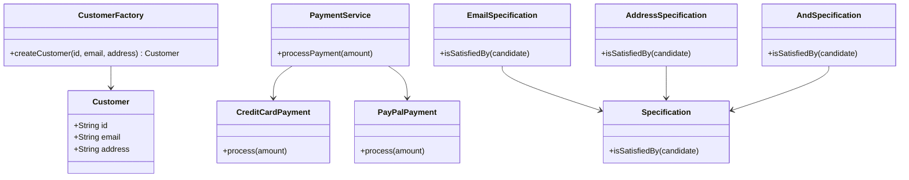

## 28.8 Using Design Patterns in DDD

Domain-Driven Design (DDD) is a powerful approach to software development that emphasizes collaboration between technical and domain experts to create a model that accurately reflects the business domain. Design patterns play a crucial role in DDD by providing proven solutions to common problems, ensuring that the domain model remains clean, maintainable, and aligned with business requirements. In this section, we will explore how design patterns such as Factory, Strategy, and Specification can be effectively integrated into DDD using JavaScript.

### Understanding Domain-Driven Design

Before delving into specific design patterns, let's briefly revisit the core concepts of Domain-Driven Design. DDD focuses on:

- **Ubiquitous Language**: A common language shared by developers and domain experts to ensure clear communication.
- **Bounded Contexts**: Distinct boundaries within which a particular model is defined and applicable.
- **Entities and Value Objects**: Core building blocks of the domain model, representing unique objects and immutable values, respectively.
- **Aggregates**: Clusters of entities and value objects that are treated as a single unit for data changes.
- **Repositories**: Abstractions for accessing and persisting aggregates.
- **Domain Services**: Operations that don't naturally fit within entities or value objects.

### Integrating Design Patterns into DDD

Design patterns provide a structured approach to solving recurring problems in software design. When applied within the context of DDD, they help maintain the integrity of the domain model and facilitate the implementation of complex business logic.

#### Factory Pattern

**Intent**: The Factory Pattern is used to create objects without specifying the exact class of object that will be created. It provides a way to encapsulate the instantiation logic, making it easier to manage and extend.

**Applicability in DDD**: In DDD, the Factory Pattern is often used to create complex aggregates. By encapsulating the creation logic, factories ensure that aggregates are always instantiated in a valid state, adhering to business rules.

**Example**: Consider a `Customer` aggregate that requires a valid email and address upon creation. A factory can be used to enforce these constraints:

```javascript
class Customer {
  constructor(id, email, address) {
    this.id = id;
    this.email = email;
    this.address = address;
  }
}

class CustomerFactory {
  static createCustomer(id, email, address) {
    if (!email.includes('@')) {
      throw new Error('Invalid email address');
    }
    if (!address) {
      throw new Error('Address is required');
    }
    return new Customer(id, email, address);
  }
}

// Usage
try {
  const customer = CustomerFactory.createCustomer(1, 'john.doe@example.com', '123 Main St');
} catch (error) {
  console.error(error.message);
}
```

**Design Considerations**: Use factories when the creation process involves complex logic or validation. This pattern helps keep the domain model clean by separating creation logic from business logic.

#### Strategy Pattern

**Intent**: The Strategy Pattern defines a family of algorithms, encapsulates each one, and makes them interchangeable. It allows the algorithm to vary independently from clients that use it.

**Applicability in DDD**: The Strategy Pattern is useful in DDD for implementing domain services that require different algorithms based on the context or input. It promotes flexibility and reusability.

**Example**: Suppose we have a `PaymentService` that needs to support multiple payment methods:

```javascript
class CreditCardPayment {
  process(amount) {
    console.log(`Processing credit card payment of $${amount}`);
  }
}

class PayPalPayment {
  process(amount) {
    console.log(`Processing PayPal payment of $${amount}`);
  }
}

class PaymentService {
  constructor(paymentStrategy) {
    this.paymentStrategy = paymentStrategy;
  }

  processPayment(amount) {
    this.paymentStrategy.process(amount);
  }
}

// Usage
const creditCardPayment = new CreditCardPayment();
const paymentService = new PaymentService(creditCardPayment);
paymentService.processPayment(100);
```

**Design Considerations**: Use the Strategy Pattern when you have multiple algorithms for a specific task and want to switch between them dynamically. This pattern helps keep the domain logic flexible and adaptable to changing requirements.

#### Specification Pattern

**Intent**: The Specification Pattern allows for the creation of complex business rules that can be combined and reused. It encapsulates the logic for determining whether a particular object satisfies certain criteria.

**Applicability in DDD**: In DDD, the Specification Pattern is often used to enforce business rules and validation logic. It provides a way to express complex conditions in a reusable and composable manner.

**Example**: Consider a scenario where we need to filter customers based on specific criteria:

```javascript
class Specification {
  isSatisfiedBy(candidate) {
    throw new Error('Specification#isSatisfiedBy needs to be implemented');
  }
}

class EmailSpecification extends Specification {
  constructor(emailDomain) {
    super();
    this.emailDomain = emailDomain;
  }

  isSatisfiedBy(candidate) {
    return candidate.email.endsWith(this.emailDomain);
  }
}

class AddressSpecification extends Specification {
  constructor(city) {
    super();
    this.city = city;
  }

  isSatisfiedBy(candidate) {
    return candidate.address.includes(this.city);
  }
}

class AndSpecification extends Specification {
  constructor(spec1, spec2) {
    super();
    this.spec1 = spec1;
    this.spec2 = spec2;
  }

  isSatisfiedBy(candidate) {
    return this.spec1.isSatisfiedBy(candidate) && this.spec2.isSatisfiedBy(candidate);
  }
}

// Usage
const emailSpec = new EmailSpecification('@example.com');
const addressSpec = new AddressSpecification('New York');
const combinedSpec = new AndSpecification(emailSpec, addressSpec);

const customer = new Customer(1, 'john.doe@example.com', '123 Main St, New York');
console.log(combinedSpec.isSatisfiedBy(customer)); // true
```

**Design Considerations**: Use the Specification Pattern when you need to define complex business rules that can be reused and combined. This pattern helps keep the domain model clean by separating business rules from business logic.

### Best Practices for Using Design Patterns in DDD

1. **Align Patterns with Domain Requirements**: Choose design patterns that naturally fit the domain model and business requirements. Avoid forcing patterns that don't align with the domain.

2. **Encapsulate Complexity**: Use patterns to encapsulate complex logic and keep the domain model clean and focused on business concerns.

3. **Promote Reusability**: Design patterns should promote reusability and flexibility, allowing for easy adaptation to changing business requirements.

4. **Maintain Ubiquitous Language**: Ensure that the implementation of design patterns aligns with the ubiquitous language of the domain, facilitating clear communication between developers and domain experts.

5. **Test Thoroughly**: Implement comprehensive tests to ensure that the design patterns correctly enforce business rules and maintain domain integrity.

### Visualizing Design Patterns in DDD

Let's visualize how these design patterns fit into the DDD architecture using a class diagram:



### Knowledge Check

- **What is the primary purpose of the Factory Pattern in DDD?**
- **How does the Strategy Pattern enhance flexibility in domain services?**
- **In what scenarios would you use the Specification Pattern?**
- **Why is it important to align design patterns with domain requirements?**

### Exercises

1. **Implement a Factory Pattern**: Create a factory for a `Product` aggregate that requires a valid SKU and price upon creation. Ensure that the factory enforces these constraints.

2. **Apply the Strategy Pattern**: Implement a `ShippingService` that supports multiple shipping methods (e.g., standard, express). Use the Strategy Pattern to switch between these methods dynamically.

3. **Use the Specification Pattern**: Define specifications for filtering orders based on status and total amount. Combine these specifications to filter orders that are both completed and above a certain amount.

### Conclusion

Design patterns are invaluable tools in Domain-Driven Design, providing structured solutions to common problems and ensuring that the domain model remains clean, maintainable, and aligned with business requirements. By integrating patterns like Factory, Strategy, and Specification into your DDD approach, you can create robust and flexible JavaScript applications that accurately reflect the business domain.

Remember, this is just the beginning. As you progress, you'll build more complex and interactive applications. Keep experimenting, stay curious, and enjoy the journey!

## Quiz: Mastering Design Patterns in Domain-Driven Design



### What is the primary purpose of the Factory Pattern in DDD?

- [x] To encapsulate the instantiation logic and ensure objects are created in a valid state.
- [ ] To define a family of algorithms and make them interchangeable.
- [ ] To enforce complex business rules and validation logic.
- [ ] To separate business rules from business logic.

> **Explanation:** The Factory Pattern encapsulates the instantiation logic, ensuring that objects are created in a valid state according to business rules.

### How does the Strategy Pattern enhance flexibility in domain services?

- [x] By allowing multiple algorithms to be defined and switched dynamically.
- [ ] By enforcing complex business rules and validation logic.
- [ ] By encapsulating the instantiation logic.
- [ ] By separating business rules from business logic.

> **Explanation:** The Strategy Pattern allows multiple algorithms to be defined and switched dynamically, enhancing flexibility in domain services.

### In what scenarios would you use the Specification Pattern?

- [x] When you need to define complex business rules that can be reused and combined.
- [ ] When you need to encapsulate the instantiation logic.
- [ ] When you need to define a family of algorithms.
- [ ] When you need to separate business rules from business logic.

> **Explanation:** The Specification Pattern is used to define complex business rules that can be reused and combined, ensuring domain integrity.

### Why is it important to align design patterns with domain requirements?

- [x] To ensure that the domain model remains clean and focused on business concerns.
- [ ] To allow multiple algorithms to be defined and switched dynamically.
- [ ] To encapsulate the instantiation logic.
- [ ] To enforce complex business rules and validation logic.

> **Explanation:** Aligning design patterns with domain requirements ensures that the domain model remains clean and focused on business concerns.

### What is the role of a Factory in DDD?

- [x] To create complex aggregates and ensure they are instantiated in a valid state.
- [ ] To define a family of algorithms and make them interchangeable.
- [ ] To enforce complex business rules and validation logic.
- [ ] To separate business rules from business logic.

> **Explanation:** In DDD, a Factory is used to create complex aggregates and ensure they are instantiated in a valid state according to business rules.

### How does the Strategy Pattern promote reusability?

- [x] By allowing algorithms to be defined independently and reused across different contexts.
- [ ] By encapsulating the instantiation logic.
- [ ] By enforcing complex business rules and validation logic.
- [ ] By separating business rules from business logic.

> **Explanation:** The Strategy Pattern promotes reusability by allowing algorithms to be defined independently and reused across different contexts.

### What is a key benefit of using the Specification Pattern?

- [x] It allows for the creation of reusable and composable business rules.
- [ ] It encapsulates the instantiation logic.
- [ ] It defines a family of algorithms.
- [ ] It separates business rules from business logic.

> **Explanation:** The Specification Pattern allows for the creation of reusable and composable business rules, ensuring domain integrity.

### How can the Factory Pattern contribute to a clean domain model?

- [x] By separating creation logic from business logic.
- [ ] By allowing multiple algorithms to be defined and switched dynamically.
- [ ] By enforcing complex business rules and validation logic.
- [ ] By separating business rules from business logic.

> **Explanation:** The Factory Pattern contributes to a clean domain model by separating creation logic from business logic.

### What is the primary focus of Domain-Driven Design?

- [x] To create a model that accurately reflects the business domain.
- [ ] To define a family of algorithms and make them interchangeable.
- [ ] To encapsulate the instantiation logic.
- [ ] To enforce complex business rules and validation logic.

> **Explanation:** The primary focus of Domain-Driven Design is to create a model that accurately reflects the business domain.

### True or False: The Specification Pattern is used to encapsulate the instantiation logic.

- [ ] True
- [x] False

> **Explanation:** False. The Specification Pattern is used to enforce complex business rules and validation logic, not to encapsulate the instantiation logic.


