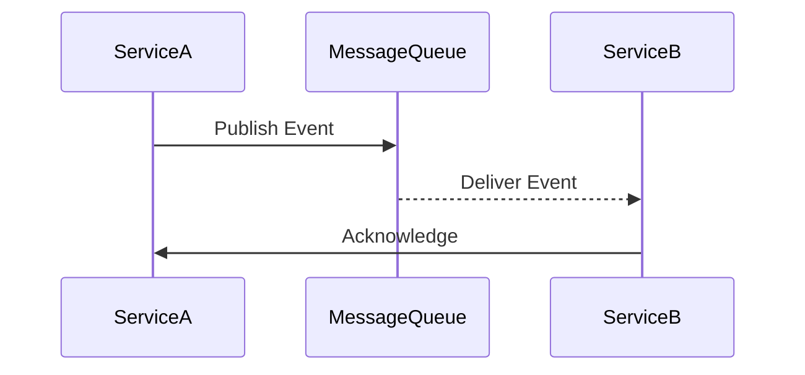

## 28.9 Integrating DDD with Microservices

In the realm of modern software architecture, integrating Domain-Driven Design (DDD) with microservices has become a powerful approach to building scalable, maintainable, and robust systems. This section delves into how DDD principles can be applied within microservices architectures, enabling each service to represent a bounded context within the domain.

### Understanding Bounded Contexts in DDD

**Bounded Contexts** are a core concept in DDD, representing a specific boundary within which a particular domain model is defined and applicable. Each bounded context has its own ubiquitous language and domain logic, ensuring clarity and reducing ambiguity.

#### Key Characteristics of Bounded Contexts

- **Isolation**: Each bounded context is isolated from others, meaning changes within one context do not affect others.
- **Consistency**: Within a bounded context, the domain model is consistent and coherent.
- **Language**: A shared language is used within the context, facilitating clear communication among team members.

### Aligning Bounded Contexts with Microservices

Microservices architecture naturally aligns with the concept of bounded contexts. Each microservice can be designed to encapsulate a bounded context, ensuring that the domain logic and data are self-contained.

#### Benefits of Aligning Microservices with Bounded Contexts

- **Scalability**: Services can be scaled independently based on their specific needs.
- **Flexibility**: Teams can work on different services concurrently without stepping on each other's toes.
- **Resilience**: Failures in one service do not cascade to others, enhancing system robustness.

### Decomposing a Monolithic Domain Model into Microservices

Transitioning from a monolithic architecture to microservices involves decomposing the domain model into smaller, manageable pieces. This process requires careful consideration of the domain's structure and the identification of natural boundaries.

#### Steps to Decompose a Monolithic Domain Model

1. **Identify Bounded Contexts**: Analyze the domain to identify distinct bounded contexts.
2. **Define Service Boundaries**: Establish clear boundaries for each service based on the identified contexts.
3. **Refactor Domain Logic**: Refactor the domain logic to fit within the new service boundaries.
4. **Decouple Dependencies**: Ensure that dependencies between services are minimized and well-defined.

### Guidelines for Defining Service Boundaries

Defining service boundaries is crucial for the success of a microservices architecture. Here are some guidelines to help you define effective service boundaries:

- **Domain-Driven**: Base service boundaries on domain contexts rather than technical concerns.
- **Cohesion**: Ensure that each service has a high degree of cohesion, with related functionalities grouped together.
- **Loose Coupling**: Minimize dependencies between services to reduce the impact of changes.

### Communication Patterns Between Services

In a microservices architecture, services need to communicate with each other to fulfill business requirements. Various communication patterns can be employed, each with its own advantages and trade-offs.

#### Common Communication Patterns

- **Synchronous Communication**: Services communicate in real-time, often using HTTP or gRPC.
- **Asynchronous Messaging**: Services communicate via message queues or event streams, allowing for decoupled interactions.
- **Event-Driven Architecture**: Services emit and react to events, promoting loose coupling and scalability.



*Diagram: An example of asynchronous communication using a message queue.*

### Challenges of Data Consistency and Transactions

One of the primary challenges in a microservices architecture is maintaining data consistency across services. Traditional ACID transactions are difficult to implement in a distributed system, necessitating alternative approaches.

#### Strategies for Data Consistency

- **Eventual Consistency**: Accept that data may be temporarily inconsistent, but will eventually become consistent.
- **Saga Pattern**: Implement distributed transactions using a series of compensating actions.
- **CQRS (Command Query Responsibility Segregation)**: Separate read and write operations to optimize for consistency and performance.

### Best Practices for Maintaining Domain Integrity

Maintaining domain integrity in a distributed system requires careful design and adherence to best practices. Here are some recommendations:

- **Strong Contracts**: Define clear and strong contracts between services to ensure consistent interactions.
- **Versioning**: Implement versioning strategies for APIs to manage changes without breaking existing clients.
- **Monitoring and Logging**: Use monitoring and logging tools to track service interactions and detect anomalies.

### JavaScript and Microservices

JavaScript, with its asynchronous nature and rich ecosystem, is well-suited for building microservices. Frameworks like Node.js provide the necessary tools to implement scalable and efficient services.

#### JavaScript-Specific Considerations

- **Non-Blocking I/O**: Leverage Node.js's non-blocking I/O for handling concurrent requests efficiently.
- **Event-Driven**: Utilize JavaScript's event-driven architecture to implement reactive microservices.
- **Microservices Frameworks**: Explore frameworks like Express.js, Koa, and NestJS for building microservices.

### Conclusion

Integrating DDD with microservices offers a powerful approach to building scalable and maintainable systems. By aligning bounded contexts with microservices, you can achieve greater flexibility, resilience, and clarity in your architecture. Remember to carefully define service boundaries, choose appropriate communication patterns, and address data consistency challenges to maintain domain integrity.

### Try It Yourself

Experiment with the following code example to understand how microservices can be implemented in JavaScript:

```javascript
// Service A: Order Service
const express = require('express');
const app = express();
const port = 3000;

app.post('/order', (req, res) => {
    // Process order
    console.log('Order received');
    res.send('Order processed');
});

app.listen(port, () => {
    console.log(`Order service listening on port ${port}`);
});

// Service B: Inventory Service
const express = require('express');
const app = express();
const port = 3001;

app.post('/inventory', (req, res) => {
    // Update inventory
    console.log('Inventory updated');
    res.send('Inventory updated');
});

app.listen(port, () => {
    console.log(`Inventory service listening on port ${port}`);
});
```

**Try modifying the code to add a new service or change the communication pattern between services.**

### Knowledge Check

- What are bounded contexts in DDD, and how do they align with microservices?
- How can you decompose a monolithic domain model into microservices?
- What are some common communication patterns between microservices?
- How can you maintain data consistency across services in a distributed system?

### Embrace the Journey

Remember, this is just the beginning. As you progress, you'll build more complex and interactive systems. Keep experimenting, stay curious, and enjoy the journey!

## Quiz: Mastering DDD and Microservices Integration



### What is a bounded context in DDD?

- [x] A boundary within which a specific domain model is defined and applicable.
- [ ] A shared database used by all microservices.
- [ ] A communication protocol between services.
- [ ] A type of database transaction.

> **Explanation:** A bounded context is a boundary within which a specific domain model is defined and applicable, ensuring clarity and reducing ambiguity.

### How do bounded contexts align with microservices?

- [x] Each microservice can encapsulate a bounded context.
- [ ] Bounded contexts require a monolithic architecture.
- [ ] Microservices must share a single bounded context.
- [ ] Bounded contexts are unrelated to microservices.

> **Explanation:** Each microservice can be designed to encapsulate a bounded context, ensuring that the domain logic and data are self-contained.

### What is the Saga pattern used for?

- [x] Implementing distributed transactions using a series of compensating actions.
- [ ] Synchronizing data between microservices.
- [ ] Defining service boundaries.
- [ ] Creating a shared database schema.

> **Explanation:** The Saga pattern is used to implement distributed transactions using a series of compensating actions to maintain consistency.

### Which communication pattern is asynchronous?

- [x] Messaging via message queues or event streams.
- [ ] HTTP requests.
- [ ] gRPC calls.
- [ ] Direct database access.

> **Explanation:** Messaging via message queues or event streams allows for asynchronous communication between services.

### What is eventual consistency?

- [x] Accepting temporary data inconsistency that will eventually become consistent.
- [ ] Ensuring immediate data consistency across all services.
- [ ] Using a single database for all microservices.
- [ ] Implementing synchronous communication only.

> **Explanation:** Eventual consistency accepts that data may be temporarily inconsistent but will eventually become consistent.

### What is the primary benefit of aligning microservices with bounded contexts?

- [x] Scalability and flexibility.
- [ ] Increased database size.
- [ ] Reduced code complexity.
- [ ] Faster network speeds.

> **Explanation:** Aligning microservices with bounded contexts provides scalability and flexibility, allowing services to be scaled independently.

### What is a key challenge in microservices architecture?

- [x] Maintaining data consistency across services.
- [ ] Implementing a single database schema.
- [ ] Using synchronous communication only.
- [ ] Reducing the number of services.

> **Explanation:** Maintaining data consistency across services is a key challenge in microservices architecture.

### Which JavaScript framework is commonly used for building microservices?

- [x] Node.js
- [ ] Angular
- [ ] React
- [ ] Vue.js

> **Explanation:** Node.js, with its asynchronous nature, is commonly used for building microservices.

### What is the purpose of CQRS?

- [x] Separating read and write operations to optimize for consistency and performance.
- [ ] Combining all operations into a single service.
- [ ] Using a shared database schema.
- [ ] Implementing synchronous communication only.

> **Explanation:** CQRS separates read and write operations to optimize for consistency and performance.

### True or False: Microservices architecture naturally aligns with the concept of bounded contexts.

- [x] True
- [ ] False

> **Explanation:** Microservices architecture naturally aligns with the concept of bounded contexts, as each service can encapsulate a bounded context.


