## 29.3 Design Pattern Reference Cheat Sheet

This cheat sheet provides a quick reference to the design patterns discussed in the guide. Each entry includes the pattern's name, category, intent, key components, and a simple diagram where applicable. Use this as a refresher or a starting point for deeper exploration.

### Creational Design Patterns

#### 1. Singleton Pattern
- **Category**: Creational
- **Intent**: Ensure a class has only one instance and provide a global point of access to it.
- **Key Components**: Singleton class, private constructor, static instance method.
- **Diagram**:

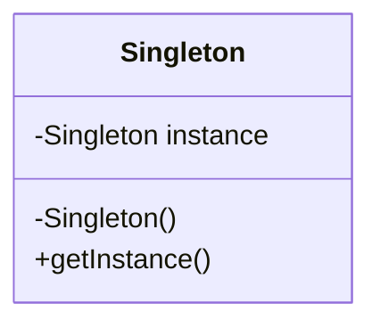

- **JavaScript Unique Features**: Use closures to encapsulate the instance.

#### 2. Factory Method Pattern
- **Category**: Creational
- **Intent**: Define an interface for creating an object, but let subclasses alter the type of objects that will be created.
- **Key Components**: Creator class, ConcreteCreator classes, Product interface, ConcreteProduct classes.
- **Diagram**:

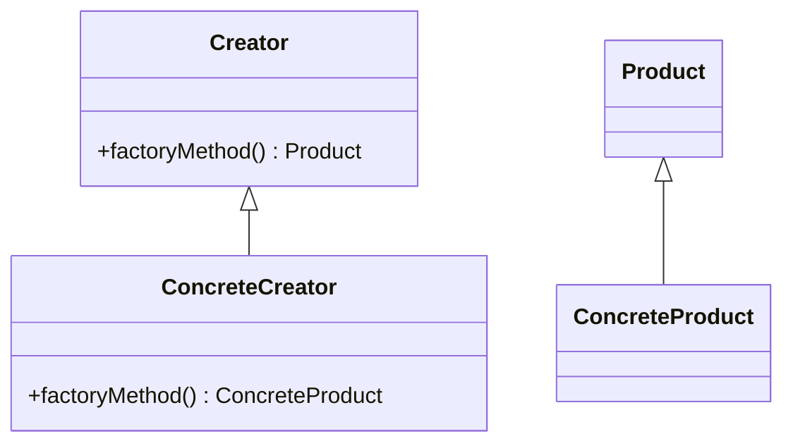

- **JavaScript Unique Features**: Use functions to create objects without exposing the instantiation logic.

#### 3. Abstract Factory Pattern
- **Category**: Creational
- **Intent**: Provide an interface for creating families of related or dependent objects without specifying their concrete classes.
- **Key Components**: AbstractFactory, ConcreteFactory, AbstractProduct, ConcreteProduct.
- **Diagram**:

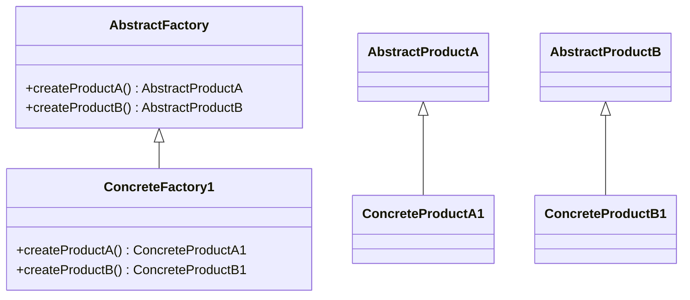

- **JavaScript Unique Features**: Leverage object literals and factory functions.

#### 4. Builder Pattern
- **Category**: Creational
- **Intent**: Separate the construction of a complex object from its representation, allowing the same construction process to create different representations.
- **Key Components**: Builder, ConcreteBuilder, Director, Product.
- **Diagram**:

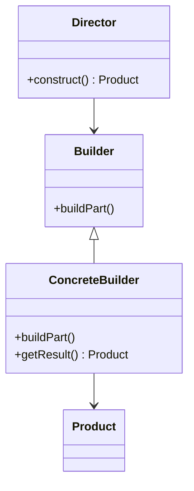

- **JavaScript Unique Features**: Use chaining methods to build objects step by step.

#### 5. Prototype Pattern
- **Category**: Creational
- **Intent**: Specify the kinds of objects to create using a prototypical instance, and create new objects by copying this prototype.
- **Key Components**: Prototype, ConcretePrototype, Client.
- **Diagram**:

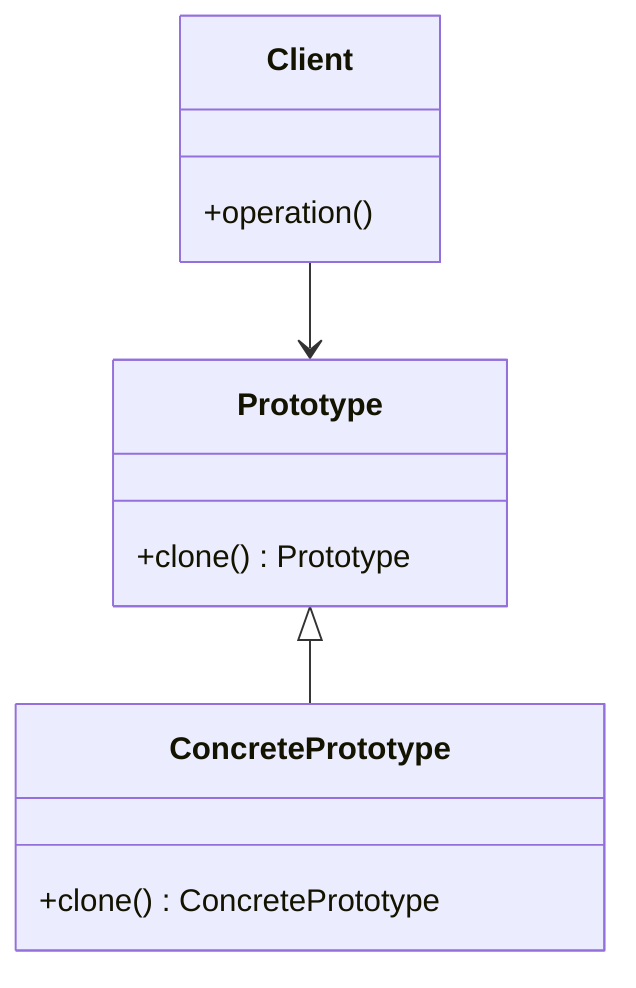

- **JavaScript Unique Features**: Utilize JavaScript's prototypal inheritance.

### Structural Design Patterns

#### 6. Adapter Pattern
- **Category**: Structural
- **Intent**: Convert the interface of a class into another interface clients expect. Adapter lets classes work together that couldn't otherwise because of incompatible interfaces.
- **Key Components**: Target, Adapter, Adaptee, Client.
- **Diagram**:

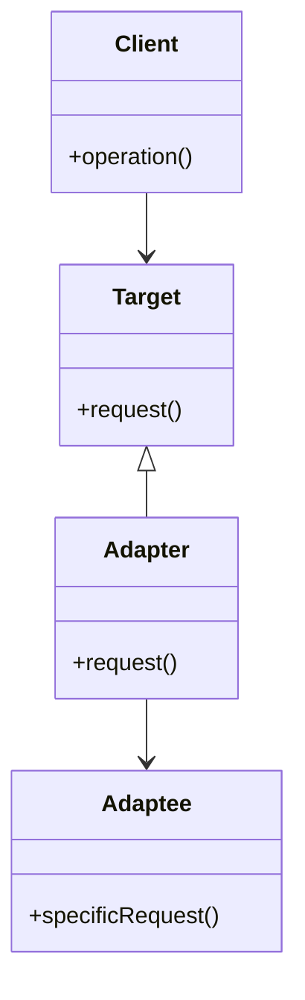

- **JavaScript Unique Features**: Use classes or functions to wrap incompatible interfaces.

#### 7. Decorator Pattern
- **Category**: Structural
- **Intent**: Attach additional responsibilities to an object dynamically. Decorators provide a flexible alternative to subclassing for extending functionality.
- **Key Components**: Component, ConcreteComponent, Decorator, ConcreteDecorator.
- **Diagram**:

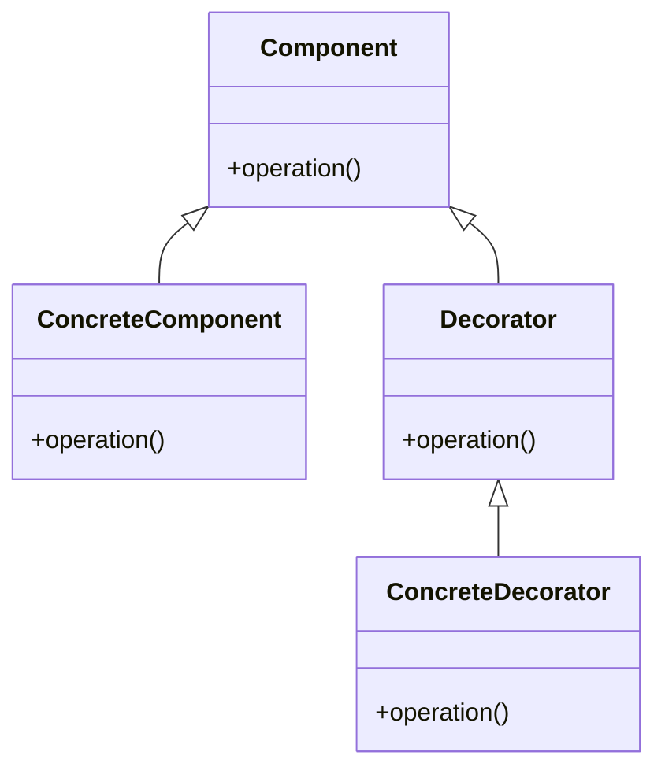

- **JavaScript Unique Features**: Use higher-order functions to add behavior.

#### 8. Facade Pattern
- **Category**: Structural
- **Intent**: Provide a unified interface to a set of interfaces in a subsystem. Facade defines a higher-level interface that makes the subsystem easier to use.
- **Key Components**: Facade, Subsystem classes.
- **Diagram**:

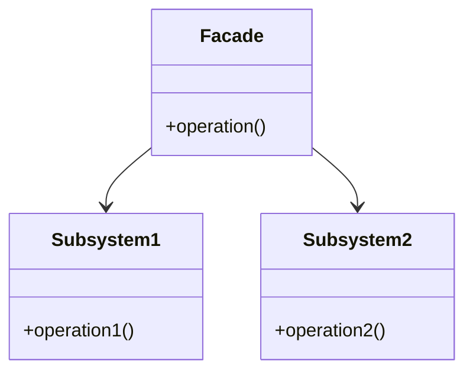

- **JavaScript Unique Features**: Simplify complex APIs with a single interface.

#### 9. Proxy Pattern
- **Category**: Structural
- **Intent**: Provide a surrogate or placeholder for another object to control access to it.
- **Key Components**: Subject, RealSubject, Proxy.
- **Diagram**:

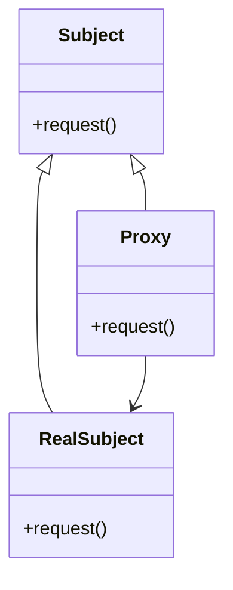

- **JavaScript Unique Features**: Use ES6 Proxy objects to intercept operations.

### Behavioral Design Patterns

#### 10. Strategy Pattern
- **Category**: Behavioral
- **Intent**: Define a family of algorithms, encapsulate each one, and make them interchangeable. Strategy lets the algorithm vary independently from clients that use it.
- **Key Components**: Strategy, ConcreteStrategy, Context.
- **Diagram**:

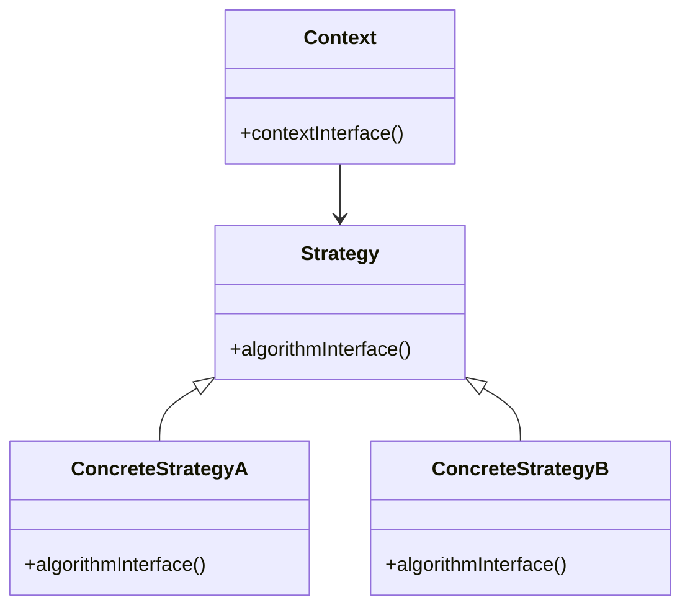

- **JavaScript Unique Features**: Use functions or classes to encapsulate algorithms.

#### 11. Observer Pattern
- **Category**: Behavioral
- **Intent**: Define a one-to-many dependency between objects so that when one object changes state, all its dependents are notified and updated automatically.
- **Key Components**: Subject, Observer, ConcreteObserver.
- **Diagram**:

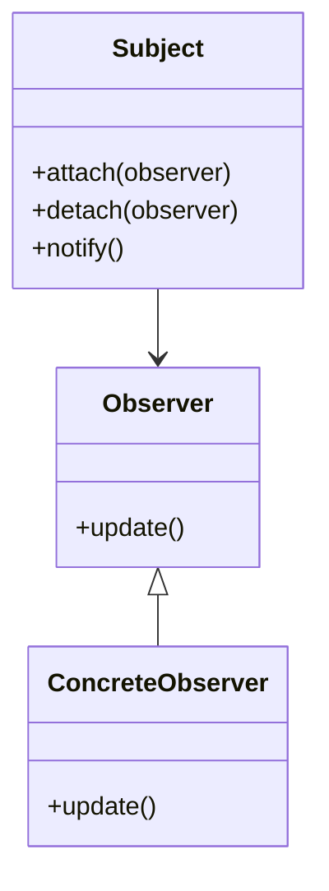

- **JavaScript Unique Features**: Use events and callbacks to implement observer behavior.

#### 12. Command Pattern
- **Category**: Behavioral
- **Intent**: Encapsulate a request as an object, thereby letting you parameterize clients with queues, requests, and operations.
- **Key Components**: Command, ConcreteCommand, Invoker, Receiver.
- **Diagram**:

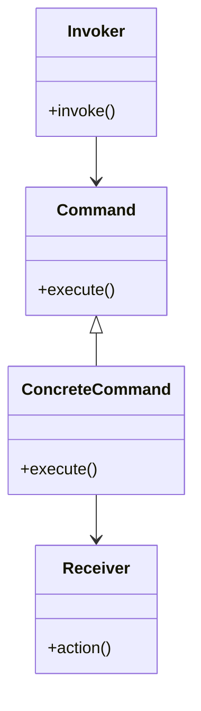

- **JavaScript Unique Features**: Use functions as commands.

#### 13. Iterator Pattern
- **Category**: Behavioral
- **Intent**: Provide a way to access the elements of an aggregate object sequentially without exposing its underlying representation.
- **Key Components**: Iterator, ConcreteIterator, Aggregate, ConcreteAggregate.
- **Diagram**:

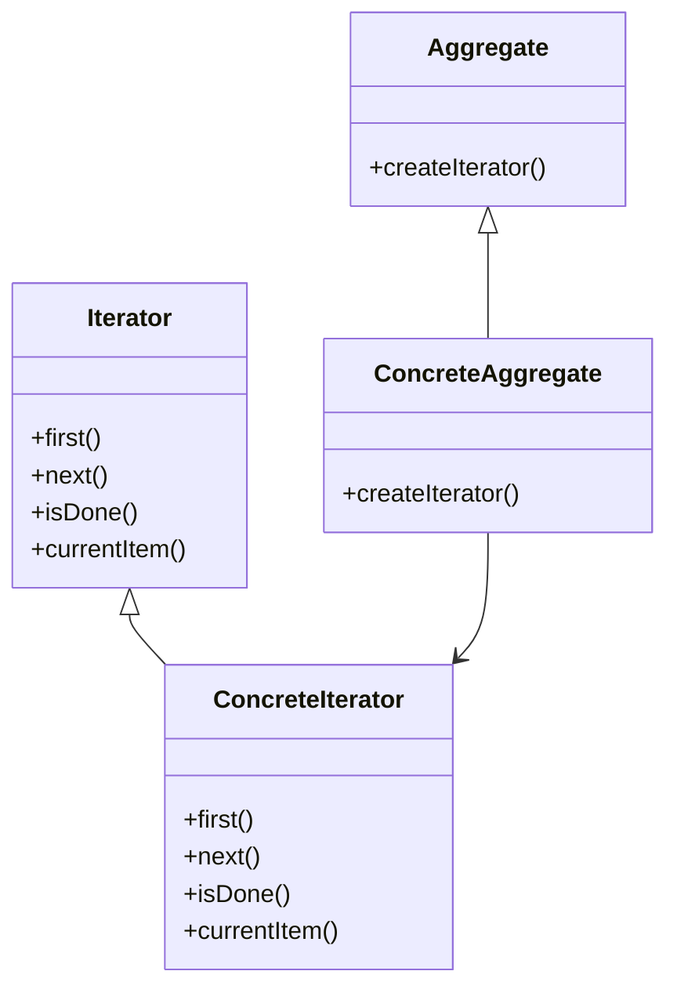

- **JavaScript Unique Features**: Use ES6 iterators and generators.

#### 14. State Pattern
- **Category**: Behavioral
- **Intent**: Allow an object to alter its behavior when its internal state changes. The object will appear to change its class.
- **Key Components**: Context, State, ConcreteState.
- **Diagram**:

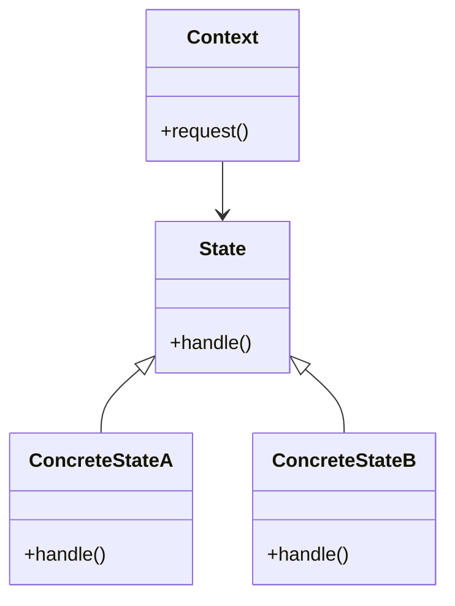

- **JavaScript Unique Features**: Use classes or objects to represent states.

### Try It Yourself

To deepen your understanding, try modifying the code examples provided in this cheat sheet. For instance, you can:

- Implement a Singleton pattern using ES6 classes.
- Create a Factory Method pattern with different types of products.
- Use the Proxy pattern to log access to an object.
- Experiment with the Observer pattern using JavaScript's event system.

### Knowledge Check

## Test Your Knowledge on JavaScript Design Patterns



### What is the primary intent of the Singleton pattern?

- [x] Ensure a class has only one instance and provide a global point of access to it.
- [ ] Define an interface for creating an object.
- [ ] Convert the interface of a class into another interface clients expect.
- [ ] Provide a way to access the elements of an aggregate object sequentially.

> **Explanation:** The Singleton pattern ensures that a class has only one instance and provides a global point of access to it.

### Which pattern is used to define a family of algorithms and make them interchangeable?

- [ ] Singleton Pattern
- [x] Strategy Pattern
- [ ] Observer Pattern
- [ ] Command Pattern

> **Explanation:** The Strategy pattern defines a family of algorithms, encapsulates each one, and makes them interchangeable.

### What is the key feature of the Proxy pattern in JavaScript?

- [ ] It provides a unified interface to a set of interfaces in a subsystem.
- [x] It uses ES6 Proxy objects to intercept operations.
- [ ] It attaches additional responsibilities to an object dynamically.
- [ ] It allows an object to alter its behavior when its internal state changes.

> **Explanation:** The Proxy pattern in JavaScript uses ES6 Proxy objects to intercept and control access to another object.

### Which pattern provides a way to access the elements of an aggregate object sequentially?

- [ ] Singleton Pattern
- [ ] Strategy Pattern
- [x] Iterator Pattern
- [ ] Observer Pattern

> **Explanation:** The Iterator pattern provides a way to access the elements of an aggregate object sequentially without exposing its underlying representation.

### What is the main purpose of the Decorator pattern?

- [x] Attach additional responsibilities to an object dynamically.
- [ ] Convert the interface of a class into another interface clients expect.
- [ ] Provide a surrogate or placeholder for another object.
- [ ] Define a one-to-many dependency between objects.

> **Explanation:** The Decorator pattern attaches additional responsibilities to an object dynamically, providing a flexible alternative to subclassing for extending functionality.

### Which pattern is used to encapsulate a request as an object?

- [ ] Singleton Pattern
- [ ] Strategy Pattern
- [ ] Observer Pattern
- [x] Command Pattern

> **Explanation:** The Command pattern encapsulates a request as an object, allowing for parameterization of clients with queues, requests, and operations.

### What is the primary intent of the Adapter pattern?

- [ ] Ensure a class has only one instance.
- [x] Convert the interface of a class into another interface clients expect.
- [ ] Define a family of algorithms.
- [ ] Provide a way to access the elements of an aggregate object sequentially.

> **Explanation:** The Adapter pattern converts the interface of a class into another interface clients expect, allowing classes to work together that couldn't otherwise because of incompatible interfaces.

### Which pattern allows an object to alter its behavior when its internal state changes?

- [ ] Singleton Pattern
- [ ] Strategy Pattern
- [ ] Observer Pattern
- [x] State Pattern

> **Explanation:** The State pattern allows an object to alter its behavior when its internal state changes, making the object appear to change its class.

### What is the key component of the Observer pattern?

- [ ] Command
- [ ] Strategy
- [x] Subject
- [ ] State

> **Explanation:** The key component of the Observer pattern is the Subject, which maintains a list of observers and notifies them of any state changes.

### True or False: The Facade pattern provides a unified interface to a set of interfaces in a subsystem.

- [x] True
- [ ] False

> **Explanation:** True. The Facade pattern provides a unified interface to a set of interfaces in a subsystem, simplifying the subsystem's usage.



Remember, this cheat sheet is just the beginning. As you progress, you'll build more complex and interactive applications. Keep experimenting, stay curious, and enjoy the journey!
