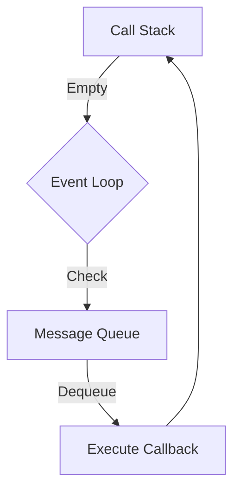

## 29.4 Common Interview Questions on JavaScript and Design Patterns

In this section, we delve into common interview questions related to JavaScript and design patterns. These questions are designed to test your understanding of core JavaScript concepts, specific design patterns, best practices, and your ability to solve scenario-based problems. Each question is followed by a detailed answer to help you prepare for technical interviews.

### Core JavaScript Concepts

#### 1. Explain the difference between `var`, `let`, and `const` in JavaScript.

**Answer:**

In JavaScript, `var`, `let`, and `const` are used for variable declarations, but they have different scopes and behaviors:

- **`var`:** 
  - Function-scoped or globally-scoped.
  - Can be redeclared and updated.
  - Hoisted to the top of their scope, initialized with `undefined`.
  
- **`let`:**
  - Block-scoped.
  - Cannot be redeclared within the same scope.
  - Can be updated.
  - Hoisted but not initialized, leading to a "temporal dead zone" until the declaration is encountered.

- **`const`:**
  - Block-scoped.
  - Cannot be redeclared or updated.
  - Must be initialized at the time of declaration.
  - Useful for constants or immutable references.

```javascript
function example() {
  var x = 1;
  if (true) {
    var x = 2; // same variable
    console.log(x); // 2
  }
  console.log(x); // 2

  let y = 1;
  if (true) {
    let y = 2; // different variable
    console.log(y); // 2
  }
  console.log(y); // 1

  const z = 1;
  // z = 2; // Error: Assignment to constant variable
}
```

#### 2. What are closures in JavaScript, and how do they work?

**Answer:**

A closure is a feature in JavaScript where an inner function has access to the outer (enclosing) function's variables. Closures allow a function to access variables from an enclosing scope, even after the outer function has finished executing.

**Key Points:**
- Closures have access to their own scope, the outer function's variables, and the global variables.
- They are created every time a function is created, at function creation time.

**Example:**

```javascript
function outerFunction(outerVariable) {
  return function innerFunction(innerVariable) {
    console.log('Outer Variable: ' + outerVariable);
    console.log('Inner Variable: ' + innerVariable);
  };
}

const newFunction = outerFunction('outside');
newFunction('inside');
// Output:
// Outer Variable: outside
// Inner Variable: inside
```

**Explanation:** In the example above, `innerFunction` is a closure that captures `outerVariable` from `outerFunction`. Even after `outerFunction` has executed, `innerFunction` retains access to `outerVariable`.

#### 3. Describe the event loop in JavaScript.

**Answer:**

The event loop is a fundamental concept in JavaScript that allows for asynchronous programming. It is responsible for executing the code, collecting and processing events, and executing queued sub-tasks.

**How it works:**
- JavaScript is single-threaded, meaning it can execute one piece of code at a time.
- The event loop continuously checks the call stack to see if there's any function that needs to run.
- If the call stack is empty, it checks the message queue to see if there's any pending callback waiting to be executed.
- It dequeues the first message from the queue and pushes it onto the call stack, effectively running it.

**Visualizing the Event Loop:**



**Explanation:** The diagram above shows the event loop checking the call stack and message queue. If the call stack is empty, it dequeues a message from the message queue and executes it.

### Specific Design Patterns

#### 4. What is the Singleton Pattern, and how is it implemented in JavaScript?

**Answer:**

The Singleton Pattern is a design pattern that restricts the instantiation of a class to a single instance. This is useful when exactly one object is needed to coordinate actions across the system.

**Implementation in JavaScript:**

```javascript
const Singleton = (function () {
  let instance;

  function createInstance() {
    const object = new Object('I am the instance');
    return object;
  }

  return {
    getInstance: function () {
      if (!instance) {
        instance = createInstance();
      }
      return instance;
    }
  };
})();

const instance1 = Singleton.getInstance();
const instance2 = Singleton.getInstance();

console.log(instance1 === instance2); // true
```

**Explanation:** In the example above, the `Singleton` object ensures that only one instance of the object is created. The `getInstance` method checks if an instance already exists; if not, it creates one.

#### 5. Explain the Observer Pattern and provide a use case in JavaScript.

**Answer:**

The Observer Pattern is a behavioral design pattern where an object, known as the subject, maintains a list of its dependents, called observers, and notifies them of state changes.

**Use Case:**

A common use case for the Observer Pattern is in event handling systems, where multiple objects need to be notified of an event.

**Implementation in JavaScript:**

```javascript
class Subject {
  constructor() {
    this.observers = [];
  }

  subscribe(observer) {
    this.observers.push(observer);
  }

  unsubscribe(observer) {
    this.observers = this.observers.filter(obs => obs !== observer);
  }

  notify(data) {
    this.observers.forEach(observer => observer.update(data));
  }
}

class Observer {
  update(data) {
    console.log('Observer received data:', data);
  }
}

const subject = new Subject();
const observer1 = new Observer();
const observer2 = new Observer();

subject.subscribe(observer1);
subject.subscribe(observer2);

subject.notify('Hello Observers!');
// Output:
// Observer received data: Hello Observers!
// Observer received data: Hello Observers!
```

**Explanation:** In the example above, the `Subject` class maintains a list of observers and notifies them of any changes. The `Observer` class implements an `update` method that is called when the subject changes.

### Best Practices and Common Pitfalls

#### 6. What are some common pitfalls in JavaScript, and how can they be avoided?

**Answer:**

Some common pitfalls in JavaScript include:

- **Global Variables:** Avoid using global variables as they can lead to conflicts and hard-to-debug code. Use `let` and `const` for block-scoping.
- **Callback Hell:** Avoid deeply nested callbacks by using Promises or async/await for asynchronous code.
- **Implicit Type Coercion:** Be aware of JavaScript's type coercion rules. Use `===` for strict equality checks.
- **Blocking the Event Loop:** Avoid long-running operations on the main thread. Use Web Workers for heavy computations.
- **Memory Leaks:** Ensure that references to unused objects are removed, especially in closures and event listeners.

**Example of Callback Hell:**

```javascript
// Callback Hell
doSomething(function (result) {
  doSomethingElse(result, function (newResult) {
    doThirdThing(newResult, function (finalResult) {
      console.log('Got the final result: ' + finalResult);
    });
  });
});
```

**Solution using Promises:**

```javascript
// Using Promises
doSomething()
  .then(result => doSomethingElse(result))
  .then(newResult => doThirdThing(newResult))
  .then(finalResult => console.log('Got the final result: ' + finalResult))
  .catch(error => console.error(error));
```

### Scenario-Based Problem-Solving Questions

#### 7. How would you implement a debounce function in JavaScript?

**Answer:**

A debounce function limits the rate at which a function can fire. It ensures that the function is only called after a certain amount of time has passed since it was last invoked.

**Implementation:**

```javascript
function debounce(func, wait) {
  let timeout;
  return function (...args) {
    const context = this;
    clearTimeout(timeout);
    timeout = setTimeout(() => func.apply(context, args), wait);
  };
}

// Usage
const debouncedFunction = debounce(() => console.log('Debounced!'), 2000);
window.addEventListener('resize', debouncedFunction);
```

**Explanation:** In the example above, the `debounce` function returns a new function that delays the execution of `func` until after `wait` milliseconds have passed since the last time it was invoked.

#### 8. How would you implement a simple event emitter in JavaScript?

**Answer:**

An event emitter is an object that facilitates communication between objects by emitting events and allowing other objects to listen for those events.

**Implementation:**

```javascript
class EventEmitter {
  constructor() {
    this.events = {};
  }

  on(event, listener) {
    if (!this.events[event]) {
      this.events[event] = [];
    }
    this.events[event].push(listener);
  }

  emit(event, ...args) {
    if (this.events[event]) {
      this.events[event].forEach(listener => listener(...args));
    }
  }

  off(event, listenerToRemove) {
    if (!this.events[event]) return;
    this.events[event] = this.events[event].filter(listener => listener !== listenerToRemove);
  }
}

// Usage
const emitter = new EventEmitter();
const logData = data => console.log('Data received:', data);

emitter.on('data', logData);
emitter.emit('data', { key: 'value' }); // Output: Data received: { key: 'value' }
emitter.off('data', logData);
```

**Explanation:** The `EventEmitter` class allows you to register listeners for specific events using the `on` method, emit events using the `emit` method, and remove listeners using the `off` method.

### Knowledge Check

#### 9. What is the difference between synchronous and asynchronous code in JavaScript?

**Answer:**

- **Synchronous Code:** Executes sequentially, blocking the execution of the next line until the current operation completes. This can lead to performance issues if a long-running operation is executed.
  
- **Asynchronous Code:** Allows the program to continue executing other tasks while waiting for an operation to complete. This is achieved using callbacks, promises, or async/await.

**Example of Synchronous Code:**

```javascript
console.log('Start');
const result = longRunningOperation(); // Blocks here
console.log('End');
```

**Example of Asynchronous Code:**

```javascript
console.log('Start');
longRunningOperationAsync().then(result => console.log('End'));
```

**Explanation:** In the asynchronous example, `longRunningOperationAsync` does not block the execution of the next line, allowing the program to continue running other tasks.

### Summary

In this section, we've covered a range of common interview questions related to JavaScript and design patterns. We've explored core JavaScript concepts, specific design patterns, best practices, and scenario-based problem-solving questions. Remember, understanding these concepts deeply will not only help you in interviews but also in writing efficient and maintainable code.

### Try It Yourself

Experiment with the code examples provided in this section. Try modifying the debounce function to allow for immediate execution on the first call, or extend the event emitter to support once-only listeners. These exercises will help reinforce your understanding of the concepts discussed.

## JavaScript Design Patterns Interview Quiz



### What is the primary purpose of the Singleton Pattern?

- [x] To ensure a class has only one instance
- [ ] To allow multiple instances of a class
- [ ] To create a new instance each time
- [ ] To manage multiple instances

> **Explanation:** The Singleton Pattern ensures that a class has only one instance and provides a global point of access to it.

### Which keyword is used to declare a block-scoped variable in JavaScript?

- [ ] var
- [x] let
- [ ] const
- [ ] function

> **Explanation:** The `let` keyword is used to declare a block-scoped variable in JavaScript.

### What is a closure in JavaScript?

- [x] A function that retains access to its lexical scope
- [ ] A function that does not have access to its lexical scope
- [ ] A function that is executed immediately
- [ ] A function that is hoisted

> **Explanation:** A closure is a function that retains access to its lexical scope, even when the function is executed outside that scope.

### How can you avoid callback hell in JavaScript?

- [ ] By using more callbacks
- [x] By using Promises or async/await
- [ ] By using synchronous code
- [ ] By using global variables

> **Explanation:** Callback hell can be avoided by using Promises or async/await, which provide a cleaner and more manageable way to handle asynchronous operations.

### What is the purpose of the Observer Pattern?

- [x] To notify multiple objects of state changes
- [ ] To create a single instance of a class
- [ ] To encapsulate object creation
- [ ] To provide a global point of access

> **Explanation:** The Observer Pattern is used to notify multiple objects of state changes, allowing them to update accordingly.

### Which method is used to remove a listener in an event emitter?

- [ ] emit
- [ ] on
- [x] off
- [ ] add

> **Explanation:** The `off` method is used to remove a listener from an event emitter.

### What is the difference between synchronous and asynchronous code?

- [x] Synchronous code blocks execution; asynchronous code does not
- [ ] Synchronous code does not block execution; asynchronous code does
- [ ] Both block execution
- [ ] Neither block execution

> **Explanation:** Synchronous code blocks execution until the current operation completes, while asynchronous code allows other operations to continue executing.

### What is a common pitfall when using global variables?

- [x] They can lead to conflicts and hard-to-debug code
- [ ] They are always block-scoped
- [ ] They are automatically garbage collected
- [ ] They improve performance

> **Explanation:** Global variables can lead to conflicts and hard-to-debug code, as they are accessible from anywhere in the program.

### How does the debounce function improve performance?

- [x] By limiting the rate at which a function can fire
- [ ] By executing a function immediately
- [ ] By blocking other operations
- [ ] By increasing the rate of function execution

> **Explanation:** The debounce function improves performance by limiting the rate at which a function can fire, preventing it from being called too frequently.

### True or False: The event loop allows JavaScript to handle asynchronous operations.

- [x] True
- [ ] False

> **Explanation:** True. The event loop allows JavaScript to handle asynchronous operations by managing the execution of code, collecting and processing events, and executing queued sub-tasks.


