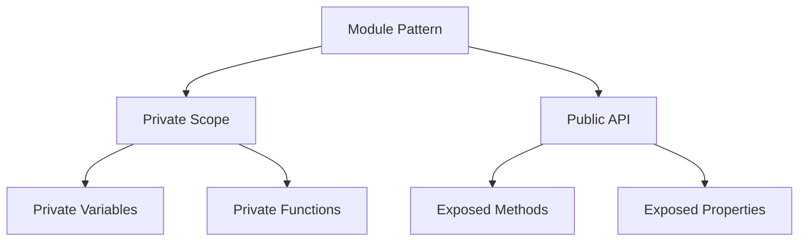

## 3.1.1 Module Pattern

### Introduction

The Module Pattern is a design pattern used in JavaScript and TypeScript to encapsulate private variables and functions within a closure. This pattern enhances code maintainability by exposing only public APIs, thereby preventing unauthorized access to internal states. It is particularly useful for managing application settings, creating singleton modules, and preventing global namespace pollution.

### Detailed Explanation

#### Understand the Intent

The primary intent of the Module Pattern is to create a private scope for variables and functions, leveraging closures to maintain state and behavior. By doing so, it provides a clean separation between public and private code, allowing developers to expose only the necessary parts of a module to the outside world.

#### Key Concepts

- **Closure:** A closure is a function that retains access to its lexical scope, even when the function is executed outside that scope. This feature is crucial for creating private variables and functions in the Module Pattern.

- **IIFE (Immediately Invoked Function Expression):** An IIFE is a function that is executed immediately after it is defined. It is used to create a private scope for the module, ensuring that variables and functions do not leak into the global scope.

### Implementation Steps

1. **Wrap Your Code Inside an IIFE:** This creates a private scope for your module, preventing any variables or functions from being accessed globally.

2. **Define Private Variables and Functions:** Inside the IIFE, declare variables and functions that should remain private to the module.

3. **Return an Object with Public Methods and Properties:** The IIFE should return an object that exposes only the methods and properties you want to be accessible from outside the module.

### Visual Aids

Below is a conceptual diagram illustrating the Module Pattern:



### Code Examples

#### Example 1: Managing Configuration Settings

```javascript
const ConfigModule = (function() {
    // Private variables
    let config = {
        apiUrl: 'https://api.example.com',
        timeout: 5000
    };

    // Private function
    function validateConfig(newConfig) {
        if (!newConfig.apiUrl || !newConfig.timeout) {
            throw new Error('Invalid configuration');
        }
    }

    // Public API
    return {
        getConfig: function() {
            return config;
        },
        setConfig: function(newConfig) {
            validateConfig(newConfig);
            config = newConfig;
        }
    };
})();

// Usage
console.log(ConfigModule.getConfig());
ConfigModule.setConfig({ apiUrl: 'https://api.newexample.com', timeout: 3000 });
console.log(ConfigModule.getConfig());
```

#### Example 2: Singleton Module

```javascript
const SingletonModule = (function() {
    let instance;

    function createInstance() {
        const object = new Object('I am the instance');
        return object;
    }

    return {
        getInstance: function() {
            if (!instance) {
                instance = createInstance();
            }
            return instance;
        }
    };
})();

// Usage
const instance1 = SingletonModule.getInstance();
const instance2 = SingletonModule.getInstance();
console.log(instance1 === instance2); // true
```

### Use Cases

- **Encapsulation and Protection:** Use the Module Pattern when you need to encapsulate and protect the internal state of a module, ensuring that only the intended API is accessible.
  
- **Preventing Global Namespace Pollution:** This pattern is ideal for preventing global namespace pollution, especially in large applications where multiple modules are used.

### Practice

Create a module that manages application settings, exposing methods to get and set configurations. Ensure that the internal state is protected and only accessible through the provided API.

### Considerations

- **Module Dependencies:** Be mindful of how module dependencies are handled within the pattern. Ensure that dependencies are properly managed and do not lead to tight coupling.

- **Scaling for Larger Applications:** While the Module Pattern is effective for small to medium-sized modules, consider using more advanced module systems like ES6 modules or CommonJS for larger applications.

### Advantages and Disadvantages

**Advantages:**

- Encapsulation of private data and functions.
- Prevention of global namespace pollution.
- Clear separation between public and private code.

**Disadvantages:**

- Limited scalability for large applications.
- Potential complexity in managing dependencies.

### Best Practices

- Use the Module Pattern for encapsulating logic that should not be exposed globally.
- Ensure that the public API is well-documented and intuitive.
- Consider using ES6 modules for larger applications to take advantage of built-in module support.

### Comparisons

The Module Pattern can be compared to ES6 modules, which provide a more modern and standardized approach to module management in JavaScript. While the Module Pattern is useful for legacy code and environments that do not support ES6, ES6 modules offer better support for dependency management and are more scalable for large applications.

### Conclusion

The Module Pattern is a powerful tool for encapsulating private data and functions in JavaScript and TypeScript. By understanding and implementing this pattern, developers can create maintainable and scalable codebases that prevent global namespace pollution and protect internal module states.

## Quiz Time!



### What is the primary intent of the Module Pattern?

- [x] To encapsulate private variables and functions within a closure
- [ ] To expose all variables and functions globally
- [ ] To create multiple instances of a module
- [ ] To eliminate the use of closures

> **Explanation:** The Module Pattern is designed to encapsulate private variables and functions within a closure, enhancing code maintainability by exposing only public APIs.

### Which JavaScript feature is crucial for creating private variables in the Module Pattern?

- [x] Closure
- [ ] Promises
- [ ] Async/Await
- [ ] Callbacks

> **Explanation:** Closures are crucial for creating private variables in the Module Pattern as they allow functions to retain access to their lexical scope.

### What is an IIFE?

- [x] Immediately Invoked Function Expression
- [ ] International Internet Function Expression
- [ ] Internal Interface Function Expression
- [ ] Integrated Inheritance Function Expression

> **Explanation:** An IIFE, or Immediately Invoked Function Expression, is a function that is executed immediately after it is defined, creating a private scope.

### How does the Module Pattern prevent global namespace pollution?

- [x] By encapsulating variables and functions within a private scope
- [ ] By using global variables
- [ ] By creating multiple instances of the same module
- [ ] By avoiding the use of closures

> **Explanation:** The Module Pattern prevents global namespace pollution by encapsulating variables and functions within a private scope, ensuring they do not leak into the global scope.

### What should be returned from an IIFE in the Module Pattern?

- [x] An object with public methods and properties
- [ ] A list of all private variables
- [ ] A single function
- [ ] Nothing

> **Explanation:** An IIFE in the Module Pattern should return an object that exposes public methods and properties, allowing controlled access to the module's functionality.

### When is the Module Pattern particularly useful?

- [x] When you need to encapsulate and protect the internal state of a module
- [ ] When you want to expose all internal states globally
- [ ] When you need to create multiple instances of a module
- [ ] When you want to avoid using closures

> **Explanation:** The Module Pattern is particularly useful when you need to encapsulate and protect the internal state of a module, ensuring that only the intended API is accessible.

### What is a common disadvantage of the Module Pattern?

- [x] Limited scalability for large applications
- [ ] It exposes all variables globally
- [ ] It cannot encapsulate private data
- [ ] It requires ES6 support

> **Explanation:** A common disadvantage of the Module Pattern is its limited scalability for large applications, where more advanced module systems may be needed.

### How can module dependencies be managed in the Module Pattern?

- [x] By carefully managing dependencies within the private scope
- [ ] By exposing all dependencies globally
- [ ] By avoiding the use of dependencies
- [ ] By using only ES6 modules

> **Explanation:** Module dependencies can be managed in the Module Pattern by carefully managing them within the private scope, ensuring they do not lead to tight coupling.

### What is a key advantage of using the Module Pattern?

- [x] Encapsulation of private data and functions
- [ ] Exposure of all internal states globally
- [ ] Creation of multiple instances of a module
- [ ] Elimination of closures

> **Explanation:** A key advantage of using the Module Pattern is the encapsulation of private data and functions, which enhances code maintainability and security.

### True or False: The Module Pattern is only applicable in JavaScript environments that support ES6.

- [ ] True
- [x] False

> **Explanation:** False. The Module Pattern is applicable in JavaScript environments that do not support ES6, making it useful for legacy code and older environments.


