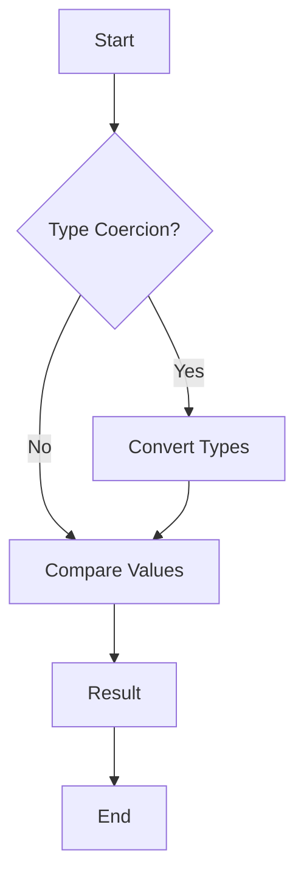

## 3.1.1 Primitive Types

JavaScript, as a versatile and widely-used programming language, offers a variety of data types to handle different kinds of data. Among these, primitive types are the most fundamental. Understanding these types is crucial for mastering JavaScript and writing efficient, bug-free code. In this section, we will delve into the seven primitive data types in JavaScript: `string`, `number`, `boolean`, `null`, `undefined`, `symbol`, and `BigInt`. We will explore their characteristics, usage, and best practices for comparison and type coercion.

### Introduction to Primitive Types

Primitive types in JavaScript are the building blocks of data manipulation. They are immutable, meaning their values cannot be changed once created. Instead, any operation on a primitive type results in a new value. This immutability is a key characteristic that distinguishes primitive types from objects.

### The Seven Primitive Types

#### 1. String

A `string` is a sequence of characters used to represent text. Strings are created by enclosing characters in single quotes (`'`), double quotes (`"`), or backticks (`` ` ``).

```javascript
// String examples
let singleQuoteString = 'Hello, World!';
let doubleQuoteString = "Hello, World!";
let templateLiteral = `Hello, ${name}!`; // Template literals allow embedded expressions
```

Strings are immutable, meaning any operation that appears to modify a string actually creates a new string.

#### 2. Number

The `number` type in JavaScript is used for both integer and floating-point numbers. JavaScript uses a 64-bit floating-point format (IEEE 754) for all numeric values.

```javascript
// Number examples
let integer = 42;
let floatingPoint = 3.14;
let negativeNumber = -1;
let notANumber = NaN; // Represents a computational error
let infinity = Infinity; // Represents infinity
```

JavaScript also provides special numeric values like `NaN` (Not-a-Number) and `Infinity`.

#### 3. Boolean

A `boolean` represents a logical entity and can have two values: `true` or `false`. Booleans are often used in conditional statements to control the flow of a program.

```javascript
// Boolean examples
let isJavaScriptFun = true;
let isThisCorrect = false;
```

#### 4. Null

`null` is a special keyword in JavaScript that represents the intentional absence of any object value. It is often used to indicate that a variable should be empty.

```javascript
// Null example
let emptyValue = null;
```

#### 5. Undefined

`undefined` is a primitive value automatically assigned to variables that have been declared but not initialized. It signifies that a variable has not been assigned a value.

```javascript
// Undefined example
let uninitializedVariable;
console.log(uninitializedVariable); // Output: undefined
```

#### 6. Symbol

Introduced in ECMAScript 6 (ES6), a `symbol` is a unique and immutable primitive value often used as object property keys.

```javascript
// Symbol example
let uniqueId = Symbol('id');
let anotherId = Symbol('id');
console.log(uniqueId === anotherId); // Output: false, symbols are unique
```

#### 7. BigInt

`BigInt` is a numeric primitive type that can represent integers with arbitrary precision, allowing for the representation of numbers larger than the `Number.MAX_SAFE_INTEGER`.

```javascript
// BigInt example
let bigIntNumber = BigInt(9007199254740991);
let anotherBigInt = 9007199254740991n; // Using the 'n' suffix
```

### Immutability of Primitive Values

Primitive values are immutable, meaning their value cannot be changed. When you perform operations on a primitive value, you create a new value rather than modifying the original. This immutability ensures that primitive values remain consistent and predictable throughout your code.

### Type Coercion

Type coercion is the automatic or implicit conversion of values from one data type to another. JavaScript is a loosely typed language, meaning it performs type coercion automatically in certain situations, such as when using the `==` operator or performing arithmetic operations.

```javascript
// Type coercion examples
console.log('5' + 5); // Output: '55' (string concatenation)
console.log('5' - 2); // Output: 3 (string converted to number)
console.log(true + 1); // Output: 2 (true converted to 1)
```

### Best Practices in Comparing Values

When comparing values in JavaScript, it's important to understand the difference between `==` (equality) and `===` (strict equality). The `==` operator performs type coercion, while `===` does not.

```javascript
// Comparison examples
console.log(5 == '5'); // Output: true (type coercion)
console.log(5 === '5'); // Output: false (no type coercion)
console.log(null == undefined); // Output: true (both are considered equal)
console.log(null === undefined); // Output: false (different types)
```

#### Best Practices

- **Use `===` for comparisons** to avoid unexpected results due to type coercion.
- **Be explicit** about types when performing operations to ensure clarity and avoid bugs.
- **Avoid using `==`** unless you specifically want type coercion.

### Visualizing Primitive Types

To better understand how primitive types interact with each other and with JavaScript's execution environment, let's visualize the concept of type coercion and comparison using a flowchart.



**Figure 1**: Flowchart illustrating the process of type coercion and comparison in JavaScript.

### Try It Yourself

Experiment with the following code snippets to deepen your understanding of primitive types and their behavior:

1. Modify the `string` examples to include template literals with embedded expressions.
2. Create a `symbol` and use it as a property key in an object.
3. Experiment with `BigInt` by performing arithmetic operations with large numbers.
4. Test the difference between `==` and `===` with various data types.

### Knowledge Check

- What are the seven primitive data types in JavaScript?
- How does JavaScript handle type coercion during arithmetic operations?
- Why is it recommended to use `===` instead of `==` for comparisons?

### Summary

In this section, we explored JavaScript's primitive types, their characteristics, and best practices for using them effectively. Understanding these fundamental data types is essential for writing robust and efficient JavaScript code. As you continue your journey in mastering JavaScript, remember to experiment with these concepts and apply them in your projects.

### Quiz: Mastering JavaScript Primitive Types



### What is a primitive type in JavaScript?

- [x] A basic data type that is immutable
- [ ] A complex data type that is mutable
- [ ] A data type that can hold multiple values
- [ ] A data type that is only used for numbers

> **Explanation:** Primitive types in JavaScript are basic data types that are immutable, meaning their values cannot be changed once created.

### Which of the following is NOT a primitive type in JavaScript?

- [ ] String
- [ ] Number
- [ ] Boolean
- [x] Object

> **Explanation:** Object is not a primitive type; it is a complex data type that can hold multiple values and properties.

### What is the result of `5 + '5'` in JavaScript?

- [ ] 10
- [x] '55'
- [ ] NaN
- [ ] 5

> **Explanation:** The `+` operator performs string concatenation when one of the operands is a string, resulting in '55'.

### How do you declare a BigInt in JavaScript?

- [x] Using the `BigInt` function or the `n` suffix
- [ ] Using the `bigint` keyword
- [ ] Using the `Number` function
- [ ] Using the `int` keyword

> **Explanation:** BigInt can be declared using the `BigInt` function or by appending an `n` to the end of an integer.

### What is the output of `null == undefined`?

- [x] true
- [ ] false
- [ ] NaN
- [ ] undefined

> **Explanation:** `null` and `undefined` are considered equal when using the `==` operator due to type coercion.

### What is the primary use of a `symbol` in JavaScript?

- [x] To create unique property keys
- [ ] To store large integers
- [ ] To perform arithmetic operations
- [ ] To represent text

> **Explanation:** Symbols are used to create unique property keys, ensuring that no two symbols are the same.

### Which operator should you use to avoid type coercion in comparisons?

- [x] `===`
- [ ] `==`
- [ ] `!=`
- [ ] `=`

> **Explanation:** The `===` operator checks for strict equality without performing type coercion.

### What does `typeof null` return in JavaScript?

- [ ] 'null'
- [ ] 'undefined'
- [x] 'object'
- [ ] 'boolean'

> **Explanation:** Due to a historical bug in JavaScript, `typeof null` returns 'object'.

### What is the result of `true + 1` in JavaScript?

- [x] 2
- [ ] 1
- [ ] true1
- [ ] NaN

> **Explanation:** `true` is coerced to 1, so `true + 1` results in 2.

### True or False: Primitive values in JavaScript are mutable.

- [ ] True
- [x] False

> **Explanation:** Primitive values in JavaScript are immutable, meaning their values cannot be changed once created.



Remember, this is just the beginning. As you progress, you'll build more complex and interactive web pages. Keep experimenting, stay curious, and enjoy the journey!
