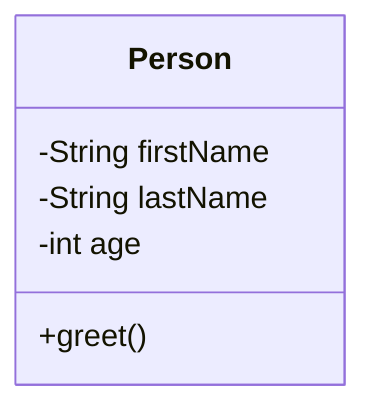
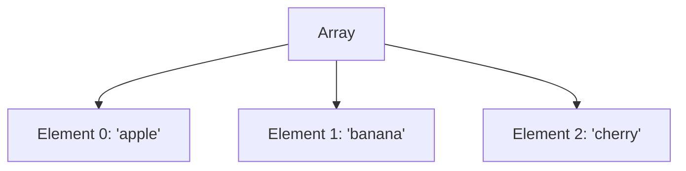

## 3.1.2 Objects and Arrays

In JavaScript, objects and arrays are fundamental data structures that allow developers to store and manipulate collections of data efficiently. Understanding how to work with these structures is crucial for mastering JavaScript and developing robust web applications. In this section, we'll explore the intricacies of objects and arrays, provide examples of their usage, and discuss best practices for handling complex data structures.

### Understanding Objects in JavaScript

Objects in JavaScript are collections of key-value pairs, where keys are strings (or Symbols) and values can be any data type, including other objects and functions. Objects are used to represent real-world entities and encapsulate related data and behavior.

#### Creating and Manipulating Objects

To create an object in JavaScript, you can use object literals or the `Object` constructor. Here's an example of creating an object using an object literal:

```javascript
// Creating an object using an object literal
const person = {
  firstName: 'John',
  lastName: 'Doe',
  age: 30,
  greet: function() {
    console.log(`Hello, my name is ${this.firstName} ${this.lastName}.`);
  }
};

// Accessing object properties
console.log(person.firstName); // Output: John
console.log(person['lastName']); // Output: Doe

// Modifying object properties
person.age = 31;
console.log(person.age); // Output: 31

// Adding new properties
person.email = 'john.doe@example.com';
console.log(person.email); // Output: john.doe@example.com

// Deleting properties
delete person.age;
console.log(person.age); // Output: undefined

// Invoking a method
person.greet(); // Output: Hello, my name is John Doe.
```

#### Object Property Access and Manipulation

JavaScript provides two ways to access object properties: dot notation and bracket notation. Dot notation is more concise and is used when the property name is a valid identifier. Bracket notation is useful when the property name is dynamic or not a valid identifier.

#### Shallow vs. Deep Cloning

When working with objects, it's important to understand the difference between shallow and deep cloning. Shallow cloning creates a new object with the same top-level properties as the original, but nested objects are still referenced. Deep cloning creates a completely independent copy of the object, including all nested objects.

Here's an example of shallow cloning using the `Object.assign` method and deep cloning using `JSON.parse` and `JSON.stringify`:

```javascript
// Original object
const original = { a: 1, b: { c: 2 } };

// Shallow clone
const shallowClone = Object.assign({}, original);
shallowClone.b.c = 3;
console.log(original.b.c); // Output: 3 (affected by changes in shallowClone)

// Deep clone
const deepClone = JSON.parse(JSON.stringify(original));
deepClone.b.c = 4;
console.log(original.b.c); // Output: 3 (unaffected by changes in deepClone)
```

### Understanding Arrays in JavaScript

Arrays in JavaScript are ordered collections of elements, which can be of any data type. Arrays are zero-indexed, meaning the first element is at index 0. They are used to store lists of data and provide various methods for manipulating these lists.

#### Creating and Manipulating Arrays

You can create arrays using array literals or the `Array` constructor. Here's an example of creating and manipulating arrays:

```javascript
// Creating an array using an array literal
const fruits = ['apple', 'banana', 'cherry'];

// Accessing array elements
console.log(fruits[0]); // Output: apple

// Modifying array elements
fruits[1] = 'blueberry';
console.log(fruits); // Output: ['apple', 'blueberry', 'cherry']

// Adding elements to the end of the array
fruits.push('date');
console.log(fruits); // Output: ['apple', 'blueberry', 'cherry', 'date']

// Removing the last element
fruits.pop();
console.log(fruits); // Output: ['apple', 'blueberry', 'cherry']

// Adding elements to the beginning of the array
fruits.unshift('apricot');
console.log(fruits); // Output: ['apricot', 'apple', 'blueberry', 'cherry']

// Removing the first element
fruits.shift();
console.log(fruits); // Output: ['apple', 'blueberry', 'cherry']
```

#### Array Methods

JavaScript arrays come with a variety of built-in methods that make it easy to manipulate data. Here are some commonly used array methods:

- **`push`**: Adds one or more elements to the end of an array.
- **`pop`**: Removes the last element from an array.
- **`shift`**: Removes the first element from an array.
- **`unshift`**: Adds one or more elements to the beginning of an array.
- **`slice`**: Returns a shallow copy of a portion of an array.
- **`splice`**: Adds or removes elements from an array.

Here's an example demonstrating the use of `slice` and `splice`:

```javascript
const numbers = [1, 2, 3, 4, 5];

// Using slice to create a new array
const sliced = numbers.slice(1, 3);
console.log(sliced); // Output: [2, 3]

// Using splice to remove elements
const spliced = numbers.splice(2, 2);
console.log(spliced); // Output: [3, 4]
console.log(numbers); // Output: [1, 2, 5]

// Using splice to add elements
numbers.splice(2, 0, 3, 4);
console.log(numbers); // Output: [1, 2, 3, 4, 5]
```

### Best Practices for Working with Objects and Arrays

When working with objects and arrays, it's important to follow best practices to ensure code maintainability and performance:

1. **Use Descriptive Property and Variable Names**: Choose meaningful names for object properties and array variables to improve code readability.

2. **Avoid Mutating Objects and Arrays**: Prefer creating new objects or arrays instead of modifying existing ones to prevent unintended side effects.

3. **Use Array Methods for Iteration**: Methods like `map`, `filter`, and `reduce` are more expressive and concise than traditional loops.

4. **Handle Nested Structures Carefully**: Be mindful of shallow vs. deep cloning when working with nested objects or arrays.

5. **Leverage Destructuring**: Use destructuring to extract values from objects and arrays for cleaner and more concise code.

6. **Consider Immutability**: Use libraries like Immutable.js to enforce immutability and prevent accidental mutations.

### Visualizing Object and Array Structures

To better understand how objects and arrays are structured and manipulated in JavaScript, let's visualize these concepts using Mermaid.js diagrams.

#### Object Structure



*Diagram 1: A class diagram representing a simple `Person` object with properties and a method.*

#### Array Structure



*Diagram 2: A graph representing an array with three elements.*

### Try It Yourself

Experiment with the code examples provided by making the following modifications:

- Add a new property to the `person` object and update the `greet` method to include this property.
- Create a new array of numbers and use the `map` method to double each number.
- Try deep cloning an object with nested arrays and verify that changes to the clone do not affect the original.

### References and Links

- [MDN Web Docs: Working with Objects](https://developer.mozilla.org/en-US/docs/Web/JavaScript/Guide/Working_with_Objects)
- [MDN Web Docs: Arrays](https://developer.mozilla.org/en-US/docs/Web/JavaScript/Reference/Global_Objects/Array)
- [JavaScript.info: Objects](https://javascript.info/object)
- [JavaScript.info: Arrays](https://javascript.info/array)

### Knowledge Check

- What is the difference between shallow and deep cloning?
- How can you add a new property to an existing object?
- What is the purpose of the `splice` method in arrays?
- How do you access an object's property using bracket notation?
- Why is it important to avoid mutating objects and arrays?

### Embrace the Journey

Remember, mastering objects and arrays is just the beginning of your journey in JavaScript. As you progress, you'll encounter more complex data structures and patterns. Keep experimenting, stay curious, and enjoy the journey!

## Quiz: Mastering JavaScript Objects and Arrays



### What is the primary purpose of objects in JavaScript?

- [x] To store collections of key-value pairs
- [ ] To perform mathematical operations
- [ ] To create animations
- [ ] To handle asynchronous operations

> **Explanation:** Objects in JavaScript are used to store collections of key-value pairs, allowing for structured data representation.

### Which method would you use to add an element to the end of an array?

- [ ] shift
- [ ] unshift
- [x] push
- [ ] pop

> **Explanation:** The `push` method adds one or more elements to the end of an array.

### How can you access the property `lastName` of an object `person` using bracket notation?

- [ ] person.lastName
- [x] person['lastName']
- [ ] person(lastName)
- [ ] person{lastName}

> **Explanation:** Bracket notation allows access to object properties using a string key, such as `person['lastName']`.

### What is the result of `numbers.slice(1, 3)` if `numbers` is `[1, 2, 3, 4, 5]`?

- [ ] [1, 2]
- [x] [2, 3]
- [ ] [3, 4]
- [ ] [4, 5]

> **Explanation:** The `slice` method returns a shallow copy of a portion of an array, starting from index 1 up to, but not including, index 3.

### Which of the following is a best practice when working with objects and arrays?

- [x] Avoid mutating objects and arrays
- [ ] Use global variables for all data
- [ ] Always use loops instead of array methods
- [ ] Ignore nested structures

> **Explanation:** Avoiding mutations helps prevent unintended side effects and makes code more predictable.

### What does the `splice` method do?

- [ ] Returns a shallow copy of an array
- [x] Adds or removes elements from an array
- [ ] Sorts the elements of an array
- [ ] Finds the index of an element in an array

> **Explanation:** The `splice` method can add or remove elements from an array, modifying the original array.

### How can you create a deep clone of an object?

- [ ] Using `Object.assign`
- [x] Using `JSON.parse(JSON.stringify(object))`
- [ ] Using `Array.from`
- [ ] Using `Object.create`

> **Explanation:** `JSON.parse(JSON.stringify(object))` creates a deep clone by serializing and deserializing the object.

### What is the output of `fruits.pop()` if `fruits` is `['apple', 'banana', 'cherry']`?

- [ ] apple
- [ ] banana
- [x] cherry
- [ ] undefined

> **Explanation:** The `pop` method removes and returns the last element of an array, which is `cherry` in this case.

### Which of the following methods adds elements to the beginning of an array?

- [ ] push
- [x] unshift
- [ ] pop
- [ ] slice

> **Explanation:** The `unshift` method adds one or more elements to the beginning of an array.

### True or False: Objects in JavaScript can have methods as properties.

- [x] True
- [ ] False

> **Explanation:** Objects in JavaScript can have methods, which are functions stored as properties, allowing them to encapsulate behavior.


