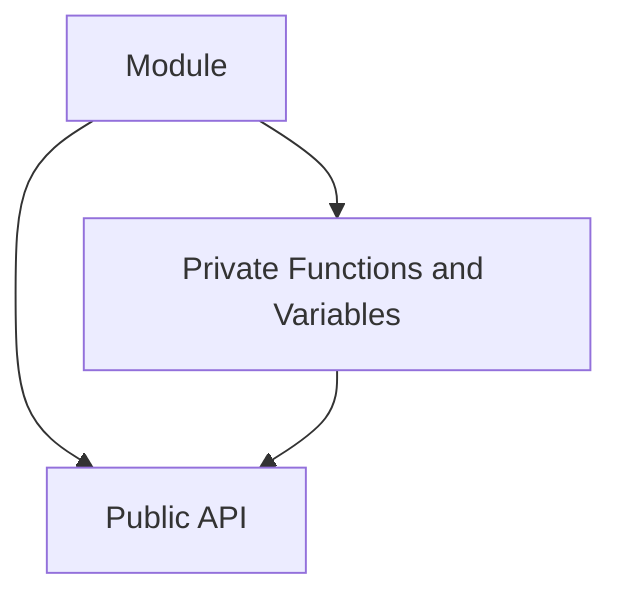

## 3.1.2 Revealing Module Pattern

The Revealing Module Pattern is a popular design pattern in JavaScript and TypeScript that focuses on improving the clarity and maintainability of code by explicitly defining what parts of a module are public and what parts are private. This pattern is particularly useful in scenarios where you want to create a clear and maintainable public interface for your modules.

### Understand the Intent

The primary intent of the Revealing Module Pattern is to:

- **Explicitly Define Public Interfaces:** Clearly outline which variables and methods are accessible from outside the module.
- **Promote Clarity:** By mapping private functions to public ones, the pattern enhances code readability and maintainability.

### Implementation Steps

Implementing the Revealing Module Pattern involves a few straightforward steps:

1. **Define Functions and Variables:** Start by defining all functions and variables within the private scope of an Immediately Invoked Function Expression (IIFE).
2. **Return Public API:** At the end of the IIFE, return an object that maps public function names to their corresponding private functions.

Here's a visual representation of the pattern:



### Code Examples

Let's examine a simple example where we create a module for a basic calculator using the Revealing Module Pattern.

```javascript
const Calculator = (function() {
    // Private variables and functions
    let result = 0;

    function add(x) {
        result += x;
    }

    function subtract(x) {
        result -= x;
    }

    function multiply(x) {
        result *= x;
    }

    function divide(x) {
        if (x !== 0) {
            result /= x;
        } else {
            console.error("Division by zero is not allowed.");
        }
    }

    function getResult() {
        return result;
    }

    // Public API
    return {
        add,
        subtract,
        multiply,
        divide,
        getResult
    };
})();

// Usage
Calculator.add(10);
Calculator.subtract(2);
Calculator.multiply(3);
Calculator.divide(2);
console.log(Calculator.getResult()); // Outputs: 12
```

In this example, the `Calculator` module exposes only the necessary operations (`add`, `subtract`, `multiply`, `divide`, and `getResult`) while keeping the `result` variable private.

### Use Cases

The Revealing Module Pattern is particularly useful in the following scenarios:

- **Clear Public Interfaces:** When you need to provide a clear and maintainable public interface for your modules.
- **Encapsulation:** When you want to encapsulate private logic and expose only the necessary parts of your module.

### Practice

To practice implementing the Revealing Module Pattern, try refactoring a simple module. For instance, refactor a module that manages a list of tasks, exposing only methods to add, remove, and list tasks.

### Considerations

When using the Revealing Module Pattern, keep the following considerations in mind:

- **Correct Mapping:** Ensure that all public methods correctly reference the intended private functions.
- **Avoid Exposing Private Variables:** Be cautious not to inadvertently expose private variables.

### Advantages and Disadvantages

#### Advantages

- **Improved Readability:** By clearly defining public and private parts, the pattern enhances code readability.
- **Encapsulation:** Provides a way to encapsulate private logic, reducing the risk of unintended interference.

#### Disadvantages

- **Complexity:** For very large modules, managing the mapping between private and public functions can become complex.
- **Performance:** The use of IIFEs can introduce slight performance overhead, although this is generally negligible.

### Best Practices

- **Consistent Naming:** Use consistent naming conventions for public and private functions to avoid confusion.
- **Documentation:** Document the public API clearly to aid future maintenance and usage.

### Conclusion

The Revealing Module Pattern is a powerful tool for creating clear and maintainable public interfaces in JavaScript and TypeScript. By explicitly defining what is public and what is private, developers can write more readable and maintainable code. As with any pattern, it's important to weigh the benefits against the complexity it introduces, especially in larger modules.

## Quiz Time!



### What is the primary intent of the Revealing Module Pattern?

- [x] To explicitly define public interfaces and promote clarity.
- [ ] To improve performance by reducing memory usage.
- [ ] To simplify asynchronous operations.
- [ ] To enhance security by encrypting module data.

> **Explanation:** The Revealing Module Pattern aims to explicitly define what is public and private, promoting clarity and maintainability.

### How are private functions and variables defined in the Revealing Module Pattern?

- [x] Within the private scope of an IIFE.
- [ ] As global variables.
- [ ] Using the `private` keyword.
- [ ] In a separate file.

> **Explanation:** Private functions and variables are defined within the private scope of an Immediately Invoked Function Expression (IIFE).

### What does the Revealing Module Pattern return at the end of the IIFE?

- [x] An object mapping public function names to private functions.
- [ ] A list of all private variables.
- [ ] A string describing the module.
- [ ] A promise resolving to the module's public API.

> **Explanation:** The pattern returns an object that maps public function names to their corresponding private functions.

### Which of the following is a use case for the Revealing Module Pattern?

- [x] When you want a clear and maintainable public interface for your modules.
- [ ] When you need to handle asynchronous operations.
- [ ] When you want to optimize for performance.
- [ ] When you need to encrypt data.

> **Explanation:** The pattern is used to create clear and maintainable public interfaces for modules.

### What should you ensure when using the Revealing Module Pattern?

- [x] All public methods reference the correct private functions.
- [ ] All private variables are exposed.
- [ ] The module is minified.
- [ ] The module uses async/await.

> **Explanation:** It's important to ensure that all public methods correctly reference the intended private functions.

### What is a potential disadvantage of the Revealing Module Pattern?

- [x] Complexity in managing mappings for large modules.
- [ ] Increased memory usage.
- [ ] Difficulty in debugging.
- [ ] Lack of support for asynchronous operations.

> **Explanation:** For very large modules, managing the mapping between private and public functions can become complex.

### How does the Revealing Module Pattern improve code readability?

- [x] By clearly defining public and private parts of the module.
- [ ] By reducing the number of lines of code.
- [ ] By using simpler syntax.
- [ ] By eliminating the need for comments.

> **Explanation:** The pattern improves readability by clearly defining what is public and what is private.

### What is a best practice when implementing the Revealing Module Pattern?

- [x] Use consistent naming conventions for public and private functions.
- [ ] Always expose all variables.
- [ ] Avoid using comments.
- [ ] Use global variables for public functions.

> **Explanation:** Consistent naming conventions help avoid confusion and improve maintainability.

### Which of the following is NOT a benefit of the Revealing Module Pattern?

- [x] Improved performance.
- [ ] Improved readability.
- [ ] Encapsulation.
- [ ] Clear public interfaces.

> **Explanation:** While the pattern improves readability and encapsulation, it does not inherently improve performance.

### True or False: The Revealing Module Pattern can introduce slight performance overhead due to the use of IIFEs.

- [x] True
- [ ] False

> **Explanation:** The use of IIFEs can introduce slight performance overhead, although this is generally negligible.


