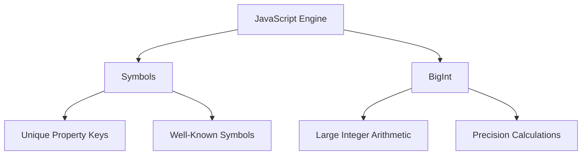

## 3.1.3 Symbols and BigInt

In the ever-evolving landscape of JavaScript, two relatively new primitive data types have emerged to address specific needs: `Symbol` and `BigInt`. These types offer unique capabilities that enhance the language's flexibility and power, especially in complex applications. In this section, we will delve into these advanced data types, exploring their purposes, use cases, and best practices.

### Understanding Symbols

#### What is a Symbol?

A `Symbol` is a unique and immutable primitive value introduced in ECMAScript 2015 (ES6). Unlike other primitive data types, such as numbers or strings, each `Symbol` is unique. This uniqueness makes `Symbols` particularly useful for creating unique property keys in objects, ensuring that no accidental property name collisions occur.

#### Creating and Using Symbols

To create a `Symbol`, you use the `Symbol()` function. Each call to `Symbol()` produces a new, unique symbol:

```javascript
// Creating symbols
const sym1 = Symbol();
const sym2 = Symbol('description');

// Checking uniqueness
console.log(sym1 === sym2); // false

// Using symbols as object keys
const myObject = {};
myObject[sym1] = 'value1';
myObject[sym2] = 'value2';

console.log(myObject[sym1]); // 'value1'
console.log(myObject[sym2]); // 'value2'
```

In this example, `sym1` and `sym2` are unique symbols, even though `sym2` has an optional description. This description is purely for debugging purposes and does not affect the symbol's uniqueness.

#### Well-Known Symbols

JavaScript provides several built-in symbols known as well-known symbols. These symbols allow developers to customize the behavior of objects in specific contexts. Some of the most commonly used well-known symbols include:

- `Symbol.iterator`: Used to define the default iterator for an object.
- `Symbol.toStringTag`: Used to customize the default string description of an object.
- `Symbol.hasInstance`: Used to customize the behavior of the `instanceof` operator.

Here's an example of using `Symbol.iterator`:

```javascript
// Custom iterable object
const myIterable = {
  *[Symbol.iterator]() {
    yield 1;
    yield 2;
    yield 3;
  }
};

// Using the iterable
for (const value of myIterable) {
  console.log(value); // 1, 2, 3
}
```

In this example, we define a custom iterable object using `Symbol.iterator`, allowing it to be used in a `for...of` loop.

#### Practical Use Cases for Symbols

Symbols are particularly useful in scenarios where you need to ensure that object properties are unique and do not conflict with other properties. Some practical use cases include:

- **Creating private object properties**: While not truly private, symbols can be used to create properties that are less likely to be accessed accidentally.
- **Defining custom behaviors**: Using well-known symbols, you can customize how objects behave in specific contexts, such as iteration or type conversion.
- **Avoiding property name collisions**: In large applications or libraries, symbols can prevent accidental overwriting of properties.

### Exploring BigInt

#### What is BigInt?

`BigInt` is a primitive data type introduced in ECMAScript 2020 (ES11) to represent integers larger than `Number.MAX_SAFE_INTEGER` (2^53 - 1). With `BigInt`, JavaScript can handle arbitrarily large integers, which is crucial for applications requiring high-precision arithmetic.

#### Creating and Using BigInt

You can create a `BigInt` by appending `n` to the end of an integer literal or by using the `BigInt()` function:

```javascript
// Creating BigInt
const bigInt1 = 1234567890123456789012345678901234567890n;
const bigInt2 = BigInt('1234567890123456789012345678901234567890');

// Arithmetic operations with BigInt
const sum = bigInt1 + bigInt2;
const product = bigInt1 * bigInt2;

console.log(sum); // 2469135780246913578024691357802469135780n
console.log(product); // A very large BigInt
```

#### Caveats of Using BigInt

While `BigInt` is powerful, there are some caveats to keep in mind:

- **Incompatibility with Number**: You cannot mix `BigInt` and `Number` types in arithmetic operations. Attempting to do so will result in a `TypeError`.
- **Performance considerations**: Operations on `BigInt` can be slower than on `Number`, especially for very large values.

#### Practical Use Cases for BigInt

`BigInt` is particularly useful in scenarios where precision and large integer values are critical:

- **Cryptography**: Handling large integers is essential for cryptographic algorithms.
- **Financial calculations**: Ensuring precision in financial applications where rounding errors can lead to significant discrepancies.
- **Scientific computations**: Performing calculations that require high precision and large numbers.

### Visualizing Symbols and BigInt

To better understand how `Symbols` and `BigInt` fit into the JavaScript ecosystem, let's visualize their interactions and roles.



**Figure 1**: This diagram illustrates how `Symbols` and `BigInt` extend the capabilities of the JavaScript engine, providing unique property keys and handling large integers, respectively.

### Best Practices for Using Symbols and BigInt

- **Use Symbols for Unique Keys**: When defining object properties that must be unique and should not conflict with other properties, use symbols.
- **Leverage Well-Known Symbols**: Customize object behaviors by implementing well-known symbols where appropriate.
- **Use BigInt for Large Integers**: When dealing with integers larger than `Number.MAX_SAFE_INTEGER`, use `BigInt` to ensure accuracy and precision.
- **Avoid Mixing Types**: Be cautious not to mix `BigInt` and `Number` types in arithmetic operations to prevent errors.

### Try It Yourself

Experiment with the following code snippets to deepen your understanding of `Symbols` and `BigInt`:

1. **Modify Symbol Descriptions**: Create symbols with different descriptions and observe how they appear in debugging tools.
2. **Implement Custom Iterators**: Use `Symbol.iterator` to create custom iterable objects and iterate over them.
3. **Perform BigInt Arithmetic**: Try different arithmetic operations with `BigInt` and observe the results.

### Knowledge Check

To reinforce your understanding of `Symbols` and `BigInt`, consider the following questions and exercises:

- What are the primary use cases for `Symbols` in JavaScript?
- How do well-known symbols enhance object customization?
- Why is `BigInt` necessary in JavaScript, and what are its limitations?
- Write a function that takes two `BigInt` values and returns their sum.

### Summary

In this section, we've explored the advanced data types `Symbol` and `BigInt`, understanding their purposes, use cases, and best practices. By leveraging these types, developers can create more robust and flexible applications, handling unique property keys and large integers with ease. Remember, this is just the beginning. As you progress, you'll build more complex and interactive web pages. Keep experimenting, stay curious, and enjoy the journey!

## Quiz: Mastering Symbols and BigInt in JavaScript



### What is a primary use case for Symbols in JavaScript?

- [x] Creating unique property keys
- [ ] Performing arithmetic operations
- [ ] Storing large integers
- [ ] Defining global constants

> **Explanation:** Symbols are primarily used for creating unique property keys in objects to avoid name collisions.

### How do you create a BigInt in JavaScript?

- [x] By appending `n` to an integer literal
- [ ] By using the `Number()` function
- [ ] By using the `Symbol()` function
- [ ] By appending `b` to an integer literal

> **Explanation:** A BigInt can be created by appending `n` to an integer literal or using the `BigInt()` function.

### Which of the following is a well-known symbol in JavaScript?

- [x] `Symbol.iterator`
- [ ] `Symbol.bigint`
- [ ] `Symbol.number`
- [ ] `Symbol.string`

> **Explanation:** `Symbol.iterator` is a well-known symbol used to define the default iterator for an object.

### Can you mix BigInt and Number types in arithmetic operations?

- [ ] Yes, they are compatible
- [x] No, it results in a TypeError
- [ ] Yes, but only in specific cases
- [ ] No, but it results in a warning

> **Explanation:** Mixing BigInt and Number types in arithmetic operations results in a TypeError.

### What is the purpose of the Symbol.toStringTag well-known symbol?

- [x] To customize the default string description of an object
- [ ] To define the default iterator for an object
- [ ] To create unique property keys
- [ ] To perform arithmetic operations

> **Explanation:** `Symbol.toStringTag` is used to customize the default string description of an object.

### Why is BigInt necessary in JavaScript?

- [x] To represent integers larger than `Number.MAX_SAFE_INTEGER`
- [ ] To create unique property keys
- [ ] To define global constants
- [ ] To perform string manipulations

> **Explanation:** BigInt is necessary for representing integers larger than `Number.MAX_SAFE_INTEGER` with precision.

### Which of the following operations is valid with BigInt?

- [x] Addition with another BigInt
- [ ] Addition with a Number
- [ ] Multiplication with a Number
- [ ] Division with a Number

> **Explanation:** Arithmetic operations with BigInt are valid only with other BigInt values.

### What is a practical use case for BigInt?

- [x] Cryptographic algorithms
- [ ] Creating unique property keys
- [ ] Defining global constants
- [ ] Performing string manipulations

> **Explanation:** BigInt is useful in cryptographic algorithms where handling large integers is essential.

### How can you define a custom iterator for an object?

- [x] By implementing the `Symbol.iterator` method
- [ ] By using the `BigInt()` function
- [ ] By appending `n` to an integer literal
- [ ] By using the `Symbol()` function

> **Explanation:** A custom iterator for an object can be defined by implementing the `Symbol.iterator` method.

### True or False: Symbols can be used to create truly private object properties.

- [ ] True
- [x] False

> **Explanation:** Symbols can create properties that are less likely to be accessed accidentally, but they are not truly private.




