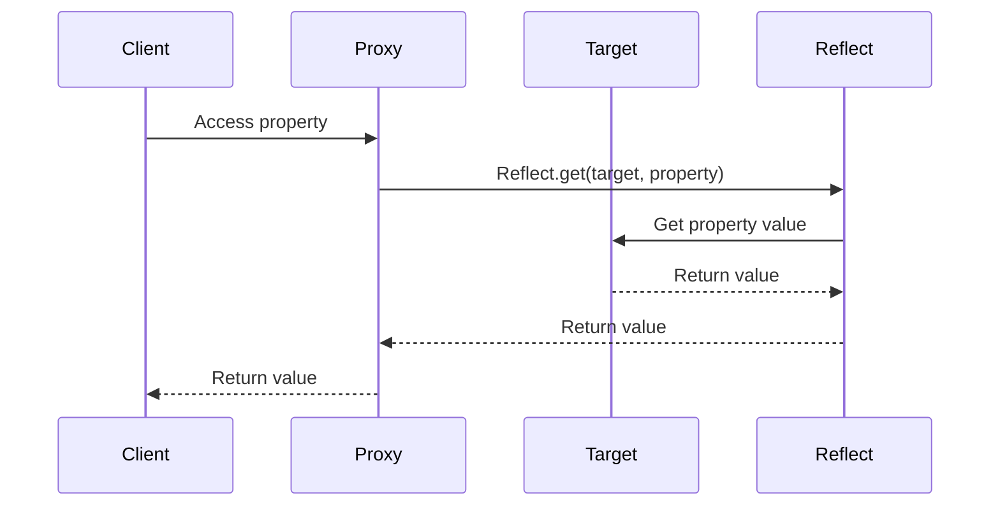

## 3.10 The Reflect and Proxy Objects

In modern JavaScript, the Reflect API and Proxy objects provide powerful tools for intercepting and customizing fundamental operations on objects. These features enable developers to create more flexible and dynamic applications by allowing them to define custom behaviors for objects. In this section, we will explore the concepts of Proxies and the Reflect API, how they work, and how you can leverage them in your JavaScript applications.

### Understanding Proxies in JavaScript

A Proxy object in JavaScript is used to define custom behavior for fundamental operations (e.g., property lookup, assignment, enumeration, function invocation, etc.). Proxies allow you to intercept and redefine these operations, providing a layer of control over how objects behave.

#### What is a Proxy?

A Proxy is an object that wraps another object (called the target) and intercepts operations performed on it. This interception is achieved through a set of handler functions known as "traps." Each trap corresponds to a specific operation, such as getting a property or setting a property value.

#### Creating a Proxy

To create a Proxy, you need two components: the target object and the handler object. The handler object contains traps that define the custom behavior for the operations you want to intercept.

```javascript
// Define a target object
const target = {
  message: "Hello, World!"
};

// Define a handler with traps
const handler = {
  get: function(target, property) {
    console.log(`Getting property: ${property}`);
    return target[property];
  }
};

// Create a Proxy
const proxy = new Proxy(target, handler);

// Access a property through the Proxy
console.log(proxy.message); // Output: Getting property: message
                            //         Hello, World!
```

In this example, the `get` trap is used to intercept property access on the target object. When `proxy.message` is accessed, the trap logs a message and returns the property value.

### Traps in Proxy Objects

Traps are the core feature of Proxy objects. They allow you to intercept and redefine operations on the target object. Here are some common traps you can define:

- **get(target, property, receiver)**: Intercepts property access.
- **set(target, property, value, receiver)**: Intercepts property assignment.
- **has(target, property)**: Intercepts the `in` operator.
- **deleteProperty(target, property)**: Intercepts property deletion.
- **apply(target, thisArg, argumentsList)**: Intercepts function calls.
- **construct(target, argumentsList, newTarget)**: Intercepts the `new` operator.

#### Example: Validation with Proxies

Proxies can be used to enforce validation rules on objects. For example, you can use a Proxy to ensure that only numeric values are assigned to a property.

```javascript
const numericValidator = {
  set: function(target, property, value) {
    if (typeof value !== 'number') {
      throw new TypeError('Value must be a number');
    }
    target[property] = value;
    return true;
  }
};

const numbers = new Proxy({}, numericValidator);

numbers.age = 25; // Works fine
console.log(numbers.age); // Output: 25

try {
  numbers.age = 'twenty-five'; // Throws an error
} catch (e) {
  console.error(e.message); // Output: Value must be a number
}
```

In this example, the `set` trap ensures that only numeric values can be assigned to properties of the `numbers` object.

### The Reflect API

The Reflect API is a built-in object that provides methods for intercepting JavaScript operations. These methods mirror the operations of the Proxy traps and provide a way to perform default operations within traps.

#### Why Use Reflect?

The Reflect API is useful for performing default operations within Proxy traps. It provides a consistent and predictable way to handle operations, ensuring that the default behavior is preserved when needed.

#### Common Reflect Methods

Here are some commonly used methods in the Reflect API:

- **Reflect.get(target, property, receiver)**: Retrieves a property value.
- **Reflect.set(target, property, value, receiver)**: Sets a property value.
- **Reflect.has(target, property)**: Checks if a property exists.
- **Reflect.deleteProperty(target, property)**: Deletes a property.
- **Reflect.apply(target, thisArg, argumentsList)**: Calls a function.
- **Reflect.construct(target, argumentsList, newTarget)**: Constructs an object.

#### Example: Using Reflect in Proxies

You can use Reflect methods within Proxy traps to perform default operations while adding custom behavior.

```javascript
const handler = {
  get: function(target, property, receiver) {
    console.log(`Accessing property: ${property}`);
    return Reflect.get(target, property, receiver);
  },
  set: function(target, property, value, receiver) {
    console.log(`Setting property: ${property} to ${value}`);
    return Reflect.set(target, property, value, receiver);
  }
};

const proxy = new Proxy(target, handler);

proxy.message = "Hello, Proxy!"; // Output: Setting property: message to Hello, Proxy!
console.log(proxy.message); // Output: Accessing property: message
                            //         Hello, Proxy!
```

In this example, the `Reflect.get` and `Reflect.set` methods are used to perform the default operations while adding logging functionality.

### Custom Behaviors with Proxies

Proxies can be used to create objects with custom behaviors, such as observable objects, validation, and more.

#### Observable Objects

You can use Proxies to create observable objects that notify listeners when properties change.

```javascript
function createObservable(target, callback) {
  return new Proxy(target, {
    set: function(target, property, value, receiver) {
      const success = Reflect.set(target, property, value, receiver);
      if (success) {
        callback(property, value);
      }
      return success;
    }
  });
}

const person = createObservable({}, (property, value) => {
  console.log(`Property ${property} changed to ${value}`);
});

person.name = "Alice"; // Output: Property name changed to Alice
person.age = 30; // Output: Property age changed to 30
```

In this example, the `createObservable` function creates a Proxy that notifies a callback function whenever a property is set.

### Performance Considerations and Pitfalls

While Proxies and the Reflect API offer powerful capabilities, they come with performance considerations and potential pitfalls.

#### Performance Overhead

Proxies can introduce performance overhead due to the additional layer of abstraction. Each intercepted operation involves a function call to the trap, which can impact performance in performance-critical applications.

#### Potential Pitfalls

- **Infinite Recursion**: Be cautious of creating traps that call themselves, leading to infinite recursion.
- **Compatibility**: Not all environments support Proxies, especially older browsers. Ensure compatibility with your target environment.
- **Complexity**: Overusing Proxies can lead to complex and hard-to-maintain code. Use them judiciously.

### Visualizing Proxy and Reflect Interactions

To better understand how Proxies and the Reflect API interact with objects, let's visualize the process using a sequence diagram.



This diagram illustrates the sequence of interactions when accessing a property through a Proxy using the Reflect API.

### Try It Yourself

Experiment with the code examples provided in this section. Try modifying the traps to add different behaviors, such as logging, validation, or transformation. Consider creating a Proxy that logs all operations performed on an object or one that restricts access to certain properties.

### Key Takeaways

- Proxies allow you to intercept and redefine fundamental operations on objects.
- Traps in Proxies define custom behavior for operations like property access, assignment, and more.
- The Reflect API provides methods that mirror object operations, allowing you to perform default operations within traps.
- Proxies can be used to create objects with custom behaviors, such as validation and observability.
- Be mindful of performance considerations and potential pitfalls when using Proxies.

### Further Reading

- [MDN Web Docs: Proxy](https://developer.mozilla.org/en-US/docs/Web/JavaScript/Reference/Global_Objects/Proxy)
- [MDN Web Docs: Reflect](https://developer.mozilla.org/en-US/docs/Web/JavaScript/Reference/Global_Objects/Reflect)

### Knowledge Check

Test your understanding of Proxies and the Reflect API with the following quiz.

## Mastering Proxies and Reflect in JavaScript



### What is a Proxy in JavaScript?

- [x] An object that wraps another object and intercepts operations on it.
- [ ] A function that executes asynchronously.
- [ ] A method for optimizing code performance.
- [ ] A built-in JavaScript library.

> **Explanation:** A Proxy is an object that wraps another object and intercepts operations performed on it, allowing custom behavior to be defined.

### Which of the following is a trap in a Proxy object?

- [x] get
- [ ] execute
- [ ] run
- [ ] invoke

> **Explanation:** The `get` trap is used to intercept property access on the target object.

### What does the Reflect API provide?

- [x] Methods for intercepting JavaScript operations.
- [ ] A way to execute asynchronous code.
- [ ] A library for creating animations.
- [ ] A tool for debugging JavaScript code.

> **Explanation:** The Reflect API provides methods that mirror object operations, allowing default operations to be performed within Proxy traps.

### How can you use Proxies for validation?

- [x] By defining a `set` trap that checks the value before assigning it.
- [ ] By using the `get` trap to log property access.
- [ ] By creating a new object with validation methods.
- [ ] By using the Reflect API to enforce rules.

> **Explanation:** A `set` trap can be used to enforce validation rules by checking the value before assigning it to a property.

### What is a potential pitfall of using Proxies?

- [x] Infinite recursion if traps call themselves.
- [ ] Improved performance in all cases.
- [ ] Automatic compatibility with all browsers.
- [ ] Simplified code maintenance.

> **Explanation:** Proxies can lead to infinite recursion if traps are not carefully implemented to avoid calling themselves.

### Which Reflect method is used to set a property value?

- [x] Reflect.set
- [ ] Reflect.get
- [ ] Reflect.apply
- [ ] Reflect.deleteProperty

> **Explanation:** `Reflect.set` is used to set a property value on an object.

### What is the purpose of using Reflect methods in Proxy traps?

- [x] To perform default operations while adding custom behavior.
- [ ] To replace the need for Proxy traps.
- [ ] To execute asynchronous code.
- [ ] To improve code readability.

> **Explanation:** Reflect methods are used within Proxy traps to perform default operations while adding custom behavior.

### How can Proxies be used to create observable objects?

- [x] By defining a `set` trap that notifies listeners when properties change.
- [ ] By using the `get` trap to log property access.
- [ ] By creating a new object with observable methods.
- [ ] By using the Reflect API to notify listeners.

> **Explanation:** A `set` trap can be used to notify listeners when properties change, creating observable objects.

### What is the main advantage of using Proxies?

- [x] Customizing object behavior by intercepting operations.
- [ ] Automatically improving code performance.
- [ ] Simplifying code syntax.
- [ ] Providing built-in validation methods.

> **Explanation:** The main advantage of using Proxies is the ability to customize object behavior by intercepting operations.

### True or False: Proxies can introduce performance overhead.

- [x] True
- [ ] False

> **Explanation:** Proxies can introduce performance overhead due to the additional layer of abstraction and function calls involved in intercepting operations.



Remember, mastering Proxies and the Reflect API can greatly enhance your ability to create dynamic and flexible JavaScript applications. Keep experimenting, stay curious, and enjoy the journey!
