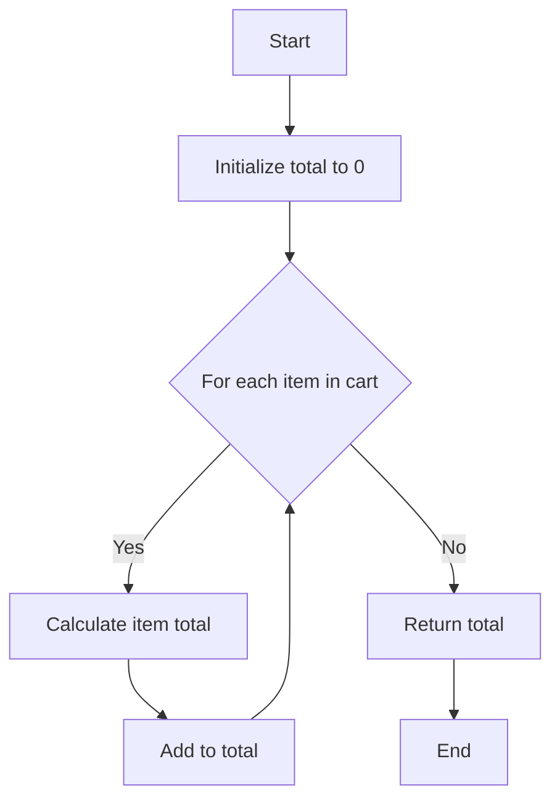

## 3.11 Coding Style and Conventions

In the world of software development, especially in JavaScript, maintaining a consistent coding style is crucial for enhancing readability and maintainability. This section delves into the importance of coding style, introduces popular style guides, and provides practical tips on naming conventions, indentation, spacing, and commenting. By adhering to a consistent style, developers can ensure that their code is not only easier to read but also simpler to maintain and extend.

### The Importance of Consistent Coding Style

Consistent coding style is more than just an aesthetic choice; it plays a significant role in the readability and maintainability of code. Here are some key benefits:

- **Readability**: A consistent style makes it easier for developers to read and understand code, reducing the cognitive load required to interpret different coding styles.
- **Collaboration**: When working in teams, a uniform style ensures that everyone can read and contribute to the codebase without confusion.
- **Maintainability**: Consistent code is easier to maintain and refactor, as developers can quickly identify patterns and structures.
- **Error Reduction**: A well-defined style can help prevent common errors and bugs by promoting best practices and reducing ambiguity.

### Popular JavaScript Style Guides

Several style guides have gained popularity in the JavaScript community. These guides provide a set of rules and best practices to follow, ensuring consistency across projects.

#### Airbnb JavaScript Style Guide

The [Airbnb JavaScript Style Guide](https://github.com/airbnb/javascript) is one of the most widely adopted style guides. It covers a comprehensive range of topics, including variables, functions, control flow, and more. The guide is known for its detailed explanations and practical examples.

#### Google JavaScript Style Guide

The [Google JavaScript Style Guide](https://google.github.io/styleguide/jsguide.html) offers a set of conventions used by Google. It emphasizes readability and simplicity, providing guidelines on everything from naming conventions to code formatting.

#### StandardJS

[StandardJS](https://standardjs.com/) is a style guide that enforces a strict set of rules without the need for configuration. It aims to reduce decision fatigue by providing a single, consistent style that developers can adopt with minimal setup.

### Naming Conventions

Naming conventions are crucial for code clarity and understanding. Here are some best practices:

- **Variables and Functions**: Use camelCase for variables and functions. For example, `let userName = 'John';` and `function calculateTotal() {}`.
- **Constants**: Use UPPER_CASE for constants. For example, `const MAX_USERS = 100;`.
- **Classes**: Use PascalCase for class names. For example, `class UserAccount {}`.
- **Descriptive Names**: Choose descriptive names that convey the purpose of the variable or function. Avoid single-letter names except for loop indices.

### Indentation and Spacing

Proper indentation and spacing improve code readability by visually representing the structure and flow of the code.

- **Indentation**: Use 2 or 4 spaces for indentation. Avoid using tabs, as they can render differently in various editors.
- **Line Length**: Keep lines under 80 or 100 characters to avoid horizontal scrolling and improve readability.
- **Spacing**: Use spaces around operators and after commas for clarity. For example, `let sum = a + b;` and `function greet(name, age) {}`.

### Commenting

Comments are essential for explaining complex logic and providing context to the code. Here are some guidelines:

- **Inline Comments**: Use inline comments sparingly to explain non-obvious code. Place them on the same line as the code they describe.
- **Block Comments**: Use block comments to describe the purpose of a function or a section of code. Place them above the code block.
- **Descriptive Comments**: Ensure comments add value by explaining why something is done, not just what is done.

### Code Examples

Let's look at examples contrasting well-formatted and poorly-formatted code.

#### Well-Formatted Code

```javascript
// Calculate the total price of items in the cart
function calculateTotal(cart) {
  let total = 0;
  for (let item of cart) {
    total += item.price * item.quantity;
  }
  return total;
}

const cart = [
  { price: 10, quantity: 2 },
  { price: 5, quantity: 4 }
];

console.log(calculateTotal(cart)); // Output: 40
```

#### Poorly-Formatted Code

```javascript
function calculateTotal(cart){let total=0;for(let item of cart){total+=item.price*item.quantity;}return total;}
const cart=[{price:10,quantity:2},{price:5,quantity:4}];console.log(calculateTotal(cart));
```

### Adhering to a Style Guide

Choosing and adhering to a style guide is essential for maintaining consistency throughout a project. Here are some tips:

- **Select a Style Guide**: Choose a style guide that aligns with your team's preferences and project requirements.
- **Use Linters**: Implement linters like ESLint to automatically enforce style rules and catch violations.
- **Document Exceptions**: If deviations from the style guide are necessary, document them clearly to avoid confusion.
- **Review Regularly**: Regularly review and update your style guide to incorporate new best practices and address any issues.

### Visualizing Code Structure

To further enhance understanding, let's visualize the structure of a well-formatted JavaScript function using a flowchart.



**Figure 1**: Flowchart of the `calculateTotal` function, illustrating the process of iterating over a cart and calculating the total price.

### References and Links

For further reading and deeper dives into coding style and conventions, consider exploring the following resources:

- [Airbnb JavaScript Style Guide](https://github.com/airbnb/javascript)
- [Google JavaScript Style Guide](https://google.github.io/styleguide/jsguide.html)
- [StandardJS](https://standardjs.com/)
- [MDN Web Docs on JavaScript](https://developer.mozilla.org/en-US/docs/Web/JavaScript)

### Knowledge Check

1. **What are the benefits of maintaining a consistent coding style?**
   - [x] Improved readability
   - [x] Easier collaboration
   - [x] Simplified maintenance
   - [ ] Increased execution speed

   > **Explanation:** Consistent coding style enhances readability, collaboration, and maintenance, but it does not affect execution speed.

2. **Which style guide is known for its strict rules without configuration?**
   - [ ] Airbnb
   - [ ] Google
   - [x] StandardJS
   - [ ] MDN

   > **Explanation:** StandardJS enforces strict rules without the need for configuration, making it easy to adopt.

3. **What naming convention is recommended for JavaScript constants?**
   - [ ] camelCase
   - [x] UPPER_CASE
   - [ ] PascalCase
   - [ ] snake_case

   > **Explanation:** Constants in JavaScript are typically written in UPPER_CASE to distinguish them from variables.

4. **What is the recommended line length for JavaScript code?**
   - [ ] 60 characters
   - [x] 80 or 100 characters
   - [ ] 120 characters
   - [ ] 140 characters

   > **Explanation:** Keeping lines under 80 or 100 characters improves readability and avoids horizontal scrolling.

5. **Which tool can be used to enforce coding style rules automatically?**
   - [ ] Babel
   - [x] ESLint
   - [ ] Webpack
   - [ ] Node.js

   > **Explanation:** ESLint is a popular tool for enforcing coding style rules and catching violations in JavaScript code.

### Exercises

1. **Refactor the following poorly-formatted code to adhere to a consistent style:**

   ```javascript
   function add(a,b){return a+b;}const result=add(5,10);console.log(result);
   ```

2. **Choose a style guide and configure ESLint to enforce it in your project.**

3. **Write a function with descriptive comments explaining its purpose and logic.**

### Embrace the Journey

Remember, adopting a consistent coding style is just the beginning. As you progress in your JavaScript journey, you'll find that these practices become second nature, allowing you to focus on solving complex problems and building innovative solutions. Keep experimenting, stay curious, and enjoy the journey!

## JavaScript Coding Style and Conventions Quiz



### What are the benefits of maintaining a consistent coding style?

- [x] Improved readability
- [x] Easier collaboration
- [x] Simplified maintenance
- [ ] Increased execution speed

> **Explanation:** Consistent coding style enhances readability, collaboration, and maintenance, but it does not affect execution speed.


### Which style guide is known for its strict rules without configuration?

- [ ] Airbnb
- [ ] Google
- [x] StandardJS
- [ ] MDN

> **Explanation:** StandardJS enforces strict rules without the need for configuration, making it easy to adopt.


### What naming convention is recommended for JavaScript constants?

- [ ] camelCase
- [x] UPPER_CASE
- [ ] PascalCase
- [ ] snake_case

> **Explanation:** Constants in JavaScript are typically written in UPPER_CASE to distinguish them from variables.


### What is the recommended line length for JavaScript code?

- [ ] 60 characters
- [x] 80 or 100 characters
- [ ] 120 characters
- [ ] 140 characters

> **Explanation:** Keeping lines under 80 or 100 characters improves readability and avoids horizontal scrolling.


### Which tool can be used to enforce coding style rules automatically?

- [ ] Babel
- [x] ESLint
- [ ] Webpack
- [ ] Node.js

> **Explanation:** ESLint is a popular tool for enforcing coding style rules and catching violations in JavaScript code.


### What is the recommended indentation style for JavaScript code?

- [x] 2 or 4 spaces
- [ ] Tabs
- [ ] 6 spaces
- [ ] No indentation

> **Explanation:** Using 2 or 4 spaces for indentation is recommended to ensure consistent rendering across different editors.


### Which of the following is a popular JavaScript style guide?

- [x] Airbnb
- [x] Google
- [ ] Python PEP 8
- [ ] Java Style Guide

> **Explanation:** Airbnb and Google are popular JavaScript style guides, while PEP 8 is for Python.


### What is the purpose of using comments in code?

- [x] To explain complex logic
- [x] To provide context
- [ ] To increase execution speed
- [ ] To reduce file size

> **Explanation:** Comments are used to explain complex logic and provide context, not to affect execution speed or file size.


### Which naming convention is recommended for JavaScript classes?

- [ ] camelCase
- [ ] UPPER_CASE
- [x] PascalCase
- [ ] snake_case

> **Explanation:** JavaScript classes are typically named using PascalCase to distinguish them from variables and functions.


### True or False: Consistent coding style can help reduce errors and bugs.

- [x] True
- [ ] False

> **Explanation:** Consistent coding style promotes best practices and reduces ambiguity, helping to prevent common errors and bugs.


