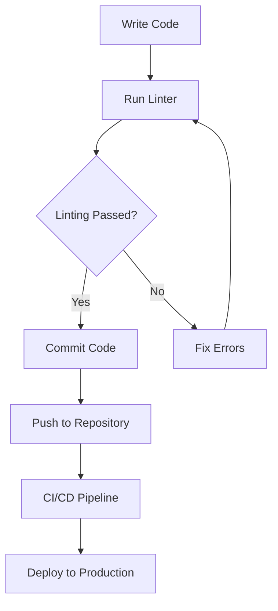

## 3.12 Effective Use of Linters (ESLint, JSHint)

### Introduction to Linters

Linters are essential tools in modern web development that help maintain code quality by enforcing coding standards and catching common errors. They analyze your code for potential issues, ensuring that it adheres to predefined coding guidelines. By integrating linters into your development workflow, you can significantly reduce bugs, improve code readability, and maintain consistency across your codebase.

### Popular JavaScript Linters

#### ESLint

[ESLint](https://eslint.org/) is a highly configurable and popular linter for JavaScript. It supports a wide range of rules and plugins, making it suitable for various coding styles and environments. ESLint's flexibility allows developers to define custom rules and integrate seamlessly with modern development tools.

#### JSHint

[JSHint](https://jshint.com/) is another widely used linter that focuses on detecting potential errors and enforcing coding conventions. While it is less configurable than ESLint, JSHint is known for its simplicity and ease of use, making it a good choice for smaller projects or teams with straightforward coding standards.

### Why Use Linters?

- **Error Detection**: Linters catch syntax errors, potential bugs, and anti-patterns early in the development process.
- **Code Consistency**: By enforcing coding standards, linters ensure that code is consistent across different developers and teams.
- **Improved Readability**: Consistent code is easier to read and understand, reducing the cognitive load on developers.
- **Reduced Technical Debt**: Regular use of linters helps prevent the accumulation of technical debt by maintaining code quality over time.

### Installing and Configuring ESLint

To get started with ESLint, follow these steps:

#### Step 1: Install ESLint

First, ensure you have Node.js and npm installed on your system. Then, install ESLint using npm:

```bash
npm install eslint --save-dev
```

#### Step 2: Initialize ESLint

Initialize ESLint in your project by running the following command:

```bash
npx eslint --init
```

This command will prompt you to answer a series of questions to set up your ESLint configuration. You can choose a popular style guide, such as Airbnb or Google, or customize your own rules.

#### Step 3: Configure ESLint

ESLint configuration is stored in a `.eslintrc` file. Here's an example configuration:

```json
{
  "env": {
    "browser": true,
    "es2021": true
  },
  "extends": "eslint:recommended",
  "parserOptions": {
    "ecmaVersion": 12,
    "sourceType": "module"
  },
  "rules": {
    "indent": ["error", 2],
    "linebreak-style": ["error", "unix"],
    "quotes": ["error", "double"],
    "semi": ["error", "always"]
  }
}
```

- **env**: Specifies the environments your code is designed to run in.
- **extends**: Allows you to extend configurations from other sources.
- **parserOptions**: Defines the ECMAScript version and module type.
- **rules**: Customizes specific linting rules.

### Customizing ESLint Rules

ESLint allows you to customize rules to fit your coding standards. You can enable, disable, or modify the severity of rules by editing your `.eslintrc` file. For example, to enforce single quotes instead of double quotes, modify the `quotes` rule:

```json
"quotes": ["error", "single"]
```

### Integrating ESLint with Code Editors

Most modern code editors, such as Visual Studio Code, Atom, and Sublime Text, support ESLint integration. This allows you to see linting errors and warnings directly in your editor as you write code.

#### Visual Studio Code Integration

1. Install the ESLint extension from the Visual Studio Code marketplace.
2. Open your project in Visual Studio Code.
3. ESLint will automatically detect your configuration and highlight issues in your code.

### Using JSHint

JSHint is another option for linting JavaScript code. It is simpler than ESLint and may be suitable for projects with less complex requirements.

#### Installing JSHint

Install JSHint using npm:

```bash
npm install jshint --save-dev
```

#### Configuring JSHint

Create a `.jshintrc` file in your project directory to configure JSHint:

```json
{
  "esversion": 6,
  "curly": true,
  "eqeqeq": true,
  "undef": true,
  "unused": true,
  "node": true
}
```

- **esversion**: Specifies the ECMAScript version.
- **curly**: Enforces the use of curly braces for all control statements.
- **eqeqeq**: Requires the use of `===` and `!==`.
- **undef**: Warns about the use of undeclared variables.
- **unused**: Warns about variables that are declared but not used.

### Integrating Linters into Continuous Integration Pipelines

Integrating linters into your continuous integration (CI) pipeline ensures that code quality checks are automated and consistent. This helps catch errors before they reach production and maintains high coding standards across your team.

#### Example CI Integration with GitHub Actions

Here's an example of how to integrate ESLint into a GitHub Actions workflow:

```yaml
name: Lint Code Base

on: [push, pull_request]

jobs:
  lint:
    runs-on: ubuntu-latest

    steps:
    - uses: actions/checkout@v2
    - name: Install Node.js
      uses: actions/setup-node@v2
      with:
        node-version: '14'
    - run: npm install
    - run: npx eslint .
```

This workflow runs ESLint on every push and pull request, ensuring that code adheres to your linting rules before being merged.

### Visualizing Linter Workflow

Below is a diagram illustrating how linters fit into the development workflow:



**Caption**: This diagram shows the integration of linters into the development workflow, highlighting their role in maintaining code quality before deployment.

### Key Takeaways

- Linters like ESLint and JSHint are crucial for maintaining code quality and consistency.
- ESLint offers extensive configurability and integration with modern development tools.
- JSHint provides a simpler alternative for projects with straightforward requirements.
- Integrating linters into CI pipelines ensures automated and consistent code quality checks.

### Try It Yourself

Experiment with the provided ESLint configuration by modifying rules and observing the changes in linting behavior. Try integrating ESLint into a simple project and run it through a CI pipeline to see how it catches errors before deployment.

### References and Further Reading

- [ESLint Documentation](https://eslint.org/docs/user-guide/getting-started)
- [JSHint Documentation](https://jshint.com/docs/)
- [MDN Web Docs on JavaScript](https://developer.mozilla.org/en-US/docs/Web/JavaScript)

### Knowledge Check

To reinforce your understanding of linters and their integration, try answering the following questions.

## Mastering JavaScript Linters: ESLint and JSHint Quiz



### What is the primary purpose of using linters in JavaScript development?

- [x] To enforce coding standards and catch common errors
- [ ] To compile JavaScript code into machine code
- [ ] To manage project dependencies
- [ ] To optimize code for performance

> **Explanation:** Linters are used to enforce coding standards and catch common errors, improving code quality and consistency.

### Which of the following is a popular JavaScript linter known for its configurability?

- [x] ESLint
- [ ] JSLint
- [ ] Prettier
- [ ] Babel

> **Explanation:** ESLint is known for its extensive configurability and support for custom rules and plugins.

### How do you initialize ESLint in a project?

- [x] By running `npx eslint --init`
- [ ] By creating a `.eslintignore` file
- [ ] By installing the ESLint extension in your code editor
- [ ] By writing a custom script

> **Explanation:** Running `npx eslint --init` initializes ESLint in a project, setting up the configuration file.

### What file is used to configure ESLint rules?

- [x] `.eslintrc`
- [ ] `package.json`
- [ ] `.eslintignore`
- [ ] `config.js`

> **Explanation:** The `.eslintrc` file is used to configure ESLint rules and settings.

### Which of the following is NOT a feature of JSHint?

- [ ] Detecting potential errors
- [ ] Enforcing coding conventions
- [x] Supporting plugins
- [ ] Providing warnings for undeclared variables

> **Explanation:** JSHint does not support plugins, unlike ESLint, which is highly extensible.

### How can you integrate ESLint with Visual Studio Code?

- [x] By installing the ESLint extension from the marketplace
- [ ] By writing a custom ESLint script
- [ ] By using the ESLint CLI
- [ ] By configuring ESLint in `package.json`

> **Explanation:** Installing the ESLint extension from the Visual Studio Code marketplace allows integration with the editor.

### What is the benefit of integrating linters into CI pipelines?

- [x] Automated and consistent code quality checks
- [ ] Faster code execution
- [ ] Reduced code size
- [ ] Improved code readability

> **Explanation:** Integrating linters into CI pipelines ensures automated and consistent code quality checks across the team.

### Which command installs ESLint as a development dependency?

- [x] `npm install eslint --save-dev`
- [ ] `npm install eslint`
- [ ] `npm install eslint --global`
- [ ] `npm install eslint --production`

> **Explanation:** The `--save-dev` flag installs ESLint as a development dependency.

### What does the `extends` property in `.eslintrc` do?

- [x] It allows extending configurations from other sources
- [ ] It specifies the ECMAScript version
- [ ] It defines custom linting rules
- [ ] It sets the environment for the code

> **Explanation:** The `extends` property allows extending configurations from other sources, such as popular style guides.

### True or False: JSHint is more configurable than ESLint.

- [ ] True
- [x] False

> **Explanation:** False. ESLint is more configurable than JSHint, offering extensive support for custom rules and plugins.



Remember, this is just the beginning. As you progress, you'll build more complex and interactive web pages. Keep experimenting, stay curious, and enjoy the journey!
