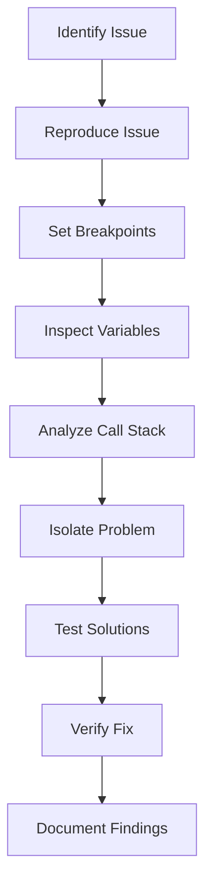

## 3.13 Debugging Techniques

Debugging is an essential skill for any JavaScript developer. It involves identifying and resolving errors or bugs in your code to ensure it functions as intended. In this section, we will explore various debugging techniques, tools, and best practices that can help you become more efficient and effective in your debugging efforts.

### Introduction to Debugging Tools

Before diving into specific techniques, it's crucial to familiarize yourself with the tools available for debugging JavaScript. The two primary environments you'll encounter are the browser and Node.js.

#### Browser Developer Tools

Modern web browsers come equipped with powerful developer tools that provide a suite of features for debugging JavaScript.

- **Chrome DevTools**: A comprehensive set of tools for web developers built directly into the Google Chrome browser. It includes features like the Elements panel for inspecting HTML and CSS, the Console for executing JavaScript, and the Sources panel for debugging JavaScript code.

- **Firefox Developer Tools**: Similar to Chrome DevTools, Firefox offers a robust set of tools for web development, including a JavaScript debugger, network monitor, and performance analysis tools.

#### Node.js Debugger

For server-side JavaScript, Node.js provides a built-in debugger that allows you to inspect and debug your code. Additionally, tools like [ndb](https://github.com/GoogleChromeLabs/ndb) offer a more user-friendly interface for debugging Node.js applications.

### Setting Breakpoints and Stepping Through Code

Breakpoints are a fundamental feature of any debugger, allowing you to pause the execution of your code at specific points to inspect its state.

#### Setting Breakpoints

To set a breakpoint in Chrome DevTools:

1. Open the **Sources** panel.
2. Navigate to the JavaScript file you want to debug.
3. Click on the line number where you want to set the breakpoint.

Once a breakpoint is set, the execution will pause at that line, allowing you to inspect variables and the call stack.

#### Stepping Through Code

When execution is paused at a breakpoint, you can step through your code line by line:

- **Step Over**: Execute the current line and move to the next one.
- **Step Into**: Dive into a function call to see its execution.
- **Step Out**: Exit the current function and return to the caller.

These controls help you understand the flow of your program and identify where things might be going wrong.

### Inspecting Variables and the Call Stack

When debugging, it's crucial to inspect the values of variables and understand the call stack to determine the state of your application.

#### Inspecting Variables

In Chrome DevTools, when execution is paused, you can view the current values of variables in the **Scope** section. This section displays local, closure, and global variables, allowing you to see their current state.

#### Understanding the Call Stack

The **Call Stack** panel shows the sequence of function calls that led to the current breakpoint. This information is invaluable for tracing the execution path and understanding how your code reached its current state.

### Advanced Debugging Features

Beyond basic breakpoints and variable inspection, modern debuggers offer advanced features that can significantly enhance your debugging capabilities.

#### Conditional Breakpoints

Conditional breakpoints allow you to pause execution only when a specific condition is met. This feature is useful when you want to debug a particular scenario without stopping at every iteration of a loop.

To set a conditional breakpoint in Chrome DevTools:

1. Right-click on the line number where you want to set the breakpoint.
2. Select **Add conditional breakpoint**.
3. Enter the condition that must be true for the breakpoint to activate.

#### Watch Expressions

Watch expressions let you monitor specific variables or expressions as your code executes. You can add watch expressions in the **Watch** panel of Chrome DevTools, and they will update in real-time as you step through your code.

### Debugging Asynchronous Code

JavaScript's asynchronous nature can make debugging challenging, as errors may not manifest until after the initial execution context has completed.

#### Handling Promises

When debugging promises, it's helpful to use the **async/await** syntax, which allows you to write asynchronous code in a synchronous style. This approach makes it easier to set breakpoints and step through asynchronous operations.

#### Debugging Callbacks

For callback-based asynchronous code, consider using the **async_hooks** module in Node.js to track asynchronous operations. This module provides hooks for monitoring the lifecycle of asynchronous resources, helping you trace the flow of your code.

### Common Debugging Issues and Solutions

#### Console Logging vs. Debugging

While console logging is a common debugging technique, it can clutter your code and make it harder to maintain. Instead, use breakpoints and the debugger to inspect your code without modifying it.

#### Dealing with Minified Code

When working with minified code, use source maps to map the minified code back to its original source. Most modern build tools generate source maps automatically, and browsers can use them to display the original code in the debugger.

### Best Practices for Debugging

- **Reproduce the Issue**: Ensure you can consistently reproduce the issue before attempting to debug it. This consistency will help you verify that your fix resolves the problem.

- **Isolate the Problem**: Narrow down the scope of the issue by isolating the problematic code. This approach makes it easier to identify the root cause and test potential solutions.

- **Use Version Control**: Keep your code under version control to track changes and revert to previous versions if necessary. This practice is invaluable when debugging complex issues.

- **Document Your Findings**: As you debug, document your findings and solutions. This documentation can help you and your team understand the issue and prevent similar problems in the future.

### Try It Yourself

To practice debugging, try modifying the following code example to introduce a bug, then use the techniques discussed to identify and fix it.

```javascript
// Sample code to debug
function fetchData(url) {
    fetch(url)
        .then(response => response.json())
        .then(data => {
            console.log(data);
        })
        .catch(error => {
            console.error('Error fetching data:', error);
        });
}

// Introduce a bug by using an incorrect URL
fetchData('https://api.example.com/data');
```

### Visualizing the Debugging Process

Below is a flowchart that illustrates the typical debugging process, from identifying an issue to verifying the fix.



### References and Further Reading

- [MDN Web Docs: Debugging JavaScript](https://developer.mozilla.org/en-US/docs/Learn/JavaScript/First_steps/What_went_wrong)
- [Google Chrome DevTools](https://developers.google.com/web/tools/chrome-devtools)
- [Node.js Debugging Guide](https://nodejs.org/en/docs/guides/debugging-getting-started/)

### Knowledge Check

To reinforce your understanding of debugging techniques, try answering the following questions.

## Debugging Techniques Quiz



### What is the primary purpose of setting breakpoints in a debugger?

- [x] To pause execution and inspect the state of the program
- [ ] To automatically fix errors in the code
- [ ] To improve the performance of the code
- [ ] To compile the code into machine language

> **Explanation:** Breakpoints allow developers to pause execution at specific points to inspect variables and the call stack, helping them understand the program's state.

### Which tool is recommended for debugging Node.js applications?

- [ ] Chrome DevTools
- [x] Node.js debugger
- [ ] Firefox Developer Tools
- [ ] Internet Explorer Developer Tools

> **Explanation:** The Node.js debugger is specifically designed for debugging Node.js applications, providing features tailored to server-side JavaScript.

### What is a conditional breakpoint?

- [x] A breakpoint that activates only when a specified condition is met
- [ ] A breakpoint that pauses execution at every line of code
- [ ] A breakpoint that automatically logs variable values
- [ ] A breakpoint that skips over function calls

> **Explanation:** Conditional breakpoints allow developers to specify conditions under which the breakpoint should activate, making debugging more efficient.

### How can you monitor specific variables or expressions during debugging?

- [ ] By using console.log statements
- [ ] By setting multiple breakpoints
- [x] By using watch expressions
- [ ] By inspecting the call stack

> **Explanation:** Watch expressions allow developers to monitor specific variables or expressions in real-time as they step through their code.

### What is the benefit of using async/await syntax for debugging promises?

- [x] It allows writing asynchronous code in a synchronous style
- [ ] It automatically resolves all promises
- [ ] It eliminates the need for breakpoints
- [ ] It improves code performance

> **Explanation:** The async/await syntax makes asynchronous code easier to read and debug by allowing it to be written in a synchronous style.

### Why is it important to reproduce an issue before debugging?

- [x] To ensure the issue can be consistently observed and tested
- [ ] To automatically generate a fix for the issue
- [ ] To improve the performance of the application
- [ ] To compile the code into machine language

> **Explanation:** Reproducing an issue ensures that it can be consistently observed, making it easier to test potential solutions and verify fixes.

### What is the purpose of source maps in debugging?

- [x] To map minified code back to its original source
- [ ] To automatically fix errors in the code
- [ ] To improve the performance of the code
- [ ] To compile the code into machine language

> **Explanation:** Source maps allow developers to view the original source code in the debugger, even when working with minified code.

### What should you do after successfully debugging an issue?

- [ ] Delete all debugging tools
- [ ] Ignore the issue and move on
- [x] Document your findings and solutions
- [ ] Revert to a previous version of the code

> **Explanation:** Documenting findings and solutions helps prevent similar issues in the future and provides valuable information for the development team.

### True or False: Console logging is always the best method for debugging JavaScript code.

- [ ] True
- [x] False

> **Explanation:** While console logging can be useful, it can clutter code and make it harder to maintain. Using a debugger with breakpoints and variable inspection is often more effective.

### What is the role of the call stack in debugging?

- [x] To show the sequence of function calls leading to the current breakpoint
- [ ] To automatically fix errors in the code
- [ ] To improve the performance of the code
- [ ] To compile the code into machine language

> **Explanation:** The call stack provides a trace of function calls, helping developers understand how the program reached its current state.



Remember, debugging is a skill that improves with practice. As you continue to develop your JavaScript applications, these techniques and tools will become invaluable in ensuring your code is robust and error-free. Keep experimenting, stay curious, and enjoy the journey!
