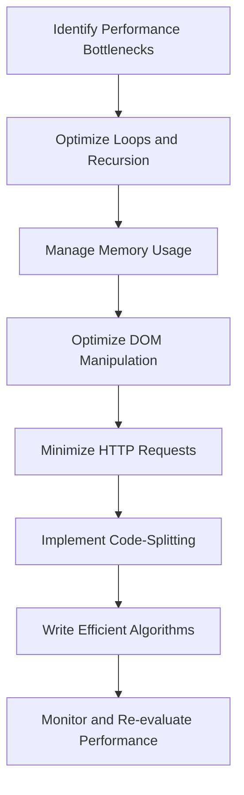

## 3.14 Performance Optimization Tips

In the world of modern web development, performance optimization is crucial for delivering fast and responsive applications. JavaScript, being a core technology for web development, plays a significant role in the performance of web applications. In this section, we will explore various techniques and tools to optimize JavaScript performance, ensuring your applications run smoothly and efficiently.

### Profiling Tools to Identify Performance Bottlenecks

Before optimizing your code, it's essential to identify where the bottlenecks are. Profiling tools help you analyze the performance of your JavaScript code and pinpoint areas that need improvement.

#### Chrome DevTools

Chrome DevTools is a powerful set of web developer tools built directly into the Google Chrome browser. It provides a comprehensive suite of features for profiling JavaScript performance.

- **Performance Panel**: Use the Performance panel to record and analyze runtime performance. It helps you understand where your application spends the most time and how to optimize it.
- **Memory Panel**: The Memory panel allows you to profile memory usage and detect memory leaks, which can degrade performance over time.

#### Node.js Profiler

For server-side JavaScript, the Node.js Profiler is an invaluable tool. It provides insights into CPU usage and memory allocation, helping you optimize server-side code.

#### Lighthouse

Lighthouse is an open-source, automated tool for improving the quality of web pages. It provides performance audits and suggestions for optimization.

### Optimizing Loops and Recursion

Loops and recursion are fundamental constructs in programming, but they can also be performance bottlenecks if not used efficiently.

#### Use Efficient Loop Constructs

- **Avoid `for...in` for Arrays**: Use `for...of` or traditional `for` loops for iterating over arrays, as `for...in` iterates over all enumerable properties, not just array elements.
- **Use Array Methods**: Methods like `map`, `filter`, and `reduce` are optimized for performance and can be more efficient than manual loops.

#### Optimize Recursive Functions

Recursive functions can lead to stack overflow errors if not optimized. Use techniques like memoization to cache results of expensive function calls and avoid redundant calculations.

```javascript
// Example of memoization in a recursive function
const memoizedFactorial = (() => {
  const cache = {};
  return function factorial(n) {
    if (n in cache) {
      return cache[n];
    } else {
      if (n === 0) {
        cache[n] = 1;
      } else {
        cache[n] = n * factorial(n - 1);
      }
      return cache[n];
    }
  };
})();

console.log(memoizedFactorial(5)); // Output: 120
```

### Memory Usage and Garbage Collection

Efficient memory management is crucial for optimizing JavaScript performance. Understanding how garbage collection works and minimizing memory leaks can significantly enhance performance.

#### Minimize Memory Leaks

Memory leaks occur when objects are no longer needed but are not released. Common causes include:

- **Uncleared Timers**: Ensure timers are cleared using `clearTimeout` or `clearInterval`.
- **Detached DOM Elements**: Remove event listeners from DOM elements before they are removed from the document.

#### Optimize Garbage Collection

Garbage collection is the process of reclaiming memory occupied by objects that are no longer in use. While JavaScript engines handle garbage collection automatically, you can optimize it by:

- **Reducing Object Creation**: Reuse objects instead of creating new ones whenever possible.
- **Avoiding Global Variables**: Global variables are not easily garbage collected. Use local variables and closures to limit scope.

### DOM Manipulation and Repaint/Reflow

DOM manipulation is one of the most expensive operations in web development. Optimizing how you interact with the DOM can lead to significant performance improvements.

#### Minimize Reflows and Repaints

Reflows and repaints are costly operations that occur when the layout or appearance of a web page changes.

- **Batch DOM Updates**: Make all DOM changes at once to minimize reflows.
- **Use Document Fragments**: When adding multiple elements, use a document fragment to batch updates.

```javascript
// Example of using document fragment to minimize reflows
const fragment = document.createDocumentFragment();
for (let i = 0; i < 100; i++) {
  const div = document.createElement('div');
  div.textContent = `Item ${i}`;
  fragment.appendChild(div);
}
document.body.appendChild(fragment);
```

#### Optimize CSS for Performance

CSS can also impact JavaScript performance. Use efficient selectors and minimize the use of complex CSS rules to reduce the impact on JavaScript execution.

### Minimizing HTTP Requests and Optimizing Assets

Reducing the number of HTTP requests and optimizing assets can significantly improve load times and overall performance.

#### Minimize HTTP Requests

- **Combine Files**: Combine multiple JavaScript and CSS files into a single file to reduce HTTP requests.
- **Use Image Sprites**: Combine multiple images into a single sprite to reduce the number of image requests.

#### Optimize Assets

- **Compress Images**: Use tools like ImageOptim or TinyPNG to compress images without losing quality.
- **Minify JavaScript and CSS**: Use tools like UglifyJS and CSSNano to minify code and reduce file size.

### Code-Splitting and Lazy Loading

Code-splitting and lazy loading are techniques for optimizing the delivery of JavaScript code, especially in large applications.

#### Implement Code-Splitting

Code-splitting allows you to split your code into smaller chunks that can be loaded on demand, reducing initial load time.

- **Webpack**: Use Webpack's dynamic imports to implement code-splitting.

```javascript
// Example of dynamic import for code-splitting
import('./module.js').then(module => {
  module.doSomething();
});
```

#### Use Lazy Loading

Lazy loading defers the loading of non-essential resources until they are needed, improving initial load time.

- **Images**: Use the `loading="lazy"` attribute for images to defer loading until they are in the viewport.
- **JavaScript Modules**: Load JavaScript modules only when they are needed.

### Writing Efficient Algorithms

Efficient algorithms are the backbone of performance optimization. Writing algorithms with optimal time and space complexity can significantly enhance performance.

#### Analyze Algorithm Complexity

- **Time Complexity**: Aim for algorithms with lower time complexity, such as O(n) or O(log n), to improve performance.
- **Space Complexity**: Optimize space usage to reduce memory consumption.

#### Use Efficient Data Structures

Choosing the right data structure can have a significant impact on performance. Use data structures that provide efficient operations for your specific use case.

### Visualizing JavaScript Performance Optimization

To better understand the impact of these optimization techniques, let's visualize the process of optimizing JavaScript performance using a flowchart.



**Figure 1**: A flowchart illustrating the process of optimizing JavaScript performance.

### References and Links

For further reading and deeper dives into JavaScript performance optimization, consider the following resources:

- [MDN Web Docs: JavaScript Performance](https://developer.mozilla.org/en-US/docs/Web/JavaScript/Performance)
- [Google Developers: Optimize JavaScript Execution](https://developers.google.com/web/fundamentals/performance/optimizing-javascript)
- [Lighthouse: Performance Audits](https://developers.google.com/web/tools/lighthouse)

### Knowledge Check

To reinforce your understanding of JavaScript performance optimization, consider the following questions and exercises:

1. What are the benefits of using profiling tools like Chrome DevTools for performance optimization?
2. How can memoization improve the performance of recursive functions?
3. Why is it important to minimize reflows and repaints in DOM manipulation?
4. Describe the impact of minimizing HTTP requests on web application performance.
5. How does code-splitting improve the performance of large JavaScript applications?

### Embrace the Journey

Remember, performance optimization is an ongoing process. As you continue to develop and refine your applications, keep exploring new techniques and tools to enhance performance. Stay curious, experiment with different approaches, and enjoy the journey of creating fast and efficient web applications!

## Quiz: Mastering JavaScript Performance Optimization



### What is the primary purpose of using profiling tools like Chrome DevTools?

- [x] To identify performance bottlenecks in JavaScript code
- [ ] To write new JavaScript code
- [ ] To manage HTTP requests
- [ ] To optimize CSS styles

> **Explanation:** Profiling tools like Chrome DevTools help identify performance bottlenecks, allowing developers to optimize their JavaScript code effectively.

### Which loop construct is generally more efficient for iterating over arrays?

- [x] `for...of`
- [ ] `for...in`
- [ ] `while`
- [ ] `do...while`

> **Explanation:** The `for...of` loop is more efficient for iterating over arrays because it iterates over the values directly, unlike `for...in`, which iterates over all enumerable properties.

### What is a common cause of memory leaks in JavaScript?

- [x] Uncleared timers
- [ ] Using `const` for variables
- [ ] Using `let` for variables
- [ ] Using `var` for variables

> **Explanation:** Uncleared timers can cause memory leaks because they keep references to objects that may no longer be needed.

### How can you minimize reflows and repaints in DOM manipulation?

- [x] Batch DOM updates
- [ ] Use `for...in` loops
- [ ] Use global variables
- [ ] Avoid using CSS

> **Explanation:** Batching DOM updates minimizes reflows and repaints by reducing the number of times the layout is recalculated.

### What is the benefit of using code-splitting in JavaScript applications?

- [x] Reduces initial load time by loading code on demand
- [ ] Increases the size of JavaScript files
- [ ] Decreases the performance of the application
- [ ] Makes debugging more difficult

> **Explanation:** Code-splitting reduces initial load time by loading only the necessary code on demand, improving performance.

### What is lazy loading primarily used for?

- [x] Deferring the loading of non-essential resources
- [ ] Loading all resources at once
- [ ] Increasing the size of images
- [ ] Decreasing the size of JavaScript files

> **Explanation:** Lazy loading defers the loading of non-essential resources until they are needed, improving initial load time.

### Which data structure is generally more efficient for storing unique values?

- [x] Set
- [ ] Array
- [ ] Object
- [ ] Map

> **Explanation:** A `Set` is more efficient for storing unique values because it automatically handles duplicates.

### What is the impact of using efficient algorithms in JavaScript?

- [x] Enhances performance by reducing time and space complexity
- [ ] Increases memory usage
- [ ] Decreases code readability
- [ ] Makes code harder to maintain

> **Explanation:** Efficient algorithms enhance performance by optimizing time and space complexity, making applications faster and more efficient.

### What is a key strategy for optimizing memory usage in JavaScript?

- [x] Reuse objects instead of creating new ones
- [ ] Use global variables extensively
- [ ] Avoid using closures
- [ ] Use `var` for all variables

> **Explanation:** Reusing objects instead of creating new ones reduces memory usage and optimizes garbage collection.

### True or False: Code-splitting can help improve the performance of JavaScript applications.

- [x] True
- [ ] False

> **Explanation:** Code-splitting improves performance by reducing the initial load time and loading code on demand.


