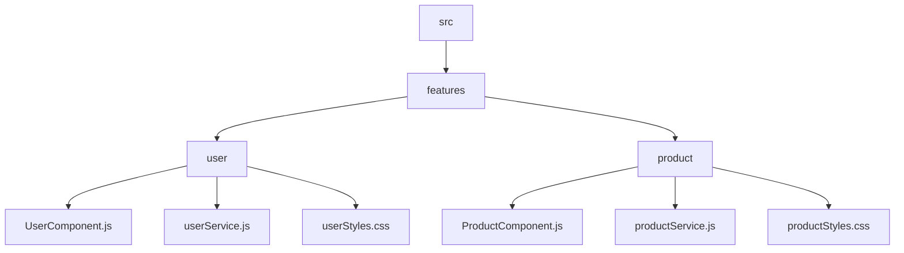

## 3.15 Best Practices in Code Organization

In the realm of JavaScript development, organizing code effectively is paramount for creating scalable and maintainable applications. As projects grow in complexity, a well-structured codebase can significantly enhance productivity, reduce errors, and facilitate collaboration among developers. This section delves into best practices for organizing JavaScript code, focusing on modularization, separation of concerns, and maintainability.

### Organizing Code into Modules and Components

**Modularization** is a fundamental concept in software development that involves breaking down a program into smaller, manageable, and reusable pieces called modules. In JavaScript, modules can be implemented using ES6 modules, CommonJS, or AMD. Let's explore how to effectively organize code into modules and components.

#### ES6 Modules

ES6 introduced a native module system that allows developers to export and import functionalities across different files. This system promotes encapsulation and reusability.

```javascript
// mathUtils.js
export function add(a, b) {
  return a + b;
}

export function subtract(a, b) {
  return a - b;
}

// main.js
import { add, subtract } from './mathUtils.js';

console.log(add(5, 3)); // Output: 8
console.log(subtract(5, 3)); // Output: 2
```

**Key Points:**
- **Encapsulation**: Modules encapsulate functionality, reducing the risk of variable and function name collisions.
- **Reusability**: Functions and variables can be reused across different parts of the application.
- **Maintainability**: Changes in one module do not affect others, making maintenance easier.

#### CommonJS and AMD

While ES6 modules are the standard for modern JavaScript, CommonJS and AMD are still prevalent in Node.js and legacy codebases.

**CommonJS Example:**

```javascript
// mathUtils.js
function add(a, b) {
  return a + b;
}

function subtract(a, b) {
  return a - b;
}

module.exports = { add, subtract };

// main.js
const { add, subtract } = require('./mathUtils');

console.log(add(5, 3)); // Output: 8
console.log(subtract(5, 3)); // Output: 2
```

**AMD Example:**

```javascript
// mathUtils.js
define([], function() {
  function add(a, b) {
    return a + b;
  }

  function subtract(a, b) {
    return a - b;
  }

  return {
    add: add,
    subtract: subtract
  };
});

// main.js
require(['mathUtils'], function(mathUtils) {
  console.log(mathUtils.add(5, 3)); // Output: 8
  console.log(mathUtils.subtract(5, 3)); // Output: 2
});
```

### Principles of Code Organization

#### Separation of Concerns

**Separation of Concerns (SoC)** is a design principle that encourages dividing a program into distinct sections, each addressing a separate concern. This principle enhances code readability and maintainability.

**Example:**

Consider a web application with separate modules for data fetching, UI rendering, and event handling.

```javascript
// dataService.js
export async function fetchData(url) {
  const response = await fetch(url);
  return response.json();
}

// uiRenderer.js
export function renderUI(data) {
  const container = document.getElementById('app');
  container.innerHTML = `<p>${data.message}</p>`;
}

// eventHandler.js
import { fetchData } from './dataService.js';
import { renderUI } from './uiRenderer.js';

document.getElementById('fetchButton').addEventListener('click', async () => {
  const data = await fetchData('https://api.example.com/data');
  renderUI(data);
});
```

**Benefits:**
- **Readability**: Each module has a clear responsibility, making the code easier to understand.
- **Maintainability**: Changes in one module do not affect others, reducing the risk of introducing bugs.

#### DRY (Don't Repeat Yourself)

The **DRY principle** emphasizes reducing repetition in code by abstracting common functionalities into reusable components or functions.

**Example:**

Instead of repeating similar code blocks, create a utility function.

```javascript
// utility.js
export function formatCurrency(amount) {
  return `$${amount.toFixed(2)}`;
}

// main.js
import { formatCurrency } from './utility.js';

console.log(formatCurrency(19.99)); // Output: $19.99
console.log(formatCurrency(5)); // Output: $5.00
```

**Benefits:**
- **Efficiency**: Reduces code duplication, making the codebase more efficient.
- **Maintainability**: Changes to the utility function automatically propagate to all usages.

### Strategies for File and Folder Structures

Organizing files and folders effectively is crucial for managing larger projects. Here are some strategies to consider:

#### Feature-Based Structure

Organize files by feature or functionality, grouping related components, services, and styles together.

```
/src
  /features
    /user
      UserComponent.js
      userService.js
      userStyles.css
    /product
      ProductComponent.js
      productService.js
      productStyles.css
```

**Benefits:**
- **Cohesion**: Related files are grouped together, making it easier to locate and manage code.
- **Scalability**: New features can be added without disrupting existing structures.

#### Layered Structure

Organize files by layer, such as presentation, business logic, and data access.

```
/src
  /presentation
    UserComponent.js
    ProductComponent.js
  /business
    userService.js
    productService.js
  /data
    apiClient.js
```

**Benefits:**
- **Separation of Concerns**: Each layer has a distinct responsibility, promoting clean architecture.
- **Maintainability**: Changes in one layer do not affect others, reducing the risk of errors.

### Consistent Naming Conventions and Code Documentation

Adopting consistent naming conventions and thorough documentation is essential for code readability and collaboration.

#### Naming Conventions

- **Variables and Functions**: Use camelCase for variables and functions (e.g., `fetchData`, `userProfile`).
- **Classes and Components**: Use PascalCase for classes and components (e.g., `UserComponent`, `ProductService`).
- **Constants**: Use UPPER_CASE for constants (e.g., `MAX_USERS`, `API_URL`).

#### Code Documentation

- **Comments**: Use comments to explain complex logic or important decisions.
- **JSDoc**: Use JSDoc annotations for documenting functions, parameters, and return types.

```javascript
/**
 * Fetches data from the specified URL.
 * @param {string} url - The URL to fetch data from.
 * @returns {Promise<Object>} The fetched data.
 */
export async function fetchData(url) {
  const response = await fetch(url);
  return response.json();
}
```

### Refactoring and Continuous Improvement

**Refactoring** involves restructuring existing code without changing its external behavior. It is a crucial practice for maintaining code quality and adapting to changing requirements.

#### Benefits of Refactoring

- **Improved Readability**: Clean and well-organized code is easier to read and understand.
- **Enhanced Performance**: Optimizing code can lead to better performance and resource utilization.
- **Reduced Technical Debt**: Regular refactoring helps manage technical debt, preventing it from accumulating over time.

#### Continuous Improvement

Adopt a mindset of continuous improvement by regularly reviewing and optimizing code. Encourage team members to suggest improvements and share best practices.

### Visualizing Code Organization

To better understand code organization, let's visualize a typical feature-based folder structure using a Mermaid.js diagram.



**Diagram Description:** This diagram illustrates a feature-based folder structure, where each feature (user, product) contains its components, services, and styles.

### References and Links

- [MDN Web Docs: Modules](https://developer.mozilla.org/en-US/docs/Web/JavaScript/Guide/Modules)
- [JavaScript Design Patterns](https://www.patterns.dev/posts/classic-design-patterns/)
- [JSDoc Documentation](https://jsdoc.app/)

### Knowledge Check

- What are the benefits of using ES6 modules in JavaScript?
- How does the DRY principle improve code maintainability?
- What are the advantages of a feature-based folder structure?
- Why is it important to use consistent naming conventions?
- How does refactoring contribute to continuous improvement?

### Embrace the Journey

Remember, mastering code organization is a continuous journey. As you apply these best practices, you'll find your code becoming more scalable, maintainable, and enjoyable to work with. Keep experimenting, stay curious, and enjoy the process of crafting clean and efficient JavaScript applications!

## Mastering JavaScript Code Organization



### What is the primary benefit of using ES6 modules?

- [x] Encapsulation and reusability
- [ ] Faster execution
- [ ] Reduced file size
- [ ] Improved syntax

> **Explanation:** ES6 modules promote encapsulation and reusability by allowing developers to export and import functionalities across different files.

### Which principle emphasizes reducing code duplication?

- [ ] Separation of Concerns
- [x] DRY (Don't Repeat Yourself)
- [ ] KISS (Keep It Simple, Stupid)
- [ ] YAGNI (You Aren't Gonna Need It)

> **Explanation:** The DRY principle focuses on reducing code duplication by abstracting common functionalities into reusable components or functions.

### What is a key advantage of a feature-based folder structure?

- [x] Cohesion of related files
- [ ] Faster compilation
- [ ] Easier debugging
- [ ] Reduced memory usage

> **Explanation:** A feature-based folder structure groups related files together, enhancing cohesion and making it easier to locate and manage code.

### What naming convention is typically used for constants?

- [ ] camelCase
- [ ] PascalCase
- [x] UPPER_CASE
- [ ] snake_case

> **Explanation:** Constants are typically named using UPPER_CASE to distinguish them from variables and functions.

### How does refactoring benefit a codebase?

- [x] Improves readability
- [ ] Increases file size
- [x] Enhances performance
- [ ] Reduces functionality

> **Explanation:** Refactoring improves readability and can enhance performance by optimizing code without changing its external behavior.

### What is the purpose of JSDoc annotations?

- [x] Documenting functions and parameters
- [ ] Reducing file size
- [ ] Improving execution speed
- [ ] Simplifying syntax

> **Explanation:** JSDoc annotations are used to document functions, parameters, and return types, enhancing code readability and maintainability.

### Which of the following is a benefit of continuous improvement?

- [x] Reduced technical debt
- [ ] Increased complexity
- [ ] Slower development
- [ ] Higher costs

> **Explanation:** Continuous improvement helps reduce technical debt by regularly reviewing and optimizing code, preventing it from accumulating over time.

### What is a key benefit of separation of concerns?

- [x] Enhanced code readability
- [ ] Faster execution
- [ ] Reduced file size
- [ ] Improved syntax

> **Explanation:** Separation of concerns enhances code readability by dividing a program into distinct sections, each addressing a separate concern.

### Why is it important to use consistent naming conventions?

- [x] Improves code readability
- [ ] Increases file size
- [ ] Enhances execution speed
- [ ] Simplifies syntax

> **Explanation:** Consistent naming conventions improve code readability by making it easier for developers to understand and navigate the codebase.

### True or False: Refactoring changes the external behavior of code.

- [ ] True
- [x] False

> **Explanation:** Refactoring involves restructuring existing code without changing its external behavior, focusing on improving code quality and maintainability.


