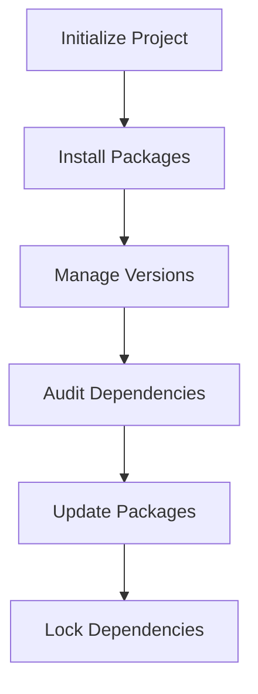

## 3.16 Dependency Management with npm and Yarn

In modern web development, managing dependencies efficiently is crucial for maintaining robust and scalable applications. Two of the most popular tools for this task in the JavaScript ecosystem are npm (Node Package Manager) and Yarn. Both tools offer a range of features to help developers manage project dependencies, automate tasks, and ensure consistent builds.

### Understanding npm and Yarn

#### What is npm?

npm, short for Node Package Manager, is the default package manager for Node.js. It allows developers to install, share, and manage code packages, which are collections of reusable code. npm is the largest software registry in the world, hosting millions of packages that can be easily integrated into your projects.

#### What is Yarn?

Yarn is an alternative package manager for JavaScript, developed by Facebook. It was created to address some of the shortcomings of npm, particularly around speed, reliability, and security. Yarn caches every package it downloads, which makes subsequent installs faster. It also ensures that the same package versions are installed across different environments, promoting consistency.

### Initializing a Project

Before you can manage dependencies, you need to initialize your project. Both npm and Yarn offer commands to set up a new project.

#### Using npm

To initialize a new project with npm, use the following command:

```bash
npm init
```

This command will prompt you to enter details about your project, such as its name, version, description, and entry point. Alternatively, you can use `npm init -y` to generate a `package.json` file with default values.

#### Using Yarn

Similarly, you can initialize a project with Yarn using:

```bash
yarn init
```

Like npm, Yarn will prompt you for project details. You can also use `yarn init -y` to skip the prompts and create a `package.json` with default settings.

### Installing Packages

Once your project is initialized, you can start installing packages. Both npm and Yarn provide commands to install packages locally (for use in your project) or globally (for use across your system).

#### Installing with npm

To install a package locally, use:

```bash
npm install <package-name>
```

For global installations, use:

```bash
npm install -g <package-name>
```

#### Installing with Yarn

With Yarn, the commands are slightly different:

```bash
yarn add <package-name>
```

For global installations:

```bash
yarn global add <package-name>
```

### Semantic Versioning

Semantic versioning (semver) is a versioning scheme that uses a three-part number format: MAJOR.MINOR.PATCH. It helps developers understand the impact of updates to dependencies.

- **MAJOR**: Incompatible API changes.
- **MINOR**: Backward-compatible functionality.
- **PATCH**: Backward-compatible bug fixes.

Both npm and Yarn use semver to manage package versions. You can specify version ranges in your `package.json` to control which versions of a package are acceptable.

### Differences Between npm and Yarn

While npm and Yarn serve similar purposes, they have some key differences:

- **Performance**: Yarn is generally faster than npm due to its caching mechanism and parallel installation process.
- **Lock Files**: Yarn uses `yarn.lock` to ensure consistent installs, while npm uses `package-lock.json`.
- **Offline Mode**: Yarn can install packages without an internet connection if they have been installed before.
- **Workspaces**: Yarn supports workspaces, allowing you to manage multiple packages within a single repository.

### Using `package.json` Scripts

The `package.json` file is the heart of your Node.js project. It not only lists your dependencies but also allows you to define scripts to automate tasks.

#### Example Scripts

```json
{
  "scripts": {
    "start": "node index.js",
    "test": "jest",
    "build": "webpack --config webpack.config.js"
  }
}
```

You can run these scripts using:

```bash
npm run <script-name>
```

or

```bash
yarn <script-name>
```

### Best Practices for Dependency Management

1. **Lock Your Dependencies**: Always commit your lock files (`package-lock.json` or `yarn.lock`) to version control to ensure consistent installs across environments.

2. **Regularly Update Dependencies**: Use tools like `npm outdated` or `yarn outdated` to check for outdated packages and update them regularly to benefit from security patches and new features.

3. **Use Semantic Versioning Wisely**: Specify version ranges in your `package.json` to avoid breaking changes.

4. **Audit for Vulnerabilities**: Regularly run `npm audit` or `yarn audit` to identify and fix security vulnerabilities in your dependencies.

5. **Avoid Global Dependencies**: Whenever possible, install packages locally to avoid version conflicts and ensure project portability.

### Security Considerations

Managing dependencies also involves ensuring the security of your application. Here are some tips:

- **Audit Dependencies**: Regularly audit your dependencies for known vulnerabilities.
- **Use Trusted Sources**: Only install packages from reputable sources and maintainers.
- **Review Code**: For critical packages, review the source code to ensure there are no malicious scripts.

### Visualizing Dependency Management

Below is a simple flowchart illustrating the process of managing dependencies with npm and Yarn:



### Conclusion

Dependency management is a critical aspect of modern JavaScript development. By mastering tools like npm and Yarn, you can ensure your projects are efficient, secure, and maintainable. Remember to regularly audit your dependencies, lock versions, and keep your packages up to date.

### Try It Yourself

Experiment with initializing a new project using both npm and Yarn. Try installing a few packages and explore the differences in lock files and installation speed. Modify the `package.json` scripts to automate a simple task, such as running a linter or a test suite.

### Knowledge Check

## Mastering npm and Yarn: Dependency Management Quiz



### What is the primary purpose of npm and Yarn?

- [x] Managing project dependencies
- [ ] Compiling JavaScript code
- [ ] Debugging JavaScript applications
- [ ] Hosting web applications

> **Explanation:** npm and Yarn are primarily used for managing project dependencies in JavaScript applications.

### Which command initializes a new project with npm?

- [x] `npm init`
- [ ] `npm start`
- [ ] `npm install`
- [ ] `npm run`

> **Explanation:** The `npm init` command is used to initialize a new project and create a `package.json` file.

### What is the purpose of a lock file in dependency management?

- [x] Ensuring consistent installs across environments
- [ ] Speeding up the installation process
- [ ] Reducing the size of the `node_modules` folder
- [ ] Providing detailed error messages

> **Explanation:** Lock files like `package-lock.json` and `yarn.lock` ensure that the same versions of dependencies are installed across different environments.

### Which versioning scheme do npm and Yarn use?

- [x] Semantic versioning
- [ ] Calendar versioning
- [ ] Random versioning
- [ ] Incremental versioning

> **Explanation:** npm and Yarn use semantic versioning, which follows the MAJOR.MINOR.PATCH format.

### How can you install a package globally using Yarn?

- [x] `yarn global add <package-name>`
- [ ] `yarn add <package-name>`
- [ ] `yarn install <package-name>`
- [ ] `yarn global install <package-name>`

> **Explanation:** The `yarn global add <package-name>` command installs a package globally.

### What is a best practice for managing dependencies?

- [x] Regularly update dependencies
- [ ] Avoid using lock files
- [ ] Install all packages globally
- [ ] Use random version numbers

> **Explanation:** Regularly updating dependencies helps ensure that you benefit from security patches and new features.

### Which command can be used to audit dependencies for vulnerabilities with npm?

- [x] `npm audit`
- [ ] `npm check`
- [ ] `npm verify`
- [ ] `npm secure`

> **Explanation:** The `npm audit` command checks for vulnerabilities in your project's dependencies.

### What is the benefit of using Yarn over npm?

- [x] Faster installation due to caching
- [ ] Larger package registry
- [ ] Better error messages
- [ ] More frequent updates

> **Explanation:** Yarn is generally faster than npm due to its caching mechanism and parallel installation process.

### True or False: Yarn can install packages without an internet connection if they have been installed before.

- [x] True
- [ ] False

> **Explanation:** Yarn's caching feature allows it to install packages offline if they have been previously installed.

### Which command is used to run a script defined in `package.json` using npm?

- [x] `npm run <script-name>`
- [ ] `npm execute <script-name>`
- [ ] `npm start <script-name>`
- [ ] `npm script <script-name>`

> **Explanation:** The `npm run <script-name>` command is used to execute scripts defined in the `package.json` file.



Remember, mastering dependency management is an ongoing journey. Keep exploring, stay updated with the latest tools and practices, and enjoy the process of building efficient and secure JavaScript applications!
