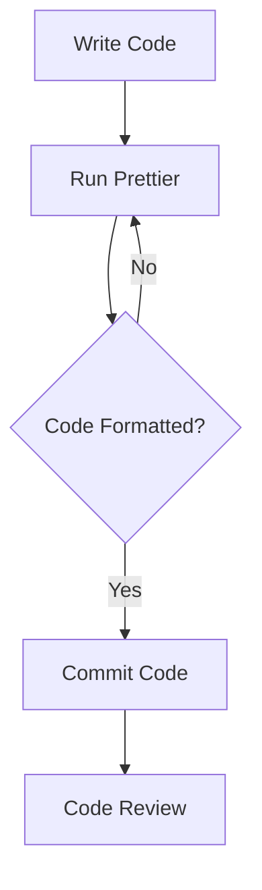

## 3.17 Automated Code Formatting with Prettier

In the realm of software development, maintaining a consistent code style is crucial for readability, maintainability, and collaboration. Prettier is a powerful tool that automates code formatting, ensuring that your JavaScript code adheres to a consistent style. This section will guide you through the benefits of using Prettier, how to set it up in your projects, and how to integrate it with other tools like ESLint.

### Understanding Prettier

Prettier is an opinionated code formatter that supports many languages, including JavaScript. It enforces a consistent style by parsing your code and re-printing it with its own rules, which are customizable to some extent. This means that Prettier takes care of formatting details, allowing developers to focus on writing code rather than worrying about style issues.

#### Key Benefits of Using Prettier

- **Consistency Across Codebases**: Prettier ensures that all code in a project looks the same, regardless of who wrote it.
- **Reduced Code Review Overhead**: By automating formatting, Prettier reduces the number of style-related comments in code reviews, allowing reviewers to focus on logic and functionality.
- **Improved Readability**: Consistent formatting makes code easier to read and understand, which is especially beneficial in large projects or when onboarding new team members.
- **Time Savings**: Developers spend less time manually formatting code, which can be especially tedious in large files or complex projects.

### Setting Up Prettier in Your Project

To start using Prettier in your project, follow these steps:

#### Step 1: Install Prettier

First, install Prettier as a development dependency in your project:

```bash
npm install --save-dev prettier
```

Alternatively, you can install it globally:

```bash
npm install --global prettier
```

#### Step 2: Create a Configuration File

Prettier can be configured using a `.prettierrc` file in the root of your project. This file allows you to specify options such as line width, tab width, and whether to use semicolons. Here is an example configuration:

```json
{
  "semi": false,
  "singleQuote": true,
  "tabWidth": 2,
  "trailingComma": "es5"
}
```

#### Step 3: Add Prettier Scripts to `package.json`

To easily format your code, add scripts to your `package.json`:

```json
{
  "scripts": {
    "format": "prettier --write \"src/**/*.js\"",
    "format-check": "prettier --check \"src/**/*.js\""
  }
}
```

- **`format`**: Formats all JavaScript files in the `src` directory.
- **`format-check`**: Checks if files are formatted according to Prettier's rules without modifying them.

#### Step 4: Integrate with Code Editors

Most modern code editors, such as Visual Studio Code, have Prettier extensions available. Install the Prettier extension for your editor and configure it to format on save:

- **Visual Studio Code**: Install the Prettier extension from the marketplace and enable "Format On Save" in settings.
- **WebStorm**: Prettier is built-in; enable it in the preferences under "Languages & Frameworks > JavaScript > Prettier".

### Configuring Prettier Options

Prettier offers several configuration options to tailor its formatting to your preferences. Here are some commonly used options:

- **`printWidth`**: Specifies the line length that Prettier will wrap on. Default is 80.
- **`tabWidth`**: Number of spaces per indentation level. Default is 2.
- **`useTabs`**: Indent lines with tabs instead of spaces. Default is `false`.
- **`semi`**: Print semicolons at the ends of statements. Default is `true`.
- **`singleQuote`**: Use single quotes instead of double quotes. Default is `false`.
- **`trailingComma`**: Print trailing commas wherever possible. Options are `"none"`, `"es5"`, and `"all"`.

### Integrating Prettier with ESLint

ESLint is a popular tool for identifying and fixing problems in JavaScript code. Integrating Prettier with ESLint allows you to use both tools without conflicts.

#### Step 1: Install Necessary Packages

Install the following packages to integrate Prettier with ESLint:

```bash
npm install --save-dev eslint-config-prettier eslint-plugin-prettier
```

#### Step 2: Configure ESLint

Update your `.eslintrc` configuration file to include Prettier:

```json
{
  "extends": [
    "eslint:recommended",
    "plugin:prettier/recommended"
  ],
  "plugins": ["prettier"],
  "rules": {
    "prettier/prettier": "error"
  }
}
```

- **`eslint-config-prettier`**: Disables ESLint rules that conflict with Prettier.
- **`eslint-plugin-prettier`**: Runs Prettier as an ESLint rule and reports differences as ESLint issues.

### Benefits of Using Prettier in Team Environments

Using Prettier in a team setting offers several advantages:

- **Unified Code Style**: Ensures that all team members adhere to the same code style, reducing friction and misunderstandings.
- **Simplified Onboarding**: New team members can quickly adapt to the project's style without needing to learn individual preferences.
- **Focus on Code Quality**: With style issues handled automatically, code reviews can concentrate on logic, performance, and security.

### Encouraging Prettier Adoption

To encourage the adoption of Prettier in your team:

- **Demonstrate Benefits**: Show how Prettier can save time and reduce errors.
- **Provide Training**: Offer workshops or documentation on setting up and using Prettier.
- **Integrate into CI/CD**: Include Prettier checks in your continuous integration pipeline to enforce consistency.

### Try It Yourself

To get hands-on experience with Prettier, try the following exercises:

1. **Modify Configuration**: Change the `.prettierrc` settings and observe how it affects the formatting.
2. **Integrate with ESLint**: Set up a project with both Prettier and ESLint, and resolve any conflicts.
3. **Experiment with Editor Integration**: Enable and disable "Format On Save" in your editor to see the impact on your workflow.

### Visualizing Prettier's Impact

Below is a simple flowchart illustrating how Prettier fits into the development workflow:



**Figure 1**: Prettier Workflow in Development

### Key Takeaways

- Prettier automates code formatting, ensuring consistency and reducing style-related code review comments.
- Setting up Prettier involves installing it, configuring options, and integrating with editors and ESLint.
- Using Prettier in team environments promotes a unified code style and improves collaboration.

### Further Reading

- [Prettier Documentation](https://prettier.io/docs/en/index.html)
- [ESLint and Prettier Integration](https://prettier.io/docs/en/integrating-with-linters.html)
- [Visual Studio Code Prettier Extension](https://marketplace.visualstudio.com/items?itemName=esbenp.prettier-vscode)

## Quiz: Mastering Prettier for JavaScript Code Consistency



### What is the primary purpose of Prettier?

- [x] To enforce consistent code formatting
- [ ] To identify syntax errors
- [ ] To optimize code for performance
- [ ] To manage project dependencies

> **Explanation:** Prettier is designed to enforce consistent code formatting across a codebase.

### Which configuration file is used to customize Prettier settings?

- [x] .prettierrc
- [ ] .eslintrc
- [ ] package.json
- [ ] .babelrc

> **Explanation:** The `.prettierrc` file is used to specify Prettier's configuration options.

### How can Prettier be integrated with ESLint?

- [x] By using eslint-config-prettier and eslint-plugin-prettier
- [ ] By installing prettier-eslint
- [ ] By adding Prettier rules directly to ESLint
- [ ] By using a separate Prettier configuration file

> **Explanation:** `eslint-config-prettier` and `eslint-plugin-prettier` are used to integrate Prettier with ESLint.

### What is the benefit of using Prettier in a team environment?

- [x] It ensures a unified code style across the team
- [ ] It increases the number of code review comments
- [ ] It allows each developer to use their own style
- [ ] It replaces the need for code reviews

> **Explanation:** Prettier ensures a consistent code style, which is beneficial for team collaboration.

### Which option in Prettier configuration controls the use of semicolons?

- [x] semi
- [ ] singleQuote
- [ ] tabWidth
- [ ] trailingComma

> **Explanation:** The `semi` option in Prettier configuration controls whether semicolons are used at the end of statements.

### How does Prettier reduce code review overhead?

- [x] By automating code formatting and reducing style-related comments
- [ ] By identifying logical errors in the code
- [ ] By optimizing code for performance
- [ ] By managing project dependencies

> **Explanation:** Prettier automates code formatting, which reduces the number of style-related comments in code reviews.

### What command is used to format code with Prettier in a project?

- [x] prettier --write "src/**/*.js"
- [ ] prettier --check "src/**/*.js"
- [ ] eslint --fix
- [ ] npm run format

> **Explanation:** The command `prettier --write "src/**/*.js"` is used to format code with Prettier.

### What is the default line length that Prettier wraps on?

- [x] 80
- [ ] 100
- [ ] 120
- [ ] 60

> **Explanation:** Prettier's default line length for wrapping is 80 characters.

### True or False: Prettier can be configured to use tabs instead of spaces for indentation.

- [x] True
- [ ] False

> **Explanation:** Prettier can be configured to use tabs instead of spaces by setting the `useTabs` option to `true`.

### What is the primary advantage of integrating Prettier with a code editor?

- [x] It allows automatic formatting on save
- [ ] It identifies syntax errors
- [ ] It manages project dependencies
- [ ] It optimizes code for performance

> **Explanation:** Integrating Prettier with a code editor allows for automatic formatting on save, enhancing workflow efficiency.



Remember, adopting tools like Prettier is just the beginning of maintaining a clean and consistent codebase. Keep exploring, stay curious, and enjoy the journey of mastering JavaScript development!
