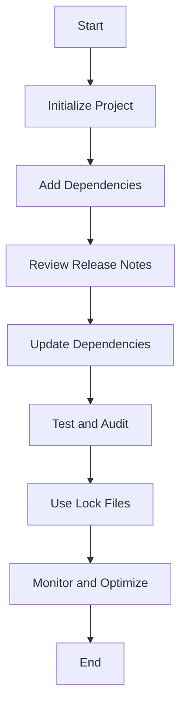

## 3.18 Managing External Dependencies

In modern web development, managing external dependencies is a crucial aspect of maintaining a robust and efficient JavaScript project. Dependencies can range from small utility libraries to large frameworks, and they play a vital role in enhancing functionality and speeding up development. However, they also introduce challenges related to security, performance, and maintainability. In this section, we will explore best practices for managing and updating external libraries and dependencies, ensuring that your project remains secure, performant, and consistent.

### Importance of Regularly Updating Dependencies

Regularly updating dependencies is essential for several reasons:

1. **Security**: Vulnerabilities in third-party libraries can expose your application to security risks. Regular updates help mitigate these risks by incorporating security patches and fixes.

2. **Performance**: Updates often include performance improvements and optimizations that can enhance the speed and efficiency of your application.

3. **Compatibility**: Keeping dependencies up-to-date ensures compatibility with the latest versions of other libraries and tools you might be using.

4. **Bug Fixes**: Updates often address bugs and issues that could affect the stability of your application.

#### Tools for Auditing Dependencies

To manage dependencies effectively, it's important to audit them regularly. Tools like `npm audit` and `yarn audit` can help identify vulnerabilities in your project's dependencies.

- **npm audit**: This command analyzes your project's dependency tree and reports known security vulnerabilities. It provides a detailed report and suggests actions to fix the issues.

```bash
npm audit
```

- **yarn audit**: Similar to `npm audit`, this command checks for vulnerabilities in your project's dependencies when using Yarn as your package manager.

```bash
yarn audit
```

Both tools provide actionable insights and recommendations for addressing vulnerabilities, making them indispensable for maintaining a secure project.

### Strategies for Handling Breaking Changes

Updating dependencies can sometimes introduce breaking changes that affect your project's functionality. Here are some strategies to handle these changes effectively:

1. **Review Release Notes**: Before updating a dependency, review its release notes to understand what changes have been made and whether they might affect your project.

2. **Use Semantic Versioning**: Semantic versioning (semver) helps you understand the impact of updates. Major version changes often indicate breaking changes, while minor and patch updates are usually backward-compatible.

3. **Test Thoroughly**: After updating a dependency, run your project's test suite to ensure that everything works as expected. Consider adding tests if coverage is lacking.

4. **Incremental Updates**: Update dependencies incrementally rather than all at once. This approach makes it easier to identify and address issues related to specific updates.

5. **Use Feature Flags**: Implement feature flags to toggle new features on and off, allowing you to test updates in a controlled environment before fully integrating them.

### Lock Files for Consistent Installs

Lock files, such as `package-lock.json` (npm) and `yarn.lock` (Yarn), play a crucial role in ensuring consistent installs across different environments. They record the exact versions of dependencies and their sub-dependencies, preventing unexpected changes when running `npm install` or `yarn install`.

- **package-lock.json**: Automatically generated by npm, this file ensures that the same dependency versions are installed on every machine.

- **yarn.lock**: Similarly, Yarn generates this file to lock dependency versions, providing consistency across installations.

Using lock files is a best practice that helps avoid the "it works on my machine" problem, ensuring that your application behaves consistently in development, testing, and production environments.

### Mindful Inclusion of Dependencies

While dependencies can greatly enhance your project, it's important to be mindful of their inclusion to avoid bloat and maintain performance. Here are some tips:

1. **Evaluate Necessity**: Before adding a dependency, evaluate whether it's truly necessary. Consider whether the functionality can be implemented with existing code or a smaller library.

2. **Assess Popularity and Maintenance**: Choose well-maintained and popular libraries with active communities. This ensures better support and a lower likelihood of encountering unaddressed issues.

3. **Consider Alternatives**: Explore alternative libraries that might offer similar functionality with a smaller footprint or better performance.

4. **Monitor Bundle Size**: Use tools like Webpack Bundle Analyzer to monitor the size of your application's bundle and identify large dependencies that might be impacting performance.

5. **Remove Unused Dependencies**: Regularly audit your project for unused dependencies and remove them to reduce bloat and improve performance.

### Code Example: Managing Dependencies with npm

Let's explore a practical example of managing dependencies using npm. We'll create a simple project, add a dependency, and demonstrate how to update and audit it.

```bash
# Initialize a new npm project
npm init -y

# Add a dependency (e.g., lodash)
npm install lodash

# Check installed dependencies
npm list

# Update a dependency
npm update lodash

# Audit dependencies for vulnerabilities
npm audit
```

In this example, we initialize a new npm project, add the `lodash` library as a dependency, and then update and audit it. This process highlights the importance of regularly managing dependencies to ensure security and performance.

### Visualizing Dependency Management

To better understand the process of managing dependencies, let's visualize it using a flowchart.



**Figure 1: Dependency Management Workflow**

This flowchart illustrates the key steps involved in managing dependencies, from initializing a project to monitoring and optimizing dependencies for performance.

### References and Further Reading

- [npm Documentation](https://docs.npmjs.com/)
- [Yarn Documentation](https://classic.yarnpkg.com/en/docs/)
- [Semantic Versioning](https://semver.org/)
- [Webpack Bundle Analyzer](https://github.com/webpack-contrib/webpack-bundle-analyzer)

### Knowledge Check

1. Why is it important to regularly update dependencies in a JavaScript project?
2. What tools can you use to audit dependencies for vulnerabilities?
3. How can semantic versioning help in managing dependency updates?
4. What is the purpose of a lock file in a JavaScript project?
5. How can you avoid bloat when managing dependencies?

### Exercises

1. Create a new npm project and add a dependency of your choice. Update the dependency and audit it for vulnerabilities.
2. Analyze the bundle size of a JavaScript project using Webpack Bundle Analyzer. Identify large dependencies and consider alternatives.

### Summary

Managing external dependencies is a critical aspect of modern web development. By regularly updating dependencies, auditing for vulnerabilities, and using lock files, you can ensure the security, performance, and consistency of your JavaScript projects. Remember to be mindful of the dependencies you include, avoiding bloat and maintaining a lean and efficient codebase.

### Embrace the Journey

Managing dependencies is an ongoing process that requires diligence and attention to detail. As you continue to develop and maintain your projects, keep exploring new tools and strategies to optimize your workflow. Stay curious, keep learning, and enjoy the journey of mastering JavaScript development!

## Quiz: Mastering Dependency Management in JavaScript



### Why is it important to regularly update dependencies?

- [x] To ensure security and performance
- [ ] To increase the size of the project
- [ ] To make the code more complex
- [ ] To reduce the number of features

> **Explanation:** Regular updates help incorporate security patches, performance improvements, and bug fixes, ensuring the project remains secure and efficient.

### Which tool can be used to audit dependencies in a JavaScript project?

- [x] npm audit
- [ ] npm install
- [ ] npm init
- [ ] npm run

> **Explanation:** `npm audit` is used to analyze the dependency tree and report known security vulnerabilities.

### What is the purpose of a lock file in a JavaScript project?

- [x] To ensure consistent installs across environments
- [ ] To increase the project's complexity
- [ ] To remove unused dependencies
- [ ] To add new features

> **Explanation:** Lock files record the exact versions of dependencies, ensuring consistent installations across different environments.

### How can semantic versioning help in managing dependency updates?

- [x] By indicating the impact of updates
- [ ] By reducing the number of dependencies
- [ ] By increasing the project's size
- [ ] By making the code more complex

> **Explanation:** Semantic versioning helps understand the impact of updates, with major version changes often indicating breaking changes.

### What is a strategy for handling breaking changes during updates?

- [x] Review release notes and test thoroughly
- [ ] Ignore the changes and proceed
- [ ] Remove all dependencies
- [ ] Increase the project's complexity

> **Explanation:** Reviewing release notes and testing thoroughly helps identify and address issues related to breaking changes.

### Which file is automatically generated by npm to lock dependency versions?

- [x] package-lock.json
- [ ] yarn.lock
- [ ] package.json
- [ ] node_modules

> **Explanation:** `package-lock.json` is automatically generated by npm to lock dependency versions.

### What is a mindful practice when including dependencies?

- [x] Evaluate necessity and assess popularity
- [ ] Add as many dependencies as possible
- [ ] Ignore the size of the dependencies
- [ ] Use outdated libraries

> **Explanation:** Evaluating necessity and assessing popularity helps avoid bloat and maintain performance.

### How can you monitor the size of your application's bundle?

- [x] Use Webpack Bundle Analyzer
- [ ] Use npm install
- [ ] Use npm init
- [ ] Use npm run

> **Explanation:** Webpack Bundle Analyzer helps monitor the size of the application's bundle and identify large dependencies.

### What is a benefit of using feature flags during updates?

- [x] To test updates in a controlled environment
- [ ] To remove all dependencies
- [ ] To increase the project's complexity
- [ ] To ignore breaking changes

> **Explanation:** Feature flags allow testing updates in a controlled environment before fully integrating them.

### True or False: Lock files are not necessary for consistent installs.

- [ ] True
- [x] False

> **Explanation:** Lock files are essential for ensuring consistent installs across different environments.


