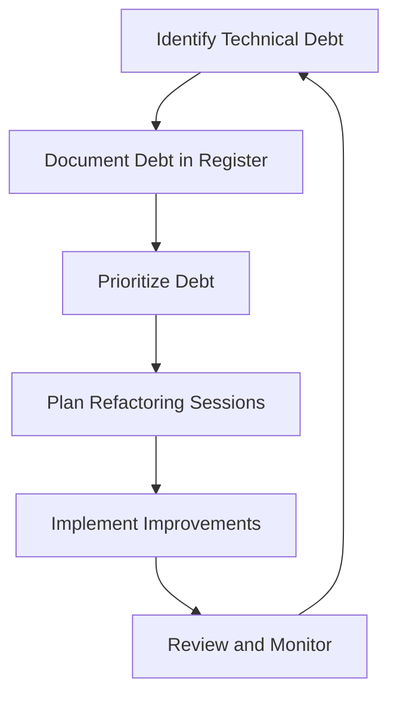

## 3.19 Managing Technical Debt

In the fast-paced world of software development, the term "technical debt" is often mentioned but not always fully understood. As developers, we strive to deliver features quickly, but this can sometimes lead to shortcuts that accumulate over time, impacting the overall health of the codebase. In this section, we will delve into the concept of technical debt, its implications, and strategies for managing it effectively in JavaScript projects.

### Understanding Technical Debt

**Technical debt** refers to the implied cost of additional rework caused by choosing an easy solution now instead of using a better approach that would take longer. It is a metaphor introduced by Ward Cunningham to describe the trade-offs between short-term gains and long-term code quality.

#### How Technical Debt Accumulates

Technical debt can accumulate due to various reasons, including:

- **Rushed Development**: Meeting tight deadlines often leads to quick fixes and workarounds.
- **Lack of Documentation**: Inadequate documentation can make code difficult to understand and maintain.
- **Poor Code Quality**: Code that lacks structure, is not modular, or is difficult to test can contribute to technical debt.
- **Outdated Technologies**: Using deprecated libraries or frameworks can lead to compatibility issues.
- **Feature Creep**: Adding features without considering the overall architecture can lead to a bloated codebase.

### Negative Impacts of Technical Debt

Technical debt can have several adverse effects on a development team and the software product:

- **Reduced Development Velocity**: As technical debt increases, it becomes harder to add new features or fix bugs, slowing down development.
- **Increased Maintenance Costs**: More time and resources are required to maintain and refactor the codebase.
- **Decreased Morale**: Developers may feel frustrated working with a messy codebase, leading to decreased job satisfaction.
- **Higher Risk of Bugs**: A codebase with high technical debt is more prone to bugs and errors.

### Identifying and Tracking Technical Debt

To manage technical debt effectively, it is crucial to identify and track it. Here are some strategies:

#### Code Reviews

Conduct regular code reviews to identify areas of technical debt. Encourage team members to document any shortcuts or potential issues they encounter.

#### Automated Tools

Use static code analysis tools like ESLint or SonarQube to detect code smells and potential debt. These tools can provide insights into code complexity, duplication, and other quality metrics.

#### Technical Debt Register

Maintain a technical debt register to document known issues, their impact, and potential solutions. This can help prioritize debt repayment efforts.

### Prioritizing Technical Debt

Not all technical debt is created equal. Prioritizing which debt to address first is essential for effective management:

- **Impact on Business Goals**: Focus on debt that directly affects the ability to deliver key business objectives.
- **Risk Assessment**: Address debt that poses a significant risk to the stability or security of the application.
- **Cost of Delay**: Consider the long-term costs of not addressing certain debts, such as increased maintenance or reduced flexibility.

### Strategies for Managing Technical Debt

Managing technical debt requires a proactive approach. Here are some strategies:

#### Regular Refactoring Sessions

Set aside time for regular refactoring sessions to improve code quality. This can be part of the sprint planning process.

#### Incremental Improvements

Encourage developers to make small improvements to the codebase as they work on new features or bug fixes. This can help reduce debt over time.

#### Dedicated Maintenance Sprints

Allocate entire sprints for addressing technical debt. This can be particularly useful for tackling larger, more complex issues.

#### Balancing New Features and Maintenance

Finding the right balance between delivering new features and maintaining code quality is crucial. Here are some tips:

- **Stakeholder Communication**: Communicate the importance of addressing technical debt to stakeholders. Highlight how it can impact future development and product quality.
- **Feature Toggles**: Use feature toggles to deploy new features incrementally, allowing for testing and refinement without introducing significant debt.
- **Continuous Integration and Deployment**: Implement CI/CD practices to ensure that code changes are tested and integrated regularly, reducing the risk of accumulating debt.

### Code Example: Refactoring a JavaScript Function

Let's look at a simple example of refactoring a JavaScript function to reduce technical debt. Consider the following function:

```javascript
// Original function with technical debt
function calculateTotalPrice(items) {
    let total = 0;
    for (let i = 0; i < items.length; i++) {
        total += items[i].price;
    }
    return total;
}

// Refactored function using modern JavaScript features
function calculateTotalPrice(items) {
    return items.reduce((total, item) => total + item.price, 0);
}
```

**Explanation**: The refactored function uses the `reduce` method, which is more concise and easier to read. This reduces technical debt by improving code readability and maintainability.

### Visualizing Technical Debt Management

Below is a flowchart illustrating the process of managing technical debt:



**Caption**: This flowchart represents the cyclical process of managing technical debt, from identification to implementation and review.

### References and Further Reading

- [MDN Web Docs: JavaScript](https://developer.mozilla.org/en-US/docs/Web/JavaScript)
- [SonarQube Documentation](https://docs.sonarqube.org/latest/)
- [Refactoring Guru: Code Smells](https://refactoring.guru/refactoring/smells)

### Knowledge Check

- What is technical debt, and how does it accumulate?
- How can technical debt impact development velocity and team morale?
- What are some strategies for identifying and tracking technical debt?
- How can code reviews help in managing technical debt?
- What is the importance of balancing new feature development with maintenance?

### Embrace the Journey

Remember, managing technical debt is an ongoing process. By incorporating these strategies into your development workflow, you can maintain a healthy codebase and ensure sustainable growth for your projects. Keep experimenting, stay curious, and enjoy the journey!

## Quiz: Understanding and Managing Technical Debt



### What is technical debt?

- [x] The implied cost of additional rework caused by choosing an easy solution now instead of a better approach that would take longer.
- [ ] The financial cost of software development.
- [ ] The amount of time spent on debugging code.
- [ ] The cost of purchasing new development tools.

> **Explanation:** Technical debt refers to the trade-offs between short-term gains and long-term code quality.

### Which of the following is a common cause of technical debt?

- [x] Rushed development to meet tight deadlines.
- [ ] Using modern development tools.
- [ ] Writing comprehensive documentation.
- [ ] Conducting regular code reviews.

> **Explanation:** Rushed development often leads to quick fixes and workarounds, contributing to technical debt.

### How can technical debt impact a development team?

- [x] It can reduce development velocity and increase maintenance costs.
- [ ] It can improve code quality and reduce bugs.
- [ ] It can lead to faster feature delivery without any drawbacks.
- [ ] It has no impact on the development process.

> **Explanation:** Technical debt can slow down development and increase the resources needed for maintenance.

### What is a technical debt register?

- [x] A document that tracks known technical debt issues, their impact, and potential solutions.
- [ ] A financial ledger for tracking software development costs.
- [ ] A tool for managing project timelines.
- [ ] A list of all completed features in a project.

> **Explanation:** A technical debt register helps prioritize debt repayment efforts by documenting known issues.

### Which practice can help reduce technical debt over time?

- [x] Encouraging incremental improvements to the codebase.
- [ ] Avoiding code reviews.
- [ ] Ignoring outdated technologies.
- [ ] Focusing solely on new feature development.

> **Explanation:** Incremental improvements can gradually reduce technical debt and improve code quality.

### What is the role of code reviews in managing technical debt?

- [x] They help identify areas of technical debt and encourage documentation of potential issues.
- [ ] They are only useful for finding syntax errors.
- [ ] They slow down the development process without any benefits.
- [ ] They are not related to technical debt management.

> **Explanation:** Code reviews are crucial for identifying and documenting technical debt.

### How can feature toggles help in managing technical debt?

- [x] By allowing incremental deployment and testing of new features.
- [ ] By permanently disabling certain features.
- [ ] By increasing the complexity of the codebase.
- [ ] By removing the need for code reviews.

> **Explanation:** Feature toggles enable testing and refinement of features without introducing significant debt.

### What is the benefit of conducting regular refactoring sessions?

- [x] They improve code quality and reduce technical debt.
- [ ] They increase the amount of technical debt.
- [ ] They are only useful for small projects.
- [ ] They have no impact on code maintainability.

> **Explanation:** Regular refactoring sessions help maintain a healthy codebase by reducing technical debt.

### Why is it important to balance new feature development with maintenance?

- [x] To ensure sustainable growth and maintain code quality.
- [ ] To focus solely on delivering new features.
- [ ] To avoid any changes to the existing codebase.
- [ ] To prioritize maintenance over all other activities.

> **Explanation:** Balancing new features with maintenance ensures a healthy codebase and sustainable development.

### True or False: Technical debt only affects the codebase and has no impact on the development team.

- [ ] True
- [x] False

> **Explanation:** Technical debt can affect both the codebase and the development team, impacting morale and productivity.


