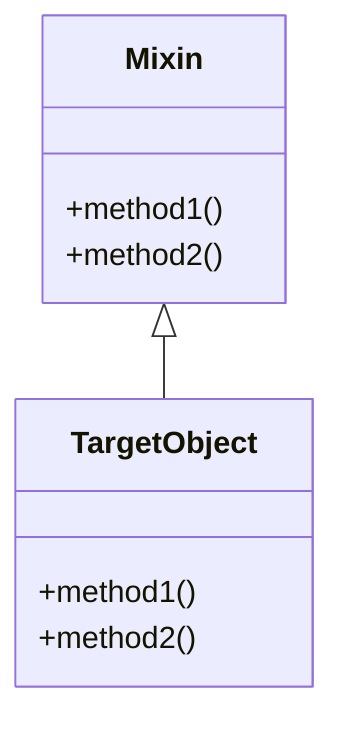

---

linkTitle: "3.2.1 Mixin"
title: "Mastering Mixins in JavaScript and TypeScript: A Comprehensive Guide"
description: "Explore the Mixin pattern in JavaScript and TypeScript, a powerful tool for object composition and code reuse without classical inheritance."
categories:
- JavaScript
- TypeScript
- Design Patterns
tags:
- Mixin
- Object Composition
- Code Reuse
- JavaScript Patterns
- TypeScript Patterns
date: 2024-10-25
type: docs
nav_weight: 321000
canonical: "https://softwarepatternslexicon.com/patterns-js/3/2/1"
license: "© 2024 Tokenizer Inc. CC BY-NC-SA 4.0"
---

## 3.2.1 Mixin

### Introduction

In the realm of object-oriented programming, the Mixin pattern offers a flexible approach to composing objects by combining properties and methods from multiple sources. Unlike classical inheritance, which establishes a parent-child relationship, mixins allow for code reuse across unrelated objects. This pattern is particularly useful in JavaScript and TypeScript, where dynamic and flexible object composition is often required.

### Understanding the Intent

The primary intent of the Mixin pattern is to enable the sharing of functionality across multiple objects without the constraints of classical inheritance. This is achieved by:

- **Combining Properties and Methods:** Mixins allow you to merge properties and methods from one or more objects into a single target object.
- **Code Reuse:** By using mixins, you can reuse code across different objects, reducing duplication and enhancing maintainability.

### Implementation Steps

Implementing the Mixin pattern involves a few straightforward steps:

1. **Define a Mixin Object:** Create an object containing the shared methods and properties you want to distribute across other objects.
2. **Object Assignment:** Use JavaScript's `Object.assign()` or similar techniques to copy methods from the mixin to the target object or its prototype.

### Code Examples

Let's explore a practical example where we implement mixins to add event handling capabilities to multiple objects.

```typescript
// Define a Mixin for event handling
const eventMixin = {
  on(event: string, handler: Function) {
    if (!this._eventHandlers) this._eventHandlers = {};
    if (!this._eventHandlers[event]) this._eventHandlers[event] = [];
    this._eventHandlers[event].push(handler);
  },
  off(event: string, handler: Function) {
    if (!this._eventHandlers || !this._eventHandlers[event]) return;
    this._eventHandlers[event] = this._eventHandlers[event].filter((h: Function) => h !== handler);
  },
  trigger(event: string, ...args: any[]) {
    if (!this._eventHandlers || !this._eventHandlers[event]) return;
    this._eventHandlers[event].forEach((handler: Function) => handler.apply(this, args));
  }
};

// Create a class and apply the mixin
class Menu {
  _eventHandlers: { [key: string]: Function[] } = {};
}

Object.assign(Menu.prototype, eventMixin);

const menu = new Menu();
menu.on('select', (item: string) => console.log(`Selected: ${item}`));
menu.trigger('select', 'Home');
```

### Use Cases

Mixins are particularly useful in scenarios where multiple objects require similar functionality but do not share a parent-child relationship. Common use cases include:

- **Event Handling:** As demonstrated, mixins can add event handling capabilities to various objects.
- **Logging:** Adding logging functionality to different classes without duplicating code.

### Practice

Try creating a mixin that adds logging functions to different classes:

```typescript
// Define a Mixin for logging
const loggingMixin = {
  log(message: string) {
    console.log(`[${new Date().toISOString()}] ${message}`);
  }
};

// Apply the mixin to a class
class User {
  name: string;
  constructor(name: string) {
    this.name = name;
  }
}

Object.assign(User.prototype, loggingMixin);

const user = new User('Alice');
user.log('User created');
```

### Considerations

While mixins are powerful, they come with considerations:

- **Property Name Clashes:** Be cautious of property name clashes when applying multiple mixins to the same object.
- **Maintenance Challenges:** Overusing mixins can lead to maintenance challenges, as it may become difficult to track which methods belong to which mixin.

### Visual Aids

To better understand how mixins work, consider the following conceptual diagram:



### Advantages and Disadvantages

**Advantages:**

- **Flexibility:** Mixins provide a flexible way to compose objects.
- **Code Reuse:** They promote code reuse without the rigidity of inheritance.

**Disadvantages:**

- **Complexity:** Overuse can lead to complex and hard-to-maintain codebases.
- **Name Clashes:** Potential for property and method name clashes.

### Best Practices

- **Limit the Number of Mixins:** Avoid applying too many mixins to a single object to prevent complexity.
- **Use Descriptive Names:** Ensure mixin methods have descriptive names to avoid clashes.

### Comparisons

Mixins are often compared to other patterns like inheritance and decorators. Unlike inheritance, mixins do not establish a hierarchy, and unlike decorators, they directly modify the target object.

### Conclusion

The Mixin pattern is a versatile tool in JavaScript and TypeScript, enabling code reuse and flexible object composition. By understanding its intent, implementation, and best practices, developers can effectively leverage mixins to enhance their applications.

## Quiz Time!



### What is the primary intent of the Mixin pattern?

- [x] To enable code reuse without classical inheritance
- [ ] To establish a parent-child relationship between objects
- [ ] To create a new class hierarchy
- [ ] To enforce strict type checking

> **Explanation:** The primary intent of the Mixin pattern is to enable code reuse across multiple objects without the constraints of classical inheritance.

### How do you apply a mixin to a class in JavaScript?

- [x] Using `Object.assign()` to copy methods to the class prototype
- [ ] By extending the class with the mixin
- [ ] By using the `implements` keyword
- [ ] By using the `new` keyword

> **Explanation:** Mixins are applied to a class by using `Object.assign()` to copy methods from the mixin to the class prototype.

### What is a common use case for mixins?

- [x] Adding event handling capabilities to multiple objects
- [ ] Creating a new class hierarchy
- [ ] Enforcing strict type checking
- [ ] Compiling TypeScript to JavaScript

> **Explanation:** A common use case for mixins is adding event handling capabilities to multiple objects without duplicating code.

### What should you be cautious of when using multiple mixins?

- [x] Property name clashes
- [ ] Memory leaks
- [ ] Type mismatches
- [ ] Compilation errors

> **Explanation:** When using multiple mixins, be cautious of property name clashes, as they can lead to unexpected behavior.

### What is a disadvantage of overusing mixins?

- [x] It can lead to maintenance challenges
- [ ] It enforces a strict class hierarchy
- [ ] It increases code readability
- [ ] It simplifies debugging

> **Explanation:** Overusing mixins can lead to maintenance challenges, as it may become difficult to track which methods belong to which mixin.

### How does the Mixin pattern differ from classical inheritance?

- [x] Mixins do not establish a parent-child relationship
- [ ] Mixins create a new class hierarchy
- [ ] Mixins enforce strict type checking
- [ ] Mixins are only used in TypeScript

> **Explanation:** Unlike classical inheritance, mixins do not establish a parent-child relationship between objects.

### What is a best practice when using mixins?

- [x] Limit the number of mixins applied to a single object
- [ ] Use mixins to create a new class hierarchy
- [ ] Apply mixins only in TypeScript
- [ ] Avoid using mixins in production code

> **Explanation:** A best practice when using mixins is to limit the number of mixins applied to a single object to prevent complexity.

### What is a benefit of using mixins?

- [x] They provide a flexible way to compose objects
- [ ] They enforce strict type checking
- [ ] They create a new class hierarchy
- [ ] They simplify debugging

> **Explanation:** Mixins provide a flexible way to compose objects, allowing for code reuse without the rigidity of inheritance.

### What is a potential issue with mixins?

- [x] Name clashes between methods
- [ ] Increased memory usage
- [ ] Compilation errors
- [ ] Type mismatches

> **Explanation:** A potential issue with mixins is name clashes between methods, which can lead to unexpected behavior.

### True or False: Mixins are only applicable in TypeScript.

- [ ] True
- [x] False

> **Explanation:** Mixins are applicable in both JavaScript and TypeScript, providing a way to compose objects in both languages.


