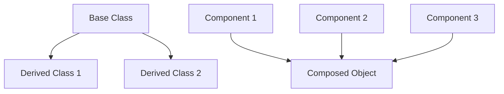

## 3.2.2 Composition Over Inheritance

### Introduction

In the realm of object-oriented programming, the debate between composition and inheritance is longstanding. While inheritance allows for code reuse by creating a hierarchy of classes, it can lead to rigid and tightly coupled systems. Composition, on the other hand, promotes flexibility and reusability by assembling objects from smaller, interchangeable components. This article delves into the principle of "Composition Over Inheritance" and how it can be effectively implemented in JavaScript and TypeScript.

### Understanding the Principle

**Composition Over Inheritance** encourages developers to favor composing small, reusable components over creating deep inheritance hierarchies. This approach aligns with the SOLID principles, particularly the Single Responsibility and Open/Closed principles, by allowing objects to be extended with new behavior without altering existing code.

#### Why Choose Composition?

- **Flexibility:** Composition allows for dynamic behavior changes at runtime by swapping out components.
- **Reusability:** Components can be reused across different objects, reducing duplication.
- **Maintainability:** Systems built with composition are easier to maintain and extend.
- **Decoupling:** Encourages loose coupling between components, enhancing modularity.

### Implementation Steps

1. **Identify Behaviors:** Determine the behaviors or functionalities that can be encapsulated into separate objects or modules.
2. **Encapsulate Behaviors:** Create small, focused objects or functions that encapsulate these behaviors.
3. **Compose Objects:** Use these encapsulated behaviors to assemble complex objects, allowing for flexible combinations.

### Code Examples

Let's explore a practical example in the context of game development, where objects like characters or entities may need capabilities such as `Renderable`, `Movable`, and `Collidable`.

#### Example: Game Entity Composition

```typescript
// Define behavior interfaces
interface Renderable {
    render(): void;
}

interface Movable {
    move(): void;
}

interface Collidable {
    collide(): void;
}

// Implement behavior classes
class RenderComponent implements Renderable {
    render() {
        console.log("Rendering entity...");
    }
}

class MoveComponent implements Movable {
    move() {
        console.log("Moving entity...");
    }
}

class CollisionComponent implements Collidable {
    collide() {
        console.log("Entity collided!");
    }
}

// Entity class using composition
class GameEntity {
    private renderComponent: Renderable;
    private moveComponent: Movable;
    private collisionComponent: Collidable;

    constructor(render: Renderable, move: Movable, collide: Collidable) {
        this.renderComponent = render;
        this.moveComponent = move;
        this.collisionComponent = collide;
    }

    performRender() {
        this.renderComponent.render();
    }

    performMove() {
        this.moveComponent.move();
    }

    performCollide() {
        this.collisionComponent.collide();
    }
}

// Usage
const entity = new GameEntity(new RenderComponent(), new MoveComponent(), new CollisionComponent());
entity.performRender();
entity.performMove();
entity.performCollide();
```

### Use Cases

- **Dynamic Behavior:** When you need the flexibility to combine behaviors dynamically at runtime, such as in game development or UI component libraries.
- **Decoupled Systems:** In systems where decoupling components is crucial for scalability and maintainability, such as microservices or plugin architectures.

### Practice

To practice composition over inheritance, consider refactoring an existing class hierarchy to use composition. Identify common behaviors and encapsulate them into separate components, then compose these components to form complex objects.

### Considerations

- **Design for Composability:** Ensure components are designed to be loosely coupled and easily composable. This often involves defining clear interfaces and adhering to the Single Responsibility Principle.
- **Manage Complexity:** While composition offers flexibility, it can also lead to an increased number of objects and potential complexity. Use dependency injection and service locators to manage dependencies effectively.

### Visual Aids

Below is a conceptual diagram illustrating the difference between inheritance and composition:



- **Inheritance Hierarchy:** Shows a base class with multiple derived classes.
- **Composition:** Demonstrates how a composed object can integrate multiple components.

### Advantages and Disadvantages

**Advantages:**

- Promotes code reuse and flexibility.
- Enhances maintainability and scalability.
- Encourages loose coupling and high cohesion.

**Disadvantages:**

- Can lead to increased complexity with more objects.
- Requires careful management of dependencies and interactions.

### Best Practices

- **Adhere to SOLID Principles:** Ensure components follow the Single Responsibility and Open/Closed principles.
- **Use Interfaces:** Define clear interfaces for components to ensure consistency and interchangeability.
- **Leverage Modern Tools:** Utilize TypeScript's type system to enforce component contracts and enhance code reliability.

### Comparisons

**Composition vs. Inheritance:**

- **Flexibility:** Composition offers more flexibility in changing behavior at runtime.
- **Complexity:** Inheritance can lead to complex hierarchies, while composition can increase the number of objects.
- **Coupling:** Inheritance often results in tighter coupling, whereas composition promotes loose coupling.

### Conclusion

Composition over inheritance is a powerful principle that can lead to more flexible, maintainable, and scalable systems. By focusing on composing small, reusable components, developers can create systems that are easier to extend and adapt to changing requirements. Embrace this principle in your JavaScript and TypeScript projects to unlock the full potential of object-oriented design.

## Quiz Time!



### What is the main advantage of using composition over inheritance?

- [x] Flexibility to change behavior at runtime
- [ ] Simplicity of implementation
- [ ] Reduced number of objects
- [ ] Tighter coupling between components

> **Explanation:** Composition allows for dynamic behavior changes at runtime by swapping out components, offering greater flexibility than inheritance.

### In the context of composition, what does it mean to encapsulate behaviors?

- [x] Creating small, focused objects or functions that encapsulate specific behaviors
- [ ] Using inheritance to extend behaviors
- [ ] Combining multiple classes into a single class
- [ ] Implementing all behaviors in a single object

> **Explanation:** Encapsulating behaviors involves creating small, focused objects or functions that encapsulate specific behaviors, allowing for flexible composition.

### Which of the following is a disadvantage of using composition?

- [ ] Tighter coupling between components
- [x] Increased number of objects
- [ ] Reduced flexibility
- [ ] Difficulty in changing behavior at runtime

> **Explanation:** While composition offers flexibility, it can lead to an increased number of objects, which may add complexity to the system.

### How does composition promote code reuse?

- [x] By allowing components to be reused across different objects
- [ ] By creating deep inheritance hierarchies
- [ ] By reducing the number of classes
- [ ] By implementing all functionality in a single class

> **Explanation:** Composition promotes code reuse by allowing components to be reused across different objects, reducing duplication.

### What principle does composition over inheritance align with?

- [x] SOLID Principles
- [ ] DRY Principle
- [ ] KISS Principle
- [ ] YAGNI Principle

> **Explanation:** Composition over inheritance aligns with the SOLID principles, particularly the Single Responsibility and Open/Closed principles.

### In the provided code example, which component is responsible for rendering the entity?

- [x] RenderComponent
- [ ] MoveComponent
- [ ] CollisionComponent
- [ ] GameEntity

> **Explanation:** The `RenderComponent` is responsible for rendering the entity, as it implements the `Renderable` interface.

### Which of the following is a use case for composition over inheritance?

- [x] Dynamic behavior changes at runtime
- [ ] Implementing a simple class hierarchy
- [ ] Reducing the number of objects
- [ ] Creating tightly coupled systems

> **Explanation:** Composition is particularly useful when you need the flexibility to combine behaviors dynamically at runtime.

### What is a potential drawback of using composition?

- [ ] Reduced flexibility
- [ ] Tighter coupling between components
- [x] Increased complexity due to more objects
- [ ] Difficulty in reusing components

> **Explanation:** A potential drawback of using composition is increased complexity due to the presence of more objects, which requires careful management.

### How can you manage dependencies effectively in a composition-based system?

- [x] Use dependency injection and service locators
- [ ] Implement all functionality in a single class
- [ ] Use deep inheritance hierarchies
- [ ] Avoid using interfaces

> **Explanation:** Using dependency injection and service locators can help manage dependencies effectively in a composition-based system.

### True or False: Composition over inheritance encourages tight coupling between components.

- [ ] True
- [x] False

> **Explanation:** Composition over inheritance encourages loose coupling between components, enhancing modularity and flexibility.


