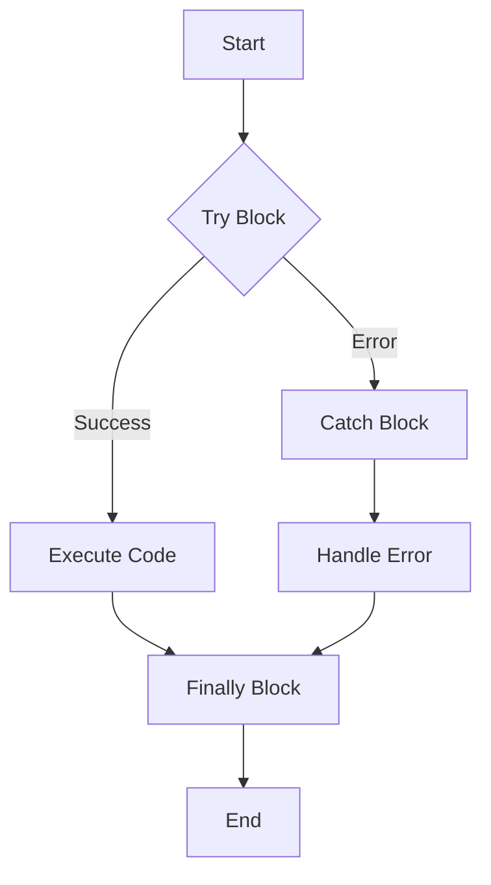

## 3.2 Control Flow and Error Handling

In JavaScript, control flow and error handling are fundamental concepts that allow developers to manage the execution sequence of their code and handle unexpected situations gracefully. This section delves into the constructs available in JavaScript for controlling the flow of execution and managing errors, providing you with the tools to write robust and maintainable code.

### Control Flow Statements

Control flow statements determine the order in which statements are executed in a program. JavaScript provides several constructs for this purpose, including conditionals and loops.

#### Conditionals

Conditionals allow you to execute different code blocks based on certain conditions. The primary conditional statements in JavaScript are `if`, `else`, and `switch`.

##### `if` and `else`

The `if` statement executes a block of code if a specified condition evaluates to `true`. The `else` statement can be used to execute an alternative block of code if the condition is `false`.

```javascript
let temperature = 30;

if (temperature > 25) {
  console.log("It's a hot day!");
} else {
  console.log("It's a cool day!");
}
```

In this example, the message "It's a hot day!" is logged if the temperature is greater than 25. Otherwise, "It's a cool day!" is logged.

##### `switch`

The `switch` statement is used to perform different actions based on different conditions. It is often used as an alternative to multiple `if...else` statements.

```javascript
let fruit = 'apple';

switch (fruit) {
  case 'banana':
    console.log('Banana is yellow.');
    break;
  case 'apple':
    console.log('Apple is red.');
    break;
  case 'grape':
    console.log('Grape is purple.');
    break;
  default:
    console.log('Unknown fruit.');
}
```

Here, the `switch` statement checks the value of `fruit` and executes the corresponding block of code. The `break` statement is crucial to prevent fall-through to subsequent cases.

#### Loops

Loops allow you to execute a block of code multiple times. JavaScript provides several types of loops, including `for`, `while`, `do...while`, `for...in`, and `for...of`.

##### `for` Loop

The `for` loop is used when the number of iterations is known beforehand. It consists of three parts: initialization, condition, and increment/decrement.

```javascript
for (let i = 0; i < 5; i++) {
  console.log(`Iteration ${i}`);
}
```

This loop will print "Iteration 0" to "Iteration 4".

##### `while` Loop

The `while` loop executes a block of code as long as a specified condition is `true`.

```javascript
let count = 0;

while (count < 5) {
  console.log(`Count is ${count}`);
  count++;
}
```

This loop continues until `count` is no longer less than 5.

##### `do...while` Loop

The `do...while` loop is similar to the `while` loop, but it guarantees that the block of code is executed at least once.

```javascript
let number = 0;

do {
  console.log(`Number is ${number}`);
  number++;
} while (number < 5);
```

##### `for...in` Loop

The `for...in` loop iterates over the properties of an object.

```javascript
const person = { name: 'Alice', age: 25 };

for (let key in person) {
  console.log(`${key}: ${person[key]}`);
}
```

This loop will output the properties and values of the `person` object.

##### `for...of` Loop

The `for...of` loop iterates over iterable objects, such as arrays.

```javascript
const colors = ['red', 'green', 'blue'];

for (let color of colors) {
  console.log(color);
}
```

This loop will print each color in the `colors` array.

### Exception Handling

Exception handling in JavaScript is performed using `try`, `catch`, `finally`, and `throw` statements. These constructs allow you to handle errors gracefully and maintain the stability of your application.

#### `try`, `catch`, and `finally`

The `try` block contains code that may throw an error. If an error occurs, the `catch` block is executed. The `finally` block, if present, executes regardless of whether an error occurred.

```javascript
try {
  let result = riskyOperation();
  console.log(`Result: ${result}`);
} catch (error) {
  console.error(`An error occurred: ${error.message}`);
} finally {
  console.log('Operation complete.');
}
```

In this example, if `riskyOperation()` throws an error, the `catch` block logs the error message. The `finally` block runs in all cases.

#### `throw`

The `throw` statement allows you to create custom errors.

```javascript
function divide(a, b) {
  if (b === 0) {
    throw new Error('Division by zero is not allowed.');
  }
  return a / b;
}

try {
  console.log(divide(10, 0));
} catch (error) {
  console.error(error.message);
}
```

Here, a custom error is thrown if an attempt is made to divide by zero.

### Best Practices in Control Flow Design and Error Handling

1. **Use Errors for Exceptional Conditions Only**: Avoid using exceptions for control flow. Exceptions should be reserved for unexpected situations.

2. **Graceful Degradation**: Ensure your application can handle errors gracefully without crashing.

3. **Custom Error Types**: Create custom error types for different error scenarios to provide more context.

4. **Avoid Deep Nesting**: Use early returns to avoid deep nesting in your code, which can make it difficult to read and maintain.

5. **Consistent Error Handling Strategy**: Implement a consistent strategy for error handling across your application.

6. **Logging and Monitoring**: Implement logging and monitoring to track errors and improve debugging.

### Visualizing Control Flow and Error Handling

Below is a flowchart illustrating the control flow of a `try...catch...finally` block:



This diagram shows the flow of execution through a `try...catch...finally` block, highlighting how errors are caught and handled.

### Try It Yourself

Experiment with the code examples provided. Try modifying the conditions in the loops and conditionals, or create your own custom errors to see how they behave.

### Knowledge Check

To reinforce your understanding, consider the following questions:

- What is the difference between `for...in` and `for...of` loops?
- How does the `finally` block behave in a `try...catch` statement?
- Why is it important to use exceptions for exceptional conditions only?

### Summary

In this section, we explored the control flow and error handling mechanisms in JavaScript. By mastering these concepts, you can write more robust and maintainable code. Remember, this is just the beginning. As you progress, you'll build more complex and interactive web applications. Keep experimenting, stay curious, and enjoy the journey!

## Quiz: Mastering JavaScript Control Flow and Error Handling



### What is the primary purpose of control flow statements in JavaScript?

- [x] To determine the order of execution of code blocks
- [ ] To handle errors in the code
- [ ] To define variables and constants
- [ ] To manage memory allocation

> **Explanation:** Control flow statements are used to determine the order in which code blocks are executed based on conditions and loops.

### Which statement is used to execute a block of code based on a specific condition?

- [x] `if`
- [ ] `switch`
- [ ] `for`
- [ ] `while`

> **Explanation:** The `if` statement is used to execute a block of code if a specified condition evaluates to `true`.

### What is the purpose of the `finally` block in a `try...catch` statement?

- [x] To execute code regardless of whether an error occurred
- [ ] To catch errors that occur in the `try` block
- [ ] To throw a custom error
- [ ] To log error messages

> **Explanation:** The `finally` block executes code regardless of whether an error occurred in the `try` block.

### How can you create a custom error in JavaScript?

- [x] Using the `throw` statement
- [ ] Using the `catch` statement
- [ ] Using the `try` statement
- [ ] Using the `finally` statement

> **Explanation:** The `throw` statement is used to create custom errors in JavaScript.

### Which loop is guaranteed to execute its code block at least once?

- [x] `do...while`
- [ ] `for`
- [ ] `while`
- [ ] `for...of`

> **Explanation:** The `do...while` loop executes its code block at least once before checking the condition.

### What is the difference between `for...in` and `for...of` loops?

- [x] `for...in` iterates over object properties, `for...of` iterates over iterable objects
- [ ] `for...in` iterates over iterable objects, `for...of` iterates over object properties
- [ ] Both iterate over object properties
- [ ] Both iterate over iterable objects

> **Explanation:** `for...in` iterates over the properties of an object, while `for...of` iterates over iterable objects like arrays.

### Why should exceptions be used for exceptional conditions only?

- [x] To avoid using them for regular control flow
- [ ] To ensure they are caught in the `catch` block
- [ ] To make code more readable
- [ ] To improve performance

> **Explanation:** Exceptions should be used for unexpected situations, not for regular control flow, to maintain code clarity and efficiency.

### What is a best practice for error handling in JavaScript?

- [x] Implement a consistent error handling strategy
- [ ] Use deep nesting for error handling
- [ ] Avoid using `try...catch` statements
- [ ] Use exceptions for regular control flow

> **Explanation:** Implementing a consistent error handling strategy helps maintain code quality and manage errors effectively.

### What is the role of the `catch` block in a `try...catch` statement?

- [x] To handle errors thrown in the `try` block
- [ ] To execute code regardless of errors
- [ ] To create custom errors
- [ ] To determine the order of execution

> **Explanation:** The `catch` block handles errors that are thrown in the `try` block.

### True or False: The `switch` statement can be used as an alternative to multiple `if...else` statements.

- [x] True
- [ ] False

> **Explanation:** The `switch` statement can be used to perform different actions based on different conditions, similar to multiple `if...else` statements.


