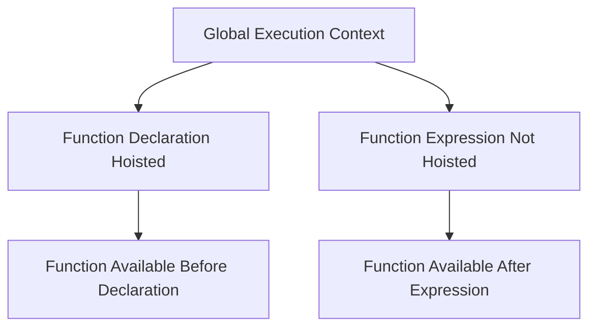

## 3.3.1 Regular Functions

In JavaScript, functions are fundamental building blocks that allow us to encapsulate code for reuse, organization, and abstraction. Understanding how to effectively use regular functions is crucial for mastering JavaScript and implementing design patterns. In this section, we will delve into the details of function declarations, function expressions, hoisting, scope, and the concept of first-class functions.

### Function Declarations

A function declaration is the most common way to define a function in JavaScript. It consists of the `function` keyword followed by the function name, a list of parameters enclosed in parentheses, and a block of code enclosed in curly braces.

```javascript
// Function Declaration
function greet(name) {
    console.log(`Hello, ${name}!`);
}

// Calling the function
greet('Alice'); // Output: Hello, Alice!
```

#### Key Characteristics of Function Declarations

- **Hoisting**: Function declarations are hoisted to the top of their containing scope, meaning they can be called before they are defined in the code.
- **Named Functions**: Function declarations must have a name, which is used to reference the function.

### Function Expressions

A function expression involves creating a function and assigning it to a variable. Function expressions can be named or anonymous.

```javascript
// Anonymous Function Expression
const greet = function(name) {
    console.log(`Hello, ${name}!`);
};

// Named Function Expression
const greet = function greetFunction(name) {
    console.log(`Hello, ${name}!`);
};

// Calling the function
greet('Bob'); // Output: Hello, Bob!
```

#### Key Characteristics of Function Expressions

- **Not Hoisted**: Unlike function declarations, function expressions are not hoisted. They must be defined before they are called.
- **Anonymous Functions**: Function expressions can be anonymous, meaning they do not have to have a name.

### Hoisting and Scope

Understanding hoisting and scope is essential for working with functions in JavaScript. Hoisting is JavaScript's default behavior of moving declarations to the top of the current scope.

#### Hoisting Example

```javascript
// Function can be called before its declaration due to hoisting
sayHello('Charlie');

function sayHello(name) {
    console.log(`Hello, ${name}!`);
}
```

In the example above, the `sayHello` function is hoisted, allowing it to be called before its declaration.

#### Scope

Scope determines the visibility of variables and functions. JavaScript has function scope and block scope (introduced with `let` and `const` in ES6).

```javascript
function outerFunction() {
    let outerVariable = 'I am outside!';

    function innerFunction() {
        console.log(outerVariable); // Accessing outerVariable from innerFunction
    }

    innerFunction();
}

outerFunction(); // Output: I am outside!
```

In this example, `innerFunction` can access `outerVariable` because it is within the same function scope.

### Named and Anonymous Functions

Named functions have a name that can be used to reference the function, while anonymous functions do not have a name.

#### Named Function Example

```javascript
const add = function addNumbers(a, b) {
    return a + b;
};

console.log(add(2, 3)); // Output: 5
```

#### Anonymous Function Example

```javascript
const multiply = function(a, b) {
    return a * b;
};

console.log(multiply(2, 3)); // Output: 6
```

### First-Class Functions

In JavaScript, functions are first-class citizens, meaning they can be treated like any other variable. They can be passed as arguments to other functions, returned from functions, and assigned to variables.

#### Passing Functions as Arguments

```javascript
function performOperation(a, b, operation) {
    return operation(a, b);
}

const sum = (x, y) => x + y;
const product = (x, y) => x * y;

console.log(performOperation(5, 3, sum)); // Output: 8
console.log(performOperation(5, 3, product)); // Output: 15
```

#### Returning Functions from Functions

```javascript
function createMultiplier(multiplier) {
    return function(x) {
        return x * multiplier;
    };
}

const double = createMultiplier(2);
console.log(double(5)); // Output: 10
```

### Best Practices for Regular Functions

- **Use Descriptive Names**: Choose meaningful names for functions to make your code more readable.
- **Keep Functions Small**: Aim for functions to perform a single task or operation.
- **Avoid Side Effects**: Functions should not modify variables outside their scope unless necessary.
- **Use Default Parameters**: Provide default values for parameters to handle cases where arguments are not provided.

### Visualizing Function Hoisting

To better understand function hoisting, let's visualize how JavaScript handles function declarations and expressions during the execution phase.



In this diagram, function declarations are hoisted, making them available before their declaration, while function expressions are not hoisted and are only available after the expression is evaluated.

### Try It Yourself

Experiment with the following code examples to deepen your understanding of regular functions in JavaScript:

1. Modify the `performOperation` function to include a subtraction operation.
2. Create a function that returns another function, which calculates the power of a number.
3. Test the hoisting behavior by calling a function expression before its definition.

### References and Links

- [MDN Web Docs: Functions](https://developer.mozilla.org/en-US/docs/Web/JavaScript/Guide/Functions)
- [W3Schools: JavaScript Functions](https://www.w3schools.com/js/js_functions.asp)

### Knowledge Check

- What is the difference between function declarations and function expressions?
- How does hoisting affect function declarations and expressions?
- What are first-class functions, and how can they be used in JavaScript?

### Embrace the Journey

Remember, mastering regular functions is just the beginning of your JavaScript journey. As you progress, you'll encounter more complex patterns and techniques. Keep experimenting, stay curious, and enjoy the journey!

## Quiz: Mastering Regular Functions in JavaScript



### What is a key characteristic of function declarations?

- [x] They are hoisted to the top of their scope.
- [ ] They cannot be named.
- [ ] They are always anonymous.
- [ ] They are not hoisted.

> **Explanation:** Function declarations are hoisted, meaning they can be called before they are defined in the code.

### Which of the following is true about function expressions?

- [x] They can be anonymous.
- [ ] They are hoisted.
- [ ] They must be named.
- [ ] They cannot be assigned to variables.

> **Explanation:** Function expressions can be anonymous and are not hoisted, meaning they must be defined before they are called.

### What does it mean for functions to be first-class citizens in JavaScript?

- [x] Functions can be passed as arguments to other functions.
- [x] Functions can be returned from other functions.
- [ ] Functions cannot be assigned to variables.
- [ ] Functions must be declared globally.

> **Explanation:** In JavaScript, functions are first-class citizens, meaning they can be passed as arguments, returned from functions, and assigned to variables.

### How does hoisting affect function expressions?

- [ ] They are hoisted to the top of their scope.
- [x] They are not hoisted.
- [ ] They become anonymous.
- [ ] They are always named.

> **Explanation:** Function expressions are not hoisted, meaning they must be defined before they are called.

### What is the output of the following code?

```javascript
console.log(add(2, 3));
var add = function(a, b) {
    return a + b;
};
```

- [ ] 5
- [ ] 6
- [x] TypeError
- [ ] ReferenceError

> **Explanation:** The code will throw a TypeError because `add` is undefined at the time of the call due to the function expression not being hoisted.

### Which of the following is a best practice for writing functions?

- [x] Use descriptive names for functions.
- [ ] Keep functions as large as possible.
- [ ] Always modify global variables.
- [ ] Avoid using parameters.

> **Explanation:** Using descriptive names for functions makes the code more readable and maintainable.

### What is the purpose of default parameters in functions?

- [x] To provide default values for parameters when arguments are not provided.
- [ ] To make functions anonymous.
- [ ] To hoist function expressions.
- [ ] To prevent functions from being called.

> **Explanation:** Default parameters allow functions to have default values for parameters when arguments are not provided.

### Which statement is true about named function expressions?

- [x] They have a name that can be used for recursion.
- [ ] They are hoisted.
- [ ] They cannot be assigned to variables.
- [ ] They must be declared globally.

> **Explanation:** Named function expressions have a name that can be used for recursion, but they are not hoisted.

### What is the output of the following code?

```javascript
function outer() {
    var x = 10;
    function inner() {
        console.log(x);
    }
    return inner;
}
var closure = outer();
closure();
```

- [x] 10
- [ ] undefined
- [ ] ReferenceError
- [ ] TypeError

> **Explanation:** The code will output 10 because the inner function forms a closure over the variable `x`.

### True or False: Function expressions are hoisted in JavaScript.

- [ ] True
- [x] False

> **Explanation:** Function expressions are not hoisted in JavaScript, unlike function declarations.




