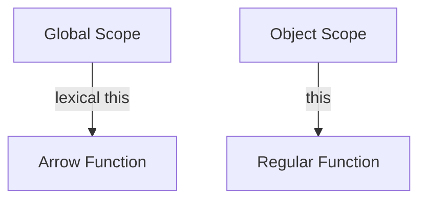
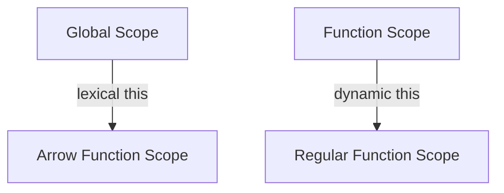

## 3.3.2 Arrow Functions

Arrow functions, introduced in ECMAScript 6 (ES6), are a more concise way to write function expressions in JavaScript. They offer a streamlined syntax and come with some unique features that distinguish them from traditional function expressions. In this section, we'll explore the syntax of arrow functions, their benefits, and how they differ from regular functions, particularly in terms of `this` binding. We'll also provide practical examples and discuss scenarios where arrow functions might not be the best choice.

### Understanding Arrow Function Syntax

Arrow functions provide a more concise syntax compared to traditional function expressions. Here's a basic example to illustrate the difference:

```javascript
// Traditional function expression
const add = function(a, b) {
    return a + b;
};

// Arrow function
const addArrow = (a, b) => a + b;
```

#### Key Syntax Features

1. **No `function` Keyword**: Arrow functions do not require the `function` keyword.
2. **Implicit Return**: If the function body consists of a single expression, the `return` keyword can be omitted, and the expression is returned implicitly.
3. **Parentheses**: Parentheses around a single parameter can be omitted, but they are required for zero or multiple parameters.
4. **Curly Braces**: Curly braces are needed for function bodies with multiple statements, and the `return` keyword must be used explicitly in such cases.

```javascript
// Single parameter without parentheses
const square = x => x * x;

// Multiple parameters require parentheses
const multiply = (a, b) => a * b;

// Multiple statements require curly braces and explicit return
const complexCalculation = (a, b) => {
    const result = a * b;
    return result + 10;
};
```

### Lexical `this` Binding

One of the most significant differences between arrow functions and regular functions is how they handle the `this` keyword. Arrow functions do not have their own `this` context; instead, they lexically bind `this` from the surrounding code. This behavior is particularly useful in scenarios where you want to preserve the context of `this` without using `.bind()` or storing `this` in a variable.

#### Example: Lexical `this` in Arrow Functions

Consider the following example where we use an arrow function inside a method of an object:

```javascript
const obj = {
    value: 42,
    regularFunction: function() {
        console.log(this.value); // 42
    },
    arrowFunction: () => {
        console.log(this.value); // undefined
    }
};

obj.regularFunction(); // 42
obj.arrowFunction(); // undefined
```

In the example above, `regularFunction` has its own `this` context, which refers to `obj`. However, `arrowFunction` lexically binds `this` from the surrounding scope, which is the global context in this case, resulting in `undefined`.

#### Diagram: Lexical `this` Binding



**Caption**: This diagram illustrates how `this` is lexically bound in arrow functions, while regular functions have their own `this` context.

### Benefits of Arrow Functions

Arrow functions offer several benefits that can enhance code readability and maintainability:

1. **Conciseness**: The syntax is shorter and more readable, especially for small functions.
2. **Lexical `this`**: Simplifies the handling of `this`, particularly in callbacks and nested functions.
3. **No `arguments` Object**: Arrow functions do not have their own `arguments` object, which can prevent accidental misuse.

#### Example: Improved Readability

Consider a scenario where you need to iterate over an array and perform an operation on each element:

```javascript
const numbers = [1, 2, 3, 4, 5];

// Using a regular function
const doubled = numbers.map(function(number) {
    return number * 2;
});

// Using an arrow function
const doubledArrow = numbers.map(number => number * 2);

console.log(doubled); // [2, 4, 6, 8, 10]
console.log(doubledArrow); // [2, 4, 6, 8, 10]
```

The arrow function version is more concise and easier to read, making it a preferred choice for such use cases.

### When Not to Use Arrow Functions

While arrow functions are powerful, there are scenarios where they might not be appropriate:

1. **Object Methods**: Arrow functions should not be used as methods in objects because they do not have their own `this` context.
2. **Dynamic Contexts**: Situations where you need a dynamic `this` context, such as event handlers in certain frameworks.
3. **Constructors**: Arrow functions cannot be used as constructors and will throw an error if used with `new`.

#### Example: Arrow Functions in Object Methods

```javascript
const person = {
    name: 'Alice',
    greet: () => {
        console.log(`Hello, my name is ${this.name}`);
    }
};

person.greet(); // Hello, my name is undefined
```

In this example, `this.name` is `undefined` because the arrow function does not have its own `this` context. A regular function should be used instead:

```javascript
const person = {
    name: 'Alice',
    greet: function() {
        console.log(`Hello, my name is ${this.name}`);
    }
};

person.greet(); // Hello, my name is Alice
```

### Try It Yourself

To deepen your understanding of arrow functions, try modifying the examples above:

- Change the arrow function in the `person` object to a regular function and observe the difference.
- Experiment with arrow functions in different contexts, such as inside a class or a nested function.
- Create a small program that uses arrow functions to manipulate an array of objects.

### Visualizing Arrow Functions

To further illustrate the differences between arrow functions and regular functions, let's visualize their behavior in terms of `this` binding and scope.

#### Diagram: Arrow Function vs. Regular Function Scope



**Caption**: This diagram shows how arrow functions lexically bind `this` from the global scope, while regular functions have their own dynamic `this` context.

### References and Links

For more information on arrow functions and their usage, consider exploring the following resources:

- [MDN Web Docs: Arrow Functions](https://developer.mozilla.org/en-US/docs/Web/JavaScript/Reference/Functions/Arrow_functions)
- [W3Schools: JavaScript Arrow Functions](https://www.w3schools.com/js/js_arrow_function.asp)

### Knowledge Check

To reinforce your understanding of arrow functions, consider the following questions:

1. What is the primary benefit of using arrow functions in JavaScript?
2. How do arrow functions handle the `this` keyword differently from regular functions?
3. In what scenarios should arrow functions be avoided?

### Summary

Arrow functions provide a concise and readable syntax for writing functions in JavaScript. They offer lexical `this` binding, which simplifies the handling of `this` in many scenarios. However, they are not suitable for all use cases, such as object methods or constructors. By understanding the strengths and limitations of arrow functions, you can make informed decisions about when to use them in your code.

Remember, this is just the beginning. As you progress, you'll build more complex and interactive web pages. Keep experimenting, stay curious, and enjoy the journey!

## Quiz: Mastering JavaScript Arrow Functions



### What is a key feature of arrow functions in JavaScript?

- [x] Lexical `this` binding
- [ ] Dynamic `this` binding
- [ ] They can be used as constructors
- [ ] They have their own `arguments` object

> **Explanation:** Arrow functions have lexical `this` binding, meaning they inherit `this` from the surrounding context.

### Which of the following is a correct syntax for an arrow function with a single parameter?

- [x] `x => x * x`
- [ ] `(x) => { return x * x; }`
- [ ] `function(x) { return x * x; }`
- [ ] `x => { return x * x; }`

> **Explanation:** `x => x * x` is a concise syntax for an arrow function with a single parameter and an implicit return.

### Why should arrow functions not be used as object methods?

- [x] They do not have their own `this` context
- [ ] They are too verbose
- [ ] They cannot return values
- [ ] They are slower than regular functions

> **Explanation:** Arrow functions do not have their own `this` context, which can lead to unexpected behavior when used as object methods.

### Can arrow functions be used as constructors?

- [ ] Yes
- [x] No

> **Explanation:** Arrow functions cannot be used as constructors and will throw an error if used with `new`.

### What happens if you use an arrow function in a method of an object?

- [x] `this` will refer to the global context
- [ ] `this` will refer to the object
- [ ] `this` will be undefined
- [ ] `this` will refer to the function itself

> **Explanation:** In an arrow function used as a method, `this` will refer to the global context because arrow functions lexically bind `this`.

### What is the result of the following code: `const add = (a, b) => a + b; console.log(add(2, 3));`?

- [x] 5
- [ ] 23
- [ ] `undefined`
- [ ] `null`

> **Explanation:** The arrow function `add` returns the sum of `a` and `b`, so `add(2, 3)` results in 5.

### Which of the following is NOT a benefit of arrow functions?

- [ ] Conciseness
- [ ] Lexical `this`
- [x] Ability to be used as constructors
- [ ] Improved readability

> **Explanation:** Arrow functions cannot be used as constructors, which is not a benefit.

### How do arrow functions handle the `arguments` object?

- [x] They do not have their own `arguments` object
- [ ] They create a new `arguments` object
- [ ] They share the `arguments` object with the parent scope
- [ ] They throw an error if `arguments` is used

> **Explanation:** Arrow functions do not have their own `arguments` object and rely on the surrounding scope's `arguments`.

### What is the output of the following code: `const greet = () => console.log(this); greet();`?

- [x] The global object (or `undefined` in strict mode)
- [ ] The `greet` function
- [ ] An empty object
- [ ] `null`

> **Explanation:** The arrow function `greet` lexically binds `this` from the surrounding context, which is the global object.

### Arrow functions are introduced in which version of ECMAScript?

- [x] ES6
- [ ] ES5
- [ ] ES7
- [ ] ES8

> **Explanation:** Arrow functions were introduced in ECMAScript 6 (ES6).




