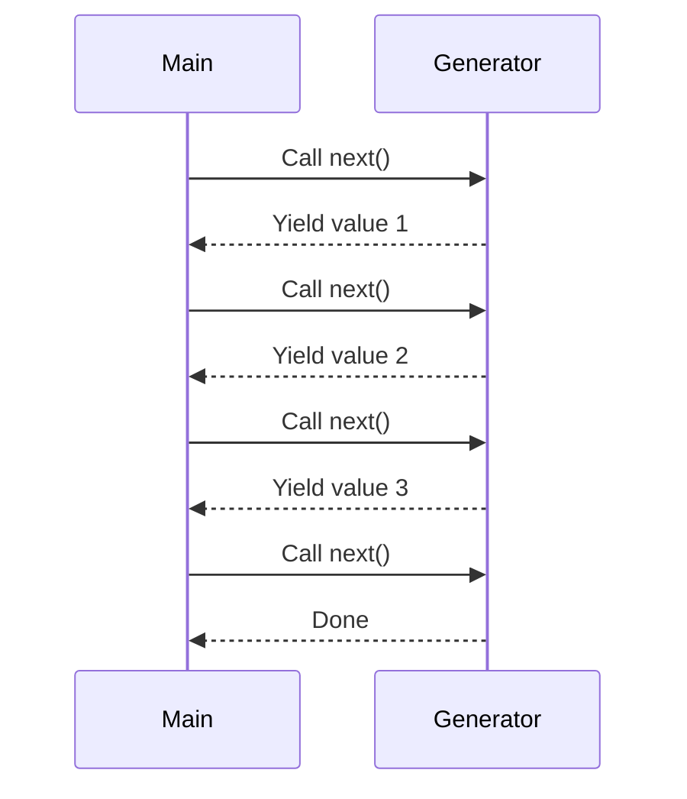

## 3.3.3 Generator Functions

In the world of JavaScript, generator functions stand out as a powerful feature introduced in ECMAScript 6 (ES6). They allow developers to write functions that can pause execution and resume later, making it possible to produce sequences of values on the fly. This capability is particularly useful for creating iterators, implementing lazy evaluation, and managing asynchronous flows. In this section, we will delve into the syntax, functionality, and practical applications of generator functions.

### Understanding Generator Functions

#### Syntax of Generator Functions

Generator functions are defined using the `function*` syntax. The asterisk (`*`) indicates that the function is a generator. Unlike regular functions, generator functions can pause their execution using the `yield` keyword and resume from where they left off.

```javascript
function* simpleGenerator() {
  yield 1;
  yield 2;
  yield 3;
}
```

In the example above, `simpleGenerator` is a generator function that yields three values: 1, 2, and 3. Each call to the generator's `next()` method returns an object with two properties: `value` and `done`. The `value` property contains the yielded value, while `done` is a boolean indicating whether the generator has completed its execution.

#### The `yield` Keyword

The `yield` keyword is used within a generator function to pause its execution and return a value. When the generator's `next()` method is called, execution resumes from the point where it was paused.

```javascript
function* countUpToThree() {
  console.log("Starting count...");
  yield 1;
  console.log("Yielded 1");
  yield 2;
  console.log("Yielded 2");
  yield 3;
  console.log("Yielded 3");
}

const counter = countUpToThree();

console.log(counter.next()); // { value: 1, done: false }
console.log(counter.next()); // { value: 2, done: false }
console.log(counter.next()); // { value: 3, done: false }
console.log(counter.next()); // { value: undefined, done: true }
```

In this example, the generator function `countUpToThree` logs messages to the console before and after each `yield` statement. The `next()` method is used to iterate through the generator, and the console output demonstrates how execution pauses and resumes.

### Iterating with Generator Functions

Generator functions are inherently iterable, meaning they can be used in loops and other constructs that work with iterators. The `for...of` loop is particularly useful for iterating over generator functions.

```javascript
function* fibonacciSequence() {
  let [prev, curr] = [0, 1];
  while (true) {
    yield curr;
    [prev, curr] = [curr, prev + curr];
  }
}

const fibonacci = fibonacciSequence();

for (let i = 0; i < 10; i++) {
  console.log(fibonacci.next().value);
}
```

In this example, the `fibonacciSequence` generator function produces an infinite sequence of Fibonacci numbers. The `for...of` loop iterates over the first ten numbers in the sequence, demonstrating how generator functions can be used to generate potentially infinite sequences.

### Use Cases for Generator Functions

#### Lazy Evaluation

One of the most compelling use cases for generator functions is lazy evaluation. Generators allow you to produce values on demand, which can be more efficient than computing all values upfront.

```javascript
function* lazyRange(start, end) {
  for (let i = start; i <= end; i++) {
    yield i;
  }
}

const range = lazyRange(1, 5);

console.log(range.next().value); // 1
console.log(range.next().value); // 2
// Values are generated only when needed
```

In this example, the `lazyRange` generator function produces numbers in a specified range. Values are generated only when requested, which can save memory and processing time.

#### Handling Asynchronous Flows

Generator functions can also be used to manage asynchronous flows in a more readable and maintainable way. By combining generators with promises, you can write asynchronous code that looks synchronous.

```javascript
function* asyncFlow() {
  const data1 = yield fetchData("url1");
  console.log(data1);
  const data2 = yield fetchData("url2");
  console.log(data2);
}

function fetchData(url) {
  return new Promise((resolve) => {
    setTimeout(() => resolve(`Data from ${url}`), 1000);
  });
}

function run(generator) {
  const iterator = generator();

  function iterate(iteration) {
    if (iteration.done) return;
    const promise = iteration.value;
    promise.then((data) => iterate(iterator.next(data)));
  }

  iterate(iterator.next());
}

run(asyncFlow);
```

In this example, the `asyncFlow` generator function uses `yield` to pause execution until data is fetched from a URL. The `run` function manages the generator's execution, resuming it when promises are resolved. This pattern can simplify complex asynchronous code.

### Visualizing Generator Function Execution

To better understand how generator functions work, let's visualize the execution flow using a sequence diagram.



This diagram illustrates the interaction between the main program and a generator function. Each call to `next()` resumes the generator's execution until a `yield` statement is encountered, at which point control returns to the main program.

### Best Practices for Using Generator Functions

- **Use Generators for Iteration**: Generators are ideal for creating custom iterators, especially when dealing with large datasets or infinite sequences.
- **Combine with Promises for Asynchronous Code**: Generators can simplify asynchronous code by making it appear synchronous. Use libraries like `co` or `redux-saga` to manage generator-based asynchronous flows.
- **Avoid Overuse**: While generators are powerful, they can add complexity if overused. Use them judiciously where they provide clear benefits.

### JavaScript Unique Features

JavaScript's implementation of generator functions is unique due to its integration with the language's event-driven, non-blocking architecture. This makes generators particularly useful for managing asynchronous operations in a way that aligns with JavaScript's concurrency model.

### Differences and Similarities with Other Patterns

Generator functions are often compared to iterators and async/await patterns. While all three are used for managing sequences of operations, generators offer a middle ground between the simplicity of iterators and the power of async/await for handling asynchronous flows.

### Try It Yourself

Experiment with the following code by modifying the range or adding additional `yield` statements to see how the generator function behaves.

```javascript
function* customGenerator() {
  yield "Hello";
  yield "World";
  yield "!";
}

const gen = customGenerator();

console.log(gen.next().value); // Hello
console.log(gen.next().value); // World
console.log(gen.next().value); // !
```

### Knowledge Check

To reinforce your understanding of generator functions, consider the following questions and exercises.

1. What is the purpose of the `yield` keyword in a generator function?
2. How does the `next()` method interact with a generator function?
3. Implement a generator function that produces the first `n` prime numbers.
4. How can generator functions be used to manage asynchronous flows?
5. Modify the `fibonacciSequence` example to stop after a certain number.

### Embrace the Journey

Remember, mastering generator functions is just one step in your journey to becoming a proficient JavaScript developer. As you continue to explore the language, you'll discover even more powerful features and patterns. Keep experimenting, stay curious, and enjoy the journey!

## Quiz: Mastering JavaScript Generator Functions



### What is the primary purpose of the `yield` keyword in a generator function?

- [x] To pause the function's execution and return a value
- [ ] To terminate the function's execution
- [ ] To declare a variable
- [ ] To define a function

> **Explanation:** The `yield` keyword is used to pause a generator function's execution and return a value to the caller.

### How do you define a generator function in JavaScript?

- [x] Using the `function*` syntax
- [ ] Using the `async` keyword
- [ ] Using the `yield` keyword
- [ ] Using the `function` keyword

> **Explanation:** Generator functions are defined using the `function*` syntax, where the asterisk indicates that the function is a generator.

### What does the `next()` method return when called on a generator?

- [x] An object with `value` and `done` properties
- [ ] A promise
- [ ] A string
- [ ] An array

> **Explanation:** The `next()` method returns an object with `value` and `done` properties, indicating the yielded value and whether the generator is complete.

### Which of the following is a common use case for generator functions?

- [x] Lazy evaluation
- [ ] Synchronous data fetching
- [ ] DOM manipulation
- [ ] CSS styling

> **Explanation:** Generator functions are commonly used for lazy evaluation, where values are produced on demand.

### How can generator functions be used to manage asynchronous flows?

- [x] By combining them with promises
- [ ] By using them with CSS
- [ ] By using them with HTML
- [ ] By using them with JSON

> **Explanation:** Generator functions can be combined with promises to manage asynchronous flows in a more readable way.

### What is the output of the following code?

```javascript
function* numbers() {
  yield 1;
  yield 2;
  yield 3;
}

const numGen = numbers();
console.log(numGen.next().value);
console.log(numGen.next().value);
console.log(numGen.next().value);
```

- [x] 1 2 3
- [ ] 1 1 1
- [ ] 2 3 4
- [ ] 3 2 1

> **Explanation:** The generator yields the values 1, 2, and 3 in sequence.

### What happens when a generator function completes its execution?

- [x] The `done` property of the `next()` method's return value is `true`
- [ ] The generator throws an error
- [ ] The generator restarts
- [ ] The generator returns `null`

> **Explanation:** When a generator function completes, the `done` property of the `next()` method's return value is `true`.

### Which of the following is a benefit of using generator functions?

- [x] They allow for lazy evaluation
- [ ] They improve CSS styling
- [ ] They enhance HTML rendering
- [ ] They simplify JSON parsing

> **Explanation:** Generator functions allow for lazy evaluation, producing values only when needed.

### How can you iterate over a generator function?

- [x] Using a `for...of` loop
- [ ] Using a `while` loop
- [ ] Using a `do...while` loop
- [ ] Using a `switch` statement

> **Explanation:** A `for...of` loop can be used to iterate over a generator function.

### True or False: Generator functions can be used to create infinite sequences.

- [x] True
- [ ] False

> **Explanation:** Generator functions can be used to create infinite sequences by using a loop that never terminates.


