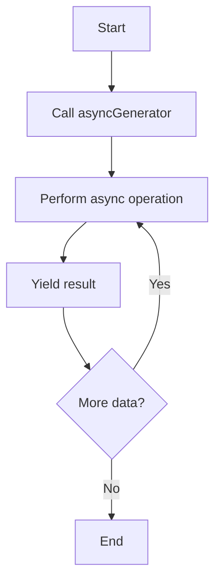

## 3.3.4 Asynchronous Generator Functions

Asynchronous generator functions are a powerful feature in JavaScript that combine the capabilities of generators and asynchronous operations. They allow you to work with asynchronous data streams in a more readable and efficient manner. In this section, we will explore what asynchronous generator functions are, how they work, and how you can use them to handle streams of data or asynchronous events effectively.

### Understanding Asynchronous Generator Functions

Asynchronous generator functions are defined using the `async function*` syntax. They return an asynchronous iterator, which can be consumed using the `for-await-of` loop. This combination allows you to pause and resume execution while waiting for asynchronous operations to complete, making it ideal for handling data streams or events that occur over time.

#### Key Characteristics

- **Asynchronous Execution**: Asynchronous generator functions can yield promises, allowing you to wait for asynchronous operations to complete before resuming execution.
- **Iterative Processing**: They enable you to process data one piece at a time, which is useful for handling large datasets or streams of data.
- **Backpressure Handling**: By yielding control back to the caller, asynchronous generators can help manage backpressure in data streams, preventing overwhelming the system with too much data at once.

### Syntax and Structure

The syntax for defining an asynchronous generator function is similar to that of a regular generator function, with the addition of the `async` keyword:

```javascript
async function* asyncGenerator() {
  // Perform asynchronous operations
  const data = await fetchData();
  yield data;

  // More asynchronous operations
  const moreData = await fetchMoreData();
  yield moreData;
}
```

In this example, `asyncGenerator` is an asynchronous generator function that performs asynchronous operations using `await` and yields the results.

### Consuming Asynchronous Iterables

To consume the values produced by an asynchronous generator, you use the `for-await-of` loop. This loop waits for each promise to resolve before proceeding to the next iteration, making it ideal for processing asynchronous data streams.

```javascript
async function processAsyncIterable() {
  for await (const value of asyncGenerator()) {
    console.log(value);
  }
}

processAsyncIterable();
```

### Practical Scenarios for Asynchronous Generators

Asynchronous generator functions are particularly useful in scenarios where you need to handle data streams or events that occur over time. Here are some practical examples:

#### 1. Handling Data Streams

Asynchronous generators can be used to process data streams, such as reading data from a network socket or a file. By yielding data as it becomes available, you can process it incrementally without waiting for the entire stream to be read.

```javascript
async function* readStream(stream) {
  const reader = stream.getReader();
  while (true) {
    const { done, value } = await reader.read();
    if (done) break;
    yield value;
  }
}

async function processStream(stream) {
  for await (const chunk of readStream(stream)) {
    console.log(chunk);
  }
}
```

#### 2. Polling APIs

When working with APIs that provide data updates at regular intervals, asynchronous generators can be used to poll the API and yield new data as it becomes available.

```javascript
async function* pollApi(url, interval) {
  while (true) {
    const response = await fetch(url);
    const data = await response.json();
    yield data;
    await new Promise(resolve => setTimeout(resolve, interval));
  }
}

async function processApiData(url, interval) {
  for await (const data of pollApi(url, interval)) {
    console.log(data);
  }
}
```

#### 3. Event Handling

Asynchronous generators can also be used to handle events, such as user interactions or system events, by yielding events as they occur.

```javascript
async function* eventStream(element, eventType) {
  const eventQueue = [];
  const listener = event => eventQueue.push(event);

  element.addEventListener(eventType, listener);

  try {
    while (true) {
      if (eventQueue.length > 0) {
        yield eventQueue.shift();
      } else {
        await new Promise(resolve => setTimeout(resolve, 100));
      }
    }
  } finally {
    element.removeEventListener(eventType, listener);
  }
}

async function processEvents(element, eventType) {
  for await (const event of eventStream(element, eventType)) {
    console.log(event);
  }
}
```

### Visualizing Asynchronous Generator Functions

To better understand how asynchronous generator functions work, let's visualize the process using a flowchart:



**Figure 1**: Flowchart illustrating the execution of an asynchronous generator function.

### Best Practices for Asynchronous Generators

- **Error Handling**: Always include error handling within your asynchronous generator functions to manage any exceptions that may occur during asynchronous operations.
- **Resource Management**: Ensure that resources, such as file handles or network connections, are properly managed and closed when the generator is no longer needed.
- **Performance Considerations**: Be mindful of the performance implications of using asynchronous generators, especially in scenarios with high-frequency data streams.

### Try It Yourself

To get a hands-on understanding of asynchronous generator functions, try modifying the examples provided. For instance, you can:

- Change the polling interval in the API polling example to see how it affects data retrieval.
- Experiment with different event types in the event handling example to see how asynchronous generators can be used to handle various events.

### Further Reading

For more information on asynchronous generator functions and related topics, consider exploring the following resources:

- [MDN Web Docs: Asynchronous Iteration](https://developer.mozilla.org/en-US/docs/Web/JavaScript/Reference/Statements/for-await...of)
- [JavaScript.info: Generators](https://javascript.info/generators-iterators)
- [Exploring ES2018 and Beyond](https://exploringjs.com/es2018-es2019/ch_async-iteration.html)

### Knowledge Check

To reinforce your understanding of asynchronous generator functions, try answering the following questions:

## Quiz: Mastering Asynchronous Generator Functions in JavaScript



### What keyword is used to define an asynchronous generator function in JavaScript?

- [x] async function*
- [ ] async function
- [ ] function*
- [ ] async*

> **Explanation:** Asynchronous generator functions are defined using the `async function*` syntax.

### Which loop is used to consume values from an asynchronous generator?

- [x] for-await-of
- [ ] for-of
- [ ] while
- [ ] do-while

> **Explanation:** The `for-await-of` loop is used to consume values from an asynchronous generator.

### What is a key benefit of using asynchronous generator functions?

- [x] They allow for iterative processing of asynchronous data streams.
- [ ] They simplify synchronous code execution.
- [ ] They eliminate the need for promises.
- [ ] They improve synchronous performance.

> **Explanation:** Asynchronous generator functions enable iterative processing of asynchronous data streams, making them ideal for handling large datasets or streams.

### How can you handle errors within an asynchronous generator function?

- [x] Use try-catch blocks within the generator function.
- [ ] Use a finally block outside the generator function.
- [ ] Use a global error handler.
- [ ] Ignore errors and let them propagate.

> **Explanation:** Error handling within asynchronous generator functions can be done using try-catch blocks to manage exceptions during asynchronous operations.

### In the context of asynchronous generators, what does "backpressure" refer to?

- [x] Managing the flow of data to prevent overwhelming the system.
- [ ] Increasing the speed of data processing.
- [ ] Reducing the size of data packets.
- [ ] Enhancing the quality of data.

> **Explanation:** Backpressure refers to managing the flow of data to prevent overwhelming the system with too much data at once.

### Which of the following is a practical use case for asynchronous generator functions?

- [x] Polling APIs for data updates.
- [ ] Sorting arrays synchronously.
- [ ] Performing mathematical calculations.
- [ ] Rendering static HTML pages.

> **Explanation:** Asynchronous generator functions are useful for polling APIs for data updates, as they can handle asynchronous data streams effectively.

### What is the purpose of the `yield` keyword in an asynchronous generator function?

- [x] To pause execution and return a value.
- [ ] To terminate the function immediately.
- [ ] To declare a variable.
- [ ] To create a new promise.

> **Explanation:** The `yield` keyword is used to pause execution and return a value from an asynchronous generator function.

### How do asynchronous generator functions help with resource management?

- [x] By allowing resources to be released when the generator is no longer needed.
- [ ] By automatically closing all open resources.
- [ ] By preventing resource allocation.
- [ ] By duplicating resources for redundancy.

> **Explanation:** Asynchronous generator functions allow resources to be released when the generator is no longer needed, ensuring proper resource management.

### True or False: Asynchronous generator functions can only be used with network requests.

- [ ] True
- [x] False

> **Explanation:** Asynchronous generator functions can be used in various scenarios, not just with network requests, including event handling and data streaming.

### What is the main advantage of using the `for-await-of` loop with asynchronous generators?

- [x] It waits for each promise to resolve before proceeding to the next iteration.
- [ ] It executes all iterations simultaneously.
- [ ] It converts synchronous code to asynchronous.
- [ ] It eliminates the need for error handling.

> **Explanation:** The `for-await-of` loop waits for each promise to resolve before proceeding to the next iteration, making it ideal for processing asynchronous data streams.



Remember, this is just the beginning. As you progress, you'll build more complex and interactive web applications. Keep experimenting, stay curious, and enjoy the journey!
