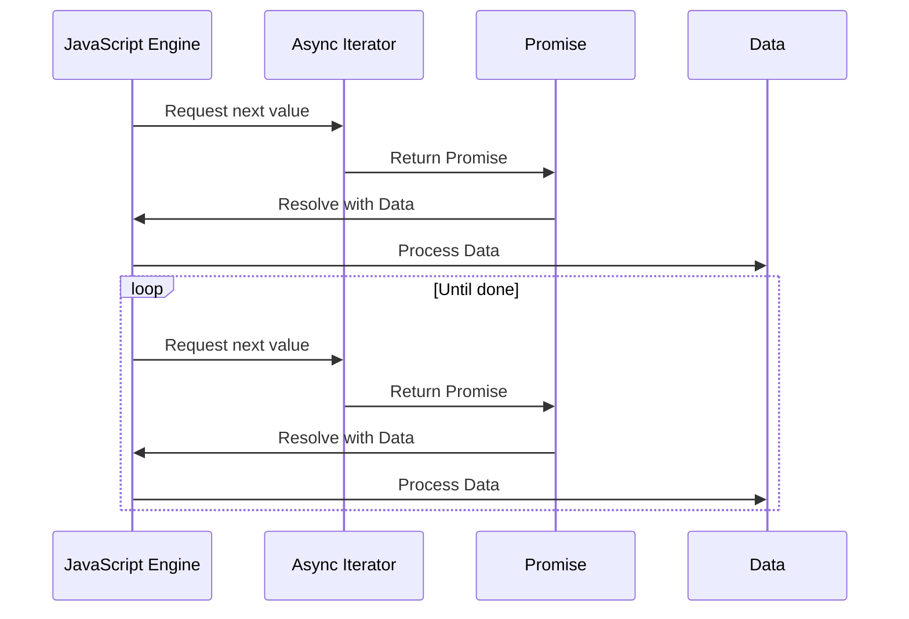

## 3.3.5 The `for-await-of` Loop

In modern web development, handling asynchronous operations efficiently is crucial. JavaScript, with its non-blocking nature, provides several constructs to manage asynchronous tasks. One such powerful feature introduced in ES2018 is the `for-await-of` loop. This loop allows us to iterate over asynchronous iterators, making it easier to work with streams of data that arrive over time.

### Understanding the `for-await-of` Loop

The `for-await-of` loop is an extension of the `for...of` loop, designed specifically for asynchronous iteration. It enables us to iterate over data sources that return promises, such as asynchronous generators or objects implementing the `AsyncIterable` protocol.

#### Syntax

The syntax of the `for-await-of` loop is similar to the `for...of` loop, but it requires the use of the `await` keyword:

```javascript
for await (const item of asyncIterable) {
  // Process each item
}
```

- **`asyncIterable`**: An object that implements the `AsyncIterable` protocol, meaning it has a `[Symbol.asyncIterator]` method that returns an `AsyncIterator`.
- **`item`**: The variable that holds each value yielded by the asynchronous iterator.

### Purpose and Use Cases

The `for-await-of` loop is particularly useful when dealing with:

- **Streams of Data**: When data is fetched in chunks, such as reading files or network streams.
- **Asynchronous Generators**: Functions that yield promises over time.
- **Handling APIs**: When consuming APIs that return data asynchronously.

#### Example: Fetching Data from an API

Let's consider an example where we fetch data from an API that provides paginated results. Using the `for-await-of` loop, we can process each page of data as it arrives:

```javascript
async function* fetchPages(url) {
  let page = 1;
  while (true) {
    const response = await fetch(`${url}?page=${page}`);
    if (!response.ok) break;
    const data = await response.json();
    yield data;
    page++;
  }
}

(async () => {
  for await (const pageData of fetchPages('https://api.example.com/data')) {
    console.log('Received page:', pageData);
  }
})();
```

In this example, `fetchPages` is an asynchronous generator function that yields each page of data. The `for-await-of` loop iterates over these pages, processing them as they are fetched.

### Error Handling in `for-await-of` Loops

Error handling is a critical aspect of working with asynchronous operations. The `for-await-of` loop allows us to handle errors using `try...catch` blocks, similar to other asynchronous constructs.

#### Example: Error Handling

Consider the previous example with added error handling:

```javascript
(async () => {
  try {
    for await (const pageData of fetchPages('https://api.example.com/data')) {
      console.log('Received page:', pageData);
    }
  } catch (error) {
    console.error('Error fetching data:', error);
  }
})();
```

Here, any errors that occur during the iteration, such as network failures or invalid responses, are caught and handled within the `catch` block.

### Differences from `for...of` Loops

While the `for...of` loop is used for synchronous iteration over iterable objects, the `for-await-of` loop is designed for asynchronous iteration. Here are some key differences:

- **Synchronous vs. Asynchronous**: `for...of` works with synchronous iterables, while `for-await-of` works with asynchronous iterables.
- **Use of `await`**: `for-await-of` requires the `await` keyword to pause execution until each promise is resolved.
- **Error Handling**: Errors in `for-await-of` can be caught using `try...catch`, whereas `for...of` typically handles errors synchronously.

### When to Use `for-await-of`

Use the `for-await-of` loop when:

- You need to process data from an asynchronous source, such as a network request or file stream.
- You are working with asynchronous generators that yield promises.
- You want to simplify the handling of asynchronous data streams without manually managing promise chains.

### Visualizing Asynchronous Iteration

To better understand how the `for-await-of` loop interacts with asynchronous iterators, let's visualize the process:



This diagram illustrates the sequence of operations in a `for-await-of` loop, where the JavaScript engine requests the next value from the async iterator, receives a promise, and processes the resolved data.

### Try It Yourself

Experiment with the `for-await-of` loop by modifying the code examples:

- **Change the Data Source**: Use a different API or data stream.
- **Add Error Scenarios**: Simulate network errors or invalid responses to test error handling.
- **Combine with Other Async Operations**: Integrate the loop with other asynchronous tasks, such as file reading or WebSocket communication.

### References and Further Reading

- [MDN Web Docs: for-await-of](https://developer.mozilla.org/en-US/docs/Web/JavaScript/Reference/Statements/for-await...of)
- [JavaScript Info: Async Iterators](https://javascript.info/async-iterators-generators)
- [W3Schools: JavaScript Async](https://www.w3schools.com/js/js_async.asp)

### Knowledge Check

To reinforce your understanding of the `for-await-of` loop, try answering these questions and challenges.

## Mastering the `for-await-of` Loop: Quiz



### What is the primary purpose of the `for-await-of` loop?

- [x] To iterate over asynchronous iterables
- [ ] To iterate over synchronous iterables
- [ ] To handle synchronous errors
- [ ] To create promises

> **Explanation:** The `for-await-of` loop is specifically designed to iterate over asynchronous iterables, allowing us to handle data streams that return promises.

### Which keyword is essential in the `for-await-of` loop?

- [ ] for
- [x] await
- [ ] async
- [ ] of

> **Explanation:** The `await` keyword is crucial in the `for-await-of` loop, as it pauses execution until each promise is resolved.

### How can errors be handled in a `for-await-of` loop?

- [x] Using try...catch blocks
- [ ] Using finally blocks
- [ ] Using error callbacks
- [ ] Using synchronous error handling

> **Explanation:** Errors in a `for-await-of` loop can be caught using `try...catch` blocks, similar to other asynchronous constructs.

### What type of objects can be used with the `for-await-of` loop?

- [ ] Synchronous iterables
- [x] Asynchronous iterables
- [ ] Arrays only
- [ ] Objects only

> **Explanation:** The `for-await-of` loop is used with asynchronous iterables, which implement the `AsyncIterable` protocol.

### Which of the following is a key difference between `for...of` and `for-await-of` loops?

- [x] `for-await-of` works with asynchronous iterables
- [ ] `for...of` requires the `await` keyword
- [ ] `for-await-of` is used for synchronous iteration
- [ ] `for...of` handles promises

> **Explanation:** The `for-await-of` loop is designed for asynchronous iterables, while `for...of` is used for synchronous iteration.

### Can the `for-await-of` loop be used with synchronous iterables?

- [ ] Yes, with additional configuration
- [x] No, it is only for asynchronous iterables
- [ ] Yes, but it requires a polyfill
- [ ] Yes, with a different syntax

> **Explanation:** The `for-await-of` loop is specifically for asynchronous iterables and cannot be used with synchronous iterables.

### What happens if a promise is rejected in a `for-await-of` loop?

- [x] The error can be caught with a try...catch block
- [ ] The loop continues without interruption
- [ ] The loop stops immediately
- [ ] The error is ignored

> **Explanation:** If a promise is rejected, the error can be caught using a `try...catch` block, allowing for graceful error handling.

### Which of the following is an example of an asynchronous iterable?

- [ ] An array
- [x] An asynchronous generator
- [ ] A plain object
- [ ] A synchronous function

> **Explanation:** An asynchronous generator is an example of an asynchronous iterable, as it yields promises over time.

### How does the `for-await-of` loop handle promise resolution?

- [x] It waits for each promise to resolve before proceeding
- [ ] It resolves all promises simultaneously
- [ ] It ignores unresolved promises
- [ ] It throws an error for unresolved promises

> **Explanation:** The `for-await-of` loop waits for each promise to resolve before proceeding to the next iteration, ensuring sequential processing.

### True or False: The `for-await-of` loop can be used in non-async functions.

- [ ] True
- [x] False

> **Explanation:** The `for-await-of` loop must be used within an `async` function, as it relies on the `await` keyword to handle promises.



Remember, mastering the `for-await-of` loop is a step towards efficient asynchronous programming in JavaScript. Keep experimenting, stay curious, and enjoy the journey!
