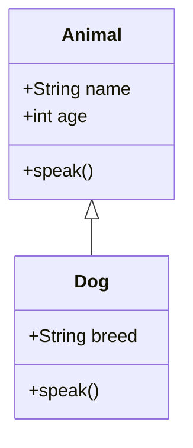

## 3.4 Classes and Object Creation Patterns

In modern JavaScript development, understanding classes and object creation patterns is crucial for building robust and maintainable applications. This section delves into the ES6 class syntax, object-oriented programming (OOP) principles, and design patterns that facilitate efficient object creation.

### Understanding ES6 Class Syntax

JavaScript classes, introduced in ECMAScript 2015 (ES6), provide a more intuitive syntax for creating objects and implementing inheritance. Although classes in JavaScript are syntactical sugar over its prototype-based inheritance, they offer a cleaner and more familiar structure for developers coming from class-based languages like Java or C++.

#### Class Declarations

A class in JavaScript is defined using the `class` keyword. Here's a simple example:

```javascript
class Animal {
  constructor(name, age) {
    this.name = name;
    this.age = age;
  }

  speak() {
    console.log(`${this.name} makes a noise.`);
  }
}

const dog = new Animal('Rex', 5);
dog.speak(); // Output: Rex makes a noise.
```

- **Constructor**: The `constructor` method is a special method for creating and initializing an object created with a class. In the example above, `constructor(name, age)` initializes the `name` and `age` properties.

- **Methods**: Methods are defined within the class body. In this case, `speak()` is a method that logs a message to the console.

#### Inheritance

JavaScript classes support inheritance, allowing one class to extend another. This is achieved using the `extends` keyword.

```javascript
class Dog extends Animal {
  constructor(name, age, breed) {
    super(name, age);
    this.breed = breed;
  }

  speak() {
    console.log(`${this.name} barks.`);
  }
}

const bulldog = new Dog('Buddy', 3, 'Bulldog');
bulldog.speak(); // Output: Buddy barks.
```

- **`extends` Keyword**: The `Dog` class extends `Animal`, inheriting its properties and methods.

- **`super` Keyword**: The `super` keyword is used to call the constructor of the parent class (`Animal`), ensuring that the `name` and `age` properties are initialized.

#### Static Methods and Properties

Static methods and properties belong to the class itself rather than any object instance. They are defined using the `static` keyword.

```javascript
class MathUtils {
  static add(a, b) {
    return a + b;
  }
}

console.log(MathUtils.add(5, 3)); // Output: 8
```

- **Static Methods**: `add` is a static method that can be called without creating an instance of `MathUtils`.

### Class-Based vs. Prototype-Based Inheritance

JavaScript's class syntax is built on top of its prototype-based inheritance model. Let's compare these two approaches:

#### Prototype-Based Inheritance

Before ES6, JavaScript relied on prototypes for inheritance. Here's how you might define a similar `Animal` class using prototypes:

```javascript
function Animal(name, age) {
  this.name = name;
  this.age = age;
}

Animal.prototype.speak = function() {
  console.log(`${this.name} makes a noise.`);
};

const cat = new Animal('Whiskers', 2);
cat.speak(); // Output: Whiskers makes a noise.
```

- **Prototype Chain**: Methods are added to the `Animal.prototype`, allowing all instances to share the same method.

#### Class-Based Inheritance

The class syntax simplifies the creation of objects and inheritance, making the code more readable and maintainable. However, under the hood, it still uses the prototype chain.

### Design Patterns for Object Creation

Design patterns provide reusable solutions to common problems in software design. Let's explore two popular patterns related to object creation: the Factory Pattern and the Singleton Pattern.

#### Factory Pattern

The Factory Pattern provides an interface for creating objects in a superclass but allows subclasses to alter the type of objects that will be created. It's useful when the exact type of object isn't known until runtime.

```javascript
class Car {
  constructor(make, model) {
    this.make = make;
    this.model = model;
  }

  drive() {
    console.log(`Driving a ${this.make} ${this.model}.`);
  }
}

class CarFactory {
  static createCar(type) {
    switch (type) {
      case 'sedan':
        return new Car('Toyota', 'Camry');
      case 'suv':
        return new Car('Ford', 'Explorer');
      default:
        throw new Error('Unknown car type.');
    }
  }
}

const myCar = CarFactory.createCar('sedan');
myCar.drive(); // Output: Driving a Toyota Camry.
```

- **Factory Method**: `createCar` is a static method that returns a new `Car` object based on the specified type.

#### Singleton Pattern

The Singleton Pattern ensures a class has only one instance and provides a global point of access to it. This is useful for managing shared resources or configurations.

```javascript
class Singleton {
  constructor() {
    if (Singleton.instance) {
      return Singleton.instance;
    }
    Singleton.instance = this;
    this.data = {};
  }

  set(key, value) {
    this.data[key] = value;
  }

  get(key) {
    return this.data[key];
  }
}

const singletonA = new Singleton();
const singletonB = new Singleton();

singletonA.set('name', 'Singleton Instance');
console.log(singletonB.get('name')); // Output: Singleton Instance
```

- **Single Instance**: The `Singleton` class ensures that only one instance exists by checking `Singleton.instance`.

### JavaScript Unique Features

JavaScript's flexibility allows for unique implementations of these patterns. For instance, closures can be used to create private variables within classes, enhancing encapsulation.

```javascript
class Counter {
  constructor() {
    let count = 0;
    this.increment = function() {
      count++;
      console.log(count);
    };
  }
}

const counter = new Counter();
counter.increment(); // Output: 1
counter.increment(); // Output: 2
```

- **Closure**: The `count` variable is private to the `Counter` class, accessible only through the `increment` method.

### Visualizing Class and Prototype Relationships

To better understand the relationship between classes and prototypes, consider the following diagram:



- **Diagram Explanation**: This diagram illustrates the inheritance relationship between `Animal` and `Dog`, where `Dog` extends `Animal`.

### Try It Yourself

Experiment with the code examples provided. Try modifying the `CarFactory` to include more car types or add additional methods to the `Singleton` class. Observe how changes affect the behavior of your objects.

### Knowledge Check

- What is the purpose of the `super` keyword in JavaScript classes?
- How do static methods differ from instance methods?
- Explain the difference between class-based and prototype-based inheritance.
- How does the Factory Pattern help in object creation?
- What is the Singleton Pattern, and when should it be used?

### Summary

In this section, we've explored JavaScript classes and object creation patterns, including the ES6 class syntax, inheritance, and design patterns like Factory and Singleton. Understanding these concepts is essential for writing efficient and maintainable JavaScript code.

Remember, this is just the beginning. As you progress, you'll build more complex and interactive applications. Keep experimenting, stay curious, and enjoy the journey!

## Quiz: Mastering JavaScript Classes and Object Creation Patterns



### What is the purpose of the `super` keyword in JavaScript classes?

- [x] To call the constructor of the parent class
- [ ] To define a static method
- [ ] To create a new instance of a class
- [ ] To declare a private variable

> **Explanation:** The `super` keyword is used to call the constructor of the parent class, allowing access to its properties and methods.

### How do static methods differ from instance methods?

- [x] Static methods belong to the class itself, not instances
- [ ] Static methods can only be called on instances
- [ ] Static methods are private by default
- [ ] Static methods cannot access `this`

> **Explanation:** Static methods belong to the class itself and can be called without creating an instance. They do not have access to instance-specific data.

### What is the main advantage of using the Factory Pattern?

- [x] It provides a way to create objects without specifying the exact class
- [ ] It ensures only one instance of a class exists
- [ ] It allows for private variables
- [ ] It simplifies inheritance

> **Explanation:** The Factory Pattern provides an interface for creating objects, allowing subclasses to determine the type of objects created.

### In JavaScript, what is a class?

- [x] A syntactical sugar over prototype-based inheritance
- [ ] A function that returns an object
- [ ] A method that initializes an object
- [ ] A static method

> **Explanation:** JavaScript classes are syntactical sugar over its prototype-based inheritance, providing a more familiar structure for developers.

### Which pattern ensures a class has only one instance?

- [x] Singleton Pattern
- [ ] Factory Pattern
- [ ] Observer Pattern
- [ ] Strategy Pattern

> **Explanation:** The Singleton Pattern ensures a class has only one instance and provides a global point of access to it.

### How can private variables be implemented in JavaScript classes?

- [x] Using closures
- [ ] Using the `private` keyword
- [ ] Using static methods
- [ ] Using the `super` keyword

> **Explanation:** Private variables can be implemented using closures, allowing variables to be accessible only within the class.

### What is the relationship between classes and prototypes in JavaScript?

- [x] Classes are built on top of prototypes
- [ ] Classes replace prototypes
- [ ] Classes do not use prototypes
- [ ] Classes and prototypes are unrelated

> **Explanation:** JavaScript classes are built on top of its prototype-based inheritance model, providing a cleaner syntax.

### What does the `extends` keyword do in JavaScript?

- [x] It allows a class to inherit from another class
- [ ] It creates a new instance of a class
- [ ] It defines a static method
- [ ] It declares a private variable

> **Explanation:** The `extends` keyword is used to create a class that inherits properties and methods from another class.

### Which method is used to initialize an object in a class?

- [x] constructor
- [ ] init
- [ ] setup
- [ ] create

> **Explanation:** The `constructor` method is used to initialize an object created with a class.

### True or False: JavaScript classes can have multiple constructors.

- [ ] True
- [x] False

> **Explanation:** JavaScript classes can have only one constructor method. Attempting to define more than one will result in a syntax error.




