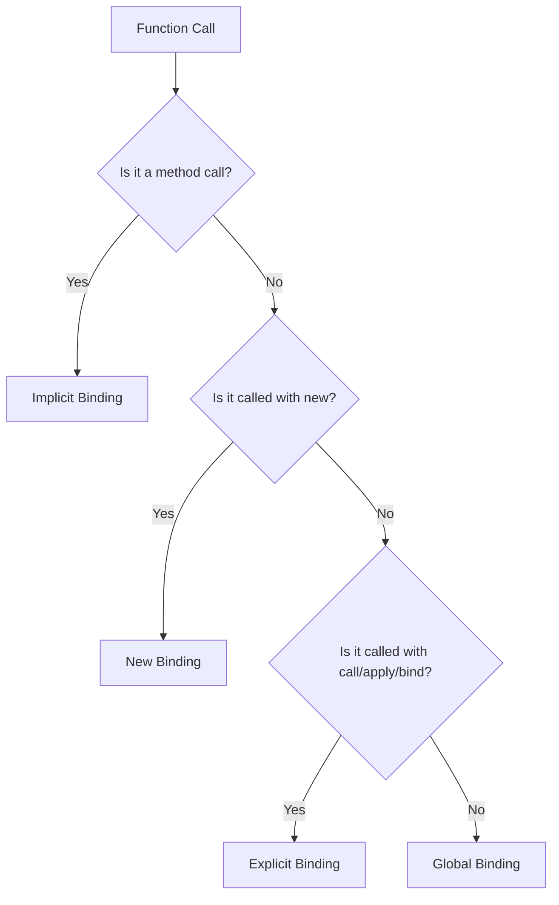

## 3.5 Understanding the `this` Keyword and Binding Functions

The `this` keyword in JavaScript is a fundamental concept that can be perplexing due to its dynamic nature. Understanding how `this` works is crucial for mastering JavaScript, especially when dealing with object-oriented programming, event handling, and asynchronous code. In this section, we will explore how `this` is determined in various execution contexts, discuss the four rules of `this` binding, and demonstrate how to control `this` using methods like `call()`, `apply()`, and `bind()`. We will also delve into how arrow functions affect the value of `this` and highlight common mistakes and how to avoid them.

### The Basics of `this` in JavaScript

In JavaScript, `this` is a special keyword that refers to the object that is executing the current function. The value of `this` is determined by how a function is called, not where it is defined. This dynamic nature makes `this` both powerful and tricky to use correctly.

### The Four Rules of `this` Binding

To understand how `this` is determined, we need to explore the four rules of `this` binding: global, implicit, explicit, and `new` binding.

#### 1. Global Binding

When a function is called in the global context, `this` refers to the global object. In a browser, this is typically the `window` object.

```javascript
function showGlobalThis() {
  console.log(this); // In a browser, this will log the window object
}

showGlobalThis();
```

#### 2. Implicit Binding

When a function is called as a method of an object, `this` refers to the object that owns the method.

```javascript
const person = {
  name: 'Alice',
  greet: function() {
    console.log(`Hello, my name is ${this.name}`);
  }
};

person.greet(); // "Hello, my name is Alice"
```

In this example, `this` refers to the `person` object because `greet` is called as a method of `person`.

#### 3. Explicit Binding

JavaScript provides methods like `call()`, `apply()`, and `bind()` to explicitly set the value of `this`.

- **`call()`**: Invokes a function with a specified `this` value and arguments provided individually.

```javascript
function introduce(language) {
  console.log(`Hello, my name is ${this.name} and I speak ${language}`);
}

const user = { name: 'Bob' };

introduce.call(user, 'English'); // "Hello, my name is Bob and I speak English"
```

- **`apply()`**: Similar to `call()`, but arguments are provided as an array.

```javascript
introduce.apply(user, ['Spanish']); // "Hello, my name is Bob and I speak Spanish"
```

- **`bind()`**: Returns a new function with a specified `this` value, allowing for later invocation.

```javascript
const boundIntroduce = introduce.bind(user);
boundIntroduce('French'); // "Hello, my name is Bob and I speak French"
```

#### 4. `new` Binding

When a function is invoked with the `new` keyword, `this` is bound to the new object being created.

```javascript
function Car(model) {
  this.model = model;
}

const myCar = new Car('Toyota');
console.log(myCar.model); // "Toyota"
```

### Arrow Functions and `this`

Arrow functions in JavaScript have a unique behavior regarding `this`. Unlike regular functions, arrow functions do not have their own `this` context. Instead, they inherit `this` from the surrounding lexical scope at the time they are defined.

```javascript
const team = {
  name: 'Developers',
  members: ['Alice', 'Bob'],
  showMembers: function() {
    this.members.forEach(member => {
      console.log(`${member} is part of ${this.name}`);
    });
  }
};

team.showMembers();
// "Alice is part of Developers"
// "Bob is part of Developers"
```

In this example, the arrow function inside `forEach` inherits `this` from the `showMembers` method, which refers to the `team` object.

### Common Mistakes and How to Avoid Them

1. **Losing `this` Context in Callbacks**: When passing a method as a callback, `this` can be lost. Use `bind()` or arrow functions to preserve `this`.

```javascript
const button = document.getElementById('myButton');

button.addEventListener('click', team.showMembers.bind(team));
```

2. **Confusing Arrow Functions with Regular Functions**: Remember that arrow functions do not have their own `this`. Use regular functions when you need a dynamic `this`.

3. **Using `this` in Global Scope**: Be cautious when using `this` in the global scope, as it refers to the global object, which can lead to unexpected behavior.

### Visualizing `this` Binding

To better understand how `this` works, let's visualize the different binding rules using a flowchart.



This flowchart illustrates the decision-making process for determining the value of `this` in a function call.

### Try It Yourself

Experiment with the following code examples to deepen your understanding of `this`:

1. Modify the `introduce` function to include more personal details and use `call()` and `apply()` to pass different objects and arguments.
2. Create a new object with a method that uses an arrow function and observe how `this` behaves differently compared to a regular function.
3. Use `bind()` to create a partially applied function and explore how it can be used in different contexts.

### References and Further Reading

- [MDN Web Docs: `this`](https://developer.mozilla.org/en-US/docs/Web/JavaScript/Reference/Operators/this)
- [JavaScript.info: `this`](https://javascript.info/this)
- [W3Schools: JavaScript `this` Keyword](https://www.w3schools.com/js/js_this.asp)

### Knowledge Check

- What are the four rules of `this` binding in JavaScript?
- How do arrow functions affect the value of `this`?
- What is the difference between `call()`, `apply()`, and `bind()`?

### Summary

Understanding the `this` keyword and how to control it is essential for writing effective JavaScript code. By mastering the four rules of `this` binding and using methods like `call()`, `apply()`, and `bind()`, you can ensure that your functions behave as expected in different contexts. Remember to leverage arrow functions when you need to inherit `this` from the surrounding scope, and be mindful of common pitfalls to avoid unexpected behavior.

### Embrace the Journey

Remember, mastering `this` is just one step in your JavaScript journey. As you continue to explore and experiment, you'll gain a deeper understanding of how JavaScript works and how to harness its full potential. Keep practicing, stay curious, and enjoy the journey!

## Quiz: Mastering the `this` Keyword and Function Binding in JavaScript



### What does `this` refer to in a global function call?

- [x] The global object
- [ ] The function itself
- [ ] The window object in Node.js
- [ ] The document object

> **Explanation:** In a global function call, `this` refers to the global object, which is `window` in browsers and `global` in Node.js.

### How does `this` behave in an arrow function?

- [x] It inherits `this` from the surrounding lexical scope
- [ ] It creates its own `this` context
- [ ] It always refers to the global object
- [ ] It refers to the function itself

> **Explanation:** Arrow functions do not have their own `this` context; they inherit `this` from the surrounding lexical scope.

### Which method can be used to explicitly set `this` for a function call?

- [x] `call()`
- [ ] `apply()`
- [ ] `bind()`
- [ ] `setThis()`

> **Explanation:** Both `call()` and `apply()` can be used to explicitly set `this` for a function call.

### What is the purpose of the `bind()` method?

- [x] To create a new function with a specified `this` value
- [ ] To immediately invoke a function with a specified `this` value
- [ ] To apply an array of arguments to a function
- [ ] To change the prototype of a function

> **Explanation:** `bind()` creates a new function with a specified `this` value, which can be invoked later.

### What happens when a function is called with the `new` keyword?

- [x] `this` is bound to the new object being created
- [ ] `this` is bound to the global object
- [ ] `this` is undefined
- [ ] `this` is bound to the function itself

> **Explanation:** When a function is called with `new`, `this` is bound to the new object being created.

### How can you preserve `this` in a callback function?

- [x] Use `bind()` to bind `this` to the callback
- [ ] Use `apply()` to set `this` in the callback
- [ ] Use `call()` to set `this` in the callback
- [ ] Use `setThis()` to set `this` in the callback

> **Explanation:** Using `bind()` allows you to preserve `this` in a callback function by binding it to the desired context.

### Which of the following is a common mistake when using `this`?

- [x] Losing `this` context in callbacks
- [ ] Using `this` in arrow functions
- [ ] Using `this` in method calls
- [ ] Using `this` in constructors

> **Explanation:** A common mistake is losing `this` context in callbacks, which can be avoided by using `bind()` or arrow functions.

### What is the result of calling a method without an object context?

- [x] `this` refers to the global object
- [ ] `this` is undefined
- [ ] `this` refers to the method itself
- [ ] `this` refers to the last object used

> **Explanation:** When a method is called without an object context, `this` refers to the global object.

### How does `apply()` differ from `call()`?

- [x] `apply()` takes an array of arguments
- [ ] `apply()` takes individual arguments
- [ ] `apply()` changes the prototype of a function
- [ ] `apply()` creates a new function

> **Explanation:** `apply()` takes an array of arguments, whereas `call()` takes individual arguments.

### True or False: Arrow functions have their own `this` context.

- [ ] True
- [x] False

> **Explanation:** False. Arrow functions do not have their own `this` context; they inherit `this` from the surrounding lexical scope.


