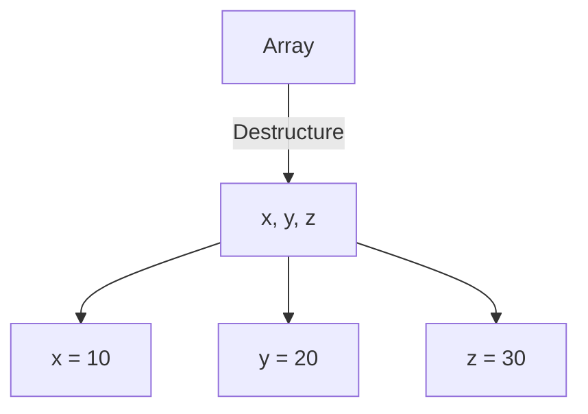
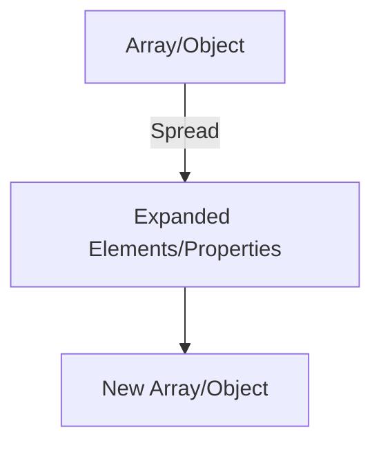

## 3.6 Destructuring and Spread Syntax

JavaScript's destructuring assignment and spread syntax are powerful features introduced in ECMAScript 6 (ES6) that simplify the process of extracting values from arrays or objects and combining them. These features enhance code readability and maintainability, making them essential tools for modern web development. In this section, we will explore these concepts in detail, providing examples and best practices to help you master their use.

### Understanding Destructuring Assignment

Destructuring assignment allows you to unpack values from arrays or properties from objects into distinct variables. This feature is particularly useful for simplifying code that deals with complex data structures.

#### Array Destructuring

Array destructuring enables you to extract values from an array and assign them to variables in a single, concise statement. Here's a basic example:

```javascript
const coordinates = [10, 20, 30];
const [x, y, z] = coordinates;

console.log(x); // Output: 10
console.log(y); // Output: 20
console.log(z); // Output: 30
```

In this example, the values from the `coordinates` array are unpacked into the variables `x`, `y`, and `z`.

##### Default Values

You can provide default values for variables in case the array does not contain enough elements:

```javascript
const colors = ["red"];
const [primary, secondary = "blue"] = colors;

console.log(primary);   // Output: red
console.log(secondary); // Output: blue
```

Here, `secondary` is assigned a default value of `"blue"` because the `colors` array does not have a second element.

##### Skipping Elements

You can skip elements in an array by leaving the corresponding variable position empty:

```javascript
const numbers = [1, 2, 3, 4];
const [, , third] = numbers;

console.log(third); // Output: 3
```

In this case, the first two elements are skipped, and only the third element is assigned to the variable `third`.

#### Object Destructuring

Object destructuring allows you to extract properties from an object and assign them to variables. Here's a simple example:

```javascript
const person = { name: "Alice", age: 25 };
const { name, age } = person;

console.log(name); // Output: Alice
console.log(age);  // Output: 25
```

In this example, the `name` and `age` properties are extracted from the `person` object.

##### Renaming Variables

You can rename variables during destructuring by using a colon (`:`) to specify the new variable name:

```javascript
const user = { username: "john_doe", email: "john@example.com" };
const { username: userName, email: userEmail } = user;

console.log(userName);  // Output: john_doe
console.log(userEmail); // Output: john@example.com
```

##### Nested Destructuring

Destructuring can be nested to extract values from nested objects or arrays:

```javascript
const employee = {
  id: 1,
  name: "Bob",
  address: {
    city: "New York",
    zip: "10001"
  }
};

const {
  name,
  address: { city, zip }
} = employee;

console.log(name); // Output: Bob
console.log(city); // Output: New York
console.log(zip);  // Output: 10001
```

In this example, the `city` and `zip` properties are extracted from the nested `address` object.

### The Spread Operator (`...`)

The spread operator (`...`) is used to expand elements of an iterable (like an array) or properties of an object. It is a versatile tool for copying, combining, and manipulating data structures.

#### Expanding Arrays

The spread operator can be used to expand elements of an array:

```javascript
const numbers = [1, 2, 3];
const moreNumbers = [...numbers, 4, 5, 6];

console.log(moreNumbers); // Output: [1, 2, 3, 4, 5, 6]
```

In this example, the `numbers` array is expanded, and additional elements are added to create a new array `moreNumbers`.

#### Copying Arrays

You can create a shallow copy of an array using the spread operator:

```javascript
const originalArray = [1, 2, 3];
const copiedArray = [...originalArray];

console.log(copiedArray); // Output: [1, 2, 3]
```

This creates a new array `copiedArray` that is a shallow copy of `originalArray`.

#### Combining Arrays

The spread operator is also useful for combining multiple arrays:

```javascript
const array1 = [1, 2];
const array2 = [3, 4];
const combinedArray = [...array1, ...array2];

console.log(combinedArray); // Output: [1, 2, 3, 4]
```

In this example, `array1` and `array2` are combined into a single array `combinedArray`.

#### Expanding Objects

The spread operator can be used to expand properties of an object:

```javascript
const obj1 = { a: 1, b: 2 };
const obj2 = { ...obj1, c: 3 };

console.log(obj2); // Output: { a: 1, b: 2, c: 3 }
```

Here, the properties of `obj1` are expanded into `obj2`, and an additional property `c` is added.

#### Copying Objects

You can create a shallow copy of an object using the spread operator:

```javascript
const originalObject = { a: 1, b: 2 };
const copiedObject = { ...originalObject };

console.log(copiedObject); // Output: { a: 1, b: 2 }
```

This creates a new object `copiedObject` that is a shallow copy of `originalObject`.

#### Combining Objects

The spread operator can also be used to combine multiple objects:

```javascript
const objA = { x: 1 };
const objB = { y: 2 };
const combinedObject = { ...objA, ...objB };

console.log(combinedObject); // Output: { x: 1, y: 2 }
```

In this example, `objA` and `objB` are combined into a single object `combinedObject`.

### Use Cases and Best Practices

Destructuring and the spread operator are powerful tools for writing clean and concise code. Here are some best practices and use cases:

- **Simplify Function Parameters**: Use destructuring to extract specific properties from objects passed as function parameters.

  ```javascript
  function displayUser({ name, age }) {
    console.log(`Name: ${name}, Age: ${age}`);
  }

  const user = { name: "Alice", age: 25 };
  displayUser(user); // Output: Name: Alice, Age: 25
  ```

- **Handle Default Values**: Use default values in destructuring to handle missing data gracefully.

  ```javascript
  const settings = { theme: "dark" };
  const { theme, language = "en" } = settings;

  console.log(language); // Output: en
  ```

- **Combine and Copy Data Structures**: Use the spread operator to combine and copy arrays or objects efficiently.

  ```javascript
  const defaults = { fontSize: 14, color: "black" };
  const userSettings = { color: "blue" };
  const finalSettings = { ...defaults, ...userSettings };

  console.log(finalSettings); // Output: { fontSize: 14, color: "blue" }
  ```

- **Avoid Mutating Original Data**: When copying or combining data structures, use the spread operator to avoid mutating the original data.

### Visualizing Destructuring and Spread Syntax

To better understand how destructuring and spread syntax work, let's visualize these concepts using Mermaid.js diagrams.

#### Array Destructuring Diagram



*Caption: This diagram illustrates how array destructuring assigns values from an array to individual variables.*

#### Object Destructuring Diagram

```mermaid
graph TD;
    A[Object] -->|Destructure| B{name, age}
    B --> C[name = "Alice"]
    B --> D[age = 25]
```

*Caption: This diagram shows how object destructuring extracts properties from an object into variables.*

#### Spread Operator Diagram



*Caption: This diagram demonstrates how the spread operator expands elements of an array or properties of an object.*

### References and Further Reading

For more information on destructuring and spread syntax, consider exploring the following resources:

- [MDN Web Docs: Destructuring Assignment](https://developer.mozilla.org/en-US/docs/Web/JavaScript/Reference/Operators/Destructuring_assignment)
- [MDN Web Docs: Spread Syntax](https://developer.mozilla.org/en-US/docs/Web/JavaScript/Reference/Operators/Spread_syntax)
- [JavaScript Info: Destructuring Assignment](https://javascript.info/destructuring-assignment)
- [JavaScript Info: Spread Syntax](https://javascript.info/rest-parameters-spread)

### Knowledge Check

Let's test your understanding of destructuring and spread syntax with a few questions:

- **What is the purpose of destructuring assignment in JavaScript?**
- **How can you provide default values when destructuring arrays or objects?**
- **What is the spread operator used for in JavaScript?**
- **How can you combine two arrays using the spread operator?**
- **What are some best practices for using destructuring and spread syntax?**

### Exercises

Try these exercises to reinforce your understanding of destructuring and spread syntax:

1. **Exercise 1**: Given an array `[5, 10, 15, 20]`, use destructuring to extract the first and third elements into variables `a` and `b`.

2. **Exercise 2**: Given an object `{ firstName: "John", lastName: "Doe", age: 30 }`, use destructuring to extract the `firstName` and `age` properties into variables `fName` and `userAge`.

3. **Exercise 3**: Use the spread operator to combine two arrays `[1, 2, 3]` and `[4, 5, 6]` into a single array.

4. **Exercise 4**: Create a function that accepts an object with properties `title` and `author`, and uses destructuring to print a message in the format "Title: [title], Author: [author]".

5. **Exercise 5**: Given two objects `{ a: 1, b: 2 }` and `{ b: 3, c: 4 }`, use the spread operator to combine them into a single object.

### Embrace the Journey

Remember, mastering destructuring and spread syntax is just the beginning. As you continue to explore JavaScript, you'll discover even more ways to write clean, efficient, and maintainable code. Keep experimenting, stay curious, and enjoy the journey!

## Quiz: Mastering Destructuring and Spread Syntax



### What is the primary purpose of destructuring assignment in JavaScript?

- [x] To extract values from arrays or objects into distinct variables
- [ ] To create new arrays or objects
- [ ] To iterate over arrays or objects
- [ ] To sort arrays or objects

> **Explanation:** Destructuring assignment is used to unpack values from arrays or properties from objects into distinct variables.

### How can you provide default values when destructuring arrays?

- [x] By specifying a default value after the variable name
- [ ] By using a separate function
- [ ] By using the `default` keyword
- [ ] By using the `setDefault` method

> **Explanation:** Default values can be provided by specifying them after the variable name during destructuring.

### What does the spread operator (`...`) do in JavaScript?

- [x] Expands elements of an iterable or properties of an object
- [ ] Concatenates strings
- [ ] Iterates over arrays
- [ ] Sorts arrays

> **Explanation:** The spread operator is used to expand elements of an iterable or properties of an object.

### How can you combine two arrays using the spread operator?

- [x] By using the spread operator inside a new array
- [ ] By using the `concat` method
- [ ] By using the `join` method
- [ ] By using the `merge` method

> **Explanation:** The spread operator can be used inside a new array to combine two arrays.

### What is a best practice when using destructuring and spread syntax?

- [x] Use them to simplify code and avoid mutating original data
- [ ] Use them only for arrays
- [ ] Avoid using them in functions
- [ ] Use them to sort data

> **Explanation:** Destructuring and spread syntax should be used to simplify code and avoid mutating original data.

### Can destructuring be used with nested objects?

- [x] Yes
- [ ] No

> **Explanation:** Destructuring can be used to extract values from nested objects.

### What is the result of using the spread operator on an object?

- [x] It creates a shallow copy of the object
- [ ] It creates a deep copy of the object
- [ ] It merges the object with another object
- [ ] It deletes properties from the object

> **Explanation:** The spread operator creates a shallow copy of the object.

### How can you rename variables during object destructuring?

- [x] By using a colon (`:`) to specify the new variable name
- [ ] By using the `rename` method
- [ ] By using the `as` keyword
- [ ] By using the `alias` keyword

> **Explanation:** Variables can be renamed during object destructuring by using a colon (`:`) to specify the new variable name.

### What is the output of the following code?
```javascript
const [a, , b] = [1, 2, 3];
console.log(a, b);
```

- [x] 1 3
- [ ] 1 2
- [ ] 2 3
- [ ] 3 1

> **Explanation:** The code skips the second element and assigns the first and third elements to `a` and `b`, respectively.

### True or False: The spread operator can be used to expand both arrays and objects.

- [x] True
- [ ] False

> **Explanation:** The spread operator can be used to expand elements of arrays and properties of objects.




