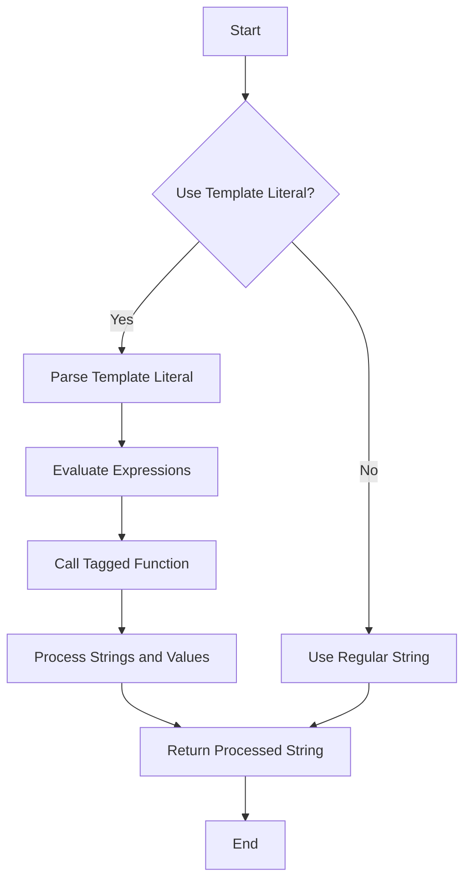

## 3.7 Template Literals and Tagged Templates

In modern JavaScript development, string manipulation is a fundamental task. Template literals and tagged templates provide powerful tools for developers to handle strings more effectively. This section will guide you through the syntax and usage of template literals, demonstrate how to use tagged templates for custom processing, and explore practical use cases such as safe HTML templating and internationalization.

### Understanding Template Literals

Template literals, introduced in ECMAScript 2015 (ES6), are a more powerful way to work with strings in JavaScript. They allow for easier string interpolation, multi-line strings, and embedded expressions.

#### Syntax of Template Literals

Template literals are enclosed by backticks (`` ` ``) instead of single or double quotes. This simple change opens up a world of possibilities for string manipulation.

```javascript
const name = "Alice";
const greeting = `Hello, ${name}!`;
console.log(greeting); // Output: Hello, Alice!
```

**Key Features of Template Literals:**

- **String Interpolation**: Embed expressions within a string using `${expression}` syntax.
- **Multi-line Strings**: Create strings that span multiple lines without needing escape characters.
- **Expression Embedding**: Include any JavaScript expression inside the `${}` syntax.

#### Multi-line Strings and Embedded Expressions

One of the most significant advantages of template literals is the ability to create multi-line strings effortlessly.

```javascript
const multiLineString = `This is a string
that spans multiple
lines.`;
console.log(multiLineString);
```

**Example of Embedded Expressions:**

```javascript
const a = 5;
const b = 10;
console.log(`The sum of ${a} and ${b} is ${a + b}.`); // Output: The sum of 5 and 10 is 15.
```

### Tagged Template Literals

Tagged template literals allow you to define custom processing for template literals. A tag is a function that can manipulate the template literal's output.

#### Creating a Tagged Template Function

A tagged template function receives the template literal's parts as arguments. The first argument is an array of string literals, and the subsequent arguments are the values of the embedded expressions.

```javascript
function tag(strings, ...values) {
  console.log(strings); // Array of string literals
  console.log(values);  // Array of expression values
}

const result = tag`Hello, ${name}! You have ${a + b} new messages.`;
```

#### Use Cases for Tagged Templates

Tagged templates are versatile and can be used for various purposes, such as:

- **Safe HTML Templating**: Prevent XSS attacks by escaping user input.
- **Internationalization**: Format strings based on locale-specific rules.
- **Custom String Formatting**: Implement custom logic for formatting strings.

### Safe HTML Templating with Tagged Templates

When dealing with user-generated content, it's crucial to prevent cross-site scripting (XSS) attacks. Tagged templates can help sanitize input before rendering it in HTML.

```javascript
function safeHTML(strings, ...values) {
  return strings.reduce((result, string, i) => {
    const value = values[i - 1];
    const safeValue = String(value).replace(/&/g, "&amp;").replace(/</g, "&lt;").replace(/>/g, "&gt;");
    return result + safeValue + string;
  });
}

const userInput = "<script>alert('XSS');</script>";
const safeString = safeHTML`<div>${userInput}</div>`;
console.log(safeString); // Output: <div>&lt;script&gt;alert('XSS');&lt;/script&gt;</div>
```

### Internationalization with Tagged Templates

Tagged templates can also be used to format strings according to different locales, making them a powerful tool for internationalization.

```javascript
function i18n(strings, ...values) {
  // Assume we have a localization function `localize` that formats values based on locale
  return strings.reduce((result, string, i) => {
    const value = values[i - 1];
    return result + (value !== undefined ? localize(value) : '') + string;
  });
}

const price = 19.99;
const formattedString = i18n`The price is ${price}.`;
console.log(formattedString); // Output depends on the locale
```

### Best Practices for Using Template Literals and Tagged Templates

- **Use Template Literals for Readability**: Prefer template literals over string concatenation for better readability and maintainability.
- **Leverage Tagged Templates for Security**: Use tagged templates to sanitize user input and prevent XSS attacks.
- **Optimize for Performance**: Be mindful of performance when using complex tagged template functions, especially in performance-critical applications.

### Visualizing Template Literals and Tagged Templates

Let's visualize how template literals and tagged templates work together in a flowchart:



**Diagram Explanation**: This flowchart illustrates the process of using template literals and tagged templates in JavaScript. When a template literal is used, expressions are evaluated, and if a tagged function is present, it processes the strings and values before returning the final string.

### Try It Yourself

Experiment with the code examples provided in this section. Try modifying the expressions within template literals, create your own tagged template functions, and explore different use cases.

### Knowledge Check

- What are the main advantages of using template literals over traditional strings?
- How can tagged templates be used to enhance security in web applications?
- Provide an example of a tagged template function for custom string formatting.

### Summary

Template literals and tagged templates are powerful features in JavaScript that enhance string manipulation capabilities. By understanding and utilizing these tools, developers can write more readable, maintainable, and secure code. Remember, this is just the beginning. As you progress, you'll build more complex and interactive web applications. Keep experimenting, stay curious, and enjoy the journey!

## Quiz: Mastering JavaScript Template Literals and Tagged Templates



### What is the primary advantage of using template literals in JavaScript?

- [x] They allow for string interpolation and multi-line strings.
- [ ] They are faster than regular strings.
- [ ] They are more secure than regular strings.
- [ ] They are the only way to create strings in JavaScript.

> **Explanation:** Template literals allow for string interpolation and multi-line strings, making them more versatile than regular strings.

### How do you denote a template literal in JavaScript?

- [x] Using backticks (` `)
- [ ] Using single quotes (' ')
- [ ] Using double quotes (" ")
- [ ] Using parentheses ( )

> **Explanation:** Template literals are denoted by backticks (` `) in JavaScript.

### What is a tagged template literal?

- [x] A template literal with a function that processes its content.
- [ ] A template literal that is tagged with a special character.
- [ ] A template literal that is used in HTML.
- [ ] A template literal that is faster than regular strings.

> **Explanation:** A tagged template literal is a template literal that is processed by a function, allowing for custom manipulation of its content.

### Which of the following is a use case for tagged templates?

- [x] Safe HTML templating
- [ ] Faster string concatenation
- [ ] Creating arrays
- [ ] Defining functions

> **Explanation:** Tagged templates can be used for safe HTML templating by sanitizing input before rendering it in HTML.

### What does the first argument of a tagged template function represent?

- [x] An array of string literals
- [ ] The first expression value
- [ ] The length of the template literal
- [ ] The last expression value

> **Explanation:** The first argument of a tagged template function is an array of string literals.

### Can template literals be used for multi-line strings?

- [x] Yes
- [ ] No

> **Explanation:** Template literals can be used to create multi-line strings without needing escape characters.

### How can tagged templates help with internationalization?

- [x] By formatting strings based on locale-specific rules
- [ ] By translating strings automatically
- [ ] By creating new languages
- [ ] By changing the script of the text

> **Explanation:** Tagged templates can format strings based on locale-specific rules, aiding in internationalization.

### What is the syntax for embedding an expression in a template literal?

- [x] `${expression}`
- [ ] `{{expression}}`
- [ ] `(expression)`
- [ ] `[expression]`

> **Explanation:** Expressions are embedded in template literals using the `${expression}` syntax.

### Which of the following is NOT a feature of template literals?

- [x] Automatic translation of strings
- [ ] String interpolation
- [ ] Multi-line strings
- [ ] Embedded expressions

> **Explanation:** Template literals do not automatically translate strings; they allow for string interpolation, multi-line strings, and embedded expressions.

### Template literals were introduced in which version of ECMAScript?

- [x] ECMAScript 2015 (ES6)
- [ ] ECMAScript 2016 (ES7)
- [ ] ECMAScript 2017 (ES8)
- [ ] ECMAScript 2018 (ES9)

> **Explanation:** Template literals were introduced in ECMAScript 2015 (ES6).




