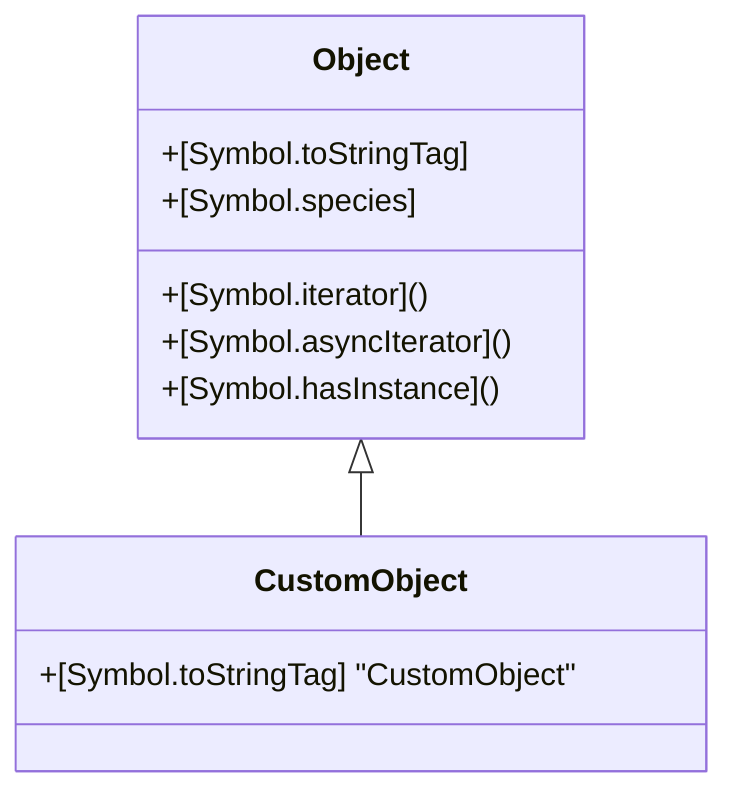

## 3.9 Symbols and Well-Known Symbols

In the ever-evolving landscape of JavaScript, Symbols and Well-Known Symbols stand out as powerful features introduced in ECMAScript 2015 (ES6). These features provide developers with the ability to create unique property keys and customize object behaviors, enhancing the flexibility and robustness of JavaScript applications. In this section, we will delve into the world of Symbols, explore the significance of Well-Known Symbols, and demonstrate their practical applications in modern web development.

### Understanding Symbols in JavaScript

#### What Are Symbols?

Symbols are a primitive data type in JavaScript, introduced to create unique and immutable property keys. Unlike strings or numbers, Symbols are guaranteed to be unique, even if they have the same description. This uniqueness makes them ideal for defining properties that should not collide with other properties, especially in large codebases or when integrating third-party libraries.

```javascript
// Creating a Symbol
const mySymbol = Symbol('description');

// Creating another Symbol with the same description
const anotherSymbol = Symbol('description');

// Checking uniqueness
console.log(mySymbol === anotherSymbol); // false
```

In the example above, even though both `mySymbol` and `anotherSymbol` have the same description, they are distinct and unique.

#### Why Use Symbols?

Symbols are particularly useful in scenarios where you need to ensure that property keys do not conflict with other keys. They are often used in libraries and frameworks to create private or semi-private properties, preventing accidental overwrites or access.

### Well-Known Symbols

Well-Known Symbols are predefined symbols in JavaScript that represent internal behaviors of objects. By using these symbols, developers can customize how objects behave in certain operations, such as iteration, type conversion, and more.

#### Key Well-Known Symbols

Let's explore some of the most commonly used Well-Known Symbols and their applications:

1. **`Symbol.iterator`**

   The `Symbol.iterator` symbol is used to define the default iterator for an object. By implementing this symbol, you can make an object iterable, allowing it to be used in constructs like `for...of` loops and the spread operator.

   ```javascript
   // Making an object iterable
   const iterableObject = {
     data: [1, 2, 3],
     [Symbol.iterator]() {
       let index = 0;
       const data = this.data;
       return {
         next() {
           if (index < data.length) {
             return { value: data[index++], done: false };
           } else {
             return { done: true };
           }
         }
       };
     }
   };

   // Using the iterable object
   for (const value of iterableObject) {
     console.log(value); // 1, 2, 3
   }
   ```

   In this example, we define an iterator for `iterableObject`, allowing it to be used in a `for...of` loop.

2. **`Symbol.asyncIterator`**

   Similar to `Symbol.iterator`, the `Symbol.asyncIterator` symbol is used to define the default asynchronous iterator for an object. This is particularly useful for handling asynchronous data streams.

   ```javascript
   // Asynchronous iterable object
   const asyncIterableObject = {
     data: [1, 2, 3],
     [Symbol.asyncIterator]() {
       let index = 0;
       const data = this.data;
       return {
         async next() {
           if (index < data.length) {
             return { value: data[index++], done: false };
           } else {
             return { done: true };
           }
         }
       };
     }
   };

   // Using the asynchronous iterable object
   (async () => {
     for await (const value of asyncIterableObject) {
       console.log(value); // 1, 2, 3
     }
   })();
   ```

   The `Symbol.asyncIterator` allows us to iterate over asynchronous data using the `for await...of` loop.

3. **`Symbol.toStringTag`**

   The `Symbol.toStringTag` symbol is used to customize the default string description of an object when `Object.prototype.toString()` is called.

   ```javascript
   // Customizing toStringTag
   const customObject = {
     [Symbol.toStringTag]: 'CustomObject'
   };

   console.log(Object.prototype.toString.call(customObject)); // [object CustomObject]
   ```

   By defining `Symbol.toStringTag`, we can control the output of `Object.prototype.toString()` for our custom object.

4. **`Symbol.hasInstance`**

   The `Symbol.hasInstance` symbol allows you to customize the behavior of the `instanceof` operator for a constructor function.

   ```javascript
   // Custom instanceof behavior
   class MyClass {
     static [Symbol.hasInstance](instance) {
       return instance instanceof Array;
     }
   }

   console.log([] instanceof MyClass); // true
   ```

   In this example, we override the `instanceof` behavior to return `true` for arrays.

5. **`Symbol.species`**

   The `Symbol.species` symbol is used to specify a constructor function that is used to create derived objects.

   ```javascript
   // Custom species
   class MyArray extends Array {
     static get [Symbol.species]() {
       return Array;
     }
   }

   const myArray = new MyArray(1, 2, 3);
   const mappedArray = myArray.map(x => x * 2);

   console.log(mappedArray instanceof MyArray); // false
   console.log(mappedArray instanceof Array); // true
   ```

   Here, we define `Symbol.species` to ensure that methods like `map` return an instance of `Array` instead of `MyArray`.

### Practical Applications of Symbols and Well-Known Symbols

Symbols and Well-Known Symbols find practical applications in various libraries and frameworks. Let's explore some scenarios where they are particularly useful:

#### Ensuring Unique Property Keys

In large codebases or when integrating third-party libraries, it's crucial to avoid property name collisions. Symbols provide a way to create unique property keys that are not accessible through standard property enumeration.

```javascript
// Using Symbols for unique property keys
const uniqueKey = Symbol('uniqueKey');
const obj = {
  [uniqueKey]: 'value'
};

console.log(obj[uniqueKey]); // 'value'
```

#### Customizing Object Iteration

By implementing `Symbol.iterator` or `Symbol.asyncIterator`, you can define custom iteration logic for objects, making them compatible with iteration constructs like `for...of` and `for await...of`.

#### Enhancing Type Conversion

With `Symbol.toStringTag`, you can control how objects are represented as strings, providing meaningful descriptions for custom objects.

#### Overriding Default Behaviors

Well-Known Symbols like `Symbol.hasInstance` and `Symbol.species` allow you to override default behaviors, such as `instanceof` checks and derived object creation, providing greater control over object interactions.

### Visualizing Symbol Usage

To better understand the interaction of Symbols and Well-Known Symbols with JavaScript objects, let's visualize the concept using a Mermaid.js diagram.



**Diagram Description:** This class diagram illustrates a generic `Object` class with various Well-Known Symbols implemented as methods or properties. The `CustomObject` class extends `Object` and overrides the `Symbol.toStringTag` to customize its string representation.

### Try It Yourself

To deepen your understanding of Symbols and Well-Known Symbols, try modifying the code examples provided. Here are some suggestions:

- Create a custom iterable object using `Symbol.iterator` and experiment with different iteration logic.
- Implement `Symbol.asyncIterator` for an object that fetches data asynchronously.
- Customize the `Symbol.toStringTag` for a class and observe how it affects the output of `Object.prototype.toString()`.

### Knowledge Check

Before we conclude, let's reinforce your understanding with a few questions:

1. What is the primary purpose of Symbols in JavaScript?
2. How does `Symbol.iterator` enhance object functionality?
3. What is the significance of `Symbol.toStringTag`?
4. How can `Symbol.hasInstance` be used to customize `instanceof` behavior?

### Summary and Key Takeaways

- **Symbols** provide unique and immutable property keys, preventing name collisions in large codebases.
- **Well-Known Symbols** allow customization of object behaviors, such as iteration, type conversion, and more.
- **Practical Applications** include ensuring unique property keys, customizing iteration, and overriding default behaviors.
- **Experimentation** with Symbols and Well-Known Symbols can lead to more robust and flexible JavaScript applications.

Remember, mastering Symbols and Well-Known Symbols is just one step in your journey to becoming a proficient JavaScript developer. Keep experimenting, stay curious, and enjoy the journey!

### References and Further Reading

- [MDN Web Docs: Symbols](https://developer.mozilla.org/en-US/docs/Web/JavaScript/Reference/Global_Objects/Symbol)
- [MDN Web Docs: Well-Known Symbols](https://developer.mozilla.org/en-US/docs/Web/JavaScript/Reference/Global_Objects/Symbol#well-known_symbols)
- [JavaScript.info: Symbol Type](https://javascript.info/symbol)

## Quiz: Mastering JavaScript Symbols and Well-Known Symbols



### What is the primary purpose of Symbols in JavaScript?

- [x] To create unique and immutable property keys
- [ ] To enhance string manipulation
- [ ] To improve number calculations
- [ ] To simplify array operations

> **Explanation:** Symbols are used to create unique and immutable property keys, preventing name collisions.

### How does `Symbol.iterator` enhance object functionality?

- [x] It makes objects iterable
- [ ] It improves string concatenation
- [ ] It optimizes mathematical operations
- [ ] It simplifies error handling

> **Explanation:** `Symbol.iterator` allows objects to be used in iteration constructs like `for...of` loops.

### What is the significance of `Symbol.toStringTag`?

- [x] It customizes the string representation of objects
- [ ] It enhances number formatting
- [ ] It simplifies array sorting
- [ ] It improves function execution

> **Explanation:** `Symbol.toStringTag` allows customization of the default string description of an object.

### How can `Symbol.hasInstance` be used to customize `instanceof` behavior?

- [x] By defining custom logic for `instanceof` checks
- [ ] By improving string parsing
- [ ] By optimizing array filtering
- [ ] By simplifying object cloning

> **Explanation:** `Symbol.hasInstance` allows customization of the behavior of the `instanceof` operator.

### Which Well-Known Symbol is used for asynchronous iteration?

- [x] `Symbol.asyncIterator`
- [ ] `Symbol.iterator`
- [ ] `Symbol.toStringTag`
- [ ] `Symbol.hasInstance`

> **Explanation:** `Symbol.asyncIterator` is used to define asynchronous iteration logic for objects.

### What does `Symbol.species` specify?

- [x] A constructor function for derived objects
- [ ] A method for string conversion
- [ ] A function for array manipulation
- [ ] A property for error handling

> **Explanation:** `Symbol.species` specifies a constructor function used to create derived objects.

### Can Symbols be used as property keys in objects?

- [x] Yes
- [ ] No

> **Explanation:** Symbols can be used as unique property keys in objects.

### Are Symbols enumerable by default?

- [ ] Yes
- [x] No

> **Explanation:** Symbols are not enumerable by default, meaning they do not appear in `for...in` loops or `Object.keys()`.

### Which method is affected by `Symbol.toStringTag`?

- [x] `Object.prototype.toString()`
- [ ] `Array.prototype.map()`
- [ ] `String.prototype.concat()`
- [ ] `Number.prototype.toFixed()`

> **Explanation:** `Symbol.toStringTag` affects the output of `Object.prototype.toString()`.

### True or False: Symbols can have the same description but are still unique.

- [x] True
- [ ] False

> **Explanation:** Symbols with the same description are unique and distinct.



---
