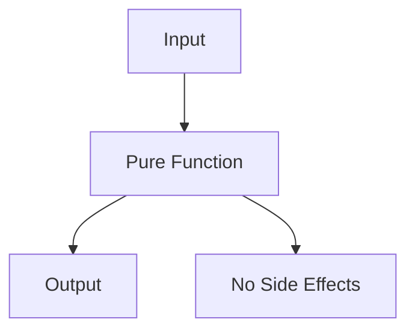

---

linkTitle: "4.1.1 Pure Functions"
title: "Pure Functions in JavaScript and TypeScript: Core Functional Programming Patterns"
description: "Explore the concept of pure functions in JavaScript and TypeScript, their implementation, benefits, and best practices for functional programming."
categories:
- Functional Programming
- JavaScript
- TypeScript
tags:
- Pure Functions
- Functional Programming
- JavaScript
- TypeScript
- Code Optimization
date: 2024-10-25
type: docs
nav_weight: 411000
canonical: "https://softwarepatternslexicon.com/patterns-js/4/1/1"
license: "© 2024 Tokenizer Inc. CC BY-NC-SA 4.0"
---

## 4.1.1 Pure Functions

### Introduction

In the realm of functional programming, pure functions stand as a cornerstone concept. They are functions that, given the same input, always return the same output and have no side effects. This predictability makes them invaluable in creating reliable and maintainable code. In this article, we will delve into the concept of pure functions, explore their implementation in JavaScript and TypeScript, and discuss their benefits and best practices.

### Understanding Pure Functions

Pure functions are defined by two main characteristics:

1. **Deterministic Output:** For the same set of inputs, a pure function will always produce the same output.
2. **No Side Effects:** Pure functions do not alter any state or perform observable actions outside their scope, such as modifying a global variable, performing I/O operations, or changing the system state.

#### Example of a Pure Function

```typescript
function add(a: number, b: number): number {
    return a + b;
}
```

In the above example, the `add` function is pure because it consistently returns the same result for the same inputs and does not affect any external state.

### Implementation Steps

To implement pure functions, follow these guidelines:

- **Avoid External State:** Do not modify variables or states outside the function's scope.
- **No I/O Operations:** Refrain from performing input/output operations within the function.
- **Immutable Data:** Prefer immutable data structures to prevent unintended side effects.

#### Converting Impure to Pure Functions

Consider the following impure function:

```javascript
let counter = 0;

function incrementCounter() {
    return ++counter;
}
```

This function is impure because it modifies the external `counter` variable. We can convert it into a pure function:

```typescript
function increment(value: number): number {
    return value + 1;
}
```

Now, `increment` is pure, as it does not rely on or alter any external state.

### Use Cases

Pure functions are particularly useful in scenarios where you need:

- **Predictable Behavior:** Since pure functions always produce the same output for the same input, they are highly predictable.
- **Easy Testability:** Testing pure functions is straightforward because they do not depend on external state or side effects.
- **Parallelism and Caching:** Pure functions facilitate parallel execution and caching, as their outputs are consistent and do not depend on mutable state.

### Practice: Identifying Pure Functions

To practice identifying pure functions, examine your codebase and look for functions that:

- Depend on external variables or states.
- Perform operations that affect the system state or perform I/O.
- Can be refactored to eliminate side effects and dependencies.

### Considerations

While pure functions offer numerous benefits, consider the following:

- **Performance:** In some cases, avoiding side effects might lead to performance trade-offs, such as creating new data structures instead of modifying existing ones.
- **Complexity:** Over-optimizing for purity can sometimes lead to overly complex code, especially in systems that inherently require state changes.

### Visual Aids

#### Conceptual Diagram of Pure Functions



This diagram illustrates how a pure function processes input to produce output without causing side effects.

### Code Examples

#### Real-World Scenario: Calculating Discounts

Consider a function that calculates discounts based on a fixed rate:

```typescript
function calculateDiscount(price: number, discountRate: number): number {
    return price * (1 - discountRate);
}
```

This function is pure because it consistently returns the same result for the same inputs and does not modify any external state.

### Best Practices

- **Use Immutable Data:** Favor immutable data structures to prevent accidental state changes.
- **Limit Function Scope:** Keep functions focused and limited in scope to enhance purity.
- **Leverage Functional Libraries:** Utilize libraries like Lodash or Ramda that offer utility functions designed for functional programming.

### Conclusion

Pure functions are a fundamental aspect of functional programming that promote predictability, testability, and maintainability. By adhering to the principles of pure functions, developers can create more robust and scalable applications. As you continue to explore functional programming, consider how pure functions can enhance your codebase and contribute to a cleaner, more efficient design.

## Quiz Time!



### What is a key characteristic of a pure function?

- [x] It always returns the same output for the same input.
- [ ] It can modify global variables.
- [ ] It performs I/O operations.
- [ ] It depends on external state.

> **Explanation:** A pure function always returns the same output for the same input and does not have side effects.

### Which of the following is NOT a benefit of pure functions?

- [ ] Predictable behavior
- [ ] Easy testability
- [x] Increased complexity
- [ ] Facilitation of parallelism

> **Explanation:** Pure functions reduce complexity by being predictable and easy to test, not increase it.

### How can you convert an impure function to a pure function?

- [x] Remove external dependencies and side effects.
- [ ] Add more global variables.
- [ ] Perform more I/O operations.
- [ ] Increase the function's scope.

> **Explanation:** To make a function pure, remove dependencies on external state and eliminate side effects.

### What does a pure function avoid?

- [x] Modifying variables outside its scope
- [ ] Returning a value
- [ ] Accepting parameters
- [ ] Being called multiple times

> **Explanation:** Pure functions avoid modifying external variables or state.

### Why are pure functions easy to test?

- [x] They have no side effects and always produce the same output for the same input.
- [ ] They require complex setup.
- [ ] They depend on external systems.
- [ ] They change global state.

> **Explanation:** Pure functions are easy to test because they are deterministic and do not rely on external state.

### Which of the following operations would make a function impure?

- [ ] Returning a calculated value
- [x] Modifying a global variable
- [ ] Accepting parameters
- [ ] Using local variables

> **Explanation:** Modifying a global variable introduces side effects, making a function impure.

### What is a common use case for pure functions?

- [x] When you require predictable behavior and easy testability.
- [ ] When you need to modify global state.
- [ ] When performing complex I/O operations.
- [ ] When relying on external APIs.

> **Explanation:** Pure functions are ideal for scenarios requiring predictability and testability.

### How do pure functions facilitate parallelism?

- [x] They do not depend on shared state, allowing independent execution.
- [ ] They require synchronization mechanisms.
- [ ] They depend on mutable data.
- [ ] They perform blocking operations.

> **Explanation:** Pure functions do not rely on shared state, enabling parallel execution without conflicts.

### What is a potential trade-off when using pure functions?

- [x] Performance due to creating new data structures
- [ ] Increased side effects
- [ ] Unpredictable behavior
- [ ] Difficulty in testing

> **Explanation:** Pure functions may incur performance costs due to the use of immutable data structures.

### True or False: Pure functions can perform I/O operations.

- [ ] True
- [x] False

> **Explanation:** Pure functions do not perform I/O operations as they introduce side effects.


