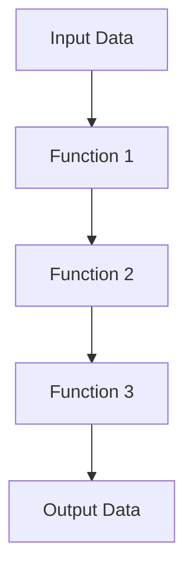

## 4.1.3 Function Composition

### Introduction

Function composition is a fundamental concept in functional programming that allows developers to combine simple functions to build more complex operations. By chaining functions together, you can create a pipeline where the output of one function becomes the input of the next. This approach promotes code reusability, modularity, and clarity.

### Understanding the Concept

Function composition involves creating a new function by combining two or more functions. The primary goal is to pass the result of one function as the input to another, forming a sequence of operations. This technique is particularly useful in scenarios where you need to apply multiple transformations to data.

### Implementation Steps

To implement function composition, you can create utility functions like `compose` and `pipe`. These functions help streamline the process of chaining functions together.

#### Compose Function

The `compose` function applies functions from right to left. Here's how you can implement it:

```typescript
function compose<T>(...functions: Array<(arg: T) => T>): (arg: T) => T {
    return (arg: T) => functions.reduceRight((acc, fn) => fn(acc), arg);
}
```

#### Pipe Function

The `pipe` function, on the other hand, applies functions from left to right:

```typescript
function pipe<T>(...functions: Array<(arg: T) => T>): (arg: T) => T {
    return (arg: T) => functions.reduce((acc, fn) => fn(acc), arg);
}
```

### Code Examples

Let's see how function composition can be used to chain transformations on data.

```typescript
// Example functions
const add = (x: number) => x + 1;
const multiply = (x: number) => x * 2;
const subtract = (x: number) => x - 3;

// Using compose
const composedFunction = compose(subtract, multiply, add);
console.log(composedFunction(5)); // Output: 9

// Using pipe
const pipedFunction = pipe(add, multiply, subtract);
console.log(pipedFunction(5)); // Output: 9
```

### Use Cases

Function composition is ideal when you need to build complex data transformations from simple functions. For example, in data processing pipelines, you can use composition to normalize, validate, and format user input.

### Practice

Create a composed function that normalizes, validates, and formats user input:

```typescript
const normalize = (input: string) => input.trim().toLowerCase();
const validate = (input: string) => /^[a-z0-9]+$/.test(input) ? input : '';
const format = (input: string) => `User: ${input}`;

const processInput = pipe(normalize, validate, format);

console.log(processInput("  ExampleUser123  ")); // Output: User: exampleuser123
```

### Considerations

- **Order of Execution:** The order in which functions are composed matters. Ensure that the sequence aligns with the desired data transformation.
- **Readability:** While function composition promotes modularity, deeply nested compositions can become hard to read. Consider breaking down complex compositions into smaller, named functions for clarity.

### Visual Aid

Below is a conceptual diagram illustrating the flow of data through composed functions:



### Advantages and Disadvantages

**Advantages:**
- Promotes code reusability and modularity.
- Simplifies complex operations by breaking them into smaller, manageable functions.
- Enhances readability when used appropriately.

**Disadvantages:**
- Can lead to readability issues if overused or deeply nested.
- Requires careful consideration of function order to avoid unexpected results.

### Best Practices

- **Use Descriptive Function Names:** Clearly name your functions to indicate their purpose within the composition.
- **Limit Composition Depth:** Avoid excessive nesting by breaking down complex compositions into smaller, logical units.
- **Test Composed Functions:** Ensure each function in the composition is thoroughly tested to prevent errors in the pipeline.

### Comparisons

Function composition is often compared to other design patterns like the Chain of Responsibility. While both involve chaining operations, function composition focuses on data transformation, whereas the Chain of Responsibility deals with passing requests along a chain of handlers.

### Conclusion

Function composition is a powerful tool in the functional programming toolkit, enabling developers to build complex operations from simple, reusable functions. By understanding and applying this pattern, you can enhance the modularity and readability of your code.

## Quiz Time!



### What is the primary goal of function composition?

- [x] To pass the result of one function as the input to another
- [ ] To create new functions from scratch
- [ ] To simplify function signatures
- [ ] To optimize function performance

> **Explanation:** Function composition aims to pass the output of one function as the input to another, forming a sequence of operations.

### Which utility function applies functions from right to left?

- [x] compose
- [ ] pipe
- [ ] reduce
- [ ] map

> **Explanation:** The `compose` function applies functions from right to left, allowing the output of one function to be passed as input to the next.

### Which utility function applies functions from left to right?

- [x] pipe
- [ ] compose
- [ ] filter
- [ ] map

> **Explanation:** The `pipe` function applies functions from left to right, processing data in a sequential manner.

### What is a potential disadvantage of function composition?

- [x] Readability issues with deeply nested compositions
- [ ] Increased code complexity
- [ ] Reduced code reusability
- [ ] Decreased performance

> **Explanation:** Deeply nested compositions can become hard to read, making it important to manage composition depth.

### In the provided code example, what is the output of `composedFunction(5)`?

- [x] 9
- [ ] 7
- [ ] 11
- [ ] 5

> **Explanation:** The composed function applies `subtract`, `multiply`, and `add` in sequence, resulting in an output of 9.

### What is the purpose of the `normalize` function in the practice example?

- [x] To trim and convert input to lowercase
- [ ] To validate input format
- [ ] To format input for display
- [ ] To capitalize input

> **Explanation:** The `normalize` function trims whitespace and converts the input to lowercase.

### What does the `validate` function do in the practice example?

- [x] Checks if the input contains only alphanumeric characters
- [ ] Formats the input for display
- [ ] Converts input to uppercase
- [ ] Trims whitespace from input

> **Explanation:** The `validate` function checks if the input contains only alphanumeric characters, returning the input if valid.

### What is the output of `processInput("  ExampleUser123  ")` in the practice example?

- [x] User: exampleuser123
- [ ] User: ExampleUser123
- [ ] User: exampleuser
- [ ] User: EXAMPLEUSER123

> **Explanation:** The `processInput` function normalizes, validates, and formats the input, resulting in "User: exampleuser123".

### Which design pattern is often compared to function composition?

- [x] Chain of Responsibility
- [ ] Singleton
- [ ] Observer
- [ ] Factory

> **Explanation:** Function composition is often compared to the Chain of Responsibility pattern, as both involve chaining operations.

### True or False: Function composition can enhance code modularity and reusability.

- [x] True
- [ ] False

> **Explanation:** Function composition promotes code modularity and reusability by allowing simple functions to be combined into complex operations.


