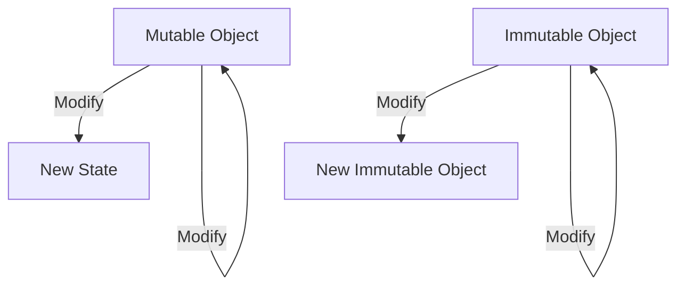

## 4.1.5 Immutable Data Structures

In the realm of functional programming, immutable data structures play a pivotal role in ensuring predictable and reliable state management. This section delves into the concept of immutability, its implementation in JavaScript and TypeScript, and its significance in modern application development.

### Understand the Concept

Immutable data structures are those that, once created, cannot be altered. This immutability ensures that data remains consistent and predictable, reducing the likelihood of unintended side effects in applications. By embracing immutability, developers can achieve more reliable and maintainable codebases.

#### Key Benefits of Immutability:
- **Predictability:** Immutable data structures provide a stable state, making it easier to reason about code behavior.
- **Concurrency:** Immutability eliminates race conditions, as data cannot be modified by multiple threads simultaneously.
- **Debugging:** Immutable states simplify debugging by ensuring that data remains consistent throughout the application's lifecycle.

### Implementation Steps

Implementing immutability in JavaScript and TypeScript involves several strategies, ranging from native methods to leveraging external libraries.

#### 1. Using `Object.freeze()`

`Object.freeze()` is a native JavaScript method that creates shallow immutable objects. It prevents modifications to an object's properties, ensuring that the object remains unchanged.

```javascript
const person = Object.freeze({
  name: 'Alice',
  age: 30
});

// Attempting to modify the object will have no effect
person.age = 31; // This will not change the age property
console.log(person.age); // Output: 30
```

#### 2. Deep Cloning and Persistent Data Structures

While `Object.freeze()` provides shallow immutability, deep cloning is necessary for nested objects. Libraries like Immutable.js and Immer offer persistent data structures that facilitate deep immutability.

##### Using Immutable.js

Immutable.js provides a rich set of immutable data structures, such as `Map`, `List`, and `Set`.

```javascript
import { Map } from 'immutable';

const map1 = Map({ a: 1, b: 2, c: 3 });
const map2 = map1.set('b', 50);

console.log(map1.get('b')); // Output: 2
console.log(map2.get('b')); // Output: 50
```

##### Using Immer

Immer allows developers to work with immutable states in a more intuitive way by using a "draft" state that can be mutated.

```javascript
import produce from 'immer';

const baseState = [
  { todo: "Learn JavaScript", done: true },
  { todo: "Learn Immer", done: false }
];

const nextState = produce(baseState, draft => {
  draft.push({ todo: "Learn TypeScript", done: false });
  draft[1].done = true;
});

console.log(baseState[1].done); // Output: false
console.log(nextState[1].done); // Output: true
```

### Use Cases

Immutable data structures are particularly useful in scenarios where state management is critical, such as in Redux.

#### State Management with Redux

Redux, a popular state management library, leverages immutability to prevent unintended side effects and ensure predictable state transitions.

```javascript
const initialState = { count: 0 };

function counterReducer(state = initialState, action) {
  switch (action.type) {
    case 'INCREMENT':
      return { ...state, count: state.count + 1 };
    case 'DECREMENT':
      return { ...state, count: state.count - 1 };
    default:
      return state;
  }
}
```

### Practice

To effectively implement immutability in your applications, consider the following practices:

- **Immutable Updates:** Use spread operators or libraries like Immer to perform immutable updates.
- **Consistent State Management:** Ensure that all state transitions are handled immutably to maintain consistency.

### Considerations

While immutability offers numerous benefits, there are important considerations to keep in mind:

- **Performance:** Excessive cloning of large data structures can impact performance. Use libraries that optimize for immutability.
- **Shallow vs. Deep Immutability:** Understand the difference between shallow and deep immutability to apply the appropriate strategy.

### Visual Aids

To better understand the concept of immutability, consider the following diagram illustrating the difference between mutable and immutable data structures:



### Conclusion

Immutable data structures are a cornerstone of functional programming, providing a foundation for predictable and reliable state management. By leveraging native methods and libraries, developers can implement immutability effectively, enhancing the maintainability and robustness of their applications.

## Quiz Time!



### What is the primary benefit of using immutable data structures?

- [x] Predictable state management
- [ ] Faster execution
- [ ] Reduced memory usage
- [ ] Simplified syntax

> **Explanation:** Immutable data structures ensure that data remains consistent and predictable, which is crucial for reliable state management.

### Which JavaScript method creates a shallow immutable object?

- [x] `Object.freeze()`
- [ ] `Object.seal()`
- [ ] `Object.lock()`
- [ ] `Object.preventExtensions()`

> **Explanation:** `Object.freeze()` is used to create shallow immutable objects by preventing modifications to an object's properties.

### What is a key feature of Immutable.js?

- [x] Provides persistent data structures
- [ ] Enhances mutable state management
- [ ] Simplifies asynchronous programming
- [ ] Reduces code verbosity

> **Explanation:** Immutable.js offers persistent data structures that facilitate deep immutability, making it easier to manage state immutably.

### How does Immer simplify working with immutable states?

- [x] By using a "draft" state that can be mutated
- [ ] By providing a mutable API
- [ ] By automatically freezing objects
- [ ] By reducing the need for cloning

> **Explanation:** Immer allows developers to work with a "draft" state that can be mutated, simplifying the process of creating immutable updates.

### In which scenario are immutable data structures particularly useful?

- [x] State management with Redux
- [ ] Real-time data processing
- [ ] Network request handling
- [ ] UI rendering optimization

> **Explanation:** Immutable data structures are crucial in state management libraries like Redux to prevent unintended side effects and ensure predictable state transitions.

### What is a potential drawback of excessive cloning in immutability?

- [x] Performance impact
- [ ] Increased code complexity
- [ ] Reduced readability
- [ ] Limited scalability

> **Explanation:** Excessive cloning of large data structures can impact performance, making it important to use optimized libraries for immutability.

### What is the difference between shallow and deep immutability?

- [x] Shallow immutability affects only the top-level properties, while deep immutability affects nested objects as well.
- [ ] Shallow immutability affects nested objects, while deep immutability affects only the top-level properties.
- [ ] Shallow immutability is faster, while deep immutability is slower.
- [ ] Shallow immutability is more memory-efficient, while deep immutability uses more memory.

> **Explanation:** Shallow immutability affects only the top-level properties, whereas deep immutability ensures that nested objects are also immutable.

### Which library provides a rich set of immutable data structures like `Map` and `List`?

- [x] Immutable.js
- [ ] Lodash
- [ ] Ramda
- [ ] Axios

> **Explanation:** Immutable.js provides a rich set of immutable data structures such as `Map`, `List`, and `Set`.

### How does immutability enhance concurrency?

- [x] By eliminating race conditions
- [ ] By increasing execution speed
- [ ] By reducing memory usage
- [ ] By simplifying thread management

> **Explanation:** Immutability eliminates race conditions because data cannot be modified by multiple threads simultaneously, enhancing concurrency.

### True or False: `Object.freeze()` provides deep immutability.

- [ ] True
- [x] False

> **Explanation:** `Object.freeze()` provides shallow immutability, meaning it only affects the top-level properties of an object, not nested objects.


