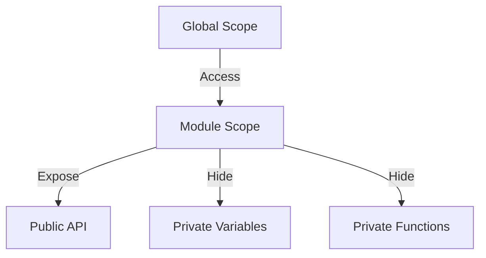

## 4.1 The Module Pattern

### Introduction

The Module Pattern is a powerful design pattern in JavaScript that allows developers to encapsulate code within a single unit, providing both privacy and organization. This pattern is particularly useful for managing the scope of variables and functions, preventing them from polluting the global namespace. In this section, we will explore the Module Pattern in depth, its historical context, implementation using Immediately Invoked Function Expressions (IIFEs), and its comparison with ES6 modules.

### Purpose of the Module Pattern

The primary purpose of the Module Pattern is to create a private scope for variables and functions, thereby achieving encapsulation. This pattern helps in:

- **Encapsulation**: By hiding the internal state and exposing only what is necessary, the Module Pattern ensures that the internal workings of a module are not accessible from the outside.
- **Reusability**: Modules can be reused across different parts of an application without risking conflicts with other code.
- **Maintainability**: By organizing code into discrete modules, it becomes easier to manage and maintain.

### Historical Context

Before the advent of ES6 modules, JavaScript lacked a built-in module system. This limitation led developers to create their own patterns for organizing code, with the Module Pattern being one of the most popular solutions. It addressed the need for encapsulation and namespace management in a language that originally did not support these features natively.

### Implementing the Module Pattern with IIFE

The Module Pattern is often implemented using an Immediately Invoked Function Expression (IIFE). This technique involves defining a function and immediately executing it, creating a private scope for the variables and functions within.

```javascript
const myModule = (function() {
    // Private variables and functions
    let privateVar = 'I am private';
    
    function privateFunction() {
        console.log(privateVar);
    }
    
    // Public API
    return {
        publicMethod: function() {
            privateFunction();
        }
    };
})();

// Usage
myModule.publicMethod(); // Logs: I am private
```

**Explanation**: In the example above, `privateVar` and `privateFunction` are not accessible from outside the module. The `publicMethod` function is exposed as part of the module's public API, allowing interaction with the module's internal state.

### Preventing Global Namespace Pollution

One of the key benefits of the Module Pattern is its ability to prevent global namespace pollution. By encapsulating code within a module, developers can avoid conflicts with other scripts or libraries that might use the same variable names.

**Example**:

```javascript
// Without Module Pattern
var counter = 0;

function increment() {
    counter++;
}

// With Module Pattern
const counterModule = (function() {
    let counter = 0;
    
    return {
        increment: function() {
            counter++;
        },
        getCounter: function() {
            return counter;
        }
    };
})();
```

In the example above, the `counter` variable is protected within the module, preventing any accidental modifications from outside code.

### Comparing the Module Pattern with ES6 Modules

With the introduction of ES6, JavaScript gained native support for modules. While the Module Pattern and ES6 modules share similar goals, they differ in implementation and usage.

**Similarities**:
- Both provide encapsulation and prevent global namespace pollution.
- Both allow for code reusability and organization.

**Differences**:
- **Syntax**: ES6 modules use `import` and `export` keywords, while the Module Pattern relies on IIFEs.
- **Scope**: ES6 modules are file-based, meaning each file is its own module. The Module Pattern can be implemented within a single file.
- **Static vs. Dynamic**: ES6 modules are statically analyzed, allowing for tree shaking and other optimizations. The Module Pattern is dynamic and does not benefit from these optimizations.

**Example of ES6 Module**:

```javascript
// myModule.js
export const myModule = {
    publicMethod() {
        console.log('I am public');
    }
};

// main.js
import { myModule } from './myModule.js';

myModule.publicMethod(); // Logs: I am public
```

### Practical Use Cases and Best Practices

The Module Pattern is particularly useful in scenarios where:

- **Legacy Code**: When working with older codebases that do not use ES6 modules.
- **Browser Compatibility**: In environments where ES6 module support is not available.
- **Simple Applications**: For small applications where the overhead of a module bundler is not justified.

**Best Practices**:
- **Consistent Naming**: Use clear and consistent naming conventions for module variables and methods.
- **Minimal Public API**: Expose only what is necessary to the outside world, keeping the internal implementation hidden.
- **Avoid Overuse**: While the Module Pattern is powerful, overusing it can lead to overly complex code. Use it judiciously.

### Conclusion

The Module Pattern remains a valuable tool in a JavaScript developer's toolkit, offering encapsulation and organization in environments where ES6 modules are not feasible. By understanding its implementation and benefits, developers can create more maintainable and conflict-free code.

### Try It Yourself

Experiment with the Module Pattern by modifying the code examples provided. Try adding new methods to the module or changing the internal state to see how encapsulation affects the module's behavior.

### Visualizing the Module Pattern

Below is a diagram illustrating the encapsulation provided by the Module Pattern:



**Description**: This diagram shows how the Module Pattern encapsulates private variables and functions within a module scope, exposing only the public API to the global scope.

### References and Links

- [MDN Web Docs: JavaScript Modules](https://developer.mozilla.org/en-US/docs/Web/JavaScript/Guide/Modules)
- [W3Schools: JavaScript Modules](https://www.w3schools.com/js/js_modules.asp)

### Knowledge Check

- What is the primary purpose of the Module Pattern?
- How does the Module Pattern prevent global namespace pollution?
- Compare the Module Pattern with ES6 modules in terms of syntax and scope.
- What are some practical use cases for the Module Pattern?

### Embrace the Journey

Remember, mastering design patterns like the Module Pattern is just the beginning. As you progress, you'll build more complex and interactive applications. Keep experimenting, stay curious, and enjoy the journey!

## Test Your Knowledge on the Module Pattern in JavaScript



### What is the primary purpose of the Module Pattern?

- [x] Encapsulation and organization of code
- [ ] Improving performance
- [ ] Enhancing security
- [ ] Simplifying syntax

> **Explanation:** The Module Pattern is primarily used for encapsulating code and organizing it into reusable units.

### How does the Module Pattern prevent global namespace pollution?

- [x] By encapsulating variables and functions within a private scope
- [ ] By using global variables
- [ ] By minimizing code
- [ ] By using ES6 syntax

> **Explanation:** The Module Pattern uses a private scope to encapsulate variables and functions, preventing them from polluting the global namespace.

### Which of the following is a similarity between the Module Pattern and ES6 modules?

- [x] Both provide encapsulation
- [ ] Both use the `import` keyword
- [ ] Both are file-based
- [ ] Both are statically analyzed

> **Explanation:** Both the Module Pattern and ES6 modules provide encapsulation, although they differ in implementation.

### What is a key difference between the Module Pattern and ES6 modules?

- [x] ES6 modules use `import` and `export` keywords
- [ ] The Module Pattern is file-based
- [ ] ES6 modules are dynamic
- [ ] The Module Pattern is statically analyzed

> **Explanation:** ES6 modules use `import` and `export` keywords, while the Module Pattern relies on IIFEs.

### In what scenario is the Module Pattern particularly useful?

- [x] When working with legacy code
- [ ] When using ES6 syntax
- [ ] When optimizing performance
- [ ] When using TypeScript

> **Explanation:** The Module Pattern is useful in legacy codebases where ES6 modules are not available.

### What is an Immediately Invoked Function Expression (IIFE)?

- [x] A function that is defined and executed immediately
- [ ] A function that is defined but not executed
- [ ] A function that is executed later
- [ ] A function that is never executed

> **Explanation:** An IIFE is a function that is defined and executed immediately, creating a private scope.

### Which of the following is a best practice when using the Module Pattern?

- [x] Expose only necessary methods
- [ ] Use global variables
- [ ] Avoid using functions
- [ ] Use complex syntax

> **Explanation:** It is a best practice to expose only necessary methods, keeping the internal implementation hidden.

### What is a potential drawback of overusing the Module Pattern?

- [x] Overly complex code
- [ ] Improved performance
- [ ] Simplified syntax
- [ ] Enhanced security

> **Explanation:** Overusing the Module Pattern can lead to overly complex code, making it harder to maintain.

### How does the Module Pattern enhance maintainability?

- [x] By organizing code into discrete modules
- [ ] By using global variables
- [ ] By minimizing code
- [ ] By using ES6 syntax

> **Explanation:** The Module Pattern enhances maintainability by organizing code into discrete modules, making it easier to manage.

### True or False: The Module Pattern is no longer useful with the advent of ES6 modules.

- [ ] True
- [x] False

> **Explanation:** The Module Pattern is still useful in scenarios where ES6 modules are not feasible, such as in legacy codebases or environments without ES6 support.


