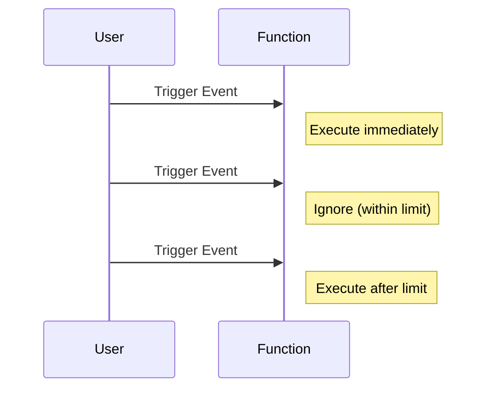
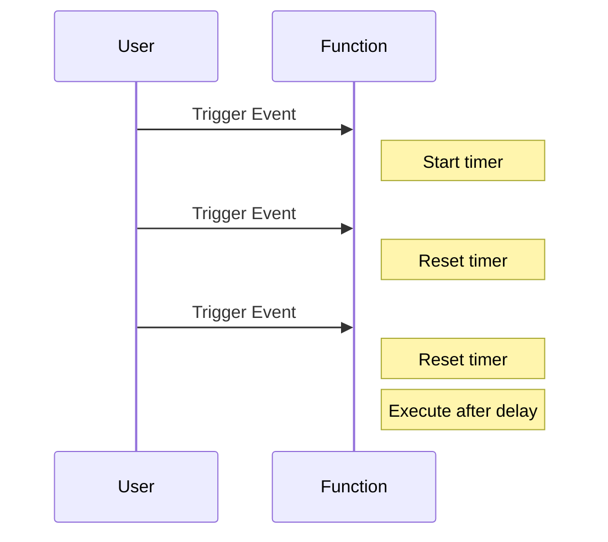

## 4.10 Lazy Evaluation and Throttling Functions

In the world of modern web development, performance optimization is crucial for creating responsive and efficient applications. Two powerful techniques that can significantly enhance performance are **lazy evaluation** and **throttling functions**. In this section, we'll delve into these concepts, explore their applications, and provide practical examples to help you master these techniques in JavaScript.

### Understanding Lazy Evaluation

**Lazy evaluation** is a programming technique where computation is delayed until its result is actually needed. This can lead to significant performance improvements, especially in scenarios where not all computed values are used. By deferring computation, you can avoid unnecessary calculations and reduce the load on your application.

#### Benefits of Lazy Evaluation

- **Efficiency**: By only computing values when necessary, you can save computational resources and improve application performance.
- **Memory Optimization**: Lazy evaluation can help reduce memory usage by avoiding the storage of intermediate results that are never used.
- **Improved Responsiveness**: Applications can remain responsive by deferring heavy computations until they are absolutely required.

#### Implementing Lazy Evaluation in JavaScript

In JavaScript, lazy evaluation can be implemented using functions and closures. Let's explore a simple example:

```javascript
// Lazy evaluation example using closures
function lazyValue(computation) {
    let cachedValue;
    let isComputed = false;

    return function() {
        if (!isComputed) {
            cachedValue = computation();
            isComputed = true;
        }
        return cachedValue;
    };
}

// Usage
const lazySum = lazyValue(() => {
    console.log("Computing sum...");
    return 5 + 3;
});

console.log(lazySum()); // Output: Computing sum... 8
console.log(lazySum()); // Output: 8 (cached result)
```

In this example, the `lazyValue` function takes a computation function as an argument and returns a new function that computes the value only once. Subsequent calls return the cached result, demonstrating the efficiency of lazy evaluation.

### Throttling and Debouncing: Controlling Function Execution

When dealing with events like scrolling, resizing, or user input, it's essential to control the rate at which event handlers are executed. This is where **throttling** and **debouncing** come into play.

#### Throttling

**Throttling** ensures that a function is called at most once in a specified period. This is particularly useful for events that can trigger multiple times in quick succession, such as window resizing or scrolling.

##### Implementing Throttling in JavaScript

Here's a basic implementation of a throttling function:

```javascript
// Throttle function implementation
function throttle(func, limit) {
    let lastFunc;
    let lastRan;

    return function(...args) {
        const context = this;
        if (!lastRan) {
            func.apply(context, args);
            lastRan = Date.now();
        } else {
            clearTimeout(lastFunc);
            lastFunc = setTimeout(function() {
                if ((Date.now() - lastRan) >= limit) {
                    func.apply(context, args);
                    lastRan = Date.now();
                }
            }, limit - (Date.now() - lastRan));
        }
    };
}

// Usage
const handleResize = throttle(() => {
    console.log("Window resized");
}, 1000);

window.addEventListener('resize', handleResize);
```

In this example, the `throttle` function limits the execution of `handleResize` to once every 1000 milliseconds, ensuring that the function is not called too frequently during rapid resize events.

#### Debouncing

**Debouncing** delays the execution of a function until after a specified period has elapsed since the last time it was invoked. This is useful for scenarios like search input fields, where you want to wait until the user has stopped typing before making an API call.

##### Implementing Debouncing in JavaScript

Here's how you can implement a debouncing function:

```javascript
// Debounce function implementation
function debounce(func, delay) {
    let timeoutId;

    return function(...args) {
        const context = this;
        clearTimeout(timeoutId);
        timeoutId = setTimeout(() => func.apply(context, args), delay);
    };
}

// Usage
const handleInput = debounce(() => {
    console.log("Input processed");
}, 500);

document.getElementById('searchInput').addEventListener('input', handleInput);
```

In this example, the `debounce` function ensures that `handleInput` is only called 500 milliseconds after the user stops typing, reducing unnecessary API calls.

### Practical Scenarios for Throttling and Debouncing

Throttling and debouncing are invaluable in various real-world scenarios:

- **Scrolling Events**: Use throttling to limit the frequency of scroll event handlers, improving performance and reducing jank.
- **Resizing Events**: Throttle resize event handlers to prevent excessive layout recalculations.
- **Search Input**: Debounce search input handlers to wait until the user has finished typing before sending a request.
- **Button Clicks**: Debounce button click handlers to prevent multiple submissions from rapid clicks.

### Utilities for Throttling and Debouncing

JavaScript libraries like Lodash provide built-in utilities for throttling and debouncing, making it easier to implement these patterns in your applications.

#### Using Lodash's Throttle and Debounce

Lodash offers `throttle` and `debounce` functions that are highly optimized and easy to use:

```javascript
// Using Lodash's throttle
const _ = require('lodash');

const throttledFunction = _.throttle(() => {
    console.log("Throttled function executed");
}, 1000);

window.addEventListener('scroll', throttledFunction);

// Using Lodash's debounce
const debouncedFunction = _.debounce(() => {
    console.log("Debounced function executed");
}, 500);

document.getElementById('searchInput').addEventListener('input', debouncedFunction);
```

These utilities handle edge cases and provide additional options, such as leading and trailing execution, making them a robust choice for managing function execution.

### Visualizing Throttling and Debouncing

To better understand how throttling and debouncing work, let's visualize their behavior using Mermaid.js diagrams.

#### Throttling Diagram



#### Debouncing Diagram



### Key Takeaways

- **Lazy Evaluation**: Delays computation until needed, improving efficiency and responsiveness.
- **Throttling**: Limits function execution to once per specified period, ideal for frequent events.
- **Debouncing**: Delays function execution until after a specified period of inactivity, useful for input fields.
- **Lodash Utilities**: Provide optimized `throttle` and `debounce` functions for easy implementation.

### Try It Yourself

Experiment with the provided code examples by modifying the delay times or event types. Observe how these changes affect the behavior of your application. Consider integrating these techniques into your projects to enhance performance and responsiveness.

### Further Reading

- [MDN Web Docs: Throttling and Debouncing](https://developer.mozilla.org/en-US/docs/Web/Events/scroll)
- [Lodash Documentation](https://lodash.com/docs)

### Knowledge Check

## Quiz: Mastering Lazy Evaluation and Throttling in JavaScript



### What is lazy evaluation?

- [x] Delaying computation until the result is needed
- [ ] Executing all computations immediately
- [ ] Caching all results in memory
- [ ] Running computations in parallel

> **Explanation:** Lazy evaluation delays computation until the result is actually needed, improving efficiency.

### Which function execution control technique limits the rate of function calls?

- [x] Throttling
- [ ] Debouncing
- [ ] Lazy evaluation
- [ ] Memoization

> **Explanation:** Throttling limits the rate at which a function can be called, ensuring it is executed at most once in a specified period.

### What is the primary purpose of debouncing?

- [x] Delaying function execution until after a period of inactivity
- [ ] Executing a function immediately
- [ ] Caching function results
- [ ] Running functions in parallel

> **Explanation:** Debouncing delays function execution until after a specified period of inactivity, reducing unnecessary calls.

### Which library provides optimized throttle and debounce functions?

- [x] Lodash
- [ ] jQuery
- [ ] React
- [ ] Angular

> **Explanation:** Lodash provides optimized `throttle` and `debounce` functions for controlling function execution.

### In which scenario is throttling most useful?

- [x] Handling frequent scroll events
- [ ] Delaying API calls
- [ ] Caching data
- [ ] Running animations

> **Explanation:** Throttling is most useful for handling frequent events like scrolling, where you want to limit the rate of function execution.

### What is a key benefit of lazy evaluation?

- [x] Improved efficiency by avoiding unnecessary computations
- [ ] Immediate execution of all functions
- [ ] Increased memory usage
- [ ] Parallel processing

> **Explanation:** Lazy evaluation improves efficiency by avoiding unnecessary computations until the result is needed.

### How does debouncing affect input field event handlers?

- [x] Delays execution until the user stops typing
- [ ] Executes immediately on each keystroke
- [ ] Caches input values
- [ ] Runs in parallel with other functions

> **Explanation:** Debouncing delays execution of input field event handlers until the user stops typing, reducing unnecessary API calls.

### What is the difference between throttling and debouncing?

- [x] Throttling limits execution rate; debouncing delays until inactivity
- [ ] Throttling delays execution; debouncing limits rate
- [ ] Both limit execution rate
- [ ] Both delay execution until inactivity

> **Explanation:** Throttling limits the execution rate, while debouncing delays execution until after a period of inactivity.

### Which of the following is a practical use case for debouncing?

- [x] Search input fields
- [ ] Scrolling events
- [ ] Animation frames
- [ ] Data caching

> **Explanation:** Debouncing is practical for search input fields, where you want to wait until the user stops typing before making an API call.

### True or False: Lazy evaluation can help reduce memory usage.

- [x] True
- [ ] False

> **Explanation:** True. Lazy evaluation can help reduce memory usage by avoiding the storage of intermediate results that are never used.



Remember, this is just the beginning. As you progress, you'll build more complex and interactive web pages. Keep experimenting, stay curious, and enjoy the journey!
