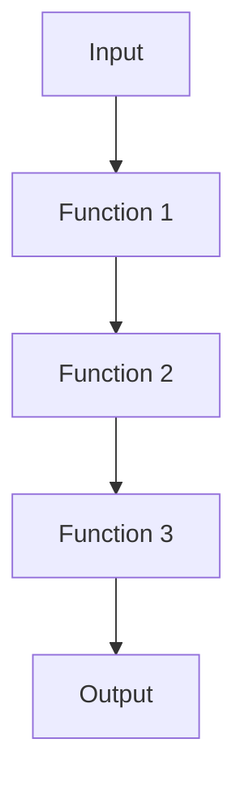

## 4.11 Composing Functions and Method Chaining

In the realm of JavaScript, composing functions and method chaining are powerful techniques that can significantly enhance code readability and modularity. These patterns allow developers to build complex logic from simpler, reusable functions and create fluent APIs that improve the developer experience. In this section, we will delve into the concepts of function composition and method chaining, explore their benefits, and provide practical examples to illustrate their application.

### Understanding Function Composition

Function composition is a fundamental concept in functional programming that involves combining two or more functions to produce a new function. The composed function applies the original functions in sequence, passing the result of each function as the input to the next. This approach allows developers to build complex operations from simpler, reusable functions, promoting code modularity and readability.

#### The Basics of Function Composition

In JavaScript, function composition can be achieved using higher-order functions. A higher-order function is a function that takes one or more functions as arguments and/or returns a function as its result. Let's explore a simple example of function composition:

```javascript
// Define two simple functions
const add = (x) => x + 2;
const multiply = (x) => x * 3;

// Compose the functions
const addThenMultiply = (x) => multiply(add(x));

// Use the composed function
console.log(addThenMultiply(5)); // Output: 21
```

In this example, the `addThenMultiply` function is composed of the `add` and `multiply` functions. It first adds 2 to the input and then multiplies the result by 3.

#### Creating a Generic Compose Function

To make function composition more reusable, we can create a generic `compose` function that takes an arbitrary number of functions and returns a new function that applies them in sequence:

```javascript
// Generic compose function
const compose = (...functions) => (initialValue) =>
  functions.reduceRight((acc, fn) => fn(acc), initialValue);

// Define functions
const subtract = (x) => x - 1;
const square = (x) => x * x;

// Compose functions using the generic compose function
const subtractThenSquare = compose(square, subtract);

// Use the composed function
console.log(subtractThenSquare(5)); // Output: 16
```

The `compose` function uses `reduceRight` to apply the functions from right to left, starting with the initial value. This pattern is common in functional programming and is supported by libraries like [Lodash](https://lodash.com/).

### Function Composition in Practice

Function composition is particularly useful in scenarios where you need to apply a series of transformations to data. It allows you to break down complex operations into smaller, manageable functions that can be reused and tested independently.

#### Example: Data Transformation Pipeline

Consider a scenario where you need to process a list of numbers by filtering out even numbers, doubling the remaining numbers, and then summing them up. Using function composition, you can achieve this in a clean and modular way:

```javascript
// Define transformation functions
const filterOdd = (numbers) => numbers.filter((n) => n % 2 !== 0);
const double = (numbers) => numbers.map((n) => n * 2);
const sum = (numbers) => numbers.reduce((acc, n) => acc + n, 0);

// Compose the transformation pipeline
const processNumbers = compose(sum, double, filterOdd);

// Use the composed function
const numbers = [1, 2, 3, 4, 5];
console.log(processNumbers(numbers)); // Output: 18
```

In this example, the `processNumbers` function is composed of three smaller functions: `filterOdd`, `double`, and `sum`. Each function performs a specific transformation, and the composed function applies them in sequence.

### Method Chaining Patterns

Method chaining is a pattern commonly used in JavaScript libraries to create fluent APIs. It involves calling multiple methods on an object in a single expression, where each method returns the object itself or another object that supports further method calls. This pattern is prevalent in libraries like [jQuery](https://jquery.com/) and [Lodash](https://lodash.com/).

#### The Basics of Method Chaining

Method chaining allows developers to write concise and expressive code by chaining method calls together. The key to method chaining is ensuring that each method returns an object that supports further method calls. Let's explore a simple example:

```javascript
// Define a simple class with method chaining
class Calculator {
  constructor(value = 0) {
    this.value = value;
  }

  add(number) {
    this.value += number;
    return this; // Return the object for chaining
  }

  subtract(number) {
    this.value -= number;
    return this; // Return the object for chaining
  }

  multiply(number) {
    this.value *= number;
    return this; // Return the object for chaining
  }

  getResult() {
    return this.value;
  }
}

// Use method chaining
const result = new Calculator(5)
  .add(3)
  .subtract(2)
  .multiply(4)
  .getResult();

console.log(result); // Output: 24
```

In this example, the `Calculator` class supports method chaining by returning `this` from each method. This allows us to chain method calls together in a single expression.

#### Benefits of Method Chaining

Method chaining offers several benefits, including:

- **Conciseness**: Method chaining allows you to write concise and expressive code by chaining multiple operations together.
- **Fluent APIs**: Chaining creates fluent APIs that are easy to read and understand, improving the developer experience.
- **Modularity**: Each method in a chain can be implemented as a separate, reusable function, promoting code modularity.

### Best Practices for Method Chaining

While method chaining can enhance code readability and modularity, it's important to follow best practices to avoid potential pitfalls:

- **Avoid Deep Chaining**: Deep chaining can make code difficult to read and debug. Limit the depth of method chains to maintain readability.
- **Return Consistent Types**: Ensure that each method in a chain returns a consistent type, allowing for predictable chaining behavior.
- **Document Method Chains**: Provide clear documentation for method chains, including examples of how to use them effectively.

### Try It Yourself

To reinforce your understanding of function composition and method chaining, try modifying the examples provided in this section. Experiment with creating your own composed functions and method chains, and explore how these patterns can be applied to solve real-world problems.

### Visualizing Function Composition

To better understand function composition, let's visualize the flow of data through a composed function using a Mermaid.js diagram:



In this diagram, data flows from the input through a series of functions, with each function transforming the data before passing it to the next. This visual representation highlights the sequential nature of function composition.

### References and Further Reading

- [MDN Web Docs: Functions](https://developer.mozilla.org/en-US/docs/Web/JavaScript/Guide/Functions)
- [Lodash Documentation](https://lodash.com/docs/)
- [jQuery Documentation](https://api.jquery.com/)

### Knowledge Check

To test your understanding of function composition and method chaining, try answering the following quiz questions.

## Mastering Function Composition and Method Chaining Quiz



### What is function composition in JavaScript?

- [x] Combining two or more functions to produce a new function
- [ ] Creating a function that calls itself
- [ ] Defining multiple functions with the same name
- [ ] Using a function as a method of an object

> **Explanation:** Function composition involves combining two or more functions to produce a new function that applies the original functions in sequence.

### What is the purpose of a generic compose function?

- [x] To create a reusable function that applies multiple functions in sequence
- [ ] To define a function that can be used as a method
- [ ] To create a function that returns an array
- [ ] To define a function that takes no arguments

> **Explanation:** A generic compose function creates a reusable function that applies multiple functions in sequence, allowing for modular and reusable code.

### What is method chaining?

- [x] Calling multiple methods on an object in a single expression
- [ ] Defining multiple methods with the same name
- [ ] Creating a function that returns a method
- [ ] Using a method as a function argument

> **Explanation:** Method chaining involves calling multiple methods on an object in a single expression, where each method returns the object itself or another object that supports further method calls.

### What is a key benefit of method chaining?

- [x] Creating fluent APIs that are easy to read and understand
- [ ] Increasing the number of methods in a class
- [ ] Reducing the number of arguments in a function
- [ ] Defining multiple methods with the same name

> **Explanation:** Method chaining creates fluent APIs that are easy to read and understand, improving the developer experience.

### Which of the following is a best practice for method chaining?

- [x] Avoid deep chaining to maintain readability
- [ ] Use different return types for each method
- [ ] Define methods with the same name
- [ ] Limit the number of methods in a chain

> **Explanation:** Avoiding deep chaining helps maintain readability, ensuring that method chains are easy to understand and debug.

### What does the `compose` function do in the provided example?

- [x] It applies functions from right to left, starting with the initial value
- [ ] It applies functions from left to right, starting with the initial value
- [ ] It creates a new function that returns an array
- [ ] It defines a function that takes no arguments

> **Explanation:** The `compose` function applies functions from right to left, starting with the initial value, allowing for modular and reusable code.

### What is a potential pitfall of deep method chaining?

- [x] It can make code difficult to read and debug
- [ ] It increases the number of methods in a class
- [ ] It reduces the number of arguments in a function
- [ ] It defines multiple methods with the same name

> **Explanation:** Deep method chaining can make code difficult to read and debug, so it's important to limit the depth of method chains.

### What is the output of the `addThenMultiply` function in the first example?

- [x] 21
- [ ] 15
- [ ] 18
- [ ] 24

> **Explanation:** The `addThenMultiply` function first adds 2 to the input (5), resulting in 7, and then multiplies the result by 3, resulting in 21.

### What is the purpose of returning `this` in a method chain?

- [x] To allow for further method calls on the same object
- [ ] To define a method that takes no arguments
- [ ] To create a new object with the same properties
- [ ] To return an array of method names

> **Explanation:** Returning `this` in a method chain allows for further method calls on the same object, enabling method chaining.

### True or False: Function composition is only useful in functional programming.

- [ ] True
- [x] False

> **Explanation:** Function composition is useful in various programming paradigms, including functional programming, as it promotes code modularity and reusability.



Remember, mastering function composition and method chaining is just the beginning. As you progress, you'll build more complex and interactive applications. Keep experimenting, stay curious, and enjoy the journey!


