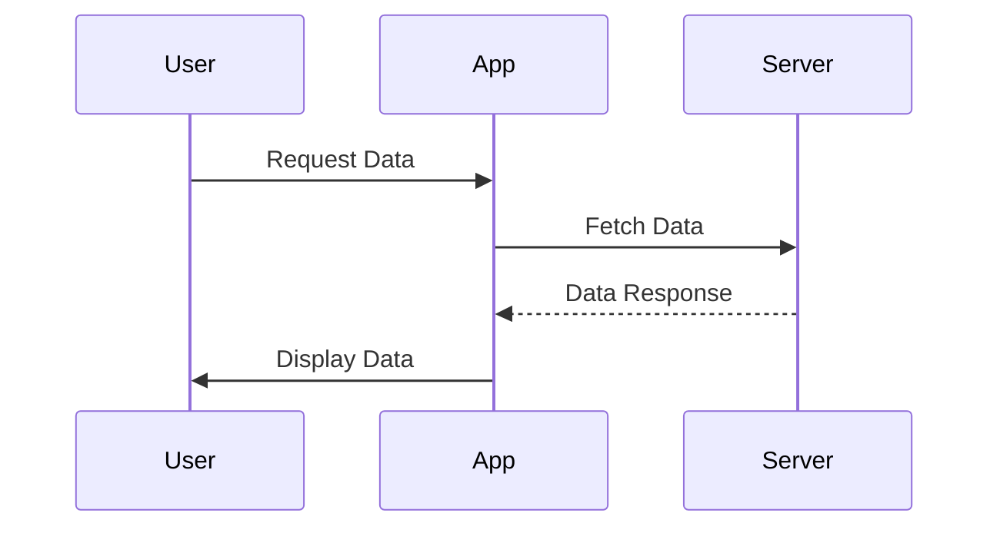

## 4.12 Avoiding Common Pitfalls in Asynchronous Code

Asynchronous programming is a cornerstone of modern JavaScript development, enabling non-blocking operations and improving performance in web applications. However, it comes with its own set of challenges and pitfalls that can lead to complex, hard-to-maintain code. In this section, we will explore common mistakes developers make when dealing with asynchronous JavaScript and provide strategies to avoid them.

### Understanding Asynchronous JavaScript

Before diving into the pitfalls, let's briefly review how asynchronous JavaScript works. JavaScript is single-threaded, meaning it can execute one task at a time. Asynchronous operations, such as network requests or file I/O, allow JavaScript to perform other tasks while waiting for these operations to complete. This is achieved through mechanisms like callbacks, Promises, and the `async/await` syntax.

### Common Pitfalls in Asynchronous JavaScript

#### 1. Callback Hell

**Callback hell** occurs when multiple asynchronous operations are nested within each other, leading to deeply indented and hard-to-read code. This pattern makes it difficult to understand the flow of the program and manage error handling.

**Example of Callback Hell:**

```javascript
function getData(callback) {
    setTimeout(() => {
        callback(null, 'Data');
    }, 1000);
}

function processData(data, callback) {
    setTimeout(() => {
        callback(null, `Processed ${data}`);
    }, 1000);
}

function displayData(data, callback) {
    setTimeout(() => {
        callback(null, `Displaying ${data}`);
    }, 1000);
}

getData((err, data) => {
    if (err) {
        console.error(err);
    } else {
        processData(data, (err, processedData) => {
            if (err) {
                console.error(err);
            } else {
                displayData(processedData, (err, result) => {
                    if (err) {
                        console.error(err);
                    } else {
                        console.log(result);
                    }
                });
            }
        });
    }
});
```

**Solution: Use Promises**

Promises provide a cleaner way to handle asynchronous operations by chaining them together, reducing the nesting level.

**Refactored with Promises:**

```javascript
function getData() {
    return new Promise((resolve, reject) => {
        setTimeout(() => {
            resolve('Data');
        }, 1000);
    });
}

function processData(data) {
    return new Promise((resolve, reject) => {
        setTimeout(() => {
            resolve(`Processed ${data}`);
        }, 1000);
    });
}

function displayData(data) {
    return new Promise((resolve, reject) => {
        setTimeout(() => {
            resolve(`Displaying ${data}`);
        }, 1000);
    });
}

getData()
    .then(processData)
    .then(displayData)
    .then(console.log)
    .catch(console.error);
```

#### 2. Unhandled Promise Rejections

When a Promise is rejected and there is no `catch` handler, it results in an unhandled rejection. This can lead to silent failures in your application.

**Example of Unhandled Promise Rejection:**

```javascript
function faultyFunction() {
    return new Promise((resolve, reject) => {
        reject('Something went wrong!');
    });
}

faultyFunction(); // No catch handler
```

**Solution: Always Handle Rejections**

Ensure that every Promise chain has a `catch` block to handle errors.

**Correct Implementation:**

```javascript
faultyFunction()
    .catch(error => {
        console.error('Error:', error);
    });
```

#### 3. Race Conditions

Race conditions occur when the outcome of asynchronous operations depends on the timing of events, leading to unpredictable results.

**Example of Race Condition:**

```javascript
let counter = 0;

function incrementCounter() {
    return new Promise((resolve) => {
        setTimeout(() => {
            counter += 1;
            resolve(counter);
        }, Math.random() * 1000);
    });
}

Promise.all([incrementCounter(), incrementCounter(), incrementCounter()])
    .then(results => {
        console.log('Counter:', counter); // Unpredictable result
    });
```

**Solution: Use Locks or Atomic Operations**

To avoid race conditions, use locks or atomic operations to ensure that shared resources are accessed in a controlled manner.

**Correct Implementation with Atomic Operations:**

```javascript
const { Mutex } = require('async-mutex');
const mutex = new Mutex();

async function incrementCounterSafely() {
    const release = await mutex.acquire();
    try {
        counter += 1;
        return counter;
    } finally {
        release();
    }
}

Promise.all([incrementCounterSafely(), incrementCounterSafely(), incrementCounterSafely()])
    .then(results => {
        console.log('Counter:', counter); // Predictable result
    });
```

### Best Practices for Asynchronous JavaScript

#### Properly Chain Promises

When chaining Promises, ensure that each function returns a Promise. This allows the next `then` block to wait for the previous operation to complete.

**Example:**

```javascript
function fetchData() {
    return new Promise((resolve) => {
        setTimeout(() => {
            resolve('Fetched Data');
        }, 1000);
    });
}

function processData(data) {
    return new Promise((resolve) => {
        setTimeout(() => {
            resolve(`Processed ${data}`);
        }, 1000);
    });
}

fetchData()
    .then(processData)
    .then(console.log)
    .catch(console.error);
```

#### Use `async/await` for Cleaner Code

The `async/await` syntax provides a more synchronous-looking code structure, making it easier to read and maintain.

**Example with `async/await`:**

```javascript
async function main() {
    try {
        const data = await fetchData();
        const processedData = await processData(data);
        console.log(processedData);
    } catch (error) {
        console.error('Error:', error);
    }
}

main();
```

#### Return Promises in Functions

Always return a Promise from a function that performs asynchronous operations. This ensures that the caller can handle the result or error appropriately.

**Example:**

```javascript
function asyncOperation() {
    return new Promise((resolve, reject) => {
        setTimeout(() => {
            resolve('Operation Complete');
        }, 1000);
    });
}

asyncOperation()
    .then(console.log)
    .catch(console.error);
```

### Tools and Linters for Asynchronous JavaScript

Several tools and linters can help detect issues in asynchronous JavaScript code:

- **ESLint**: A popular linter for JavaScript that can be configured to catch common asynchronous issues.
- **Promise Tracker**: A tool that helps track unhandled Promise rejections.
- **Async Hooks**: A Node.js feature that provides an API to track asynchronous resources.

### Visualizing Asynchronous JavaScript

To better understand the flow of asynchronous operations, let's visualize the execution using a sequence diagram.



**Description:** This diagram illustrates the sequence of asynchronous operations when a user requests data from an application, which in turn fetches data from a server and displays it to the user.

### Knowledge Check

- What is callback hell, and how can it be avoided?
- Why is it important to handle Promise rejections?
- How can race conditions be prevented in asynchronous code?
- What are the benefits of using `async/await` over traditional Promises?
- How can tools like ESLint help in writing better asynchronous code?

### Exercises

1. Refactor a nested callback structure into Promises.
2. Identify and fix unhandled Promise rejections in a given code snippet.
3. Implement a function that safely increments a shared counter using locks.

### Summary

Avoiding common pitfalls in asynchronous JavaScript requires understanding the underlying mechanisms and applying best practices. By using Promises, `async/await`, and proper error handling, you can write cleaner, more maintainable code. Tools like ESLint and Promise Tracker can further assist in identifying and resolving asynchronous issues.

Remember, this is just the beginning. As you progress, you'll build more complex and interactive web applications. Keep experimenting, stay curious, and enjoy the journey!

## Quiz: Mastering Asynchronous JavaScript



### What is callback hell?

- [x] A situation where multiple nested callbacks make code difficult to read and maintain.
- [ ] A method to handle asynchronous operations in JavaScript.
- [ ] A tool for debugging asynchronous code.
- [ ] A feature of the JavaScript engine.

> **Explanation:** Callback hell refers to deeply nested callbacks that make the code hard to read and maintain.

### How can callback hell be avoided?

- [x] By using Promises to chain asynchronous operations.
- [ ] By using more nested callbacks.
- [ ] By avoiding asynchronous operations altogether.
- [ ] By using synchronous code.

> **Explanation:** Promises allow chaining of asynchronous operations, reducing nesting and improving readability.

### What is an unhandled Promise rejection?

- [x] A Promise that is rejected without a `catch` handler.
- [ ] A Promise that is resolved without a `then` handler.
- [ ] A Promise that is never created.
- [ ] A Promise that is always pending.

> **Explanation:** An unhandled Promise rejection occurs when a Promise is rejected, but no `catch` handler is present to handle the error.

### Why is it important to handle Promise rejections?

- [x] To prevent silent failures in the application.
- [ ] To make the code run faster.
- [ ] To avoid using Promises.
- [ ] To ensure synchronous execution.

> **Explanation:** Handling Promise rejections prevents silent failures and ensures that errors are properly managed.

### What is a race condition?

- [x] A situation where the outcome of asynchronous operations depends on the timing of events.
- [ ] A method to speed up asynchronous operations.
- [ ] A feature of the JavaScript engine.
- [ ] A tool for debugging asynchronous code.

> **Explanation:** Race conditions occur when the outcome of asynchronous operations depends on the timing of events, leading to unpredictable results.

### How can race conditions be prevented?

- [x] By using locks or atomic operations to control access to shared resources.
- [ ] By using more asynchronous operations.
- [ ] By avoiding asynchronous code.
- [ ] By using synchronous code.

> **Explanation:** Locks or atomic operations ensure that shared resources are accessed in a controlled manner, preventing race conditions.

### What are the benefits of using `async/await`?

- [x] Provides a more synchronous-looking code structure.
- [ ] Makes the code run faster.
- [x] Easier to read and maintain.
- [ ] Avoids the need for Promises.

> **Explanation:** `async/await` provides a more synchronous-looking code structure, making it easier to read and maintain.

### Why should functions performing asynchronous operations return a Promise?

- [x] To allow the caller to handle the result or error appropriately.
- [ ] To make the code run faster.
- [ ] To avoid using callbacks.
- [ ] To ensure synchronous execution.

> **Explanation:** Returning a Promise allows the caller to handle the result or error appropriately, ensuring proper flow control.

### How can ESLint help in writing better asynchronous code?

- [x] By catching common asynchronous issues.
- [ ] By making the code run faster.
- [ ] By avoiding the use of Promises.
- [ ] By ensuring synchronous execution.

> **Explanation:** ESLint can be configured to catch common asynchronous issues, helping developers write better code.

### True or False: Using `async/await` eliminates the need for error handling in asynchronous code.

- [ ] True
- [x] False

> **Explanation:** While `async/await` simplifies asynchronous code, error handling is still necessary to manage potential failures.


